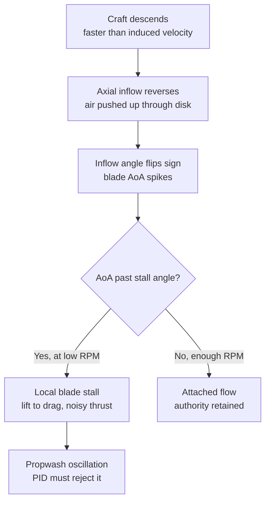

Propeleris — tai besisukantis sparnas, ir kaip bet kuris sparnas jis gamina švarią trauką tik tada, kai oras įteka į jį iš priekio — rotoriui tai reiškia orą iš viršaus, einantį žemyn pro diską. Duok jam švaraus oro — jis skrenda; nustok duoti — jis **užstalina**, lygiai kaip sparnas, patemptas į per didelį atakos kampą.

Štai ir visas propwash. Kai numeti gazą arba išeini iš dive'o, dronas toliau leidžiasi, o motorai lėtėja — tad dronas krenta į tą patį oro stulpą, kurį ką tik nustūmė žemyn. Srautas apsiverčia ir grįžta *aukštyn* pro diską, mentės atakos kampas peršoka stall kampą, srautas atsiskiria, ir trauka tampa nelygi bei triukšminga. Tas wobble, kurį jauti — tai PID kilpa, besigrumianti su ta nelygia trauka.

Vienintelė svirtis, kurią turi — **RPM**: užstalinusi mentė vėl prilimpa, kai tik sukasi pakankamai greitai, kad jos pačios downwash įveiktų aukštyn kylantį orą. Būtent tą ir daro **dynamic idle** — jis tiesiog neleidžia motorams įkristi į žemo RPM stall zoną. (Pirmą kartą pajutęs propwash maniau, kad prastai suderinau PID. Iš dalies — taip, bet dalis jo tiesiog fizika.)

---

## Oro srautas pro vieną propelerį

Propeleris sukasi horizontalioje (XZ) plokštumoje apie vertikalią ašį; dronas juda vertikaliai (XY). Vieno propelerio pakanka pamatyti tai, kas svarbu — stebėk orą pro diską, kai dronas kyla, kybo ir leidžiasi:

```p5js
const p = sketch;
// Side view of ONE prop. The disk spins in the horizontal (XZ) plane,
// seen edge-on as an ellipse; the craft moves vertically (XY). We watch
// air go through the disk while it climbs, hovers, and descends.
let W = 560, H = 420;
let cx = W / 2;
let diskR = 150, ellH = 26;
let baseY = H * 0.5, diskY = baseY, bladeA = 0;
let particles = [];
let phase = 0, timer = 0;
const dur = [220, 200, 260];
const name = ["CLIMB - extra air pulled down through the disk",
              "HOVER - steady downwash column",
              "DESCEND - craft drops into its own wake: backflow"];
const wThru = [3.2, 2.0, -1.4];   // net flow through disk, + = down
const craftV = [-0.7, 0, 0.7];
const theta = 22;                 // blade pitch angle at 0.7R (deg)

function mkP(init) {
  const descending = wThru[phase] < 0;
  return { x: cx + p.random(-diskR, diskR),
           y: init ? p.random(0, H) : (descending ? H + 6 : -6),
           turb: 0 };
}

p.setup = function () {
  p.createCanvas(W, H);
  p.textFont('monospace');
  for (let i = 0; i < 150; i++) particles.push(mkP(true));
};

p.draw = function () {
  p.background(17, 17, 17, 70);
  timer++;
  if (timer > dur[phase]) { timer = 0; phase = (phase + 1) % 3; }
  bladeA += 0.35;

  diskY = p.constrain(diskY + craftV[phase], baseY - 70, baseY + 70);
  if (phase === 1) diskY = p.lerp(diskY, baseY, 0.02);

  const w = wThru[phase];
  const descending = w < 0;

  for (let i = particles.length - 1; i >= 0; i--) {
    const pt = particles[i];
    const above = pt.y < diskY;
    if (!descending) {
      pt.y += above ? w * 0.9 : w * 1.7;        // down, slipstream speeds up below
    } else {
      pt.y += w * 1.5;                          // up: backflow
      pt.turb = p.lerp(pt.turb, p.random(-1.4, 1.4), 0.12);
      pt.x += pt.turb + (p.abs(pt.y - diskY) < 45 ? (pt.x < cx ? -1 : 1) : 0);
    }
    const near = p.abs(pt.y - diskY) < 50;
    if (descending && near) p.stroke(255, 120, 40, 200);
    else { const g = p.map(p.abs(w), 0, 3.2, 150, 220); p.stroke(70, g, 255, 170); }
    p.strokeWeight(descending && near ? 3 : 2);
    p.point(pt.x, pt.y);
    if (pt.y < -8 || pt.y > H + 8 || pt.x < cx - diskR - 30 || pt.x > cx + diskR + 30)
      particles[i] = mkP(false);
  }

  arrow(cx - diskR - 26, diskY - 74, descending ? -28 : 30, descending);
  arrow(cx - diskR - 26, diskY + 46, descending ? -28 : 30, descending);

  p.noFill(); p.stroke(120, 140, 160, 130); p.strokeWeight(2);
  p.ellipse(cx, diskY, diskR * 2, ellH);
  p.stroke(150, 200, 255); p.strokeWeight(4);
  const bx = Math.cos(bladeA) * diskR, by = Math.sin(bladeA) * (ellH / 2);
  p.line(cx - bx, diskY - by, cx + bx, diskY + by);
  p.noStroke(); p.fill(90, 90, 100); p.ellipse(cx, diskY, 16, 10);

  gauge(w);

  p.noStroke();
  p.fill(descending ? p.color(255, 150, 60) : p.color(120, 200, 255));
  p.textSize(13); p.textAlign(p.CENTER);
  p.text(name[phase], cx, H - 14);
};

function arrow(x, y, len, red) {
  p.stroke(red ? p.color(255, 120, 40) : p.color(90, 180, 255));
  p.strokeWeight(2);
  p.line(x, y, x, y + len);
  const d = len > 0 ? 1 : -1;
  p.line(x, y + len, x - 4, y + len - 4 * d);
  p.line(x, y + len, x + 4, y + len - 4 * d);
}

function gauge(w) {
  const gx = 82, gy = 78, s = 48;
  const Vt = 30, axial = w * 1.8;
  const phi = p.degrees(Math.atan2(axial, Vt));
  const aoa = theta - phi;
  const stalled = aoa > 14;
  p.push(); p.translate(gx, gy);
  p.rotate(p.radians(-theta));
  p.noStroke(); p.fill(stalled ? p.color(255, 90, 60) : p.color(185, 205, 225));
  p.ellipse(0, 0, s, s * 0.26);
  p.rotate(p.radians(theta));
  p.stroke(stalled ? p.color(255, 120, 40) : p.color(120, 220, 255));
  p.strokeWeight(2);
  const wx = Math.cos(p.radians(phi)) * s, wy = Math.sin(p.radians(phi)) * s;
  p.line(wx * 0.2, wy * 0.2, -wx, -wy);
  p.pop();
  p.noStroke(); p.textAlign(p.LEFT); p.textSize(11);
  p.fill(stalled ? p.color(255, 110, 80) : p.color(160, 200, 160));
  p.text("blade AoA " + p.nf(aoa, 0, 0) + "\u00B0" + (stalled ? "  STALL" : ""), gx - 44, gy + 44);
}
```

- **Kylant:** dronas, judėdamas aukštyn, prideda prie žemyn krypstančio srauto. Mentė sutinka orą mažu atakos kampu — nepakrauta ir švari, bet traukai reikia daugiau RPM.
- **Kybant:** pastovus induced-velocity stulpas. Mentė jau sėdi arti optimalaus kampo — netoli savo lift kreivės viršūnės.
- **Leidžiantis:** kai leidimosi greitis viršija induced velocity, oras stumiamas **aukštyn** pro diską. Propeleris kramto savo paties turbulentišką pėdsaką (vortex-ring tipo recirkuliacija), srautas apsiverčia, ir mentės atakos kampas šokteli.

---

## Kodėl apsivertęs srautas užstalina mentę

Propelerio mentė — tai besisukantis sparnas. Jos **efektyvus atakos kampas** yra geometrinis pitch kampas minus srauto kampas:

\[ \alpha = \theta_{pitch} - \varphi, \qquad \varphi = \arctan\left(\frac{V_{axial}}{V_{tangential}}\right) \]

`V_tangential` — tai pačios mentės sukimosi greitis (`Ω·r`); `V_axial` — oro greitis pro diską. Kylant `V_axial` didelis ir teigiamas, tad `φ` didelis, o `α` lieka mažas. Kai leidimasis apverčia ašinį srautą, `V_axial` tampa **neigiamas**, `φ` keičia ženklą, ir `α = θ − φ` šoka virš stall kampo (~12–15°). Už to kampo srautas atsiskiria nuo mentės, keltis virsta pasipriešinimu, o trauka tampa triukšminga ir netiesinė — kaip tik tas trikdis, kurį paskui turi atmesti PID.



---

## Efektyvumas ir stall zona prieš RPM

Perkelk tai į traukos efektyvumą per visą RPM diapazoną. Kiekvieną kreivę formuoja du dalykai. Pirma, propas prie beveik nulinio RPM negamina beveik nieko, o **maksimumą** pasiekia ties viduriniu RPM — tada efektyvumas vėl **krenta** prie aukšto RPM, kai mentės galiukai artėja prie garso greičio (tai tip-speed riba). Antra, apsivertusiame sraute mentė lieka **užstalinusi** tol, kol RPM tampa pakankamas, kad jos induced velocity įveiktų aukštyn kylantį orą — o šis stall-išėjimo RPM kiekvienam režimui skiriasi:

```chart
{
  "type": "line",
  "data": {
    "labels": ["1k","2k","3k","4k","5k","7k","9k","12k","15k","18k","21k","24k","28k"],
    "datasets": [
      {
        "label": "Propwash-prone band (hover OK, descending stalls)",
        "data": [null, null, null, 108, 108, 108, null, null, null, null, null, null, null],
        "borderColor": "transparent", "backgroundColor": "rgba(249,115,22,0.13)",
        "fill": "origin", "pointRadius": 0, "tension": 0
      },
      {
        "label": "Climb (up)",
        "data": [6, 22, 43, 64, 80, 96, 100, 99, 95, 87, 75, 61, 41],
        "borderColor": "rgba(34,197,94,1)", "backgroundColor": "transparent",
        "borderWidth": 2.5, "tension": 0.35, "pointRadius": 2
      },
      {
        "label": "Hover",
        "data": [4, 16, 35, 55, 70, 86, 90, 89, 86, 79, 68, 55, 37],
        "borderColor": "rgba(148,163,184,1)", "backgroundColor": "transparent",
        "borderWidth": 2, "borderDash": [5,4], "tension": 0.35, "pointRadius": 0
      },
      {
        "label": "Descend 3 m/s (down)",
        "data": [0, 2, 7, 19, 37, 72, 88, 91, 87, 80, 69, 56, 38],
        "borderColor": "rgba(239,68,68,1)", "backgroundColor": "transparent",
        "borderWidth": 2.5, "tension": 0.35, "pointRadius": 2
      }
    ]
  },
  "options": {
    "responsive": true,
    "interaction": { "mode": "index", "intersect": false },
    "plugins": {
      "title": { "display": true, "text": "Prop efficiency vs RPM - peaks then falls; the shaded band is propwash-prone" },
      "legend": { "position": "bottom" }
    },
    "scales": {
      "x": { "title": { "display": true, "text": "Motor RPM" } },
      "y": { "beginAtZero": true, "max": 110, "title": { "display": true, "text": "Relative thrust efficiency (%)" } }
    }
  }
}
```

Skaityk taip:

- **Kiekvienas režimas turi maksimumą, o paskui krenta.** Geriausias efektyvumas — zona apie 9–13k RPM; sukant greičiau (per didelio KV propas) tik švaistoma energija ir kaista motorai anapus maksimumo — tip-speed bauda.
- **Kylant ir kybant stall zona baigiasi anksti** (~4000 RPM) — švarus arba beveik švarus srautas.
- **Leidžiantis ji baigiasi vėlai** (~7000 RPM esant 3 m/s nusileidimui), ir stall-išėjimas slenka toliau į dešinę, kuo greičiau leidiesi.
- **Užtamsinta juosta — tai visa problema.** Tarp hover stall-išėjimo ir leidimosi stall-išėjimo *kybėti čia visiškai gerai* — bet vos pradedi leistis, nukrenti ant užstalinusios leidimosi kreivės. Tas tarpas ir yra ta vieta, kur gyvena propwash.
- Tad dynamic idle darbas — laikyti motorų minimalų RPM tos juostos **dešinėje** tiems nusileidimams, kuriuos realiai darai.

---

## Kodėl dynamic idle padeda

Pažiūrėk į užtamsintą juostą grafike. Be dynamic idle ESC laiko tik *fiksuotą* minimalų gazą (default ~5.5%), tad per gazo numetimą ar staigią korekciją motoras gali nusėsti į tą juostą — arba žemiau — kaip tik tada, kai reikia jėgos. Ten jis užstalina arba dalinai desinchronizuojasi, ir wobble tik pablogėja.

**Dynamic idle** naudoja dvikryptį DShot RPM telemetriją, kad lėčiausią motorą laikytų virš nustatyto minimalaus RPM net kai mikseris komanduoja nulinį gazą. Nustatyk jį taip, kad sėdėtų ties (ar už) **dešiniuoju** tos juostos kraštu — ir nusileidimas nebenumeta menčių į stall'ą. Jis sutvarko kasdienius atvejus — gazo numetimus ir švelnius nusileidimus; greitas, agresyvus dive nustumia juostos dešinį kraštą toliau, nei bet koks protingas idle gali pavyti — todėl kieti dive'ai visada turi šiek tiek propwash.

```
# Requires bidirectional DShot (RPM telemetry) enabled first
set dyn_idle_min_rpm = 35        # units of 100 rpm -> 3500 rpm; 30-40 typical for 5"
set transient_throttle_limit = 0 # must be 0 with dynamic idle
save
```

- Reikšmė — **šimtais RPM**: `35` = 3500 RPM. Diapazonas 0–200; bet kokia ne nulinė reikšmė įjungia.
- Pradėk nuo **30–40 su 5"**; daugiau lengviems 3"–4" propams, mažiau aukšto pitch ar didesniems propams.
- Per žemai → motorai vis tiek gali užstalinti/desinchronizuoti greitų flip'ų pabaigoje (wobble). Per aukštai → plaukiojantis gazas ir karštesni motorai.

---

## Propelerio stall'as prieš pitch

Stall priklauso nuo *geometrinio* pitch kampo `θ`, o didesnio pitch propeleriai turi didesnį `θ` kiekviename taške. Esant tam pačiam apsivertusiam srautui, didesnio pitch propeleris pasiekia stall kampą greičiau ir stalina stipriau — jis kanda daugiau oro per apsisukimą, bet blogiau toleruoja sutrikdytą srautą leidžiantis. Mažesnio pitch propeleriai atsparesni stall'ui (ir tylesni propwash'e), bet gamina mažiau traukos per RPM, tad remiasi didesniu RPM.

Tai tas pats pitch kampas, kuris nustato trauką ir tip speed — žr. animuotą paaiškinimą [KV ir propelerių derinime](../../motors-esc/kv-prop-matcher/).

---

## Ką tuning'as gali ir ko negali ištaisyti

| Simptomas | Tuning sprendimas | Riba |
|-----------|-------------------|------|
| Lengvas svyravimas išeinant iš dive, nurimsta per 1–2 ciklus | Padidink D (Roll/Pitch) 5–10% | Visiškai ištaisoma |
| Wobble kaskart numetus gazą | Padidink D, patikrink RPM filtrą, įjunk dynamic idle | Iš esmės ištaisoma |
| Smarkus svyravimas per agresyvų split-S | D + šiek tiek sumažink P, patikrink filtravimą | Iš dalies — ekstremalūs judesiai visada turi propwash |
| Svyravimas su karštais motorais | D per aukštas — atleisk | Nesivyk propwash pertekliniu D |
| Vis dar svyruoja, kai D jau ties šiluminiu limitu | Susitaik — aerodinamika laimi | Tai ne tuning'o problema |

**Tikslas — ne pašalinti propwash, o greitai jį atmesti neperkaitinant motorų.** Agresyvus freestyle dronas visada turės šiek tiek propwash; gerai suderintas (su dynamic idle, laikančiu mentes pakrautas) jį nuslopina per vieną–du svyravimo ciklus.

---

## Susiję

- [KV ir propelerių derinimas](../../motors-esc/kv-prop-matcher/) — propelerio pitch, tip speed ir pitch animacija
- [PID pagrindai](../../tuning/pid-basics/)
- [BBL pagrįstas PID tuning protokolas](../../tuning/bbl-pid-tuning-protocol/)
- [Blackbox logging](../../tuning/blackbox-logging/)
