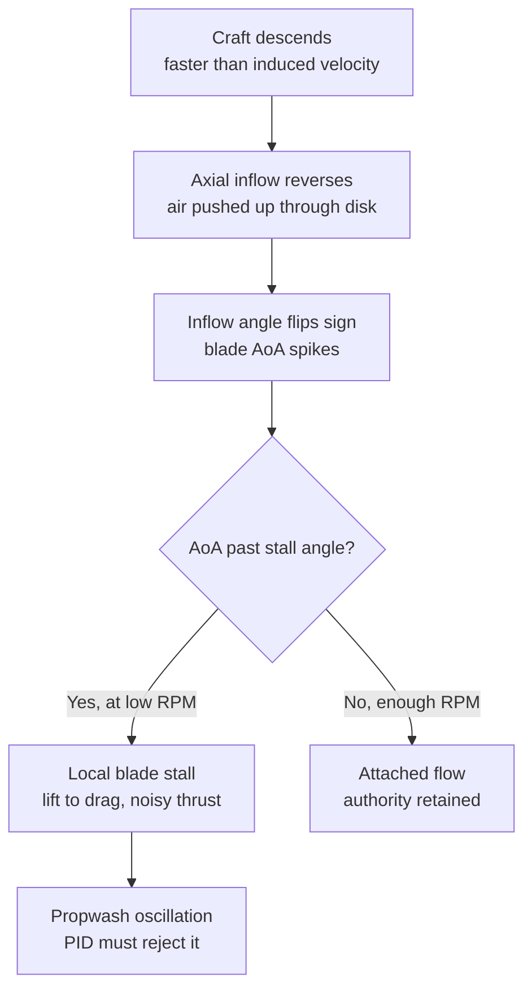

A propeller is a spinning wing, and like any wing it only makes clean thrust while air flows *into* it from the front — for a rotor, that means air coming from above and going down through the disk. Feed it clean air and it flies; stop feeding it clean air and it **stalls**, exactly like a wing yanked to too high an angle of attack.

That is the whole of propwash. When you chop throttle or pull out of a dive, the quad keeps sinking while the motors slow down — so the craft falls into the column of air it just pushed down. The inflow reverses and comes back *up* through the disk, the blade's angle of attack blows past its stall angle, the flow separates, and thrust goes ragged and noisy. The wobble you feel is the PID loop wrestling that ragged thrust.

The one lever you have is **RPM**: a stalled blade re-attaches once it spins fast enough that its own downwash beats the air rising into it. That is exactly what **dynamic idle** does — it refuses to let the motors fall into the stalled, low-RPM region in the first place.

---

## The airflow through one prop

The prop rotates in the horizontal (XZ) plane about a vertical axis; the craft moves vertically (XY). One prop is enough to see what matters — watch the air through the disk as it climbs, hovers, and descends:

```p5js
const p = sketch;
// Side view of ONE prop. The disk spins in the horizontal (XZ) plane,
// seen edge-on as an ellipse; the craft moves vertically (XY). We watch
// air go through the disk while it climbs, hovers, and descends.
let W = 560, H = 420;
let cx = W / 2;
let diskR = 150, ellH = 26;
let baseY = H * 0.5, diskY = baseY, bladeA = 0;
let particles = [];
let phase = 0, timer = 0;
const dur = [220, 200, 260];
const name = ["CLIMB - extra air pulled down through the disk",
              "HOVER - steady downwash column",
              "DESCEND - craft drops into its own wake: backflow"];
const wThru = [3.2, 2.0, -1.4];   // net flow through disk, + = down
const craftV = [-0.7, 0, 0.7];
const theta = 22;                 // blade pitch angle at 0.7R (deg)

function mkP(init) {
  const descending = wThru[phase] < 0;
  return { x: cx + p.random(-diskR, diskR),
           y: init ? p.random(0, H) : (descending ? H + 6 : -6),
           turb: 0 };
}

p.setup = function () {
  p.createCanvas(W, H);
  p.textFont('monospace');
  for (let i = 0; i < 150; i++) particles.push(mkP(true));
};

p.draw = function () {
  p.background(17, 17, 17, 70);
  timer++;
  if (timer > dur[phase]) { timer = 0; phase = (phase + 1) % 3; }
  bladeA += 0.35;

  diskY = p.constrain(diskY + craftV[phase], baseY - 70, baseY + 70);
  if (phase === 1) diskY = p.lerp(diskY, baseY, 0.02);

  const w = wThru[phase];
  const descending = w < 0;

  for (let i = particles.length - 1; i >= 0; i--) {
    const pt = particles[i];
    const above = pt.y < diskY;
    if (!descending) {
      pt.y += above ? w * 0.9 : w * 1.7;        // down, slipstream speeds up below
    } else {
      pt.y += w * 1.5;                          // up: backflow
      pt.turb = p.lerp(pt.turb, p.random(-1.4, 1.4), 0.12);
      pt.x += pt.turb + (p.abs(pt.y - diskY) < 45 ? (pt.x < cx ? -1 : 1) : 0);
    }
    const near = p.abs(pt.y - diskY) < 50;
    if (descending && near) p.stroke(255, 120, 40, 200);
    else { const g = p.map(p.abs(w), 0, 3.2, 150, 220); p.stroke(70, g, 255, 170); }
    p.strokeWeight(descending && near ? 3 : 2);
    p.point(pt.x, pt.y);
    if (pt.y < -8 || pt.y > H + 8 || pt.x < cx - diskR - 30 || pt.x > cx + diskR + 30)
      particles[i] = mkP(false);
  }

  arrow(cx - diskR - 26, diskY - 74, descending ? -28 : 30, descending);
  arrow(cx - diskR - 26, diskY + 46, descending ? -28 : 30, descending);

  p.noFill(); p.stroke(120, 140, 160, 130); p.strokeWeight(2);
  p.ellipse(cx, diskY, diskR * 2, ellH);
  p.stroke(150, 200, 255); p.strokeWeight(4);
  const bx = Math.cos(bladeA) * diskR, by = Math.sin(bladeA) * (ellH / 2);
  p.line(cx - bx, diskY - by, cx + bx, diskY + by);
  p.noStroke(); p.fill(90, 90, 100); p.ellipse(cx, diskY, 16, 10);

  gauge(w);

  p.noStroke();
  p.fill(descending ? p.color(255, 150, 60) : p.color(120, 200, 255));
  p.textSize(13); p.textAlign(p.CENTER);
  p.text(name[phase], cx, H - 14);
};

function arrow(x, y, len, red) {
  p.stroke(red ? p.color(255, 120, 40) : p.color(90, 180, 255));
  p.strokeWeight(2);
  p.line(x, y, x, y + len);
  const d = len > 0 ? 1 : -1;
  p.line(x, y + len, x - 4, y + len - 4 * d);
  p.line(x, y + len, x + 4, y + len - 4 * d);
}

function gauge(w) {
  const gx = 82, gy = 78, s = 48;
  const Vt = 30, axial = w * 1.8;
  const phi = p.degrees(Math.atan2(axial, Vt));
  const aoa = theta - phi;
  const stalled = aoa > 14;
  p.push(); p.translate(gx, gy);
  p.rotate(p.radians(-theta));
  p.noStroke(); p.fill(stalled ? p.color(255, 90, 60) : p.color(185, 205, 225));
  p.ellipse(0, 0, s, s * 0.26);
  p.rotate(p.radians(theta));
  p.stroke(stalled ? p.color(255, 120, 40) : p.color(120, 220, 255));
  p.strokeWeight(2);
  const wx = Math.cos(p.radians(phi)) * s, wy = Math.sin(p.radians(phi)) * s;
  p.line(wx * 0.2, wy * 0.2, -wx, -wy);
  p.pop();
  p.noStroke(); p.textAlign(p.LEFT); p.textSize(11);
  p.fill(stalled ? p.color(255, 110, 80) : p.color(160, 200, 160));
  p.text("blade AoA " + p.nf(aoa, 0, 0) + "\u00B0" + (stalled ? "  STALL" : ""), gx - 44, gy + 44);
}
```

- **Climb:** the craft moving up adds to the downward inflow. The blade meets air at a low angle of attack — unloaded and clean, but it needs more RPM to make thrust.
- **Hover:** a steady induced-velocity column. The blade already sits close to its best angle — near the top of its lift curve.
- **Descend:** once the descent rate beats the induced velocity, air is pushed **up** through the disk. The prop chews through its own turbulent wake (a vortex-ring-like recirculation), inflow reverses, and the blade angle of attack jumps.

---

## Why reversed inflow stalls the blade

A propeller blade is a rotating wing. Its **effective angle of attack** is the geometric pitch angle minus the inflow angle:

\[ \alpha = \theta_{pitch} - \varphi, \qquad \varphi = \arctan\left(\frac{V_{axial}}{V_{tangential}}\right) \]

`V_tangential` is the blade's own rotational speed (`Ω·r`); `V_axial` is the air speed through the disk. In a climb, `V_axial` is large and positive, so `φ` is large and `α` stays small. When descent reverses the axial flow, `V_axial` goes **negative**, `φ` flips sign, and `α = θ − φ` shoots up past the stall angle (~12–15°). Past that angle the flow separates from the blade, lift collapses and turns to drag, and thrust becomes noisy and non-linear — exactly the disturbance the PID loop then has to fight.



---

## Efficiency and the stall region vs RPM

Turn that into thrust efficiency across the RPM range. Two things shape every curve. First, a prop makes almost nothing near zero RPM and **peaks** at a moderate RPM — then efficiency **falls off** again at high RPM as the blade tips approach the speed of sound (this is the tip-speed limit). Second, in reversed inflow the blade stays **stalled** until RPM is high enough for its induced velocity to beat the air rising into it — and that stall-exit RPM is different for every mode:

```chart
{
  "type": "line",
  "data": {
    "labels": ["1k","2k","3k","4k","5k","7k","9k","12k","15k","18k","21k","24k","28k"],
    "datasets": [
      {
        "label": "Propwash-prone band (hover OK, descending stalls)",
        "data": [null, null, null, 108, 108, 108, null, null, null, null, null, null, null],
        "borderColor": "transparent", "backgroundColor": "rgba(249,115,22,0.13)",
        "fill": "origin", "pointRadius": 0, "tension": 0
      },
      {
        "label": "Climb (up)",
        "data": [6, 22, 43, 64, 80, 96, 100, 99, 95, 87, 75, 61, 41],
        "borderColor": "rgba(34,197,94,1)", "backgroundColor": "transparent",
        "borderWidth": 2.5, "tension": 0.35, "pointRadius": 2
      },
      {
        "label": "Hover",
        "data": [4, 16, 35, 55, 70, 86, 90, 89, 86, 79, 68, 55, 37],
        "borderColor": "rgba(148,163,184,1)", "backgroundColor": "transparent",
        "borderWidth": 2, "borderDash": [5,4], "tension": 0.35, "pointRadius": 0
      },
      {
        "label": "Descend 3 m/s (down)",
        "data": [0, 2, 7, 19, 37, 72, 88, 91, 87, 80, 69, 56, 38],
        "borderColor": "rgba(239,68,68,1)", "backgroundColor": "transparent",
        "borderWidth": 2.5, "tension": 0.35, "pointRadius": 2
      }
    ]
  },
  "options": {
    "responsive": true,
    "interaction": { "mode": "index", "intersect": false },
    "plugins": {
      "title": { "display": true, "text": "Prop efficiency vs RPM - peaks then falls; the shaded band is propwash-prone" },
      "legend": { "position": "bottom" }
    },
    "scales": {
      "x": { "title": { "display": true, "text": "Motor RPM" } },
      "y": { "beginAtZero": true, "max": 110, "title": { "display": true, "text": "Relative thrust efficiency (%)" } }
    }
  }
}
```

Read it like this:

- **Every mode peaks and then falls.** Best efficiency is a band around 9–13k RPM; spinning faster (an over-KV'd prop) just burns energy and heats motors on the far side of the peak — the tip-speed penalty.
- **Climb and hover leave the stall region early** (~4,000 RPM) — they have clean or near-clean inflow.
- **Descending leaves it late** (~7,000 RPM for a 3 m/s sink), and the stall-exit moves further right the faster you drop.
- **The shaded band is the whole problem.** Between the hover stall-exit and the descend stall-exit, *hovering there is perfectly fine* — but the instant you start sinking you fall onto the stalled descend curve. That gap is where propwash lives.
- So dynamic idle's job is to keep the motors' minimum RPM to the **right** of that band for the descents you actually fly.

---

## Why dynamic idle helps

Look at the shaded band in the chart. Without dynamic idle the ESC only holds a *fixed* minimum throttle (default ~5.5%), so during a throttle chop or a hard correction a motor can sag into that band — or below it — exactly when you need bite. There it stalls or partially desyncs, and the wobble gets worse.

**Dynamic idle** uses bidirectional DShot RPM telemetry to hold the *slowest* motor above a set minimum RPM, even when the mixer commands zero drive. Set it to sit at (or past) the **right edge** of that band and a sink no longer drops the blades into stall. It fixes the everyday cases — throttle chops and gentle sinks; a fast, aggressive dive shoves the band's right edge further right than any sane idle can chase, which is why hard dives always carry some propwash.

```
# Requires bidirectional DShot (RPM telemetry) enabled first
set dyn_idle_min_rpm = 35        # units of 100 rpm -> 3500 rpm; 30-40 typical for 5"
set transient_throttle_limit = 0 # must be 0 with dynamic idle
save
```

- Value is in **hundreds of RPM**: `35` = 3,500 RPM. Range 0–200; any non-zero value enables it.
- Start around **30–40 for 5"**; go higher for light 3"–4" props, lower for high-pitch or bigger props.
- Too low → motors can still stall/desync at the end of fast flips (a wobble). Too high → floaty throttle and warmer motors.

---

## Prop stall vs prop pitch

Stall depends on the *geometric* pitch angle `θ`, and higher-pitch props carry a higher `θ` at every station. For the same reversed inflow, a higher-pitch prop reaches the stall angle sooner and stalls harder — it bites more air per turn but is less tolerant of the disturbed inflow in a descent. Lower-pitch props are more stall-resistant (and quieter in propwash) but make less thrust per RPM, so they lean on higher RPM instead.

This is the same pitch angle that sets thrust and tip speed — see the animated explanation in [KV & Prop Matching](../../motors-esc/kv-prop-matcher/).

---

## What Tuning Can and Can't Fix

| Symptom | Tuning fix | Limit |
|---------|-----------|-------|
| Mild oscillation on dive exit, damps in 1–2 cycles | Increase D (Roll/Pitch) 5–10% | Fully fixable |
| Wobble on every throttle-down | Increase D, verify RPM filter, enable dynamic idle | Largely fixable |
| Violent oscillation on aggressive split-S | D + reduce P slightly, check filtering | Partially — extreme moves always have propwash |
| Oscillation with hot motors | D is too high — back off | Don't chase propwash with excessive D |
| Still wobbling after D is at thermal limit | Accept it — aerodynamics win | Not a tuning problem |

**The goal is not to eliminate propwash — it is to reject it quickly without overheating motors.** An aggressive freestyle quad will always have some propwash; a well-tuned one (with dynamic idle keeping the blades loaded) damps it within one to two oscillation cycles.

---

## Related

- [KV & Prop Matching](../../motors-esc/kv-prop-matcher/) — prop pitch, tip speed, and the pitch animation
- [PID Basics](../../tuning/pid-basics/)
- [BBL-Based PID Tuning Protocol](../../tuning/bbl-pid-tuning-protocol/)
- [Blackbox Logging](../../tuning/blackbox-logging/)
