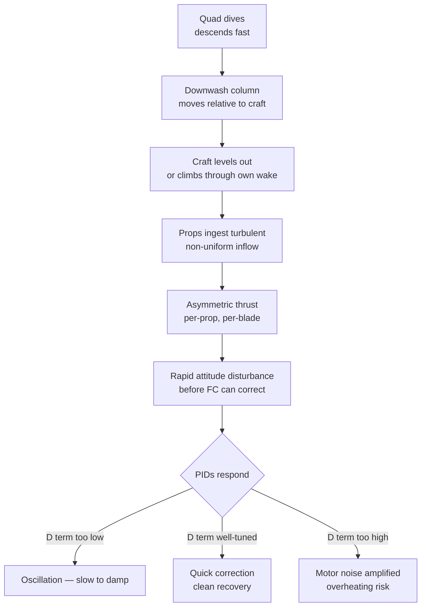

Propwash is the turbulence a multirotor flies through when it descends into its own rotor downwash. It is the dominant cause of the characteristic oscillation felt during punch-outs, split-S exits, and any recovery from a dive. Understanding the airflow geometry makes the tuning response obvious.

---

## What Is Rotor Downwash?

Each spinning prop accelerates air downward through a pressure differential — high pressure above the disk, low below. The resulting column of accelerated air is called **downwash**. In a hover, this column extends several prop diameters below the craft and disperses gradually.

<canvas id="downwash-canvas" width="520" height="360" style="border-radius:8px;background:#111;display:block;"></canvas>

---

## How Propwash Oscillation Happens

During normal forward flight the quad is flying into clean air. When it pitches level after a dive — or punches up into a descent — it flies back into the disturbed air column it just came through. Each prop then ingests turbulent, non-uniform inflow instead of smooth laminar air.

The disturbance is primarily felt as a pitch/roll wobble on exit from dives and during throttle-down recovery. It is **not** a PID instability — it is an external aerodynamic input that the PID loop has to reject. Tuning helps, but it cannot eliminate the physics.

---

## The Airflow Geometry — Live

<canvas id="propwash-canvas" width="520" height="400" style="border-radius:8px;background:#111;display:block;"></canvas>

**Orange = turbulent inflow.** During recovery the quad descends into the disturbed column it just pushed downward. Each blade encounters varying angle of attack across the disk, producing asymmetric thrust.

---

## Why Ground Effect Adds to It

Close to the ground (within ~1 prop diameter altitude), the downwash cannot fully develop — it spreads radially outward along the surface and wraps back up, re-entering the rotor disk from outside. This **ground recirculation** reduces effective thrust and adds another turbulent input. Combined with prop wash during low-altitude descents, this is why slow hover-in-ground-effect landings can feel mushy.

---

## What Tuning Can and Can't Fix

| Symptom | Tuning fix | Limit |
|---------|-----------|-------|
| Mild oscillation on dive exit, damps in 1–2 cycles | Increase D (Roll/Pitch) 5–10% | Fully fixable |
| Wobble on every throttle-down | Increase D, verify RPM filter | Largely fixable |
| Violent oscillation on aggressive split-S | D + reduce P slightly, check filtering | Partially — extreme moves always have propwash |
| Oscillation hot motors | D is too high — back off | Don't chase propwash with excessive D |
| Still wobbling after D is at thermal limit | Accept it — aerodynamics win | Not a tuning problem |

**The goal is not to eliminate propwash — it is to reject it quickly without overheating motors.** An aggressive freestyle quad will always have some propwash. A well-tuned one damps it within one to two oscillation cycles.

---

## Related

- [PID Basics](../../tuning/pid-basics/)
- [BBL-Based PID Tuning Protocol](../../tuning/bbl-pid-tuning-protocol/)
- [Blackbox Logging](../../tuning/blackbox-logging/)
