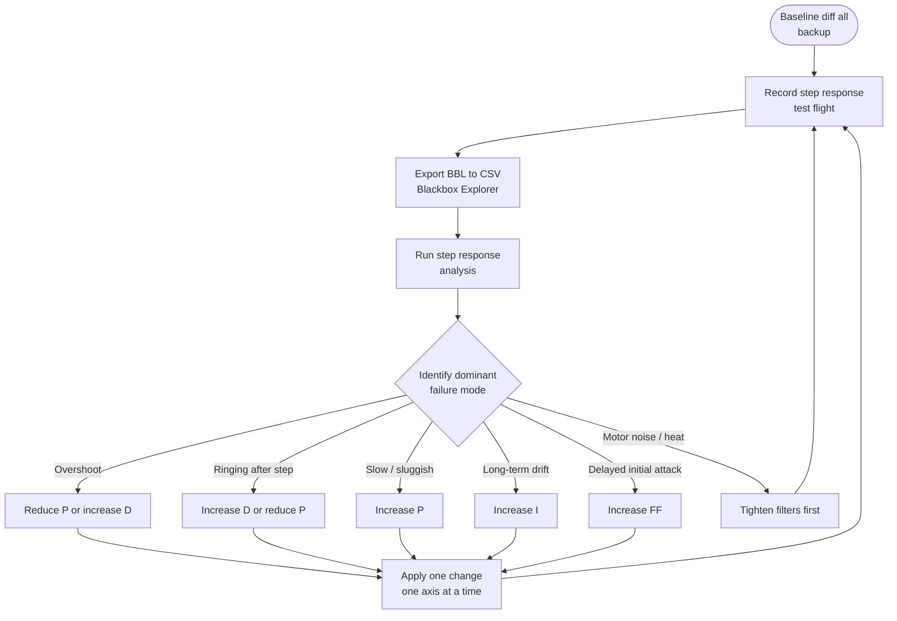
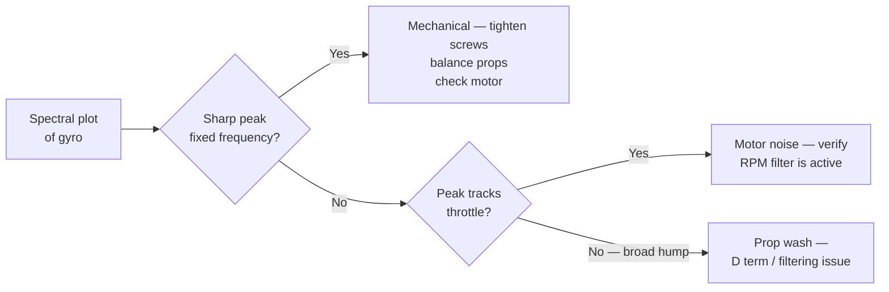
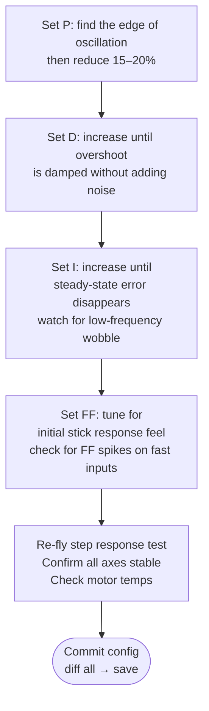

A structured, blackbox-driven PID tuning protocol based on step response analysis. Derived from the methodology implemented in [PIDtoolbox](https://github.com/bw1129/PIDtoolbox) (Brian White, MATLAB) and adapted for iterative field use. The protocol requires a `.bbl` log from a dedicated test flight; do not attempt to tune from a freestyle or racing session log — the input signals are too irregular.

---

## Overview



**Before touching PIDs: verify your filters are correctly configured.** High P gains on a noisy, under-filtered quad produce oscillation that looks identical to a P-too-high symptom. Always analyze the motor traces and spectral noise floor before concluding a PID adjustment is needed.

---

## Step 1 — Backup Current Config

```
# In Betaflight CLI:
diff all
# Save output to a timestamped file before any change
# e.g.: build-name_2026-07-13_pre-tune.txt
```

See [CLI Backup and Restore](../cli-backup-restore/) for the full workflow.

---

## Step 2 — Record a Proper Test Flight

A step response test flight is **not** normal flying. The goal is to generate clean, repeated rapid stick inputs on each axis independently.

### Maneuver Protocol

| Axis | Input | Description |
|------|-------|-------------|
| Roll | Rapid left–right deflections | Full deflection in one direction, return to center, opposite full deflection. ~0.5–1s per direction. |
| Pitch | Rapid forward–back deflections | Same pattern, in clean level flight. |
| Yaw | Rapid left–right rudder | Slower than roll/pitch — yaw is under-actuated on most builds. |

**Do each axis separately in its own log segment, or at minimum pause between axes.** Mixing simultaneous inputs defeats step response analysis.

### Flight Conditions

- Hover height 5–10 m in calm air (wind degrades the analysis)
- Constant throttle during the inputs — throttle changes shift the hover point and contaminate the data
- Arms enabled, Air Mode on
- Blackbox at full rate (denom = 1) or half rate (denom = 2) — see [Blackbox Logging](../blackbox-logging/)

### BBL Settings for Tuning Sessions

```
# Enable high-rate logging for tuning:
set blackbox_sample_rate = 1/2   # or 1/1 for max resolution
set blackbox_device = SPIFLASH   # or SDCARD if available

# Fields to ensure are logged:
set blackbox_disable_pids = OFF
set blackbox_disable_setpoint = OFF
set blackbox_disable_gyroraw = OFF
set blackbox_disable_motor = OFF
save
```

---

## Step 3 — Export from Blackbox Explorer

1. Open Betaflight Blackbox Explorer, load the `.bbl` file
2. Identify the clean step response segments — look for the axis inputs visually
3. Select the relevant segment (avoid arming transients, landing, or crashes)
4. Export: **File → Export CSV**
5. Note which log number corresponds to which axis / tune iteration

---

## Step 4 — Step Response Analysis

The step response is computed via Wiener deconvolution of the gyro response against the setpoint. The output is a curve showing how the actual rotation rate tracks the commanded rotation rate over time.

```mermaid
flowchart LR
    SET[Setpoint\n(RC command)] -->|Wiener deconvolution| SR[Step Response\ncurve]
    GYR[Gyro\n(actual rate)] --> SR
    SR --> SHAPE{Shape analysis}
    SHAPE --> OS[Overshoot peak]
    SHAPE --> RT[Rise time]
    SHAPE --> ST[Settling time]
    SHAPE --> SS[Steady-state error]
```

### Target Step Response Shape

```chart
{
  "type": "line",
  "data": {
    "labels": ["0","10","20","30","40","50","60","70","80","90","100","110","120","130","140","150"],
    "datasets": [
      {
        "label": "Ideal / well tuned",
        "data": [0,0.35,0.72,0.95,1.05,1.04,1.02,1.01,1.00,1.00,1.00,1.00,1.00,1.00,1.00,1.00],
        "borderColor": "rgba(34,197,94,1)",
        "backgroundColor": "transparent",
        "borderWidth": 2.5,
        "tension": 0.3,
        "pointRadius": 0
      },
      {
        "label": "P too high (overshoot + ringing)",
        "data": [0,0.42,0.90,1.25,1.20,1.10,1.18,1.08,1.13,1.05,1.08,1.02,1.04,1.01,1.02,1.00],
        "borderColor": "rgba(239,68,68,1)",
        "backgroundColor": "transparent",
        "borderWidth": 2,
        "tension": 0.3,
        "borderDash": [5,3],
        "pointRadius": 0
      },
      {
        "label": "P too low (slow, undershoots)",
        "data": [0,0.18,0.40,0.60,0.76,0.86,0.93,0.97,0.99,1.00,1.00,1.00,1.00,1.00,1.00,1.00],
        "borderColor": "rgba(249,115,22,1)",
        "backgroundColor": "transparent",
        "borderWidth": 2,
        "tension": 0.3,
        "borderDash": [4,2],
        "pointRadius": 0
      },
      {
        "label": "D too low (overshoot, slow settle)",
        "data": [0,0.38,0.78,1.10,1.18,1.14,1.08,1.05,1.03,1.02,1.01,1.00,1.00,1.00,1.00,1.00],
        "borderColor": "rgba(168,85,247,1)",
        "backgroundColor": "transparent",
        "borderWidth": 2,
        "tension": 0.3,
        "borderDash": [6,2],
        "pointRadius": 0
      },
      {
        "label": "I too low (steady-state error)",
        "data": [0,0.35,0.72,0.96,1.05,1.03,1.01,1.00,0.97,0.95,0.93,0.91,0.90,0.90,0.90,0.90],
        "borderColor": "rgba(234,179,8,1)",
        "backgroundColor": "transparent",
        "borderWidth": 2,
        "tension": 0.3,
        "borderDash": [3,2],
        "pointRadius": 0
      }
    ]
  },
  "options": {
    "responsive": true,
    "interaction": { "mode": "index", "intersect": false },
    "plugins": {
      "title": { "display": true, "text": "Step Response Shapes — Diagnosis Guide (normalized, t in ms)" },
      "legend": { "position": "bottom" }
    },
    "scales": {
      "x": { "title": { "display": true, "text": "Time (ms)" } },
      "y": {
        "min": 0,
        "max": 1.35,
        "title": { "display": true, "text": "Normalized rate response" }
      }
    }
  }
}
```

### Reading the Step Response

| Shape | Diagnosis | Primary fix |
|-------|-----------|------------|
| Overshoot >10%, oscillates back | P too high | Reduce P by 10–15% |
| Overshoot present, settles cleanly but slowly | D too low | Increase D by 10% |
| Slow rise, no overshoot, sluggish | P too low | Increase P by 10–15% |
| Rises fast, massive overshoot, sustained ringing | P too high AND D too low | Reduce P first, then evaluate D |
| Good shape in analysis but ringing in freestyle | Noise / filter issue | Check motor noise spectrum first |
| Steady-state error: response settles at 0.92 not 1.0 | I too low | Increase I by 10–20% |
| Delayed start of rise (lag before response begins) | FF too low | Increase FF by 10% |

---

## Step 5 — Spectral Analysis (Noise Check)

Before any PID adjustment, run spectral analysis on gyro and motor traces. Look for:

- **Prop wash frequency**: typically 100–300 Hz depending on frame/prop size. Broad hump in the gyro spectrum.
- **Motor noise**: sharp peaks above 300 Hz. RPM filter should place notches here.
- **ESC switching noise**: above 1 kHz. Low-pass filter should handle this.
- **Mechanical resonance**: sharp narrow peak at a fixed frequency regardless of throttle. Check motor screws, prop balance.



Only proceed to PID adjustment once the noise floor is clean or understood.

---

## Step 6 — Tuning Order

Follow this order. Do not skip to I or FF before P and D are stable.



**Axis order**: Roll first (most sensitive), then Pitch, then Yaw. Roll and Pitch can often share PID values on symmetrical frames — verify after setting both.

---

## Step 7 — Motor Temperature Check

After any PID change, hover for 2–3 minutes and immediately check motor temperatures:

- **< 50°C** — safe; PIDs are reasonable
- **50–65°C** — warm; D or filters may be too aggressive, generating excess motor activity
- **> 65°C** — hot; reduce D or re-examine filter cutoffs before flying further

Motors should be checked in the same order (M1–M4) every time. If one motor runs significantly hotter than the others, that arm may have vibration or a soft motor mount — address mechanically before attributing to PIDs.

---

## Reference

- **PIDtoolbox** (Brian White): [github.com/bw1129/PIDtoolbox](https://github.com/bw1129/PIDtoolbox) — the MATLAB implementation of step response analysis and spectral tooling this protocol is derived from. Runs in MATLAB or GNU Octave.
- **Betaflight Blackbox Explorer**: [github.com/betaflight/blackbox-log-viewer](https://github.com/betaflight/blackbox-log-viewer)
- **Rylo** — AI-assisted BBL analysis: share your `.bbl` log and get step response, spectral diagnosis, and PID recommendations without MATLAB. → [app.sintra.ai/community/helpers/rylo](https://app.sintra.ai/community/helpers/rylo)
- Related snippets: [Blackbox Logging](../blackbox-logging/), [PID Basics](../pid-basics/), [CLI Backup and Restore](../cli-backup-restore/), [Tuning Flight Protocol](../tuning-flight-protocol/), [Wobble-Test PID Protocol](../pid-tuning-wobble-test/)
