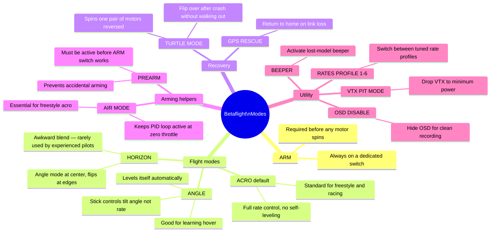
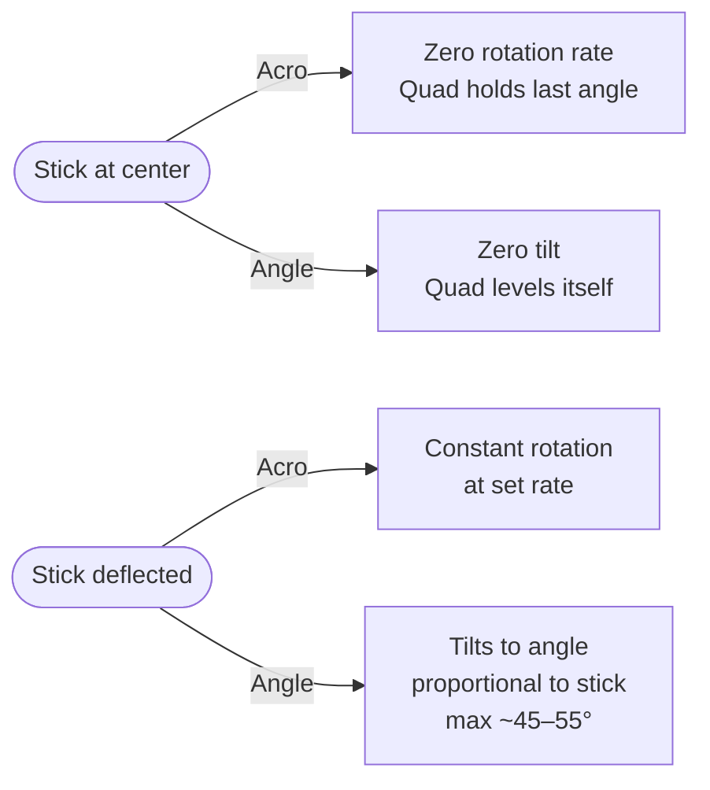

Betaflight modes are conditions assigned to AUX channel ranges. When a switch position triggers a condition, the FC activates that mode. Some modes are mutually exclusive; others stack.

---

## Mode Map



---

## Recommended Switch Layout

| Switch | Mode(s)              | Type       | Notes                                           |
|--------|----------------------|------------|-------------------------------------------------|
| SA     | ARM                  | 2-position | Most critical; always know which way is disarmed|
| SB     | ANGLE / ACRO         | 2-position | SB down = acro, SB up = angle (for recovery)   |
| SC     | BEEPER / TURTLE      | 3-position | Mid = beeper, Up = turtle after crash           |
| SD     | RATES PROFILE 1–3    | 3-position | Slow / normal / fast rates                      |
| SE     | GPS RESCUE / PREARM  | 2-position | Or VTX power levels on a wheel                 |

Assign channels in the radio's mixer: SA → CH5 (AUX1), SB → CH6 (AUX2), etc.

---

## Acro vs Angle — When to Use Each



**Acro (rate mode)** is the default and the "correct" mode for any freestyle or outdoor flying. It gives full control authority — you can fly inverted, do flips, and hold any attitude. The quad does exactly what the sticks say.

**Angle mode** self-levels. The stick commands a tilt angle, not a rotation rate. The FC actively fights any tilt beyond the configured max angle. Useful for absolute beginners learning to hover, but the limits prevent inverted flight and maneuvers.

---

## Air Mode

Air Mode keeps the PID loop active when the throttle is at zero. Without it, the FC cuts PID output at zero throttle and the quad tumbles uncontrollably during inverted passes or power-off maneuvers.

```
# Enable permanently (recommended for acro flying)
set airmode_activate_throttle = 1000
feature AIRMODE
save

# Or assign to a switch in Modes tab → AIR MODE
```

Enable Air Mode permanently for any freestyle flying. The only case to disable it: absolute beginners on angle mode who benefit from the quad stopping dead on throttle cut.

---

## Turtle Mode (Flip Over After Crash)

After a crash with the quad landed upside-down, Turtle Mode spins the props in reverse on alternating diagonal pairs to flip it over — no walking out to retrieve it.

**How to activate:**
1. Disarm (arm switch to disarm)
2. Activate Turtle Mode switch
3. Re-arm
4. Use roll/pitch stick to flip; the quad spins the appropriate motors
5. Once upright, disarm, disable Turtle, re-arm normally

```
# Requires DSHOT — bidirectional not required, but the ESCs must support
# motor reversal command (all BLHeli_32 / AM32 ESCs do)
set beeper_dshot_beacon_tone = 1  # optional: beacon beeps while turtle active
```

Turtle Mode is hard on props and motors — the reverse-spin torque stresses bearings. Use it sparingly; don't flip repeatedly on the same crash.

---

## Prearm

Adds a two-step arming requirement: Prearm switch must be active before the ARM switch does anything. Prevents accidentally arming while carrying the quad.

Assign to a switch that you consciously activate when ready to fly:

```
# In Modes tab: PREARM on AUX3 full range
# In practice: flip Prearm (SA up), then flip ARM (SB up)
# To disarm: flip ARM down. Prearm can stay active.
```

Highly recommended for any build with exposed props in a bag or case.

---

## OSD Disable

Removes all OSD elements from the video feed. Useful when recording clean footage for editing without pilot UI clutter:

```
# In Modes tab: OSD DISABLE on a switch position
# Flip to hide OSD for clean B-roll; flip back to see telemetry
```
