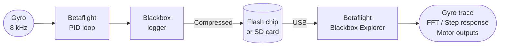

Blackbox records every sensor reading, RC input, PID output, and motor command at high frequency. It is the most powerful diagnostic tool available — without it, tuning is guesswork.

---

## How the Pipeline Works



The logger samples at your configured log rate (typically 1–4 kHz) and writes compressed frames to either onboard flash or a microSD card slot on the FC.

---

## Enabling Logging

Configurator → **Blackbox** tab:

```
set blackbox_device = SPIFLASH   # or SDCARD
set blackbox_rate_denom = 2      # log every 2nd PID loop (4 kHz at 8 kHz loop)
set blackbox_mode = NORMAL       # log when armed
save
```

`blackbox_rate_denom`: higher value = lower log rate = longer recording before flash fills.

| Loop rate | rate_denom | Effective log rate | ~Minutes on 16MB flash |
|-----------|------------|-------------------|------------------------|
| 8 kHz     | 1          | 8 kHz             | ~4 min                 |
| 8 kHz     | 2          | 4 kHz             | ~8 min                 |
| 8 kHz     | 4          | 2 kHz             | ~16 min                |
| 8 kHz     | 8          | 1 kHz             | ~32 min                |

**For tuning: use 4 kHz (denom = 2).** For long sessions where you only want crash data: 1 kHz (denom = 8).

---

## What Each Field Tells You

```chart
{
  "type": "bar",
  "data": {
    "labels": [
      "gyroADC (raw gyro)",
      "gyroUnfilt (pre-filter)",
      "rcCommand (stick input)",
      "axisP/I/D/F (PID terms)",
      "motor[0-3] (output)",
      "rcData (RC channels)",
      "vbatLatest (voltage)",
      "amperageLatest (current)"
    ],
    "datasets": [{
      "label": "Diagnostic value for tuning",
      "data": [9, 8, 7, 10, 9, 5, 6, 6],
      "backgroundColor": [
        "rgba(59,130,246,0.7)",
        "rgba(59,130,246,0.5)",
        "rgba(34,197,94,0.7)",
        "rgba(249,115,22,0.9)",
        "rgba(239,68,68,0.8)",
        "rgba(156,163,175,0.6)",
        "rgba(168,85,247,0.7)",
        "rgba(168,85,247,0.6)"
      ],
      "borderWidth": 1
    }]
  },
  "options": {
    "indexAxis": "y",
    "responsive": true,
    "plugins": {
      "title": { "display": true, "text": "Blackbox Field Usefulness for Tuning (subjective 1–10)" },
      "legend": { "display": false }
    },
    "scales": {
      "x": { "beginAtZero": true, "max": 10, "title": { "display": true, "text": "Usefulness" } }
    }
  }
}
```

**axisP/I/D/F** — the individual PID term outputs. The only way to know which term is oscillating.

**motor[0–3]** — final motor commands after all PID and filtering. Saturation (hitting 0 or 2047) shows torque limiting. Divergence between motors shows frame/motor imbalance.

**gyroADC** — filtered gyro. What the PID loop actually sees. Should track RC input cleanly.

**gyroUnfilt** — raw gyro before any filtering. Compare with gyroADC to see what your filters are removing. If unfilt and ADC look the same, your filters aren't doing much (could be good or bad).

---

## Reading a Log in Blackbox Explorer

1. Download [Betaflight Blackbox Explorer](https://github.com/betaflight/blackbox-log-viewer/releases)
2. Open the `.bbl` file (drag and drop)
3. Use **I/O keys** to scrub forward/backward
4. Enable **FFT** (top right) to see frequency-domain noise spectrum
5. Look for:
   - Gyro traces oscillating without stick input → filter or tune issue
   - Motor traces hitting max/min → torque saturation or desync
   - P-term spikes on roll → P too high, or insufficient filtering

---

## Erasing Flash

```
# In CLI
blackbox erase
# Wait for the confirmation beep / "Done" message, then save
```

Or use Configurator → Blackbox tab → **Erase Flash** button.

---

## Notes

- Logging does not affect flight performance measurably.
- Some FCs have only 1–2 MB of flash — enough for a single short flight at 4 kHz. Check your FC specs.
- SD card logging gives unlimited capacity; flash is more reliable (cards can unmount mid-flight on vibration).
- Always erase the log before a tuning session so you don't have to hunt through old sessions.
