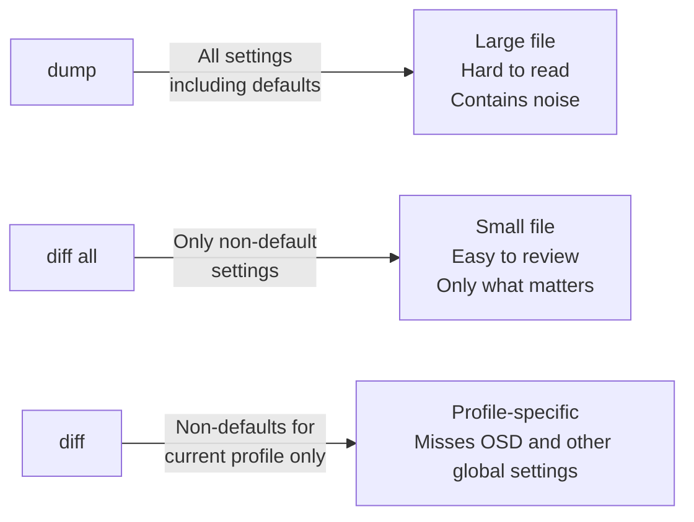
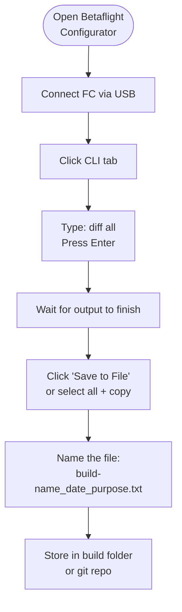
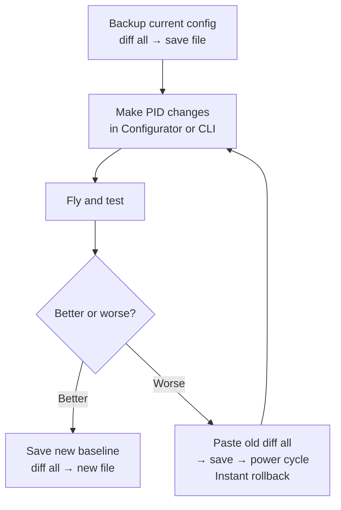

The Betaflight CLI is the only source of truth for a complete build configuration. Configurator tabs show most settings, but the CLI exposes everything — including defaults that the GUI hides. Before any tune experiment, back up with `diff all`. After a session, back up again.

---

## Why `diff all` Instead of `dump`



| Command    | What it saves              | Best for                               |
|------------|---------------------------|----------------------------------------|
| `dump`     | Everything, including defaults | Full factory-level backup         |
| `diff all` | Only your changes          | Day-to-day tuning backup               |
| `diff`     | Changes in current profile | Quick per-profile snapshot             |

**Use `diff all` for every backup.** It's readable, fits in a text file easily, and restores cleanly to the same Betaflight version. Use `dump` only when you need a byte-for-byte clone of an entire FC, or when transferring config to a different FC of the same model.

---

## Backup Workflow



### In CLI:

```
# Generate the backup
diff all

# The output scrolls in the terminal.
# Click "Save to File" in Configurator, OR:
# Select all output text (Ctrl+A in the text area), copy, paste to a .txt file.
```

Name the file with context — not just `backup.txt`:

```
pavo20_2026-07-13_pre-tune.txt
pavo20_2026-07-13_post-pid-tune.txt
freestyle5_2026-07-10_working-config.txt
```

---

## Restore Workflow

```
# In CLI tab, paste the diff all contents and press Enter
# Or use "Load from File" button

# After pasting, always end with:
save

# Then power cycle the FC (unplug USB, replug)
```

Betaflight processes each CLI command in sequence. A `diff all` file is a series of `set` commands plus `profile` and `rateprofile` switching commands — it's valid CLI input.

---

## Safe Tune Experimentation

Use this pattern to try a new tune without fear of losing what worked:



```
# Before any tune experiment:
diff all
# → Save to file immediately

# After a bad tune:
# Open the saved file, paste all contents into CLI, press Enter, then:
save
# Done — you're back to the working tune.
```

---

## What `diff all` Captures

- All PID values and TPA settings
- All rate profiles (RC Rate, Super Rate, Expo for all axes)
- All OSD element positions
- Failsafe configuration
- ESC/motor protocol settings
- RPM filter configuration
- All mode assignments
- Blackbox settings
- VTX power table
- GPS settings (if configured)

**It does NOT capture:**
- Receiver bind (stored on the RX)
- VTX channel/power *current* selection (channel/power is runtime state)
- Motor order/direction (stored in ESC firmware)

---

## Storing Configs in Git

For serious builds, put your `diff all` files in a git repository:

```bash
mkdir quad-configs && cd quad-configs
git init
cp pavo20_2026-07-13.txt .
git add .
git commit -m "Pavo20: pre-tune baseline"

# After a tune session:
cp pavo20_2026-07-14_after-pid.txt .
git add .
git commit -m "Pavo20: P/D tuned, filter lowpass moved to 150Hz"
```

`git diff` between two configs shows exactly what changed — every `set` line that moved. This makes it trivially easy to understand what a tune session actually modified.

---

## Recovering from a Bricked Config

If the FC won't arm or behaves strangely after a paste:

```
# In CLI:
defaults nosave     # resets all settings but does NOT save — lets you verify first
# Verify arming works in Configurator
save
# Now paste your last known-good diff all
```

`defaults nosave` is reversible — `save` makes it permanent. Always test before saving.
