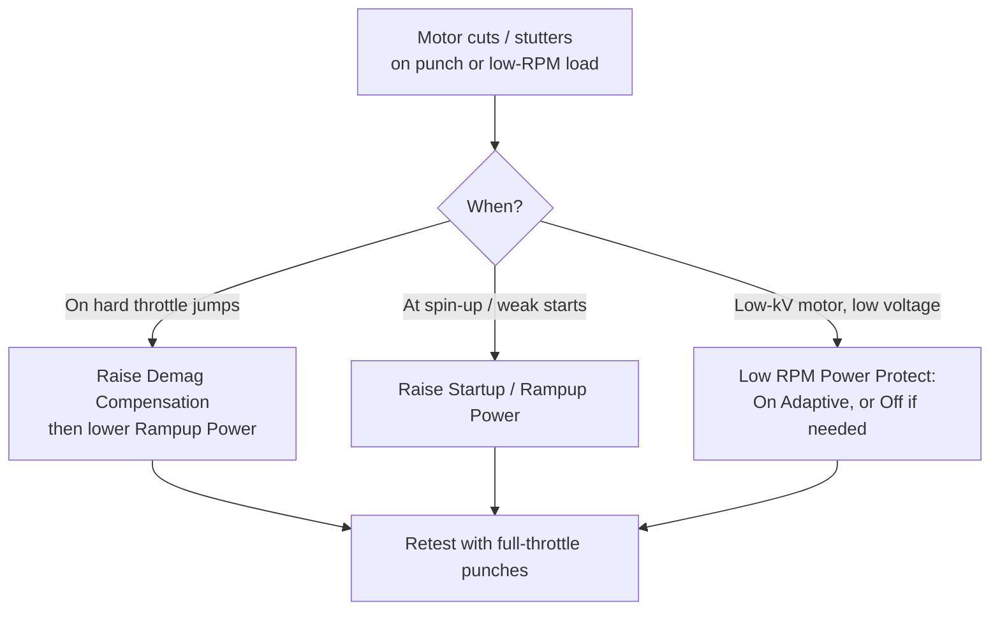

Keletas ESC pusės nustatymų nulemia, kaip patikimai motoras įsisuka ir kaip elgiasi, kai jį spaudi negailestingai. Pagrindinis gedimas, nuo kurio jie saugo, — tai **desync**, motoro nutrūkimas ore, kuris baigiasi krašu (ir tą garsą, kai variklis staiga nutyla vidury punch'o, atpažinsi iš karto — patikėkite). Čia apžvelgsim demag kompensaciją, startup/rampup galią ir apsaugų grupę BLHeli_32 ir AM32 firmware. Apie timing svirtį, kuri sąveikauja su visais jais, žr. [Motor Timing Advance](../motor-advance/).

---

## Problema: desync

Brushless ESC yra *sensorless* — jis neturi enkoderio. Rotoro poziciją jis nustato matuodamas **back-EMF** (BEMF) įtampą nevaromoje fazėje ir aptikdamas jos zero-crossing, kad suplanuotų kitą komutaciją.

Jei ESC apsiskaičiuoja komutacijos laiką, jis įjungia ne tą fazę, rotorius priešinasi, ir motoras **praranda sync** — sustoja, trūkčioja arba griežia. Simptomai: motoras nutrūksta per staigų punch'ą, trūkčioja žemuose RPM su apkrova arba „užsikabina“ ir numeta kvadrą. Dažni trigger'iai:

- Staigūs throttle pokyčiai (punch-out'ai, flip stop'ai)
- Didelė apkrova žemuose RPM
- Elektrinis triukšmas (6S, high-current build'ai)
- Ilgas **demagnetizacijos** laikas po to, kai fazė išsijungia

---

## Demag kompensacija

Kai fazė išsijungia, srovė apvijoje nesustoja akimirksniu — apvijos induktyvumas ją toliau varo, kol ji **demagnetizuojasi**. To lango metu BEMF rodmuo yra sugadintas, o esant aukštiems RPM ar didelei apkrovai demag laikas gali „suvalgyti“ detekcijos langą ir sukelti sync praradimą.

Demag kompensacija aptinka demag situaciją ir trumpam **nukerpa galią**, kad apsaugotų sync:

| Nustatymas | Elgsena                                              |
|-------------|-------------------------------------------------------|
| **Off**     | Galia niekada nekerpama — maksimalus našumas, mažiausiai saugu |
| **Low**     | Švelniai nukerpa galią aptikus demag įvykį            |
| **High**    | Kerpa galią agresyviau — stipresnė apsauga            |
| **Very High** (32.9+) | Agresyviausias kirpimas                     |

Aukštesnis nustatymas duoda geresnę apsaugą, bet gali šiek tiek **sumažinti viršutinę galią** kai kuriuose motoruose (jis riboja pagreitį, kad sutramdytų srovės šuolius). Aukštas komutacijos timing kovoja su ta pačia problema, bet kainuoja efektyvumą — demag kompensacija yra taiklesnė alternatyva.

**Praktiškai:** palik default'e, nebent gauni desync. Kelk į **High** 6S / high-power / hex build'ams arba jei matai trūkčiojimą per punch'us.

---

## Startup / Rampup galia

Tai riboja, kiek galios ESC gali paduoti **žemuose RPM ir įsisukimo metu**. Riba egzistuoja tam, kad BEMF liktų aptinkamas, kol motoras vos sukasi.

- **BLHeli_32 „Rampup Power“** (senesnis pavadinimas: *Startup Power*): santykinis **3%–150%**. Per mažas → silpni ar nepavykę startai ir trūkčiojimas; per didelis → srovės šuoliai, desync ir triukšmingesnis kvadras.
- **AM32** jį skaido į du:
  - **Startup Power** — trumpas boost'as tik per pirmas kelias komutacijas, kad motoras įsuktų į sukimąsi.
  - **Minimum Duty Cycle** — grindys (iki ~25%), kad maži / low-inertia motorai neužstrigtų prie labai mažo throttle.

Rampup galios mažinimas yra teisėta svirtis prieš desync ir elektrinį triukšmą, atsiperkant šiek tiek minkštesniu motoro atsaku.

---

## Low RPM Power Protect

Riboja galią būtent žemų RPM zonoje, kad išlaikytų sync.

- **On** (default) — saugu beveik kiekvienam kvadrui.
- **Off** — reikalinga tik norint gauti pilną galią iš kai kurių **low-kV motorų su žema tiekimo įtampa**; jį išjungus, padidėja sync praradimo rizika ir gali iškepti motorą ar ESC.
- **On Adaptive** (32.9+) — skaliuoja ribą pagal `kV × voltage`; geras „nustatyk ir pamiršk“ variantas bet kokiam motorui / įtampai.

Palik **On**, nebent turi konkrečią low-kV / low-voltage priežastį.

---

## Temperatūros apsauga

ESC stebi savo MCU temperatūrą ir, kai ji peržengia slenkstį, **palaipsniui mažina motoro galią** iki maždaug **25%**, jei temperatūra vis kyla. Slenkstis pasirenkamas (paprastai **140/150/160/170 °C**, arba išjungta).

Laikyk jį **įjungtą** — tai paskutinė gynybos linija, saugianti ESC nuo šiluminės mirties; ant sveiko build'o jis turėtų suveikti retai. Jei jis suveikinėja, taisyk tikrąją priežastį (per aukštas timing, per aukštas PWM, per sunkus prop — žr. [ESC PWM Frequency](../esc-khz/) ir [Motor Timing Advance](../motor-advance/)).

---

## Srovės apsauga

Kietas **amperų limitas** kiekvienam ESC. Kai įjungta, srovė ribojama iki užprogramuotos vertės, o ribotuvas pakankamai greitas, kad suveiktų pagreičių metu (AM32 tai daro su tikra srovės PID kilpa).

Palik **off** pagal nutylėjimą — jei ESC srovės reitingas atitinka build'ą, jo tau nereikia. Tai daugiausia apsauga nuo ESC sudeginimo per pasikartojančius krašus / desync'us.

---

## Nustatymai daugiausia kitiems aparatams

| Nustatymas             | Ką jis daro                                              | Ant kvadro         |
|------------------------|----------------------------------------------------------|--------------------|
| **Low Voltage Protection** | Nukerpa / riboja galią žemiau 2.5–4.0 V vienai celei | **Off** — FC tvarko vbat įspėjimus; niekada nenori, kad ESC nukirstų galią per flip'ą |
| **Stall Protection**   | Padidina throttle, kad neužstrigtų su apkrova            | **Off** — crawler / RC-car funkcija; sukelia karštį ir keistą elgesį ant kvadrų |
| **Brake on Stop**      | Įjungia stabdymą prie nulinio throttle                   | Paprastai Off — skirta fixed-wing sulankstomiems prop'ams (Air Mode stabdo kitaip) |

---

## Rekomenduojami startiniai taškai pagal klasę

Šios apsaugos vienodos ant kiekvieno build'o, nuo 65 mm whoop iki 5":

| Visada                 | Vertė                          |
|------------------------|--------------------------------|
| Temperature Protection | Enabled (~140–150 °C)          |
| Current Protection     | Off                            |
| Low Voltage Protection | Off (FC tvarko vbat)           |
| Stall Protection       | Off                            |
| Brake on Stop          | Off                            |

Kas realiai skaliuojasi su prop dydžiu, tai **demag** ir **startup**: mažesni, žemesnės įtampos build'ai traukia mažai srovės ir retai desync'ina, todėl jiems reikia mažiau demag apsaugos; startup/rampup dėmesio reikia tik tada, kai motoras neįsisuka švariai.

| Prop dydis (pavyzdys) | Tipinis pack | Demag kompensacija            | Startup / Rampup                        | Low RPM Power Protect |
|---------------------|--------------|-------------------------------|-----------------------------------------|-----------------------|
| 35 mm (Air65)       | 1S           | Default — nereikės High       | Default; pakelk truputį, jei motorai stringa per arm | On             |
| 45 mm (Meteor65)    | 1S           | Default — nereikės High       | Default; pakelk truputį, jei motorai stringa per arm | On             |
| 1.6"                | 1S–2S        | Default                       | Default                                 | On                    |
| 2"                  | 2S–3S        | Default                       | Default                                 | On                    |
| 2.2"                | 3S–4S        | Default                       | Default                                 | On                    |
| 2.5"                | 4S           | Default                       | Default                                 | On                    |
| 3"                  | 4S–6S        | Default; High jei desync      | Default                                 | On                    |
| 5"                  | 4S–6S        | Default; High ant 6S ar desync | Default                                | On (arba Adaptive)    |

> Whoop ir micro ESC dažnai sukasi ant **BLHeli_S**, kuris atveria mažiau ratelių (demag Off/Low/High ir startup-power slankiklis, be srovės limito). Patarimas tas pats — palik default'us ir kelk demag tik tada, jei gauni nutrūkimus.

Keisk po vieną dalyką ir patvirtink su **full-throttle punch sesija**, tada patikrink motorų temperatūras nusileidus. Dauguma desync fix'ų yra: pakelk demag, sumažink rampup ir patikrink, kad timing nebūtų nustatytas per agresyviai. Beje — po vieną, ne visus iškart, kitaip vėliau nebežinosi, kuris nustatymas tave išgelbėjo.

---

## Susiję

- [Motor Timing Advance](../motor-advance/) — timing svirtis, kuri iškeičia efektyvumą į desync atsargą
- [ESC PWM Frequency](../esc-khz/) — perjungimo dažnis vs karštis
- [DSHOT on the Wire](../dshot-protocol/) — protokolas, varantis ESC
- [Common Build Pitfalls](../../setup-safety/common-pitfalls/) — desync ir kitos pirmo skrydžio nesėkmės
