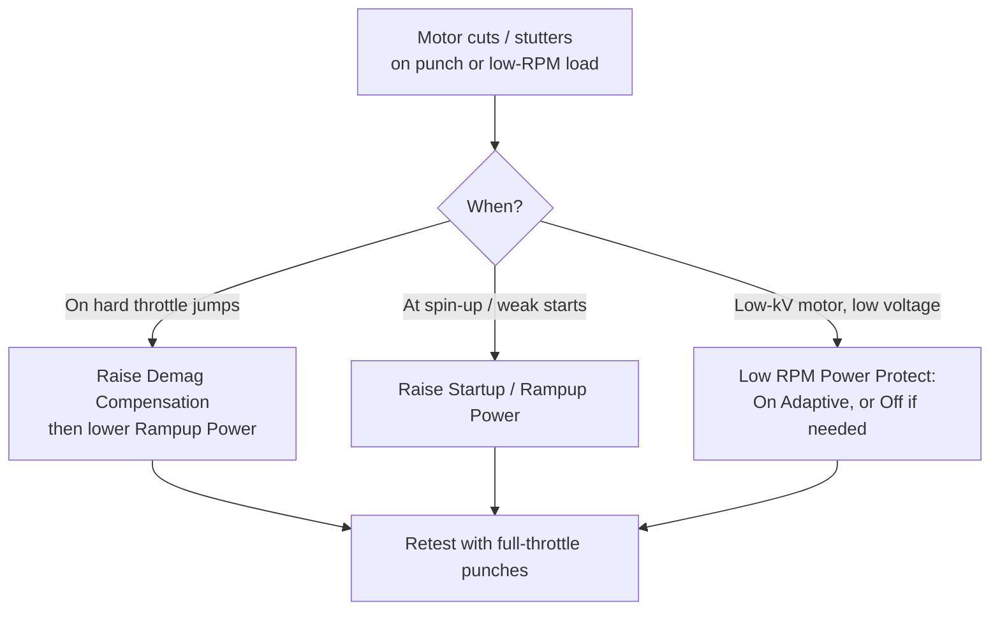

A handful of ESC-side settings decide how reliably a motor spins up and how it behaves when abused. The headline failure they guard against is **desync** — the mid-air motor cutout that ends in a crash. This covers demag compensation, startup/rampup power, and the protection group in BLHeli_32 and AM32. For the timing lever that interacts with all of them, see [Motor Timing Advance](../motor-advance/).

---

## The problem: desync

A brushless ESC is *sensorless* — it has no encoder. It figures out rotor position by measuring the **back-EMF** (BEMF) voltage on the undriven phase and detecting its zero-crossing to time the next commutation.

If the ESC mistimes a commutation, it energises the wrong phase, the rotor fights it, and the motor **loses sync** — it stops, stutters, or grinds. Symptoms: a motor that cuts on a hard punch, stutters at low RPM under load, or "catches" and drops the quad. Common triggers:

- Rapid throttle changes (punch-outs, flip stops)
- High load at low RPM
- Electrical noise (6S, high-current builds)
- Long **demagnetization** time after a phase switches off

---

## Demag Compensation

When a phase switches off, current in the winding does not stop instantly — the winding's inductance keeps it flowing while it **demagnetizes**. During that window the BEMF reading is corrupted, and at high RPM or high load the demag time can eat into the detection window and cause sync loss.

Demag compensation detects a demag situation and **cuts power** briefly to protect sync:

| Setting     | Behaviour                                             |
|-------------|-------------------------------------------------------|
| **Off**     | Power is never cut — maximum performance, least safe  |
| **Low**     | Cuts power gently on a detected demag event           |
| **High**    | Cuts power more aggressively — stronger protection    |
| **Very High** (32.9+) | Most aggressive cut                         |

A higher setting gives better protection but can slightly **reduce top-end power** on some motors (it limits acceleration to tame current spikes). High commutation timing fights the same problem but costs efficiency — demag compensation is the targeted alternative.

**Practical:** leave it at default unless you get desync. Raise to **High** for 6S / high-power / hex builds or if you see stutter on punches.

---

## Startup / Rampup Power

This limits how much power the ESC may apply **at low RPM and during spin-up**. The cap exists so BEMF stays detectable while the motor is barely turning.

- **BLHeli_32 "Rampup Power"** (older name: *Startup Power*): relative **3%–150%**. Too low → weak or failed starts and stutter; too high → current spikes, desync, and a noisier quad.
- **AM32** splits it in two:
  - **Startup Power** — a short boost during only the first few commutations, to kick the motor into rotation.
  - **Minimum Duty Cycle** — a floor (up to ~25%) so tiny/low-inertia motors don't stall at very low throttle.

Reducing rampup power is a valid lever against desync and electrical noise, at the cost of slightly softer motor response.

---

## Low RPM Power Protect

Limits power specifically in the low-RPM region to keep sync.

- **On** (default) — safe for almost every quad.
- **Off** — only needed to get full power from some **low-kV motors on low supply voltage**; disabling it raises the risk of sync loss and can cook the motor or ESC.
- **On Adaptive** (32.9+) — scales the limit from `kV × voltage`; a good "set and forget" for any motor/voltage.

Leave this **On** unless you have a specific low-kV/low-voltage reason.

---

## Temperature Protection

The ESC monitors its MCU temperature and **progressively reduces motor power** once it passes the threshold, down to roughly **25%** if it keeps climbing. The threshold is selectable (typically **140/150/160/170 °C**, or disabled).

Keep it **enabled** — it is a last-ditch guard that saves the ESC from thermal death; it should rarely engage on a healthy build. If it's engaging, fix the real cause (timing too high, PWM too high, prop too heavy — see [ESC PWM Frequency](../esc-khz/) and [Motor Timing Advance](../motor-advance/)).

---

## Current Protection

A hard **amperage cap** per ESC. When enabled, current is limited to the programmed value, and the limiter is fast enough to act during accelerations (AM32 does this with a proper current PID loop).

Leave it **off** by default — as long as the ESC's current rating suits the build, you don't need it. It's mainly a safeguard against burning an ESC on repeated crashes/desyncs.

---

## Settings mainly for other craft

| Setting                | What it does                                             | On a quad          |
|------------------------|----------------------------------------------------------|--------------------|
| **Low Voltage Protection** | Cuts/limits power below 2.5–4.0 V per cell           | **Off** — the FC handles vbat warnings; you never want the ESC cutting power mid-flip |
| **Stall Protection**   | Boosts throttle to prevent stalling under load           | **Off** — a crawler/RC-car feature; causes heat and odd behaviour on quads |
| **Brake on Stop**      | Applies braking at zero throttle                         | Usually Off — meant for fixed-wing folding props (Air Mode brakes differently) |

---

## Recommended starting point (5" quad)

| Setting                | Value                          |
|------------------------|--------------------------------|
| Demag Compensation     | Default (raise to High on 6S / desync) |
| Rampup / Startup Power | Default                        |
| Low RPM Power Protect  | On (or On Adaptive)            |
| Temperature Protection | Enabled (~140–150 °C)          |
| Current Protection     | Off                            |
| Low Voltage Protection | Off                            |
| Stall Protection       | Off                            |

Change one thing at a time and confirm with a **full-throttle punch session**, then check motor temps on landing. Most desync fixes are: raise demag, lower rampup, and confirm timing isn't set too aggressively.

---

## Related

- [Motor Timing Advance](../motor-advance/) — the timing lever that trades efficiency for desync margin
- [ESC PWM Frequency](../esc-khz/) — switching frequency vs heat
- [DSHOT on the Wire](../dshot-protocol/) — the protocol driving the ESC
- [Common Build Pitfalls](../../setup-safety/common-pitfalls/) — desync and other first-flight failures
