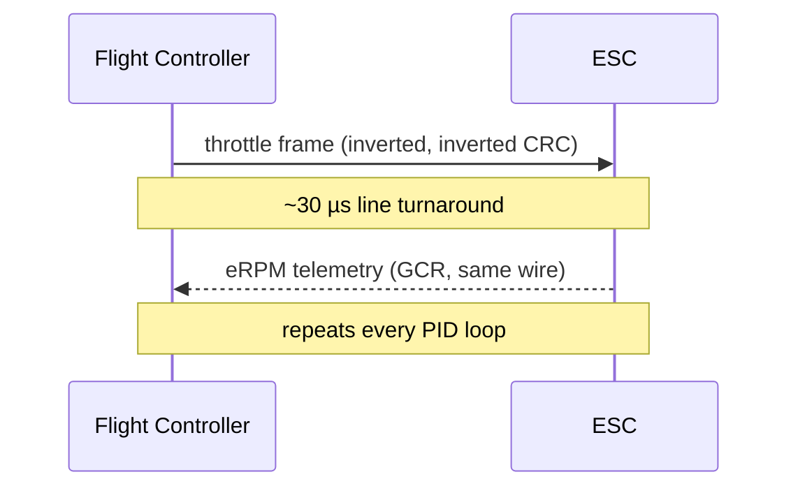

DSHOT yra skaitmeninis FC-į-ESC protokolas. Kiekvieną PID kilpą skrydžio kontroleris siunčia fiksuoto ilgio freimą su throttle verte plius checksum'a; bidirectional režime ESC atsako tuo *pačiu* laidu savo elektriniu RPM. Čia — byte lygio vaizdas, kas realiai keliauja signalo laidu (taip, žinau, skristi jam nereikia, bet man buvo per daug įdomu, kad neišsiaiškinčiau). Apie tuning pusę (RPM filter, notch'ai) žr. [DSHOT and RPM Filter](../dshot-rpm-filter/).

---

## Fizinis sluoksnis — bitas yra high laikas

DSHOT **nėra** UART. Kiekvienas bitas užima fiksuotą slotą; ar tai `1`, ar `0`, sprendžiama pagal tai, *kiek ilgai linija laikosi high* tame slote. `1` laikosi high dvigubai ilgiau nei `0`.

```wave
{ signal: [
  { name: "signal", wave: "1..010..1..01..0" },
  { name: "bit",    wave: "2...2...2...2...", data: ["1", "0", "1", "1"] }
],
  head: { text: "One slot per bit — a long high is 1, a short high is 0" }
}
```

Kadangi kiekvienas bito slotas yra to paties pločio, freimas visada yra tiksliai `16 × bit_period`, nepriklausomai nuo throttle — ir imtuvas gali nuskaityti kiekvieną bitą pagal vieną kylantį-tada-krentantį kraštą.

| Protocol | Bitrate     | T1H (µs) | T0H (µs) | Bit (µs) | Frame (µs) |
|----------|-------------|----------|----------|----------|------------|
| DSHOT150 | 150 kbit/s  | 5.00     | 2.50     | 6.67     | 106.72     |
| DSHOT300 | 300 kbit/s  | 2.50     | 1.25     | 3.33     | 53.28      |
| DSHOT600 | 600 kbit/s  | 1.25     | 0.625    | 1.67     | 26.72      |
| DSHOT1200| 1200 kbit/s | 0.625    | 0.313    | 0.83     | 13.28      |

`T1H` yra high laikas, skaitomas kaip `1`; `T0H` — high laikas, skaitomas kaip `0`. Skaičius pavadinime yra grynas bitrate.

---

## Freimo struktūra

Kiekvienas freimas yra 16 bitų, siunčiamas MSB pirma (kairiausias bitas pirmas laidu):

```wave
{ reg: [
  { bits: 4,  name: "CRC" },
  { bits: 1,  name: "T" },
  { bits: 11, name: "throttle" }
] }
```

- **11 bitų throttle** — 2048 vertės. `0` = disarmed, `1–47` = specialios komandos, `48–2047` = 2000 naudojamų throttle žingsnių.
- **1 bito telemetrijos užklausa** — prašo ESC siųsti klasikinę telemetriją *atskiru* telemetrijos laidu (nesusiję su bidirectional DSHOT).
- **4 bitų CRC** — checksum'a per prieš tai einančius 12 bitų.

---

## Checksum'a

CRC skaičiuojama per 12 bitų vertę (throttle pastumtas aukštyn vienu, OR'intas su telemetrijos bitu):

```
crc = (value ^ (value >> 4) ^ (value >> 8)) & 0x0F
```

Pavyzdys su skaičiais — throttle `1046` (pusė throttle), telemetrijos bitas nulinis, tad 12 bitų vertė yra `100000101100`:

```
value  = 100000101100
>> 4   = 000010000010
^      = 100010101110
>> 8   = 000000001000
^      = 100010100110
& 0x0F = 000000000110   → CRC = 0110
```

16 bitų laidu tampa `1000001011000110`.

---

## Specialios komandos (throttle 1–47)

Vertės žemiau 48 yra komandos, ne throttle. Dauguma jų vykdomos **tik kol motoras sustojęs**, o kelias reikia kartoti (paprastai 6×), kad vienas iškraipytas freimas negalėtų jų sutrigerinti.

| Vertė | Komanda                         | Pastaba           |
|-------|---------------------------------|-------------------|
| 0     | Motoro stop                     | —                 |
| 1–5   | Beep 1–5                        | palauk ~260 ms    |
| 7 / 8 | Sukimosi kryptis 1 / 2          | siųsk 6×          |
| 9 / 10| 3D režimas off / on             | siųsk 6×          |
| 12    | Išsaugoti nustatymus            | siųsk 6×, palauk 35 ms |
| 13/14 | Extended telemetry on / off     | siųsk 6× (EDT)    |
| 20/21 | Sukimosi kryptis normal / reversed | siųsk 6×       |
| 22–29 | LED 0–3 on / off                | —                 |

Būtent taip veikia Configurator'io *Reverse motor direction* mygtukas — jis siunčia komandą 20 arba 21 šešis kartus; ESC ją įsimena. Tam nėra jokio `set` kintamojo.

---

## Arming

ESC nepriims realaus throttle, kol nepamatys eilės disarm freimų. Bluejay, pavyzdžiui, reikalauja maždaug **300 ms `0` komandų**, kol paliks disarmed būseną — todėl ką tik įjungtas kvadras akimirką ignoruoja throttle.

---

## Freimų dažnis vs PID kilpa

FC nespamina freimų; jis išleidžia tiksliai po vieną per PID kilpos iteraciją, užrakintą prie kilpos dažnio. Tad kilpos dažnis nustato *reikalingą* DSHOT greitį, o ne atvirkščiai:

- 8 kHz kilpa → freimas kas 125 µs → DSHOT300 (53 µs/freimas) su kaupu užtenka.
- 32 kHz kilpa → freimas kas 31.25 µs → reikia DSHOT600, kad freimas tilptų.

Sukti greitesnį DSHOT nei tavo kilpai reikia savaime nieko neduoda.

---

## Bidirectional DSHOT

Bidirectional (dar vadinamas *inverted*) DSHOT yra tai, kas maitina RPM filter. Palyginti su paprastu DSHOT, keičiasi du dalykai:

1. **Linija apversta** — idle high, impulsai low (`1` = ilgas low, `0` = trumpas low). Tai ESC ženklas atsakyti su eRPM. Reikia DSHOT300 arba greitesnio.

```wave
{ signal: [
  { name: "signal", wave: "0..101..0..10..1" },
  { name: "bit",    wave: "2...2...2...2...", data: ["1", "0", "1", "1"] }
],
  head: { text: "Bidirectional = same encoding, inverted level (idle high)" }
}
```
2. **CRC apversta** — ta pati matematika, komplementuota prieš maskavimą:

```
crc = (~(value ^ (value >> 4) ^ (value >> 8))) & 0x0F
```

Kai FC baigia savo freimą, jis atleidžia liniją ir klausosi; ESC varo tą patį laidą atgal. Yra fiksuotas **~30 µs apsisukimas** linijos krypčiai, DMA ir timeriams perjungti — nepriklausomas nuo DSHOT greičio. Kadangi atsakas seka po kiekvienos komandos, pasiekiamas freimų dažnis maždaug perpus mažesnis.



---

## eRPM telemetrijos freimas

Atsakas vėl yra 16 bitų, bet išdėstytas kitaip:

```wave
{ reg: [
  { bits: 4, name: "CRC" },
  { bits: 9, name: "period base" },
  { bits: 3, name: "shift" }
] }
```

12 bitų payload'as yra mažytis slankiojo kablelio skaičius: 9 bitų **period base**, pastumtas kairėn 3 bitų **eksponente**, duoda motoro *elektrinį* komutacijos periodą mikrosekundėmis. CRC čia naudoja **neapverstą** formulę ir siunčiama neapversta.

Periodą konvertuok į RPM:

```
eperiod_us = period_base << exponent
eRPM       = 60,000,000 / eperiod_us
RPM        = eRPM / pole_pairs        # 14-pole motor → 7 pairs
```

Pavyzdys — `eperiod = 500 µs` → `eRPM = 120,000` → ant 14-pole motoro `≈ 17,140 RPM`. Betaflight būtent tai daro kiekvienam motorui, tada stato RPM-filter notch'us ant `RPM / 60` Hz ir jų harmonikų.

---

## Kodėl atsakas yra GCR koduotas

ESC **nesiunčia** tų 16 bitų žaliavos. Siųsti juos kaip DSHOT stiliaus impulsus atgal pasirodė per daug jittery, tad atsakas yra **GCR (Group-Coded Recording) koduotas** — tas pats triukas, naudojamas floppy/tape įrenginių, kad garantuotų dažnus perėjimus patikimam clock atkūrimui.

**1 žingsnis — nibble mapping (16 → 20 bitų).** Kiekvienas 4 bitų nibble mapinamas į 5 bitų kodą:

| Nibble | 0 | 1 | 2 | 3 | 4 | 5 | 6 | 7 | 8 | 9 | A | B | C | D | E | F |
|--------|---|---|---|---|---|---|---|---|---|---|---|---|---|---|---|---|
| 5-bit  |19 |1B |12 |13 |1D |15 |16 |17 |1A |09 |0A |0B |1E |0D |0E |0F |

```
16-bit:  1000 0010 1100 0110
nibbles:   x8   x2   xC   x6
mapped:   1A   12   1E   16
20-bit:  11010 10010 11110 10110
```

**2 žingsnis — perėjimų kodavimas (20 → 21 bitas).** 20 bitų GCR paverčiamas 21 bito lygio seka, kuri prasideda `0`: GCR `1` **perjungia** išėjimo lygį, GCR `0` jį **palaiko**. Tai perpus sumažina kraštų skaičių laide, dar labiau nukertant jitter.

21 bitas išeina **neapverstas 5/4 × DSHOT bitrate greičiu** (tad DSHOT600 → 750 kbit/s).

**Dekodavimas (FC pusėje)** yra viena instrukcija — atsuk perėjimų kodavimą:

```
gcr = value ^ (value >> 1)
```

tada apversk nibble lentelę ir ištrauk periodą.

---

## Extended DSHOT Telemetry (EDT)

eRPM float turi perteklinių koduočių (tas pats periodas gali būti užrašytas skirtingomis eksponentės/mantisės poromis). Bluejay/BLHeli_32/AM32 tuo naudojasi: visada normalizuodami eRPM vienu būdu, freimas formos `eee 0mmmmmmmm` niekada negali atsirasti natūraliai — tad kai FC *pamato* tokį, jis skaito jį kaip tipizuotą telemetrijos paketą:

```
pppp mmmmmmmm      # 4-bit type, 8-bit value
```

Tipai apima temperatūrą (0x02), įtampą (0x04, 0.25 V/žingsnis), srovę (0x06) ir debug/state laukus. Tai grąžina temperatūrą, įtampą ir srovę atgal **be jokio papildomo laido**, retkarčiais įterpta taip, kad netrukdytų RPM filtravimui. Įjunk jį specialiomis komandomis 13/14.

---

## Ką tai reiškia praktikoje

- **Kiekvienas throttle atnaujinimas turi checksum'ą** — triukšmas laide aptinkamas, o ne tyliai nuskraidinamas.
- **Bidirectional DSHOT yra request/response vienu laidu** — tas 30 µs apsisukimas plius atsakas yra kodėl freimų dažnis maždaug perpus sumažėja, tad aukšti kilpos dažniai nori DSHOT600.
- **eRPM yra periodas, ne RPM** — FC jį apverčia ir dalija iš pole pairs; supainiok pole skaičių, ir RPM filter seks ne tą dažnį (nekaltink filtro — jis tik daro, ką liepei). Žr. [Betaflight Tuning Math](../../tuning/betaflight-tuning-math/) dėl notch išdėstymo ir [FPV Terminology](../../reference/fpv-terminology/) dėl akronimų.
