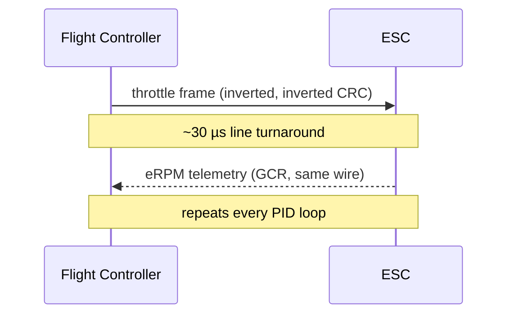

DSHOT is the digital FC-to-ESC protocol. Every PID loop the flight controller sends a fixed-length frame carrying a throttle value plus a checksum; in bidirectional mode the ESC answers on the *same* wire with its electrical RPM. This is the byte-level view — what actually travels down the signal wire. For the tuning side (RPM filter, notches) see [DSHOT and RPM Filter](../dshot-rpm-filter/).

---

## The physical layer — a bit is a high-time

DSHOT is **not** a UART. Each bit occupies a fixed slot; whether it is a `1` or a `0` is decided by *how long the line stays high* inside that slot. A `1` holds high for twice as long as a `0`.

Because every bit slot is the same width, a frame is always exactly `16 × bit_period`, regardless of throttle — and the receiver can clock each bit off a single rising-then-falling edge.

| Protocol | Bitrate     | T1H (µs) | T0H (µs) | Bit (µs) | Frame (µs) |
|----------|-------------|----------|----------|----------|------------|
| DSHOT150 | 150 kbit/s  | 5.00     | 2.50     | 6.67     | 106.72     |
| DSHOT300 | 300 kbit/s  | 2.50     | 1.25     | 3.33     | 53.28      |
| DSHOT600 | 600 kbit/s  | 1.25     | 0.625    | 1.67     | 26.72      |
| DSHOT1200| 1200 kbit/s | 0.625    | 0.313    | 0.83     | 13.28      |

`T1H` is the high time that counts as a `1`; `T0H` the high time that counts as a `0`. The number in the name is the raw bitrate.

---

## Frame structure

Every frame is 16 bits, sent MSB first:

```
 S S S S S S S S S S S  T  C C C C
 └──────── 11 ────────┘  │  └─ 4 ─┘
        throttle      telemetry  CRC
```

- **11-bit throttle** — 2048 values. `0` = disarmed, `1–47` = special commands, `48–2047` = the 2000 usable throttle steps.
- **1-bit telemetry request** — asks the ESC to send classic telemetry on the *separate* telemetry wire (unrelated to bidirectional DSHOT).
- **4-bit CRC** — checksum over the preceding 12 bits.

---

## The checksum

The CRC is computed over the 12-bit value (throttle shifted up by one, OR'd with the telemetry bit):

```
crc = (value ^ (value >> 4) ^ (value >> 8)) & 0x0F
```

Worked example — throttle `1046` (half throttle), telemetry bit clear, so the 12-bit value is `100000101100`:

```
value  = 100000101100
>> 4   = 000010000010
^      = 100010101110
>> 8   = 000000001000
^      = 100010100110
& 0x0F = 000000000110   → CRC = 0110
```

The 16 bits on the wire become `1000001011000110`.

---

## Special commands (throttle 1–47)

Values below 48 are commands, not throttle. Most are only acted on **while the motor is stopped**, and several must be repeated (typically 6×) so a single glitched frame can't trigger them.

| Value | Command                         | Note              |
|-------|---------------------------------|-------------------|
| 0     | Motor stop                      | —                 |
| 1–5   | Beep 1–5                        | wait ~260 ms      |
| 7 / 8 | Spin direction 1 / 2            | send 6×           |
| 9 / 10| 3D mode off / on                | send 6×           |
| 12    | Save settings                   | send 6×, wait 35 ms |
| 13/14 | Extended telemetry on / off     | send 6× (EDT)     |
| 20/21 | Spin direction normal / reversed| send 6×           |
| 22–29 | LED 0–3 on / off                | —                 |

This is how the Configurator's *Reverse motor direction* button works — it sends command 20 or 21 six times; the ESC persists it. There is no `set` variable for it.

---

## Arming

The ESC will not accept real throttle until it has seen a run of disarm frames. Bluejay, for example, requires roughly **300 ms of `0` commands** before it leaves the disarmed state — which is why a freshly powered quad ignores throttle for a moment.

---

## Frame rate vs PID loop

The FC does not spam frames; it emits exactly one per PID loop iteration, locked to the loop rate. So the loop rate sets the *required* DSHOT speed, not the other way around:

- 8 kHz loop → a frame every 125 µs → DSHOT300 (53 µs/frame) is plenty.
- 32 kHz loop → a frame every 31.25 µs → you need DSHOT600 to fit the frame.

Running a faster DSHOT than your loop needs buys nothing on its own.

---

## Bidirectional DSHOT

Bidirectional (a.k.a. *inverted*) DSHOT is what feeds the RPM filter. Two things change versus plain DSHOT:

1. **The line is inverted** — idle high, pulses low (`1` = low, `0` = high). This is the ESC's cue to reply with eRPM. Requires DSHOT300 or faster.
2. **The CRC is inverted** — same math, complemented before masking:

```
crc = (~(value ^ (value >> 4) ^ (value >> 8))) & 0x0F
```

After the FC finishes its frame it releases the line and listens; the ESC drives the same wire back. There is a fixed **~30 µs turnaround** to switch line direction, DMA and timers — independent of DSHOT speed. Because a reply follows every command, the achievable frame rate is roughly halved.



---

## The eRPM telemetry frame

The reply is again 16 bits, but laid out differently:

```
 e e e  m m m m m m m m m  C C C C
 └─ 3 ┘ └────── 9 ───────┘ └─ 4 ─┘
 shift      period base      CRC
```

The 12-bit payload is a tiny floating-point number: the 9-bit **period base** left-shifted by the 3-bit **exponent** gives the motor's *electrical* commutation period in microseconds. The CRC here uses the **un-inverted** formula and is sent un-inverted.

Convert period to RPM:

```
eperiod_us = period_base << exponent
eRPM       = 60,000,000 / eperiod_us
RPM        = eRPM / pole_pairs        # 14-pole motor → 7 pairs
```

Example — `eperiod = 500 µs` → `eRPM = 120,000` → on a 14-pole motor `≈ 17,140 RPM`. Betaflight does exactly this per motor, then places the RPM-filter notches on `RPM / 60` Hz and its harmonics.

---

## Why the reply is GCR-encoded

The ESC does **not** send those 16 bits raw. Sending them as DSHOT-style pulses back proved jittery, so the reply is **GCR (Group-Coded Recording) encoded** — the same trick used by floppy/tape drives to guarantee frequent transitions for reliable clock recovery.

**Step 1 — nibble mapping (16 → 20 bits).** Each 4-bit nibble maps to a 5-bit code:

| Nibble | 0 | 1 | 2 | 3 | 4 | 5 | 6 | 7 | 8 | 9 | A | B | C | D | E | F |
|--------|---|---|---|---|---|---|---|---|---|---|---|---|---|---|---|---|
| 5-bit  |19 |1B |12 |13 |1D |15 |16 |17 |1A |09 |0A |0B |1E |0D |0E |0F |

```
16-bit:  1000 0010 1100 0110
nibbles:   x8   x2   xC   x6
mapped:   1A   12   1E   16
20-bit:  11010 10010 11110 10110
```

**Step 2 — transition encoding (20 → 21 bits).** The 20-bit GCR is turned into a 21-bit level sequence that starts with `0`: a GCR `1` **toggles** the output level, a GCR `0` **keeps** it. This halves the number of edges on the wire, cutting jitter further.

The 21 bits go out **un-inverted at 5/4 × the DSHOT bitrate** (so DSHOT600 → 750 kbit/s).

**Decoding (on the FC)** is one instruction — undo the transition encoding:

```
gcr = value ^ (value >> 1)
```

then reverse the nibble table and pull out the period.

---

## Extended DSHOT Telemetry (EDT)

The eRPM float has redundant encodings (the same period can be written with different exponent/mantissa pairs). Bluejay/BLHeli_32/AM32 exploit this: by always normalising eRPM one way, a frame shaped `eee 0mmmmmmmm` can never occur naturally — so when the FC *does* see one, it reads it as a typed telemetry packet instead:

```
pppp mmmmmmmm      # 4-bit type, 8-bit value
```

Types include temperature (0x02), voltage (0x04, 0.25 V/step), current (0x06) and debug/state fields. This carries temperature, voltage and current back **without any extra wire**, interleaved occasionally so it doesn't disturb RPM filtering. Enable it with special commands 13/14.

---

## What this means in practice

- **Every throttle update is checksummed** — noise on the wire is detected, not silently flown.
- **Bidirectional DSHOT is a request/response on one wire** — that 30 µs turnaround plus the reply is why it roughly halves frame rate, so high loop rates want DSHOT600.
- **eRPM is a period, not an RPM** — the FC inverts it and divides by pole pairs; get the pole count wrong and the RPM filter tracks the wrong frequency. See [Betaflight Tuning Math](../../tuning/betaflight-tuning-math/) for the notch placement and [FPV Terminology](../../reference/fpv-terminology/) for the acronyms.
