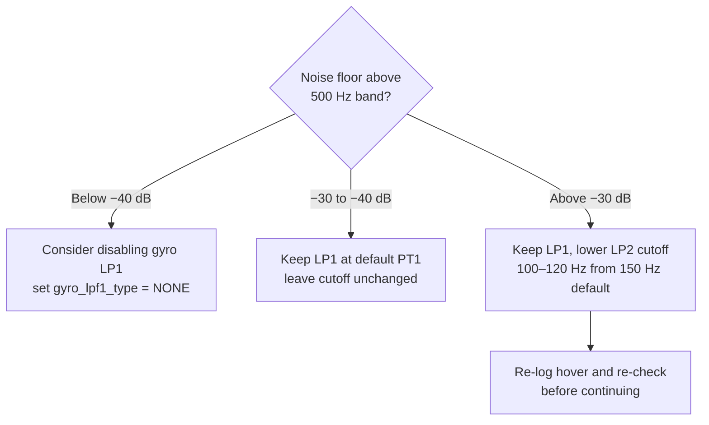
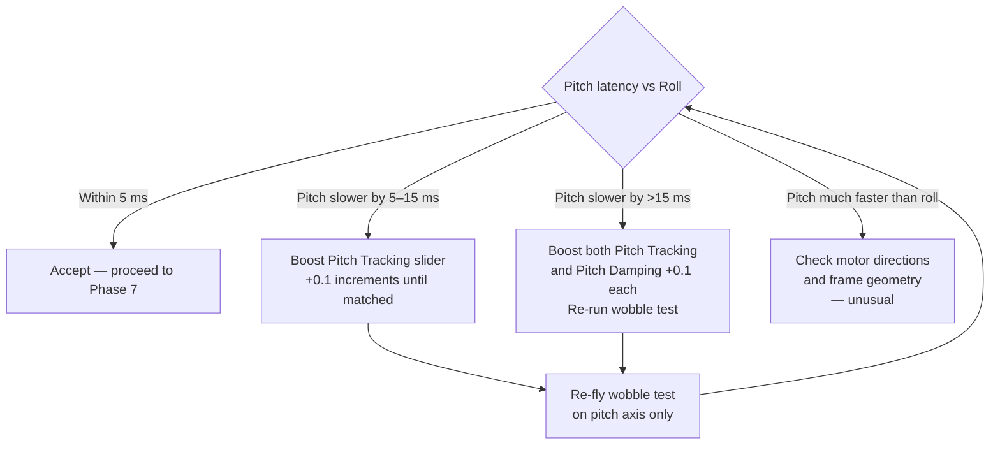
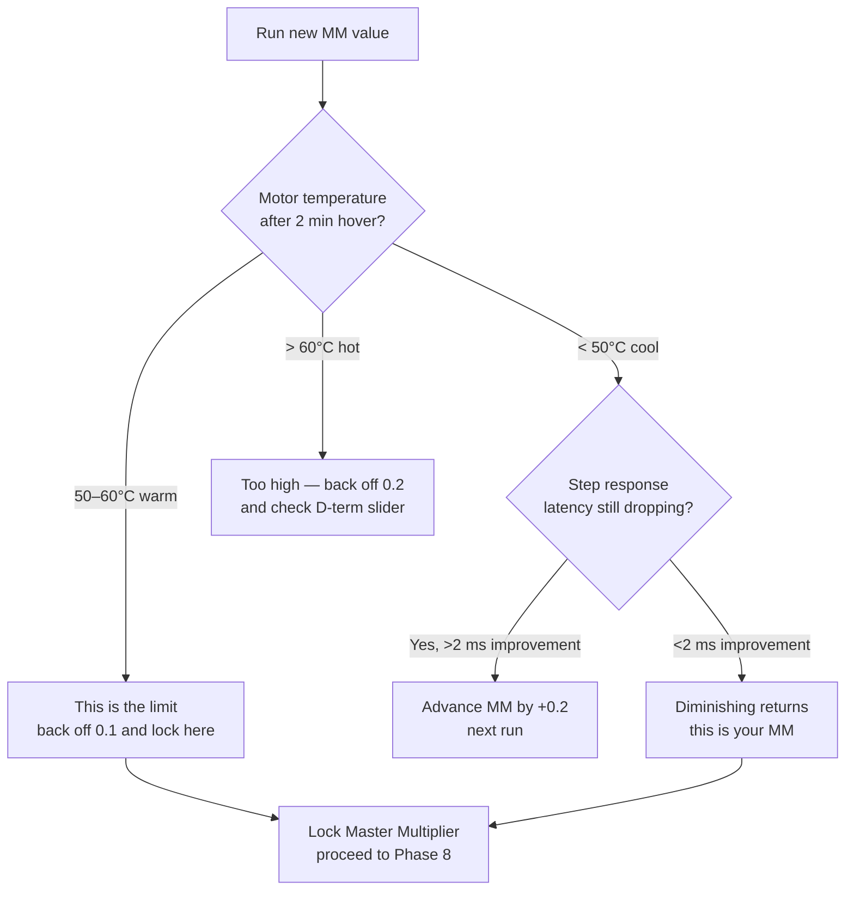

A systematic PID tuning protocol based on the Joshua Bardwell / Brian White wobble-test methodology — rewritten to run entirely on free tools: Betaflight Blackbox Explorer, Betaflight Configurator, and Rylo. No PID Toolbox, no MATLAB, no paid subscriptions.

This is the **practical field protocol**. If you want the math behind each term, see [Betaflight Tuning Math](../betaflight-tuning-math/). If you already have a `.bbl` file and want raw step response analysis, see [BBL-Based PID Tuning Protocol](../bbl-pid-tuning-protocol/).

---

## How This Protocol Works

The core insight from Brian White's research: **PD balance and master multiplier are the only two knobs that significantly affect step response latency and shape**. Everything else (I, FF, d_max) is tuned on top of a solid PD foundation.

The wobble test gives you a controlled, repeatable input: a fast full-deflection stick move in angle mode with limited travel and linear rates. This produces a clean step in commanded rotation rate — perfect for step response shape analysis without needing MATLAB.

```mermaid
flowchart TD
    A([Phase 0\nMechanical prep]) --> B
    B([Phase 1\nBetaflight setup]) --> C
    C([Phase 2\nBaseline hover log\n+ spectral analysis]) --> D
    D([Phase 3\nRPM filter setup]) --> E
    E([Phase 4\nPID pre-configuration\nzero FF · zero d_max · low I]) --> F
    F([Phase 5\nPD balance sweep\n0.6 → 1.4]) --> G
    G([Phase 6\nPitch / roll balance]) --> H
    H([Phase 7\nMaster multiplier sweep\nFRESH BATTERY]) --> I
    I([Phase 8\nI term]) --> J
    J([Phase 9\nFeedforward]) --> K
    K([Phase 10\nD-max ← optional]) --> L
    L([Phase 11\nVerification flight])

    style A fill:#1a2a3a,stroke:#4a7aaa
    style H fill:#2a1a1a,stroke:#aa4a4a
```



---

## Phase 0 — Mechanical Prep

Do this before every tuning session. Mechanical problems look like tuning problems.

- [ ] Fresh props — not chipped, not bent, seated and tightened
- [ ] All motor screws tight (M2 × 5 stainless, 4 per motor)
- [ ] FC secure in standoffs — rubber grommets not compressed flat, not missing
- [ ] Capacitor soldered to battery pads (1000–2200 µF, 25 V or higher for 4S+)
- [ ] No loose connectors or wires that can vibrate against the frame
- [ ] Arms and frame fasteners snug

> **2" Ripper note:** Check prop fit torque every session. Press-fit props on whoops and 2" builds work loose more quickly than T-mounted props. A loose prop is a major source of vibration that no filter setup can fully clean. Replace any props with visible tip chips — even a 0.5 mm chip creates a spectral spike.

---

## Phase 1 — Betaflight Setup

One-time setup. Verify these are correct before any logging session.

### Bidirectional DSHOT

Required for RPM filter. Verify in Betaflight Configurator → Configuration tab:

```
# CLI verification:
get motor_pwm_protocol   # should return DSHOT300 or DSHOT600
get dshot_bidir          # should return ON
```

If bidirectional DSHOT is off, the RPM filter has no data and falls back to fixed notch filtering.

### Blackbox Configuration

```
# In Betaflight CLI:
set blackbox_device = SPIFLASH       # or SDCARD if fitted
set blackbox_sample_rate = 1/1       # full rate — needed for spectral analysis
set blackbox_mode = NORMAL           # always logging when armed

# Debug mode — critical for spectral view in Blackbox Explorer:
set debug_mode = FFT_FREQ            # replaced gyro_scale in BF 4.5+

save
```

> **2" Ripper note:** Set `blackbox_sample_rate = 1/1` (4 kHz) without compromise. Motor fundamentals on a 2" build spinning at 30,000+ RPM are at 250–500 Hz. A 2 kHz log rate captures this but leaves headroom thin. At 4 kHz you capture two harmonics cleanly. Check Betaflight CPU load (Configurator home screen) — if it exceeds 50% after setting 4 kHz logging, either switch to a faster F7 FC or accept 1/2 rate.

### RC Link Preset

Load the preset matching your radio protocol: Configurator → Presets → search your link (ELRS 250 Hz, ELRS 500 Hz, Crossfire, etc.). This sets appropriate filter cutoffs and feedforward smoothing for your packet rate. **Do not tune without the correct link preset active.**

### Before Each Session: Erase Flash

```
# After connecting, before arming:
blackbox erase
# Wait for the green light / CLI confirmation, then disconnect
```

---

## Phase 2 — Spectral Baseline

**Goal**: identify motor noise frequencies and verify the noise floor before touching PIDs.

### Hover Log Procedure

1. Arm and lift to 3–4 m AGL (above ground effect — one prop diameter minimum)
2. Hold steady hover for **30–40 seconds** — no stick inputs, constant throttle
3. Disarm cleanly
4. Download and open the log in Betaflight Blackbox Explorer

### Spectral Analysis in Blackbox Explorer

1. Open the log, click **Spectrum Analyser** (or **Frequency** in newer versions)
2. Set the **axis** dropdown to your worst axis (usually Roll)
3. Enable **debug** trace if available — this shows the pre-filter gyro signal
4. Zoom the frequency axis to 0–1000 Hz

**What to look for:**

| Frequency zone | What it shows |
|---------------|---------------|
| 0–20 Hz | Normal flight dynamics — always present |
| 20–80 Hz | Prop wash / forward flight disturbance — broad hump |
| 80–500 Hz | **Motor fundamental** — should rise with throttle |
| 2× and 3× fundamental | Motor harmonics — tall narrow peaks |
| Fixed-frequency spike (any) | Mechanical resonance — frame, standoff, prop damage |

**Noise floor targets:**

| Level | Assessment |
|-------|-----------|
| Below −40 dB (above motor harmonic band) | Excellent — can consider disabling gyro LP1 |
| −30 to −40 dB | Acceptable — standard RPM filter + LP2 is sufficient |
| −25 to −30 dB | Elevated — keep LP1, consider tightening cutoff |
| Above −25 dB | Problematic — diagnose before tuning. Check prop balance, motor screws, cap |

**Ask Rylo:** Take a screenshot of the Blackbox Explorer spectral view and share it here. Rylo will identify the motor fundamental frequency, flag any anomalous peaks, and recommend the RPM filter minimum frequency for Phase 3.

> **2" Ripper note:** Motor fundamentals on a 2" build are typically **250–500 Hz** at mid-throttle — substantially higher than a 5" (100–200 Hz). The RPM filter min frequency default of 100 Hz may need to go to 150 Hz or higher. The overall noise floor is often higher too; a clean 2" build may still sit at −30 dB vs −40 dB on a 5".

---

## Phase 3 — RPM Filter Setup

Set the RPM filter minimum frequency based on Phase 2.

```
# In CLI:
set rpm_filter_min_hz = <lowest_motor_Hz - 25>

# Example: if motor fundamental starts at 125 Hz:
set rpm_filter_min_hz = 100

# Harmonics — default 3 is correct for most builds:
set rpm_filter_harmonics = 3

save
```

### Low-Pass Filter Decision

After setting the RPM filter, re-hover and re-check the spectral view:



> **Do not lower filters aggressively to compensate for mechanical noise.** More filtering = more phase delay = effectively lower PIDs + more latency. Fix the mechanical source first.

---

## Phase 4 — PID Pre-Configuration

Before the wobble test, configure Betaflight Sliders (Configurator → PID Tuning → Simplified Tuning) and the rates profile to isolate P and D from everything else.

### Slider Starting Point

If this is a fresh build, start all sliders at **1.0** (defaults). For a build already flying, save your current `diff all` backup first:

```
diff all
# Copy to file: build-name_2026-07-XX_pre-tune.txt
```

Then:

| Slider | Set to | Reason |
|--------|--------|--------|
| Master multiplier | 1.0 | Neutral starting point |
| PD Balance | 1.0 | Starting point for sweep |
| PD Gain (Pitch/Roll) | 1.0 | Neutral |
| **Stick Response (FF)** | **0** | **Eliminate FF from step response** |
| **D-max** | **0** | **Keep D constant during PD sweep** |

### I Term

Set I to a **minimum value** — just enough to prevent the quad from drifting:

```
# In CLI (BF 4.4+ slider maps to these raw values approximately):
set iterm_relax_type = RP         # roll + pitch
set iterm_relax_cutoff = 15       # for 5"; see size table below
save
```

Move the **I** portion of the PID Tuning sliders to approximately 0.3–0.4. This prevents I windup from polluting the step response analysis. You will set the final I term value in Phase 8.

**iterm_relax_cutoff by build size:**

| Build | iterm_relax_cutoff |
|-------|-------------------|
| 2–3" | 15 (default) |
| 5" | 15 (default) |
| 7" | 8 |
| 10"+ / lifters | 5 |

### Wobble Test Rates Profile

In Betaflight Configurator → Rates, create a dedicated tuning rates profile (or note current values to restore after):

| Parameter | Value | Reason |
|-----------|-------|--------|
| Roll rate (center/max) | 150 / 150 | Linear, predictable step input |
| Pitch rate (center/max) | 150 / 150 | Matches roll for comparison |
| Yaw rate (center/max) | 150 / 150 | Not the focus but keep consistent |
| Expo | 0 on all | Linear — no softness at center |
| Angle limit (if using Angle mode) | 30° | Keeps the test low and safe |

This gives a moderate, easy-to-control throw that produces clean step inputs without requiring precise acro skills.

---

## Phase 5 — PD Balance Sweep

**Goal**: find the PD damping slider setting where the step response shape is cleanest.

### Wobble Test Maneuver

For each PD damping slider setting:
1. Arm, hover to ~3 m
2. Execute 8–10 **rapid, full-deflection left-right roll inputs** — snap to full left, snap back, snap to full right, snap back. Each direction holds for ~0.5 s.
3. Repeat with **pitch forward-back** inputs
4. Land, disarm

This generates clean step inputs your bbl-analyzer can process. Fly in **Angle mode** if your flying skill is limited — the angle limit prevents tip-overs while still generating full-rate commanded steps.

### Sweep Settings

| Run | PD Damping Slider |
|-----|-----------------|
| 1 | 0.6 |
| 2 | 0.8 |
| 3 | 1.0 (baseline) |
| 4 | 1.2 |
| 5 | 1.4 |

Change the slider, save, erase flash, and fly each run on a separate battery (or same battery sequentially — note which segment is which). You are looking for **the point where the step response transitions from overshoot to clean**.

> **Erase flash between runs!** If you don't, all runs will be in the same log file and you'll need to identify segments by timestamp.

### Step Response Shape — What to Look For

```chart
{
  "type": "line",
  "data": {
    "labels": ["0","10","20","30","40","50","60","70","80","90","100","110","120","130","140","150"],
    "datasets": [
      {
        "label": "PD 0.6 — heavy overshoot",
        "data": [0,0.22,0.58,0.97,1.21,1.28,1.22,1.14,1.08,1.04,1.02,1.01,1.00,1.00,1.00,1.00],
        "borderColor": "rgba(239,68,68,1)",
        "backgroundColor": "transparent",
        "borderWidth": 2,
        "tension": 0.3,
        "pointRadius": 0
      },
      {
        "label": "PD 0.8 — moderate overshoot",
        "data": [0,0.28,0.68,1.02,1.16,1.14,1.08,1.04,1.02,1.01,1.00,1.00,1.00,1.00,1.00,1.00],
        "borderColor": "rgba(249,115,22,1)",
        "backgroundColor": "transparent",
        "borderWidth": 2,
        "tension": 0.3,
        "pointRadius": 0
      },
      {
        "label": "PD 1.0 — slight overshoot",
        "data": [0,0.33,0.75,1.03,1.07,1.05,1.02,1.01,1.00,1.00,1.00,1.00,1.00,1.00,1.00,1.00],
        "borderColor": "rgba(234,179,8,1)",
        "backgroundColor": "transparent",
        "borderWidth": 2,
        "tension": 0.3,
        "pointRadius": 0
      },
      {
        "label": "PD 1.2 — ideal (crisp, minimal overshoot)",
        "data": [0,0.37,0.80,1.01,1.03,1.02,1.01,1.00,1.00,1.00,1.00,1.00,1.00,1.00,1.00,1.00],
        "borderColor": "rgba(34,197,94,1)",
        "backgroundColor": "transparent",
        "borderWidth": 2.5,
        "tension": 0.3,
        "pointRadius": 0
      },
      {
        "label": "PD 1.4 — overdamped (clean but slower)",
        "data": [0,0.40,0.83,0.97,0.99,1.00,1.00,1.00,1.00,1.00,1.00,1.00,1.00,1.00,1.00,1.00],
        "borderColor": "rgba(99,102,241,1)",
        "backgroundColor": "transparent",
        "borderWidth": 2,
        "borderDash": [5,3],
        "tension": 0.3,
        "pointRadius": 0
      }
    ]
  },
  "options": {
    "responsive": true,
    "interaction": { "mode": "index", "intersect": false },
    "plugins": {
      "title": {
        "display": true,
        "text": "Step Response Shape vs PD Damping Slider (normalized, t in ms)"
      },
      "legend": { "position": "bottom" }
    },
    "scales": {
      "x": { "title": { "display": true, "text": "Time (ms)" } },
      "y": {
        "min": 0,
        "max": 1.40,
        "title": { "display": true, "text": "Normalized rate response" }
      }
    }
  }
}
```

**Target**: the step response that rises cleanly, has ≤5% overshoot, and settles to 1.0 without ringing. In the chart above, PD 1.2 is ideal. Your quad's ideal point may be at 1.0 or 1.4 depending on frame stiffness, prop size, and motor inertia.

### Analysing with Rylo

After each PD run, share the `.bbl` log segment with Rylo and ask for step response analysis:

> *"Rylo, analyse this BBL log — PD balance slider at 1.2, wobble test roll axis. Show me the step response shape and the 50% rise time."*

The bbl-analyzer skill will compute the step response via deconvolution and return the curve shape and latency metric. Compare the 50% rise time across all five runs to find the optimum.

> **2" Ripper note:** Start the sweep at **PD 0.8** rather than 0.6. 2" builds with high-KV motors and light props are typically already at or near critical damping at Betaflight defaults. The PD 0.6 run is likely to produce very light overshoot (not the dramatic wobble you'd see on a 5"). Your sweet spot is probably at **0.9–1.1**. Don't be surprised if even 1.0 looks good — advance to Phase 7 and use the master multiplier to differentiate.

---

## Phase 6 — Pitch / Roll Balance

After finding the best PD damping value, compare the **50% rise time** for pitch vs roll.

A well-balanced quad should have pitch latency within **5 ms** of roll latency. A significant difference (>10 ms) typically means the pitch axis has different inertia or motor response.



Some frames will never fully match (a front-heavy cinematic build, a long-range cruiser with offset CG) — don't chase a perfect match at the cost of excessive PD on pitch.

---

## Phase 7 — Master Multiplier Sweep

**Requires a fresh battery. Do not do this on a pack that's been through Phases 2–6.**

The master multiplier scales all PID gains proportionally. More gain = lower latency up to the point where motor noise starts climbing or the tune becomes thermally unstable.

### Starting Point by Build Size

| Build size | Start MM at |
|-----------|-------------|
| 2" | 0.7 |
| 3" | 0.8 |
| 5" | 1.0 |
| 7" | 1.0–1.2 |
| 10"+ | 1.2 |

### Sweep Procedure

| Run | Master Multiplier | Fresh pack? |
|-----|-----------------|-------------|
| 1 | Start value | ✓ Fresh |
| 2 | Start + 0.2 | ✓ Fresh |
| 3 | Start + 0.4 | ✓ Fresh |
| 4 | Start + 0.6 | ✓ Fresh (if temperatures OK) |

Between each run: hover 2 minutes, land, **immediately check motor temperatures**. Acceptable: cool to warm touch (< 50°C). Stop advancing if any motor is hot (> 60°C).

**Also check after each run** in Blackbox Explorer: D-term noise during the wobble test must stay **below −10 dB** in the spectral view. If D-term noise approaches −10 dB during aggressive inputs, you are at or near the thermal limit regardless of motor temperature.

### Step Response Improvement with Master Multiplier

```chart
{
  "type": "bar",
  "data": {
    "labels": ["MM 0.7 (2\" start)", "MM 0.8", "MM 1.0", "MM 1.2", "MM 1.4", "MM 1.6"],
    "datasets": [
      {
        "label": "50% rise time (ms) — lower is better",
        "data": [38, 33, 28, 24, 21, 19],
        "backgroundColor": [
          "rgba(99,102,241,0.7)",
          "rgba(99,102,241,0.7)",
          "rgba(34,197,94,0.7)",
          "rgba(34,197,94,0.85)",
          "rgba(249,115,22,0.7)",
          "rgba(239,68,68,0.7)"
        ],
        "borderColor": [
          "rgba(99,102,241,1)",
          "rgba(99,102,241,1)",
          "rgba(34,197,94,1)",
          "rgba(34,197,94,1)",
          "rgba(249,115,22,1)",
          "rgba(239,68,68,1)"
        ],
        "borderWidth": 1.5
      }
    ]
  },
  "options": {
    "responsive": true,
    "plugins": {
      "title": {
        "display": true,
        "text": "Master Multiplier vs Step Response Latency (50% rise time, illustrative)"
      },
      "legend": { "display": false },
      "annotation": {}
    },
    "scales": {
      "y": {
        "min": 0,
        "title": { "display": true, "text": "50% rise time (ms)" }
      }
    }
  }
}
```

**When to stop advancing MM:**



> **2" Ripper note:** The MM gain will typically plateau much sooner on a 2". Motor heat on a lightweight build is more visible (small motors with less thermal mass). Stop as soon as motors are warm, even if the step response shows room to improve — 2" motors overheat fast under excess D noise.

---

## Phase 8 — I Term

I term has a **wide acceptable range** — much wider than P and D. It is hard to get badly wrong. The goal is enough I to prevent steady-state drift without introducing slow roll/pitch wobble at constant throttle.

Default slider value of **1.0 is a good starting point** for most builds.

### Quick Test

Add I back (set slider to 1.0 after having it at ~0.3 during the sweep) and fly a 1-minute circuit with constant throttle. Look for:

- **Low I symptoms** (slider too low): the quad slowly wanders off heading or altitude after a fast input; step response analysis shows the curve settling below 1.0
- **High I symptoms** (slider too high): slow oscillation at constant speed, feels slightly "wobbly" at cruise; on heavy builds, overshoot can appear that wasn't visible at low throttle

For 5" freestyle: **1.0–1.2 is typical**. For 7"+ / heavy: **0.6–0.8**. For 2" ripper: **1.0** is almost always fine.

```
# If needed, adjust raw I term values via CLI:
set p_pitch = <auto from slider>
set i_pitch = <auto from slider>
set d_pitch = <auto from slider>
# Better: use the slider and let Betaflight compute all terms
```

---

## Phase 9 — Feedforward

Feedforward adds a command proportional to **stick velocity** (how fast you're moving the stick, not how far). It reduces the initial delay before the quad starts responding to an input — making it feel sharper and more direct.

### Visual Effect on Step Response

```chart
{
  "type": "line",
  "data": {
    "labels": ["0","5","10","15","20","25","30","35","40","50","60","70","80","100","120","150"],
    "datasets": [
      {
        "label": "FF = 0 (step response base)",
        "data": [0,0.08,0.22,0.42,0.62,0.76,0.87,0.93,0.97,1.01,1.01,1.00,1.00,1.00,1.00,1.00],
        "borderColor": "rgba(99,102,241,1)",
        "backgroundColor": "transparent",
        "borderWidth": 2,
        "borderDash": [6,3],
        "tension": 0.3,
        "pointRadius": 0
      },
      {
        "label": "FF = 0.5 (~6 ms latency reduction)",
        "data": [0,0.18,0.42,0.65,0.82,0.92,0.98,1.01,1.02,1.01,1.00,1.00,1.00,1.00,1.00,1.00],
        "borderColor": "rgba(34,197,94,1)",
        "backgroundColor": "transparent",
        "borderWidth": 2.5,
        "tension": 0.3,
        "pointRadius": 0
      },
      {
        "label": "FF = 1.0 (~12 ms total reduction, slight overshoot)",
        "data": [0,0.28,0.60,0.83,0.96,1.03,1.05,1.03,1.01,1.00,1.00,1.00,1.00,1.00,1.00,1.00],
        "borderColor": "rgba(249,115,22,1)",
        "backgroundColor": "transparent",
        "borderWidth": 2,
        "tension": 0.3,
        "pointRadius": 0
      }
    ]
  },
  "options": {
    "responsive": true,
    "interaction": { "mode": "index", "intersect": false },
    "plugins": {
      "title": {
        "display": true,
        "text": "Feedforward vs Initial Step Response Attack (normalized, t in ms)"
      },
      "legend": { "position": "bottom" }
    },
    "scales": {
      "x": { "title": { "display": true, "text": "Time (ms)" } },
      "y": {
        "min": 0,
        "max": 1.20,
        "title": { "display": true, "text": "Normalized rate response" }
      }
    }
  }
}
```

Each +0.5 on the Stick Response (FF) slider is approximately **6 ms of latency reduction** at the 50% rise point.

### Tuning Procedure

1. Restore Stick Response slider from 0 to **0.5** — fly and feel
2. If the quad feels more responsive without hot motors → advance to **1.0**
3. Stop if: motors get warm, step response shows overshoot >10%, or P term approaches zero

```
# Check P term with high FF:
# In CLI after adjusting slider:
get p_pitch
get p_roll
# If P goes negative — FF is too high. Back off the FF slider.
```

**Warning — high ELRS packet rates (500 Hz, 1000 Hz):** At very high packet rates, the setpoint signal is so smooth that FF can produce unexpected step response shapes in the analysis tool. Switch Blackbox Explorer to the **raw data view** (not the deconvolved step response) and check for P going negative as a hard limit.

> **2" Ripper note:** On 2" builds, FF of 0.5 is often sufficient and feels very direct. Full 1.0 can make the quad feel twitchy and stressful — especially in tight spaces. The lighter frame has less rotational inertia, so each command already converts to rotation faster. Tune FF to feel, not to spec.

---

## Phase 10 — D-Max (Optional)

Skip this phase if motors are running cool. D-max is only needed when:
- D had to be set **very high** to damp the wobble test
- Motors run warm at **cruise throttle** (not just during peak inputs)

D-max sets an **upper bound** for D — the D term scales from `d_min` at hover to `d_max` during fast inputs, allowing you to run lower cruise D (cooler motors) while still having high D available for wobble rejection.

```
# Only adjust if motors are hot at cruise:
# Lower the PD damping slider by 0.1–0.2 from your final value
# Set d_max slider to the original D level
# The quad now runs less D at hover (cooler) but gets the full D on fast moves
```

If you don't need it — don't use it. Extra settings are extra complexity.

---

## Phase 11 — Verification Flight

With all phases complete:

1. Restore your normal flying rates profile
2. Fly a standard test circuit: hover, punch-out, dive and recovery, slow roll sequence
3. Check immediately after: motor temperatures on all four motors (should be similar; any one motor significantly hotter = mechanical issue on that arm)
4. Log the flight and ask Rylo to confirm step response shape is still clean with the final tune

Save the final config:

```
# In CLI:
diff all
# Save output to: build-name_2026-07-XX_final-tune.txt
```

---

## Quick Reference — Size-Specific Starting Points

| Parameter | 2" | 3" | 5" | 7" | 10"+ |
|-----------|----|----|----|----|------|
| Log rate | 4 kHz | 4 kHz | 2–4 kHz | 2 kHz | 2 kHz |
| PD sweep start | 0.8 | 0.8 | 0.6 | 0.6 | 0.6 |
| Master multiplier start | 0.7 | 0.8 | 1.0 | 1.0 | 1.2 |
| iterm_relax_cutoff | 15 | 15 | 15 | 8 | 5 |
| Motor heat limit | 50°C | 55°C | 60°C | 60°C | 55°C |
| Motor fundamental (approx) | 250–500 Hz | 180–350 Hz | 100–200 Hz | 80–150 Hz | 60–120 Hz |
| RPM filter min (approx) | 150 Hz | 120 Hz | 100 Hz | 80 Hz | 60 Hz |

---

## Tools Required

| Tool | Cost | Purpose |
|------|------|---------|
| [Betaflight Configurator](https://github.com/betaflight/betaflight-configurator) | Free | Slider interface, CLI, preset loading |
| [Betaflight Blackbox Explorer](https://github.com/betaflight/blackbox-log-viewer) | Free | Spectral analysis, trace overlay |
| Rylo (bbl-analyzer skill) | Free | Step response computation from `.bbl` files |
| Fresh 18650 / LiPo packs | — | One per phase for consistent voltage |

No PID Toolbox. No MATLAB. No Patreon subscription required.

---

## Related Snippets

- [BBL-Based PID Tuning Protocol](../bbl-pid-tuning-protocol/) — the PIDtoolbox-native version with Wiener deconvolution details
- [Betaflight Tuning Math](../betaflight-tuning-math/) — P/I/D/FF formulas, iterm_relax math, RPM filter math
- [FPV Terminology](../fpv-terminology/) — quick reference for all the abbreviations in this protocol
- [Propwash](../propwash/) — why D term matters for dive recovery
