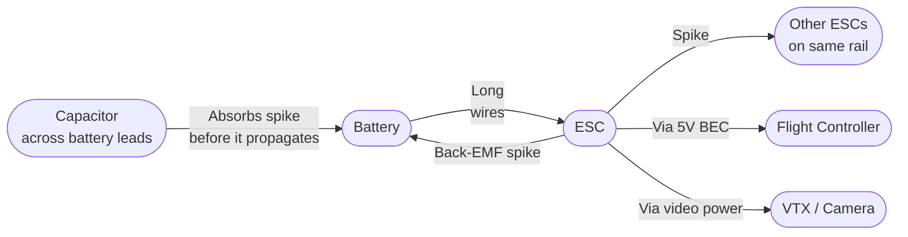
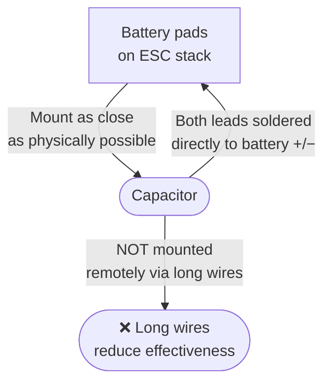

Kondensatorius per baterijos laidus — vienas pigiausių ir daugiausiai naudos duodančių papildymų bet kuriame FPV builde. Jis slopina įtampos šuolius, valo vaizdo signalo triukšmą ir saugo ESC MOSFET'us nuo back-EMF pereinamųjų procesų (transients).

---

## Kodėl atsiranda įtampos šuoliai

Kai motoras greitai keičia sūkius, jis generuoja back-EMF — įtampos šuolį, kuris keliauja atgal per maitinimo linijas. Stiprių throttle punch'ų ir staigaus lėtėjimo metu šie šuoliai gali akimirkai viršyti ESC FET'ų įtampos ribą.



Laidų induktyvumas (net kelių centimetrų laidas) priešinasi momentiniams srovės pokyčiams. Kondensatorius, sujungtas lygiagrečiai su baterijos padais, veikia kaip vietinis energijos rezervuaras, kuris sugeria šuolį dar prieš jam nukeliaujant per visą maitinimo laidų ilgį.

---

## Kokį kondensatorių naudoti

**5" freestyle / racing quad'ui (4S):**
- **35V, 1000–2200 µF elektrolitinis** (low ESR tipo, pvz. Panasonic FM ar Nichicon HE serija)
- Arba **2–4× 50V 470 µF** lygiagrečiai

**6S buildams:**
- Minimum **35V** (dėl saugos maržos naudok 50V)
- Ta pati talpos riba

**Niekada nenaudok kondensatoriaus, kurio įtampa mažesnė už maksimalią baterijos įtampą.** Pilnai įkrautas 4S pakas yra 16.8V. Naudok minimum 25V; 35V labiau pageidautina dėl atsargos.

**Low ESR yra kritiškai svarbu.** Pigūs generic kondensatoriai turi didelę serijinę varžą — jie vis dar sugeria DC ripple, bet per lėti greitiems pereinamiesiems procesams slopinti. Ieškok "low ESR" ar "audio grade" žymėjimų arba pasitikrink datasheet'ą.

---

## Montavimo taisyklės



1. **Lituok tiesiai prie ESC baterijos padų.** Kuo trumpesni laidai, tuo geriau. Net 5 cm papildomo laido mažina efektyvumą.
2. **Pritvirtink mechaniškai** — uždėk termosusitraukiantį vamzdelį ant kondensatoriaus korpuso arba naudok gumelę + zip tie'ą per rėmą. Vibracija ilgainiui nuvargins lituotas jungtis.
3. **Teisingas poliškumas** — elektrolitiniai kondensatoriai yra poliniai. Juostelė ant korpuso = minusas. Neteisingas poliškumas sunaikins kondensatorių ir galbūt ESC.
4. **Palenk kondensatorių horizontaliai**, jei aukščio trūksta. Laidų ilgis iki padų turi likti trumpas — lenkti kondensatorių galima, ilginti laidus — ne.

---

## Vaizdo triukšmo pagerėjimas

Labiausiai matomas kondensatoriaus pridėjimo rezultatas daugelyje buildų — dingstantis vaizdo triukšmas:

```chart
{
  "type": "bar",
  "data": {
    "labels": ["No cap", "Small 100µF", "470µF low ESR", "1000µF low ESR", "2200µF low ESR"],
    "datasets": [{
      "label": "Relative video noise reduction (approx)",
      "data": [0, 15, 55, 80, 90],
      "backgroundColor": [
        "rgba(239,68,68,0.7)",
        "rgba(249,115,22,0.7)",
        "rgba(234,179,8,0.7)",
        "rgba(34,197,94,0.7)",
        "rgba(34,197,94,0.9)"
      ],
      "borderWidth": 1
    }]
  },
  "options": {
    "responsive": true,
    "plugins": {
      "title": { "display": true, "text": "Cap Size vs Video Noise Reduction (typical 4S build)" },
      "legend": { "display": false }
    },
    "scales": {
      "y": {
        "beginAtZero": true,
        "max": 100,
        "title": { "display": true, "text": "Noise reduction (%)" }
      }
    }
  }
}
```

Jei vaizdo triukšmas išlieka net pridėjus didelį kondensatorių, triukšmo šaltinis gali būti BEC (5V reguliatorius) arba VTX maitinimo linija — tokiu atveju pridėk mažą LC filtrą (droselis + kondensatorius) būtent ant VTX maitinimo linijos.

---

## Papildomi kondensatoriai stack'e

Buildams su atskiru PDB ar maitinimo paskirstymu:
- Pridėk **100 µF / 25V** prie VTX maitinimo įėjimo, jei 5V BEC triukšmauja
- Pridėk **10 µF / 16V** keraminį prie FC 3.3V ir 5V įėjimų (daugumoje FC jau būna)

---

## Pastabos

- Kondensatoriai degraduoja. Jei builde atsiranda anksčiau nebuvęs vaizdo triukšmas, pirmiausia patikrink kondensatorių — išsipūtęs ar tekantis kondensatorius = keisk nedelsiant.
- Prieš dirbdamas su buildu, visada iškrauk didelį kondensatorių. Trumpai sujungus įkrautą 2200 µF kondensatorių prie 16V, prilituos lydymo įrankius — klausk manęs, iš kur žinau :)
- MLCC (keraminiai) kondensatoriai µF diapazone taip pat tinka ir geriau tvarkosi su aukštais dažniais, bet už tokią pačią talpą kainuoja brangiau.
