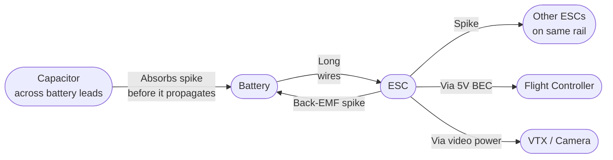
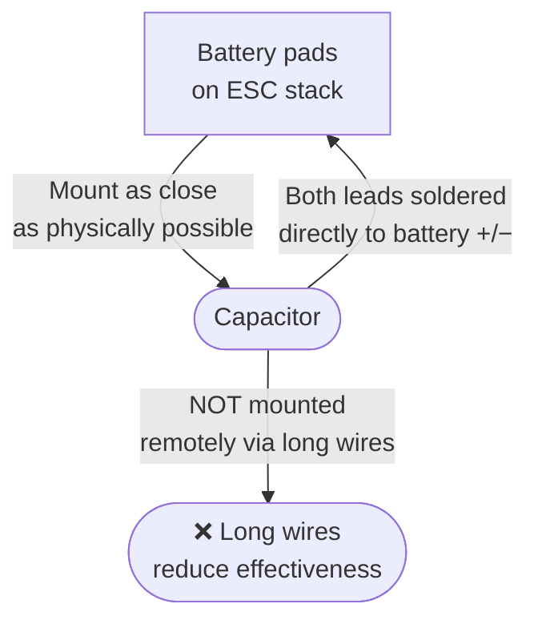

A capacitor across the battery leads is one of the cheapest, highest-impact additions to any FPV build. It suppresses voltage spikes, cleans video feed noise, and protects ESC MOSFETs from back-EMF transients.

---

## Why Voltage Spikes Happen

When a motor changes speed rapidly, it generates back-EMF — a voltage spike that travels backward through the power rails. At high throttle punches and during rapid deceleration, these spikes can exceed the ESC's FET voltage rating momentarily.



Wire inductance (even a few centimetres of lead) resists instantaneous current changes. A capacitor in parallel with the battery pads provides a local energy reservoir that absorbs the spike before it travels the length of the power wires.

---

## What Capacitor to Use

**For a 5" freestyle / racing quad (4S):**
- **35V, 1000–2200 µF electrolytic** (low ESR type, e.g. Panasonic FM or Nichicon HE series)
- Or **2–4× 50V 470 µF** in parallel

**For 6S builds:**
- Minimum **35V** (use 50V for safety margin)
- Same capacitance range

**Never use a cap rated below the maximum battery voltage.** A 4S pack fully charged is 16.8V. Use 25V minimum; 35V preferred for headroom.

**Low ESR is critical.** Generic budget capacitors have high series resistance — they still absorb DC ripple but are too slow to suppress fast transients. Look for "low ESR" or "audio grade" designations, or check the datasheet.

---

## Placement Rules



1. **Solder directly to the ESC battery pads.** The shorter the leads, the better. Even 5 cm of extra wire reduces effectiveness.
2. **Secure mechanically** — heat shrink the cap body, or use a rubber band + zip tie through the frame. Vibration will fatigue the solder joints over time.
3. **Correct polarity** — electrolytic caps are polarized. The stripe on the can = negative. Wrong polarity will destroy the cap and possibly the ESC.
4. **Bend the cap horizontal** if height is limited. Lead length to the pads must stay short — bending the cap is fine, extending the leads is not.

---

## Video Noise Improvement

The most visible result of adding a cap on many builds is video noise disappearing:

```chart
{
  "type": "bar",
  "data": {
    "labels": ["No cap", "Small 100µF", "470µF low ESR", "1000µF low ESR", "2200µF low ESR"],
    "datasets": [{
      "label": "Relative video noise reduction (approx)",
      "data": [0, 15, 55, 80, 90],
      "backgroundColor": [
        "rgba(239,68,68,0.7)",
        "rgba(249,115,22,0.7)",
        "rgba(234,179,8,0.7)",
        "rgba(34,197,94,0.7)",
        "rgba(34,197,94,0.9)"
      ],
      "borderWidth": 1
    }]
  },
  "options": {
    "responsive": true,
    "plugins": {
      "title": { "display": true, "text": "Cap Size vs Video Noise Reduction (typical 4S build)" },
      "legend": { "display": false }
    },
    "scales": {
      "y": {
        "beginAtZero": true,
        "max": 100,
        "title": { "display": true, "text": "Noise reduction (%)" }
      }
    }
  }
}
```

If video noise persists after adding a large cap, the noise source may be the BEC (5V regulator) or the VTX power path — in that case add a small LC filter (inductor + cap) on the VTX power rail specifically.

---

## Additional Caps in the Stack

For builds with a separate PDB or power distribution:
- Add **100 µF / 25V** at the VTX power input if the 5V BEC is noisy
- Add **10 µF / 16V** ceramic at the FC 3.3V and 5V inputs (already present on most FCs)

---

## Notes

- Capacitors degrade. If a build develops video noise it didn't have before, check the cap first — bulging or leaking cap = replace immediately.
- Always discharge a large cap before working on the build. Shorting a charged 2200 µF cap at 16V will weld solder tools.
- MLCC (ceramic) capacitors in the µF range can also be used and handle high frequencies better, but cost more for equivalent capacitance.
