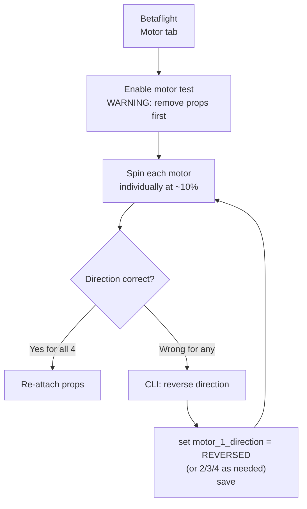
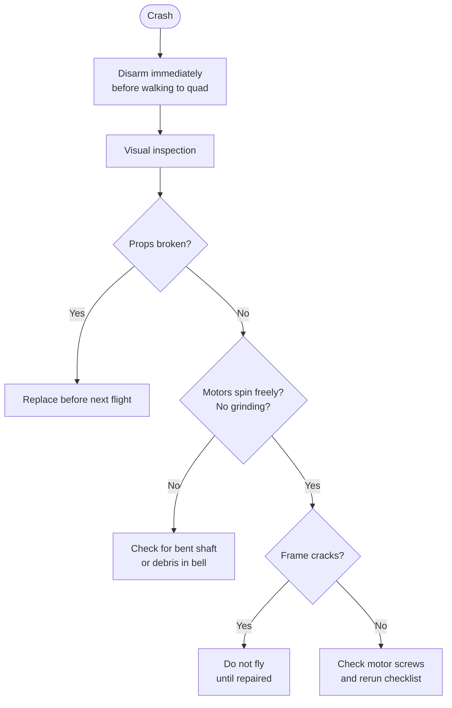

A methodical pre-flight check prevents the most common crash causes: wrong motor direction, loose props, dead receiver link, and arming flags. Five minutes before every session, not just the first flight of a build.

---

## Full Checklist

### 1 — Battery and Power

- [ ] Cell voltages balanced (within 0.05V of each other under no load)
- [ ] Pack charged to target voltage (4.20V/cell full, 4.35V/cell for HV packs)
- [ ] XT60/XT30 connector clean — no burned or corroded contacts
- [ ] Battery strap tight; pack cannot shift under flight loads
- [ ] No puffing on the pack (cells visibly swollen = remove from service)

### 2 — Frame and Hardware

- [ ] All screws tight — motor screws, arm screws, standoffs, stack screws
- [ ] Props tight and seated fully on the shaft
- [ ] Correct prop rotation: **Props In** (inner edge leading) or **Props Out** — match your motor direction setup
- [ ] No cracks in arms or frame plates (check after any crash)
- [ ] Camera angle secure; no loose pivot screw

### 3 — Motor Direction

This is the single most common wiring mistake that causes an immediate flip on first takeoff.



**Standard Betaflight layout (Props In / Butterflight style):**

| Motor | Position         | Direction |
|-------|-----------------|-----------|
| M1    | Rear right      | CCW       |
| M2    | Front right     | CW        |
| M3    | Rear left       | CW        |
| M4    | Front left      | CCW       |

**Test without props. Always.**

### 4 — RC Link

- [ ] Transmitter powered on BEFORE connecting battery
- [ ] ELRS/receiver LED solid (bound) — not blinking (searching)
- [ ] Move all sticks and switches; confirm response in Betaflight Receiver tab
- [ ] Throttle at zero before arming
- [ ] ARM switch in disarm position at powerup

### 5 — Betaflight Arming Flags

Connect USB (optional at the field — use the Betaflight app if available) and check:

```
# In CLI:
status

# Arming prevention flags to resolve:
# RXLOSS    → receiver not connected / failsafe active
# NOGYRO    → IMU not detected (hardware fault)
# CALIB     → IMU still calibrating (wait ~10s after powerup)
# ANGLE     → Angle mode active but accelerometer not calibrated
# BADVIBES  → excessive vibration on IMU
# ARMSWITCH → ARM switch not in disarm position
```

If you don't have USB access, watch the motors and OSD. Most arming flags show on the OSD if configured.

### 6 — OSD and Video

- [ ] FPV goggles receiving signal; OSD visible
- [ ] Battery voltage shown on OSD (sanity check — should match pack)
- [ ] GPS satellite count (if equipped) — wait for adequate lock
- [ ] VTX on correct channel for the session (avoid conflicts with other pilots)

### 7 — Final Check

- [ ] Flying site legal: airspace authorised, no restricted zones overhead
- [ ] People clear of the takeoff area
- [ ] Hand prop-check: spin each prop by hand, confirm tight, correct rotation
- [ ] First spin: arm at low throttle, verify quad lifts level — not flip, not lean

---

## After Every Crash



A crash that felt minor at high throttle can bend a motor shaft invisibly. Spin each motor by hand and feel for rough bearing or wobble before flying again.

---

## Quick Field Card (Print/Screenshot)

```
PRE-FLIGHT:
□ Battery: balanced, charged, strap tight
□ Props: tight, correct rotation
□ Motors: tested direction (remove props first!)
□ RC link: bound, all controls responding
□ ARM switch: DISARM position at powerup
□ OSD: voltage showing, GPS locked (if applicable)
□ Airspace: clear and legal

POST-CRASH:
□ Disarm before walking out
□ Props: check for chips or cracks
□ Motors: spin by hand — smooth and free?
□ Frame: no cracks in arms or plates
□ Battery: not puffed
□ Screws: check motor screws
```
