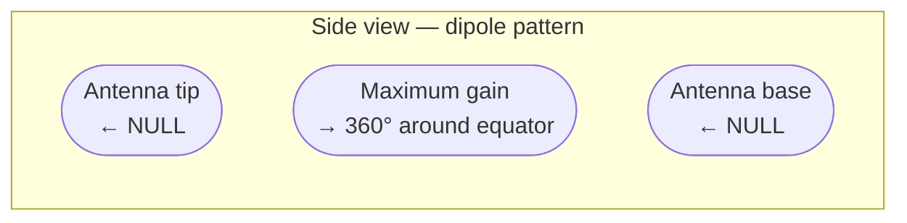
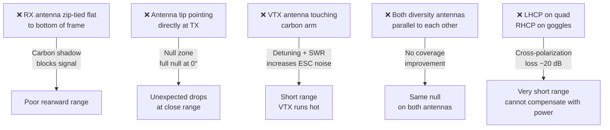

Antenų išdėstymas — vienas labiausiai nuvertinamų range faktorių. Puikiai suderintas ELRS linkas praranda 10–20 dB, kai antena nukreipta blogai — tai tolygu TX galios sumažinimui 90%. Na, aš pats kadaise kaltinau modulį, kol paaiškėjo, kad kalta tik prie karbono priplota antena.

---

## Kodėl antenos orientacija svarbi

Visakryptės (omnidirectional) antenos (dipoliai, linijinės, RHCP/LHCP) turi spinduliavimo diagramą, panašią į spurgą — stipri ties „pusiauju“, beveik nulinė ties galiukais (tas „null“).



Jei TX antenos galiukas nukreiptas tiesiai į RX, arba RX antenos galiukas tiesiai į TX, signalo stiprumas nukrenta beveik iki nulio net iš arti. Tai vadinama **null**.

**Omnidirectional reiškia „vienoda visomis kryptimis aplink pusiaują“ — o ne „vienoda absoliučiai visomis kryptimis“.**

---

## RX antenos taisyklės

### Taisyklė 1 — statmenai rėmui

Montuok RX anteną(-as) taip, kad elementas eitų **statmenai pagrindinei skrydžio ašiai** (o ne į priekį/uodegą). Ekvatorinis gain'o žiedas turi būti nukreiptas į priekį/atgal/į šonus.

```
Good:                   Bad:
   [antenna]            [RX]
       |                  |
  _________           [antenna]   ← tip points up = null when quad is below TX
 |   FC    |              |
 |   ESC   |              ↓ (pointing down = null when TX is above)
```

### Taisyklė 2 — atokiau nuo karbono

Karbonas laidus ir slopina RF. Laikyk aktyvųjį elementą (dipolio galiuko dalį arba visą elementą linijiniuose dipoliuose) ne rėmo „šešėlyje“.

Pravesk anteną pro mažą skylutę galinėje šakoje arba naudok 3D spausdintą antenos laikiklį, kuris atlenkia ją 45° nuo rėmo.

### Taisyklė 3 — 90° tarpas diversity RX

Jei tavo imtuvas turi dvi antenas (diversity), orientuok jas **90° viena kitos atžvilgiu**. Kai viena antena atsiduria null'e, kita turi beveik maksimalų gain'ą — diversity logika renkasi stipresnį signalą.

```
Diversity RX antenna orientation:
Antenna A: horizontal (along arm)
Antenna B: vertical (up through tail)

Coverage:         A covers front/back/sides
                  B covers above/below
Combined:         Near-spherical coverage
```

---

## VTX antenos taisyklės

VTX antena perduoda vaizdo signalą. Galioja ta pati null problema — jei priimančioji antena (akiniai) atsiduria null'e, gauni „sniegą“ arba vaizdo dingimus.

**5,8 GHz vaizdui naudok apskritai poliarizuotą anteną abiejuose galuose (RHCP arba LHCP), su suderinta poliarizacija.** Apskritoji poliarizacija panaikina null'us dėl sukimosi, nes signalo stiprumas nepriklauso nuo sukimosi kampo.

- **RHCP** (Right Hand Circular Polarized) — dažniausias numatytasis; TBS, Pagoda, Lumenier antenos
- **LHCP** — rečiau naudojama; poliarizacijų maišymas duoda ~20 dB nuostolį

**Montuok VTX anteną atokiau nuo karbono rėmo ir nuo RX antenų.** 2,4 GHz ELRS ir 5,8 GHz vaizdas tiesiogiai netrukdo vienas kitam (skirtingi dažniai), bet per arti esantys gali sąveikauti.

---

## Dažniausios išdėstymo klaidos



---

## ELRS 2,4 GHz vs 900 MHz antenų dydžiai

| Diapazonas | Pusbangio dipolio ilgis | Pastabos                             |
|----------|------------------------|----------------------------------------|
| 2,4 GHz  | ~62 mm                 | Trumpas; lengvai telpa bet kuriame builde |
| 900 MHz  | ~166 mm                | Ilgas; ant 5" reikia atidžiai pravesti |
| 433 MHz  | ~345 mm                | Labai ilgas; daugiausia fiksuoto sparno |

900 MHz antenos ant 5" kvadro yra fiziškai didelės — ilgą elementą reikia vesti išilgai šakos arba atlenkti į šoną (taip, atrodo kaip vabalo ūsas, bet range kalba pati už save). Ant micro kvadro 2,4 GHz beveik visada geresnis pasirinkimas dėl antenos dydžio apribojimų.

---

## Greita atmintinė

- [ ] RX antenos elementas atokiau nuo karbono, nukreiptas statmenai priekio ašiai
- [ ] Diversity antenos 90° viena kitos atžvilgiu
- [ ] VTX antena neliečia rėmo
- [ ] VTX ir akiniai naudoja suderintą poliarizaciją (abu RHCP arba abu LHCP)
- [ ] Jokia antenos jungtis nesuveržiama iki galo, kol kvadras maitinamas (SMA momentas gali įtrūkinti VTX PCB kontaktą)
