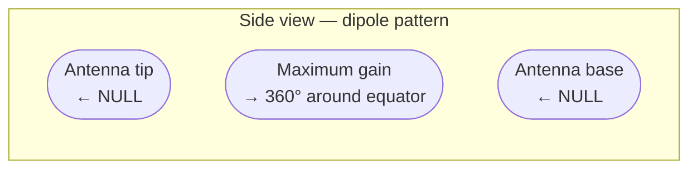
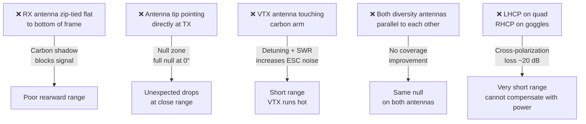

Antenna placement is one of the most overlooked range factors. A perfectly tuned ELRS link loses 10–20 dB when the antenna is oriented wrong — the equivalent of cutting TX power by 90%.

---

## Why Antenna Orientation Matters

Omnidirectional antennas (dipoles, linear, RHCP/LHCP) have a radiation pattern shaped like a donut — strong equatorially, near zero at the tips (the "null").



If the TX antenna tip points directly at the RX, or the RX antenna tip points directly at the TX, signal strength drops to near zero even at close range. This is called a **null**.

**Omnidirectional means "equal in all directions around the equator" — not "equal in all directions period."**

---

## RX Antenna Rules

### Rule 1 — Perpendicular to the frame

Mount the RX antenna(s) so the element runs **perpendicular to the main flight axis** (not pointing nose/tail). The equatorial gain ring should face forward/backward/sideways.

```
Good:                   Bad:
   [antenna]            [RX]
       |                  |
  _________           [antenna]   ← tip points up = null when quad is below TX
 |   FC    |              |
 |   ESC   |              ↓ (pointing down = null when TX is above)
```

### Rule 2 — Clear of carbon fiber

Carbon fiber is conductive and attenuates RF. Keep the active element (the tip portion of the dipole or the entire element for linear dipoles) out of the frame shadow.

Route the antenna through a small hole in the rear arm, or use a 3D-printed antenna mount that angles it 45° away from the frame.

### Rule 3 — 90° separation on diversity RX

If your receiver has two antennas (diversity), orient them **90° to each other**. When one antenna is in a null, the other has near-maximum gain — the diversity logic picks the stronger signal.

```
Diversity RX antenna orientation:
Antenna A: horizontal (along arm)
Antenna B: vertical (up through tail)

Coverage:         A covers front/back/sides
                  B covers above/below
Combined:         Near-spherical coverage
```

---

## VTX Antenna Rules

The VTX antenna transmits the video signal. The same null problem applies — if the receive antenna (goggles) is in the null, you get snow or dropout.

**For 5.8 GHz video, use a circularly polarized antenna on both ends (RHCP or LHCP), matching polarization.** Circular polarization eliminates nulls from rotation because the signal strength doesn't depend on rotational alignment.

- **RHCP** (Right Hand Circular Polarized) — common default; TBS, Pagoda, Lumenier antennas
- **LHCP** — less common; mixing polarization causes ~20 dB loss

**Mount the VTX antenna away from the carbon frame and away from the RX antennas.** 2.4 GHz ELRS and 5.8 GHz video don't interfere directly (different frequencies) but close proximity can cause interaction.

---

## Common Placement Mistakes



---

## ELRS 2.4 GHz vs 900 MHz Antenna Sizes

| Band     | Half-wave dipole length | Notes                                  |
|----------|------------------------|----------------------------------------|
| 2.4 GHz  | ~62 mm                 | Short; easy to fit on any build        |
| 900 MHz  | ~166 mm                | Long; needs careful routing on 5"      |
| 433 MHz  | ~345 mm                | Very long; mainly for fixed-wing       |

900 MHz antennas are physically large on a 5" quad — the long element needs to be routed along an arm or angled outward. On a micro quad, 2.4 GHz is almost always the better choice due to antenna size constraints.

---

## Quick Checklist

- [ ] RX antenna element clear of carbon, pointing perpendicular to nose axis
- [ ] Diversity antennas 90° to each other
- [ ] VTX antenna not touching frame
- [ ] VTX and goggles using matching polarization (both RHCP or both LHCP)
- [ ] No antenna connector fully tightened while quad is under power (SMA torque can crack the VTX PCB pad)
