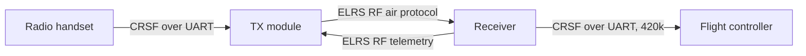
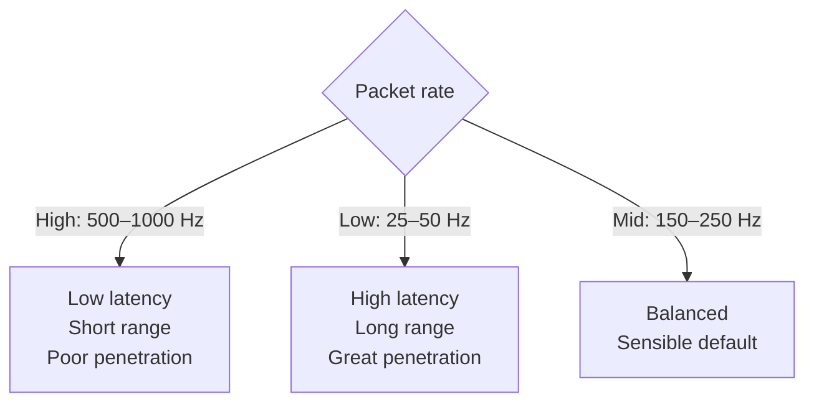

ELRS linkas iš tikrųjų yra *du* protokolai vienas paskui kitą: **RF air protokolas** tarp pulto TX modulio ir imtuvo, ir **CRSF serial protokolas** tarp imtuvo ir skrydžio kontrolerio. Nustatymai (bind phrase, domain) gyvena [ELRS konfigūracijoje](../elrs-config/); OSD skaičiai — [RC telemetrijoje](../rc-telemetry/). Šis snippet'as yra laido ir paket'ų lygio žvilgsnis ir apie tai, kodėl packet rate maino atsaką į range.



---

## CRSF laidas (imtuvas → skrydžio kontroleris)

Tarp RX ir FC duomenys yra **CRSF** (Crossfire Serial Protocol) per paprastą UART — **420 kbaud, 8N1**, vienas start bitas ir vienas stop bitas kiekvienam baitui. Dideli packet rate (500 Hz+) susiderina greitesnį baud (pvz., 921600), kad baitai vis dar tilptų tarp atnaujinimų.

```wave
{ signal: [
  { name: "CRSF UART", wave: "10========1", data: ["D0","D1","D2","D3","D4","D5","D6","D7"] }
],
  head: { text: "One byte: start bit (low), 8 data bits LSB-first, stop bit (high)" }
}
```

### Frame formatas

Kiekvienas CRSF frame'as yra tos pačios formos ir niekada neviršija **64 baitų**:

| Baitas(-ai) | Laukas | Reikšmė                                                    |
|---------|---------|---------------------------------------------------------------|
| 0       | Sync    | `0xC8` (įrenginio adresas / sync)                            |
| 1       | Length  | kiek baitų seka toliau — `type + payload + CRC` (2–62)       |
| 2       | Type    | frame'o tipas (kas yra payload'e)                            |
| 3 … n-1 | Payload | 0–60 baitų, priklauso nuo tipo                               |
| n       | CRC8    | tik nuo **type + payload**, polinomas `0xD5` (DVB-S2)        |

CRC sąmoningai neįtraukia sync ir length baitų, todėl sugadintas length negali paslėpti sugadinto payload'o.

### Frame tipai, kuriuos realiai pamatysi

| Tipas  | Pavadinimas             | Kryptis   | Ką neša                                   |
|--------|-------------------------|-----------|-------------------------------------------|
| `0x16` | RC Channels Packed      | RX → FC   | 16 kanalų × 11 bitų (stick'ai)            |
| `0x14` | Link Statistics         | RX → FC   | RSSI, LQ, SNR, RF režimas, TX galia       |
| `0x08` | Battery Sensor          | FC → RX   | įtampa, srovė, mAh (telemetry uplink)     |
| `0x02` | GPS                     | FC → RX   | lat/lon, greitis, palydovai               |
| `0x1E` | Attitude                | FC → RX   | roll, pitch, yaw                          |
| `0x2B/2C/2D` | LUA parameters    | abi       | ELRS config meniu radijuje                |
| `0x7A–0x7C` | MSP over CRSF      | abi       | Configurator srautas per linką            |

---

## Kaip supakuoti stick'ai (0x16)

RC frame'as sugrūda **16 kanalų po 11 bitų** į lygiai **22 baitus** (16 × 11 = 176 bitai). 11 bitų laukai nesutampa su 8 bitų baitais, todėl kanalai peržengia baitų ribas:

```wave
{ reg: [
  { bits: 11, name: "ch1" },
  { bits: 11, name: "ch2" },
  { bits: 10, name: "ch3 (cont.)" }
],
  config: { bits: 32 }
}
```

*(0-inis bitas dešinėje. Bitų liniuotė aiškiai parodo nesutapimą — `ch2` prasideda baito viduryje, `ch3` persilieja į kitą baitą.)* 11 bitų = 2048 žingsniai, atitinka RC rezoliuciją, kurią ELRS neša nuo galo iki galo. Visas RC frame'as yra `1 + 1 + 1 + 22 + 1 = 26 baitai` → 260 bit-times → **~620 µs** prie 420 kbaud, todėl 1000 Hz packet rate reikalauja aukštesnio CRSF baud.

### Link Statistics (0x14) payload

Dešimt baitų — kiekvieno OSD skaičiaus šaltinis:

```
uplink RSSI ant1, uplink RSSI ant2, uplink LQ, uplink SNR,
active antenna, RF mode, uplink TX power,
downlink RSSI, downlink LQ, downlink SNR
```

*Uplink* = pultas → aparatas (tavo valdymo linkas). *Downlink* = aparatas → pultas (telemetrija).

---

## RF air protokolas — packet rate

Ore **packet rate** yra tai, kiek valdymo paket'ų per sekundę siunčia TX. Tai vienas svarbiausių ELRS nustatymų, nes vienu metu nustato ir vėlinimo grindis, ir range lubas.

### 2,4 GHz

| Rate       | Moduliacija| Jautrumas   | Air vėlinimas| Charakteris                     |
|------------|------------|-------------|-------------|---------------------------------|
| 50 Hz      | LoRa       | −115 dBm    | ~20 ms      | maksimalus range / prasiskverbimas |
| 150 Hz     | LoRa       | −112 dBm    | ~6,7 ms     | subalansuotas long-range        |
| 250 Hz     | LoRa       | −108 dBm    | ~4 ms       | numatytasis; puikus visapusiškas |
| 333 Hz Full| LoRa       | −105 dBm    | ~3 ms       | daugiau kanalų, trumpesnis range |
| 500 Hz     | LoRa       | −105 dBm    | ~2 ms       | freestyle/racing „sweet spot“   |
| F1000      | FLRC       | −104 dBm    | ~1,5 ms     | tik racing; trapus per atstumą  |

### 900 MHz

Maksimumas — **200 Hz**, bet žemo rate režimai pasiekia daug giliau: 25 Hz siekia **−123 dBm**, o 50 Hz — **−120 dBm**. Žemesnis dažnis taip pat geriau **difraguoja aplink kliūtis** nei 2,4 GHz, todėl 900 MHz — long-range / už reljefo diapazonas.

---

## Kodėl egzistuoja kompromisas

Žemesnis packet rate → kiekvienas paket'as ilgiau būna ore, naudodamas aukštesnį LoRa **spreading factor**. Daugiau energijos vienam bitui reiškia, kad imtuvas gali iškapstyti signalą toliau iš triukšmo:

- **Jautrumas → range.** Kas ~6 dB papildomo jautrumo maždaug **padvigubina** laisvos erdvės range (path loss auga kaip atstumas²). 50 Hz (−115 dBm) yra ~10 dB žemiau nei 500 Hz (−105 dBm) — maždaug **3× didesnis range** prie tos pačios TX galios.
- **Jautrumas → prasiskverbimas.** Medžiai, sienos ir tavo paties kūnas slopina signalą keliais dB. Būtent papildoma jautrumo atsarga leidžia žemam rate „prasimušti“ pro kliūtį, dėl kurios aukštas rate nueitų į failsafe.
- **Rate → atsakas.** Atsakas — tai tiesiog tarpas tarp atnaujinimų: 1000 Hz = švieža komanda kas 1 ms; 50 Hz = kas 20 ms. Racer'iai jaučia skirtumą tarp 2 ms ir 6,7 ms kaip glaudesnį stick-to-quad ryšį; žemiau ~150 Hz vėlinimas tampa juntamas.

Visų trijų vienu metu turėti negali — fizika, deja, nesiderina. Greiti paket'ai atsakūs, bet trapūs; lėti paket'ai atsparūs, bet vėluoja. Teisingas atsakymas — **dinaminis**: įjunk *Dynamic Power* ir leisk linkui nusileisti į žemesnį rate ties range riba (nustatoma vieną kartą ELRS LUA skripte).



---

## Telemetry ratio

Downlink telemetrija (RX → pultas) pasiskolina laiko tarpsnius iš uplink'o. **Telemetry ratio** `1:n` reiškia vieną telemetrijos paket'ą kas `n` RC paket'ų:

- **Tankesnis** ratio (`1:2`) duoda greitą telemetriją, bet vagia tarpsnius iš valdymo.
- **Retesnis** ratio (`1:64`, „Std“) beveik visą pralaidumą palieka RC.
- Prie žemo packet rate visas vamzdis labai siauras — net `1:2` prie 50 Hz duoda tik ~25 telemetrijos atnaujinimų/s, per mažai sklandžiam MAVLink HUD. Norint daugiau telemetrijos pralaidumo, reikia kelti packet rate, o ne vien ratio.

Daugumai skraidymo tinka `Std` arba `1:8`–`1:16`; GPS/HUD darbui varyk 250 Hz+ su `1:2`.

---

## Ką tai reiškia praktikoje

- **CRSF yra checksum'inamas baitų protokolas per UART** — nustatyk portą į `Serial RX`, provider `CRSF`, be inversijos; žr. [ELRS konfigūracija](../elrs-config/).
- **Packet rate yra trišalis kompromisas** — atsakas vs range vs prasiskverbimas. Rinkis pagal skrydį arba varyk dinamiškai.
- **OSD skaičiai ateina tiesiai iš 0x14 frame'o** — ką kiekvienas reiškia ir kurį stebėti, rasi [RC telemetrijoje](../rc-telemetry/), o kaip teisingai sudėti antenas — [Antenų išdėstyme](../antenna-placement/).
