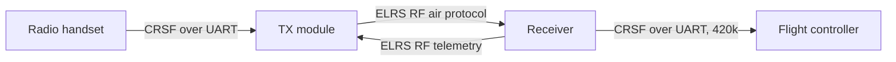
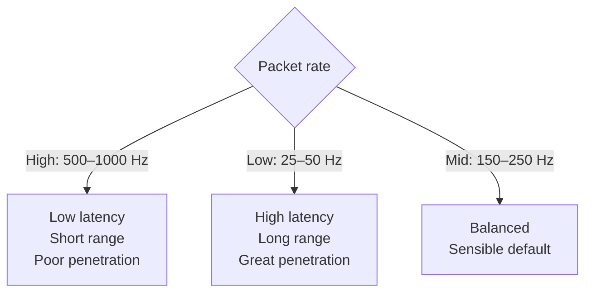

An ELRS link is really *two* protocols back to back: an **RF air protocol** between the handset's TX module and the receiver, and a **CRSF serial protocol** between the receiver and the flight controller. Setup (bind phrase, domain) lives in [ELRS Configuration](../elrs-config/); the OSD numbers live in [RC Telemetry](../rc-telemetry/). This snippet is the wire- and packet-level view, and why packet rate trades responsiveness against range.



---

## The CRSF wire (receiver → flight controller)

Between RX and FC the data is **CRSF** (Crossfire Serial Protocol) over a plain UART — **420 kbaud, 8N1**, one start bit and one stop bit per byte. High packet rates (500 Hz+) negotiate a faster baud (e.g. 921600) so the bytes still fit between updates.

```wave
{ signal: [
  { name: "CRSF UART", wave: "10========1", data: ["D0","D1","D2","D3","D4","D5","D6","D7"] }
],
  head: { text: "One byte: start bit (low), 8 data bits LSB-first, stop bit (high)" }
}
```

### Frame format

Every CRSF frame is the same shape and never exceeds **64 bytes**:

| Byte(s) | Field   | Meaning                                                        |
|---------|---------|---------------------------------------------------------------|
| 0       | Sync    | `0xC8` (device address / sync)                                |
| 1       | Length  | number of bytes that follow — `type + payload + CRC` (2–62)   |
| 2       | Type    | frame type (what the payload is)                              |
| 3 … n-1 | Payload | 0–60 bytes, type-specific                                     |
| n       | CRC8    | over **type + payload only**, polynomial `0xD5` (DVB-S2)      |

The CRC deliberately excludes the sync and length bytes, so a corrupted length can't hide a corrupted payload.

### Frame types you'll actually see

| Type   | Name                    | Direction | Carries                                   |
|--------|-------------------------|-----------|-------------------------------------------|
| `0x16` | RC Channels Packed      | RX → FC   | 16 channels × 11 bits (the sticks)        |
| `0x14` | Link Statistics         | RX → FC   | RSSI, LQ, SNR, RF mode, TX power          |
| `0x08` | Battery Sensor          | FC → RX   | voltage, current, mAh (telemetry uplink)  |
| `0x02` | GPS                     | FC → RX   | lat/lon, speed, sats                      |
| `0x1E` | Attitude                | FC → RX   | roll, pitch, yaw                          |
| `0x2B/2C/2D` | LUA parameters    | both      | the on-radio ELRS config menu             |
| `0x7A–0x7C` | MSP over CRSF      | both      | Configurator traffic through the link     |

---

## How the sticks are packed (0x16)

The RC frame crams **16 channels of 11 bits** into exactly **22 bytes** (16 × 11 = 176 bits). 11-bit fields do not line up with 8-bit bytes, so channels straddle byte boundaries:

```wave
{ reg: [
  { bits: 11, name: "ch1" },
  { bits: 11, name: "ch2" },
  { bits: 10, name: "ch3 (cont.)" }
],
  config: { bits: 32 }
}
```

*(Bit 0 is on the right. The bit ruler makes the mismatch clear — `ch2` starts mid-byte, `ch3` spills into the next byte.)* 11 bits = 2048 steps, matching the RC resolution ELRS carries end to end. A whole RC frame is `1 + 1 + 1 + 22 + 1 = 26 bytes` → 260 bit-times → **~620 µs** at 420 kbaud, which is why 1000 Hz packet rates need the higher CRSF baud.

### Link Statistics (0x14) payload

Ten bytes, the source of every number on your OSD:

```
uplink RSSI ant1, uplink RSSI ant2, uplink LQ, uplink SNR,
active antenna, RF mode, uplink TX power,
downlink RSSI, downlink LQ, downlink SNR
```

*Uplink* = handset → craft (your control link). *Downlink* = craft → handset (telemetry).

---

## The RF air protocol — packet rate

Over the air, **packet rate** is how many control packets per second the TX sends. It is the single most consequential ELRS setting because it sets the floor for latency **and** the ceiling for range at the same time.

### 2.4 GHz

| Rate       | Modulation | Sensitivity | Air latency | Character                       |
|------------|------------|-------------|-------------|---------------------------------|
| 50 Hz      | LoRa       | −115 dBm    | ~20 ms      | maximum range / penetration     |
| 150 Hz     | LoRa       | −112 dBm    | ~6.7 ms     | balanced long-range             |
| 250 Hz     | LoRa       | −108 dBm    | ~4 ms       | default; great all-rounder      |
| 333 Hz Full| LoRa       | −105 dBm    | ~3 ms       | more channels, shorter range    |
| 500 Hz     | LoRa       | −105 dBm    | ~2 ms       | freestyle/racing sweet spot     |
| F1000      | FLRC       | −104 dBm    | ~1.5 ms     | racing only; fragile at range   |

### 900 MHz

Tops out at **200 Hz**, but the low-rate modes reach much deeper: 25 Hz hits **−123 dBm** and 50 Hz **−120 dBm**. Lower frequency also **diffracts around obstacles** better than 2.4 GHz, so 900 MHz is the long-range / behind-terrain band.

---

## Why the trade-off exists

Lower packet rate → each packet is on air longer, using a higher LoRa **spreading factor**. More energy per bit means the receiver can dig the signal further out of the noise:

- **Sensitivity → range.** Every ~6 dB of extra sensitivity roughly **doubles** free-space range (path loss goes as distance²). 50 Hz (−115 dBm) sits ~10 dB below 500 Hz (−105 dBm) — roughly **3× the range** for the same TX power.
- **Sensitivity → penetration.** Trees, walls and your own body attenuate the signal by some dB. The extra sensitivity margin is exactly what lets a low rate "punch through" an obstacle that makes a high rate fail-safe.
- **Rate → responsiveness.** Responsiveness is just the gap between updates: 1000 Hz = a fresh command every 1 ms; 50 Hz = every 20 ms. Racers feel the difference between 2 ms and 6.7 ms as a tighter stick-to-quad connection; below ~150 Hz the latency becomes perceptible.

You cannot have all three. Fast packets are responsive but fragile; slow packets are tough but laggy. The right answer is **dynamic**: enable *Dynamic Power* and let the link drop to a lower rate at the edge of range (set once in the ELRS LUA script).



---

## Telemetry ratio

Downlink telemetry (RX → handset) borrows time slots from the uplink. The **telemetry ratio** `1:n` means one telemetry packet per `n` RC packets:

- A **tighter** ratio (`1:2`) gives fast telemetry but steals slots from control.
- A **looser** ratio (`1:64`, "Std") keeps almost all bandwidth for RC.
- At low packet rates the total pipe is tiny — even `1:2` at 50 Hz is only ~25 telemetry updates/s, too little for a smooth MAVLink HUD. Raising telemetry bandwidth means raising the packet rate, not just the ratio.

For most flying `Std` or `1:8`–`1:16` is right; for GPS/HUD work run 250 Hz+ with `1:2`.

---

## What this means in practice

- **CRSF is a checksummed byte protocol on a UART** — set the port to `Serial RX`, provider `CRSF`, un-inverted; see [ELRS Configuration](../elrs-config/).
- **Packet rate is a three-way trade** — responsiveness vs range vs penetration. Pick for the flight, or go dynamic.
- **The OSD numbers come straight from the 0x14 frame** — what each one means and which to watch is in [RC Telemetry](../rc-telemetry/), and getting the antenna right in [Antenna Placement](../antenna-placement/).
