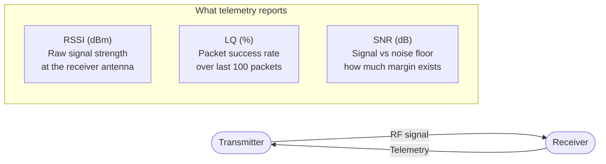

Šiuolaikiniai RC linkai siunčia telemetriją atgal iš imtuvo į siųstuvą ir OSD. Dominuoja trys skaičiai: RSSI, LQ ir SNR. Jie matuoja tą patį linką iš skirtingų kampų — o žinojimas, kurį stebėti, apsaugo ir nuo klaidingų aliarmų, ir nuo praleistų įspėjimų. Ilgai spoksojau į RSSI, kol supratau, kad iš tiesų man rūpi LQ.

---

## Ką matuoja kiekviena metrika



### RSSI — Received Signal Strength Indicator

Matuojamas dBm (decibelais 1 milivato atžvilgiu). Kuo neigiamesnis = tuo silpnesnis signalas.

- **−50 dBm** — puiku, labai arti
- **−90 dBm** — dar tinka, bet artėja prie jautrumo ribos
- **−105 dBm** — arti triukšmo grindų; linkas gali strigti

RSSI pasako signalo galią, bet ne tai, ar ta galia panaudojama. Stiprus signalas triukšmingoje aplinkoje (trukdžiai) gali turėti puikų RSSI, bet siaubingą LQ.

### LQ — Link Quality (ELRS specifinis)

Procentas tikėtinų paket'ų, kurie buvo sėkmingai priimti per paskutinius 100 paket'ų tarpsnių. Tai patikimiausias realios ELRS linko sveikatos rodiklis.

- **100%** — priimtas kiekvienas paket'as; linkas švarus
- **70–99%** — dalis paket'ų prarandama; kvadras gali jaustis kiek mažiau atsakus
- **Žemiau 70%** — rimtos problemos; svarstyk leistis
- **0%** — linkas prarastas

LQ krentantis anksčiau nei RSSI reikšmingai nukrenta — trukdžių įspėjimo ženklas: signalas yra, bet sugadintas.

### SNR — Signal to Noise Ratio

Kiek aukščiau triukšmo grindų sėdi signalas. Matuojamas dB.

- **Teigiamas SNR (> 5 dB)** — švarus linkas; signalas aiškiai virš triukšmo
- **SNR apie nulį** — signalas vos atskiriamas nuo triukšmo; linkas nepatikimas
- **Neigiamas SNR** — imtuvas dirba žemiau triukšmo grindų naudodamas spread-spectrum technikas (ELRS suprojektuotas veikti čia)

ELRS gali išlaikyti linką prie neigiamų SNR reikšmių dėl savo spread-spectrum moduliacijos — tai normalu ir tikėtina.

---

## ELRS specifinis elgesys

```chart
{
  "type": "line",
  "data": {
    "labels": ["100m","200m","400m","700m","1km","1.5km","2km","3km","4km","5km"],
    "datasets": [
      {
        "label": "RSSI (dBm, approx 2.4GHz 250mW)",
        "data": [-60,-66,-72,-78,-82,-86,-89,-93,-96,-99],
        "borderColor": "rgba(59,130,246,1)",
        "backgroundColor": "transparent",
        "borderWidth": 2.5,
        "pointRadius": 3,
        "tension": 0.3,
        "fill": false,
        "yAxisID": "y"
      },
      {
        "label": "LQ % (typical, 150Hz, good conditions)",
        "data": [100,100,100,100,99,97,93,85,72,55],
        "borderColor": "rgba(34,197,94,1)",
        "backgroundColor": "transparent",
        "borderWidth": 2.5,
        "pointRadius": 3,
        "tension": 0.3,
        "fill": false,
        "yAxisID": "y2"
      }
    ]
  },
  "options": {
    "responsive": true,
    "interaction": { "mode": "index", "intersect": false },
    "plugins": {
      "title": { "display": true, "text": "ELRS 2.4GHz — Approximate RSSI and LQ vs Distance (250mW, open field)" },
      "legend": { "position": "bottom" }
    },
    "scales": {
      "y": {
        "type": "linear",
        "position": "left",
        "min": -110,
        "max": -50,
        "title": { "display": true, "text": "RSSI (dBm)" }
      },
      "y2": {
        "type": "linear",
        "position": "right",
        "min": 0,
        "max": 100,
        "title": { "display": true, "text": "LQ (%)" },
        "grid": { "drawOnChartArea": false }
      }
    }
  }
}
```

*Reikšmės apytikslės ir kinta priklausomai nuo antenos orientacijos, trukdžių ir aplinkos.*

---

## Ką stebėti OSD

Daugumai skraidymo stebėk **LQ** — jis tiesiogiai pasako, koks procentas valdymo paket'ų prasimuša. RSSI naudingas kaip range orientyras, bet nekinta, kol jau esi toli.

Rekomenduojami OSD įspėjimai:
- **LQ < 70%** — geltonas įspėjimas
- **LQ < 50%** — raudonas įspėjimas, leiskis dabar
- **RSSI < −100 dBm** — artėji prie jautrumo ribos

Betaflight OSD nustatymuose įjunk `LINK QUALITY` ir `RSSI VALUE`. Taip pat pridėk `RSSI dBm VALUE` neapdorotam galios rodmeniui.

---

## FrSky / senesnės sistemos

Senesni FrSky linkai (D16, D8) rodo RSSI kaip analoginę 0–100 skalę, o ne dBm. Rodmuo **50+** yra patogus; **žemiau 30** verčia leistis.

FrSky neturi LQ ELRS prasme — kaip pagrindinį rodiklį jis naudoja RSSI. LQ nebuvimas apsunkina trukdžių sukelto paket'ų praradimo aptikimą iš arti.

---

## Telemetry ratio (ELRS)

ELRS telemetrija siunčiama iš RX → TX per dalį prieinamų laiko tarpsnių. Ratio (pvz., 1:16) reiškia vieną telemetrijos paket'ą kas 16 RC paket'ų.

Didesnis ratio = mažiau telemetrijos pralaidumo = šviežesnis, atsakesnis RC valdymas lėtesnių telemetrijos atnaujinimų sąskaita. Daugumai skraidymo `1:16` ar `1:8` tinka. Trumpo range treniruotėms `1:4` duoda greitesnę telemetriją be reikšmingo poveikio range.

Nustatoma ELRS LUA skripte siųstuve: **Telemetry Ratio**.
