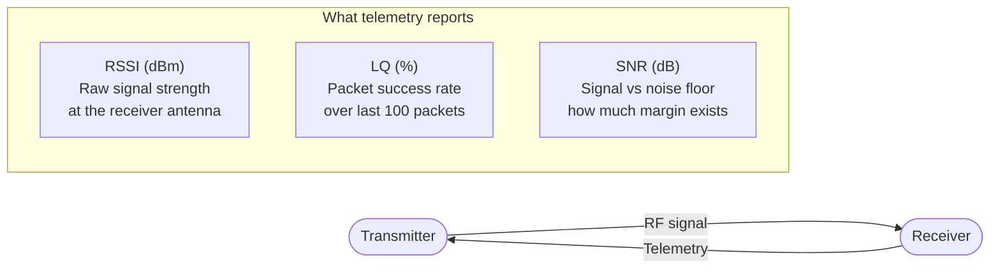

Modern RC links send telemetry back from the receiver to the transmitter and OSD. Three numbers dominate: RSSI, LQ, and SNR. They measure the same link from different angles — and knowing which one to watch prevents both false alarms and missed warnings.

---

## What Each Metric Measures



### RSSI — Received Signal Strength Indicator

Measured in dBm (decibels relative to 1 milliwatt). More negative = weaker signal.

- **−50 dBm** — excellent, very close range
- **−90 dBm** — usable but approaching sensitivity limit
- **−105 dBm** — near noise floor; link may struggle

RSSI tells you signal power but not whether that power is usable. A strong signal in a high-noise environment (interference) can have excellent RSSI but terrible LQ.

### LQ — Link Quality (ELRS-specific)

The percentage of expected packets that were successfully received in the last 100 packet slots. This is the most reliable indicator of actual link health for ELRS.

- **100%** — every packet received; link is clean
- **70–99%** — some packet loss; quad may feel slightly less responsive
- **Below 70%** — serious issues; consider landing
- **0%** — link lost

LQ dropping before RSSI drops significantly is a warning sign of interference — the signal is present but corrupted.

### SNR — Signal to Noise Ratio

How far above the noise floor the signal sits. Measured in dB.

- **Positive SNR (> 5 dB)** — clean link; signal clearly above noise
- **Near zero SNR** — signal barely distinguishable from noise; link unreliable
- **Negative SNR** — receiver is working below the noise floor using spread-spectrum techniques (ELRS is designed to work here)

ELRS can maintain a link at negative SNR values because of its spread-spectrum modulation — this is normal and expected.

---

## ELRS-Specific Behaviour

```chart
{
  "type": "line",
  "data": {
    "labels": ["100m","200m","400m","700m","1km","1.5km","2km","3km","4km","5km"],
    "datasets": [
      {
        "label": "RSSI (dBm, approx 2.4GHz 250mW)",
        "data": [-60,-66,-72,-78,-82,-86,-89,-93,-96,-99],
        "borderColor": "rgba(59,130,246,1)",
        "backgroundColor": "transparent",
        "borderWidth": 2.5,
        "pointRadius": 3,
        "tension": 0.3,
        "fill": false,
        "yAxisID": "y"
      },
      {
        "label": "LQ % (typical, 150Hz, good conditions)",
        "data": [100,100,100,100,99,97,93,85,72,55],
        "borderColor": "rgba(34,197,94,1)",
        "backgroundColor": "transparent",
        "borderWidth": 2.5,
        "pointRadius": 3,
        "tension": 0.3,
        "fill": false,
        "yAxisID": "y2"
      }
    ]
  },
  "options": {
    "responsive": true,
    "interaction": { "mode": "index", "intersect": false },
    "plugins": {
      "title": { "display": true, "text": "ELRS 2.4GHz — Approximate RSSI and LQ vs Distance (250mW, open field)" },
      "legend": { "position": "bottom" }
    },
    "scales": {
      "y": {
        "type": "linear",
        "position": "left",
        "min": -110,
        "max": -50,
        "title": { "display": true, "text": "RSSI (dBm)" }
      },
      "y2": {
        "type": "linear",
        "position": "right",
        "min": 0,
        "max": 100,
        "title": { "display": true, "text": "LQ (%)" },
        "grid": { "drawOnChartArea": false }
      }
    }
  }
}
```

*Values are approximate and vary with antenna orientation, interference, and environment.*

---

## What to Watch on OSD

For most flying, watch **LQ** — it tells you directly what percentage of control packets are getting through. RSSI is useful for range reference but doesn't change until you're already far out.

Recommended OSD warnings:
- **LQ < 70%** — yellow warning
- **LQ < 50%** — red warning, land now
- **RSSI < −100 dBm** — getting close to sensitivity limit

In Betaflight OSD setup, enable `LINK QUALITY` and `RSSI VALUE`. Also add `RSSI dBm VALUE` for the raw power reading.

---

## FrSky / Legacy Systems

Older FrSky links (D16, D8) report RSSI as an analogue 0–100 scale rather than dBm. A reading of **50+** is comfortable; **below 30** warrants landing.

FrSky does not have LQ in the ELRS sense — it uses RSSI as the primary indicator. The absence of LQ makes it harder to detect interference-induced packet loss at close range.

---

## Telemetry Ratio (ELRS)

ELRS telemetry is sent from RX → TX on a subset of available time slots. The ratio (e.g., 1:16) means one telemetry packet per 16 RC packets.

Higher ratio = less telemetry bandwidth = fresher, more responsive RC control at the cost of slower telemetry updates. For most flying, `1:16` or `1:8` is fine. For close-range practice, `1:4` gives faster telemetry without meaningful range impact.

Set in the ELRS LUA script on the transmitter: **Telemetry Ratio**.
