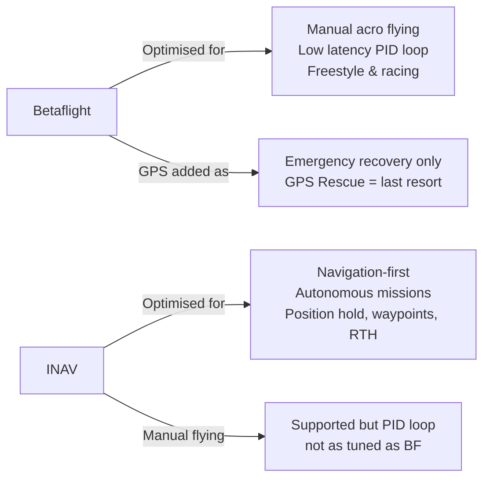
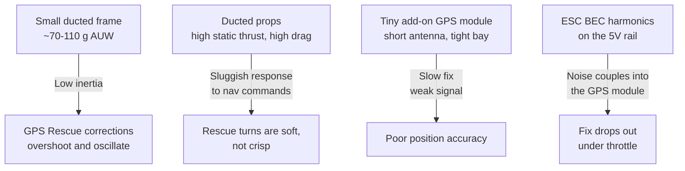
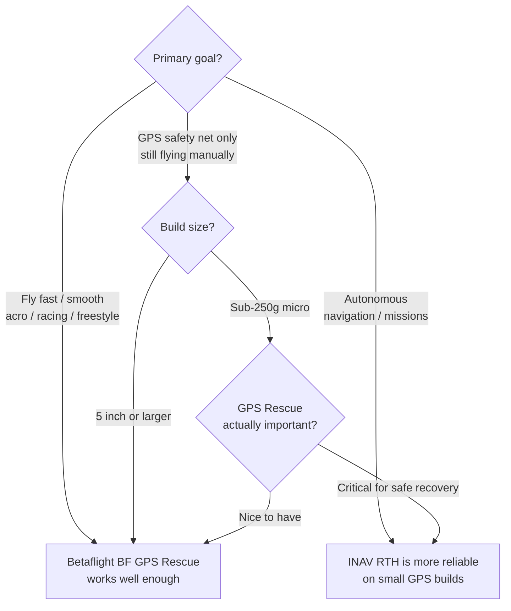

Betaflight ir INAV — abu atviro kodo skrydžio kontrolerio firmware. Jie turi bendrą kodo istoriją, bet išsišakojo į skirtingus įrankius su skirtingomis stiprybėmis. Netinkamas pasirinkimas GPS dronui baigiasi arba erzinančia patirtimi, arba nepanaudotomis galimybėmis. (Spėkit, iš kurios pusės aš mokiausi.)

---

## Pagrindinė filosofija



Betaflight į GPS žiūri kaip į saugumo funkciją. INAV į GPS žiūri kaip į pagrindinį naudojimo scenarijų.

---

## Funkcijų palyginimas

| Funkcija                      | Betaflight        | INAV               |
|-------------------------------|-------------------|--------------------|
| Rankinis acro skraidymas      | Puikus            | Geras              |
| PID kilpos vėlinimas          | ~1 ms tikslas     | ~2–4 ms tipiškai   |
| GPS Rescue (RTH)              | Bazinis — tik avariniam | Pilnas RTH su stabdymu, hold, misija |
| Position Hold                 | Nėra              | Taip — POSHOLD režimas |
| Waypoint misijos              | Nėra              | Taip — autonominiai maršrutai |
| Aukščio išlaikymas            | Nėra              | Taip — ALTHOLD režimas |
| Fiksuoto sparno palaikymas    | Ne                | Taip — pilnas palaikymas |
| Blackbox / derinimo įrankiai  | Puikūs            | Geri               |
| OSD integracija               | Puiki             | Gera (rodo daugiau GPS duomenų) |
| Bendruomenė / forumai         | Didesnė           | Aktyvi, bet mažesnė |
| Konfigūratoriaus patirtis     | Subrendusi        | Subrendusi, sudėtingesnė |
| Failsafe                      | Stage 1/2, GPS Rescue | RTH su stabdymu, EMERG nusileidimas |

---

## Kada naudoti Betaflight

- **Freestyle ar racing dronai**, kur PID kilpos kokybė yra prioritetas
- **Cinewhoop'ai ir proximity dronai**, kur sklandus atsakas svarbesnis už navigaciją
- **Dronai, kuriems GPS reikia tik kaip „saugos tinklo“** — GPS Rescue beveik niekada nespaudi, bet jis yra, jei kas nutiktų
- **Bet koks standartinis 5" freestyle rėmas** — bendruomenės derinimo resursai (presetai, Betaflight presetų bazė) čia gerokai pranašesni

Betaflight GPS Rescue veikia ir per 4.3/4.4 versijas ženkliai pagerėjo — bet jis neskirtas patikimai autonominei navigacijai. Tai funkcija „parvaryk droną namo, kol baterija dar neišsikrovė“.

---

## Kada naudoti INAV

- **GPS tyrinėtojams / long-range dronams**, kur nori, kad dronas realiai navigatų pats
- **Waypoint misijoms** — INAV gali skristi iš anksto suprogramuotu maršrutu, laikyti aukštį ir grįžti namo be RC valdymo
- **Fiksuoto sparno hibridams** — INAV palaiko stabilizuotą fiksuoto sparno skrydį ir maišymą (mixing)
- **Dronams, kur nori POSHOLD** — galimybė paleisti stick'us ir kad dronas kabotų vietoje 3D erdvėje be dreifo
- **Kinematografijai su gimbalu** — INAV pozicijos/aukščio išlaikymas leidžia sklandžius „dolly“ kadrus be nuolatinio koregavimo

---

## GPS pridėjimas prie Pavo20

Pavo20 (Pro / Pro II) — tai **2.2" ducted skaitmeninis cinewhoop'as**: 3S maitinimas (LAVA 1104 7200 KV motorai ant Gemfan 2218 tri-blade propų), DJI O3/O4/O4 Pro arba Walksnail HD air unit, ir **jokio GPS iš gamyklos**. Jokio analogo, jokio 1S, jokios integruotos navigacijos. Kas nori GPS Rescue — patys prisukа micro GPS modulį (ir dažniausiai buzzerį). Būtent nuo to prasideda vargas:



Ta, kurią visi praleidžia — **P4**: AIO BEC'as perjunginėja tokiu dažniu, kurio harmonikos pataiko tiesiai į GPS modulio maitinimo liniją ir prasiskverbia į jo RF įėjimą, tad fix'as sugenda kaip tik tada, kai užsuki motorus. (Pats gaudau šitą triukšmą savo Pavo20 — bus atskiras rašinys, kaip jį susekti ir užmušti.)

INAV navigacijos „stackas“ patį *skrydį* per rescue tvarko geriau, nes naudoja tikrą pozicijos kontrolerį (o ne grubų avarinį režimą), o jo RTH seka apima lėtėjimą ir stabdymą. INAV taip pat turi geresnę barometro integraciją aukščiui laikyti dronuose be tvirtos GPS aukščio fiksacijos — bet nei viena iš šitų funkcijų neišgydys triukšmingo GPS fix'o; tai aparatūros problema (žr. žemiau).

**Pavo20 migravimas į INAV:**
- Pavo20 F4 2-3S AIO turi turėti INAV target'ą — patikrink [INAV target sąraše](https://github.com/iNavFlight/inav/blob/master/docs/Boards.md)
- Tikėkis, kad PID reikės derinti iš naujo — INAV numatytieji nustatymai suderinti sunkesniems GPS dronams
- Pirmiausia sutvarkyk GPS maitinimo triukšmą — INAV nenavigatuos ant fix'o, kuris dingsta užsukus motorus

---

## Signalo kokybė veikia abu firmware

Nepriklausomai nuo firmware, GPS veikimas mažuose dronuose kenčia dėl:

```chart
{
  "type": "bar",
  "data": {
    "labels": ["Clear sky\nopen field", "Suburban area\ntrees + buildings", "Under canopy\nor indoors", "Carbon frame\nshadowing GPS", "GPS near VTX\n5.8GHz interference"],
    "datasets": [{
      "label": "Typical GPS fix quality (1=terrible, 10=excellent)",
      "data": [9, 6, 2, 4, 3],
      "backgroundColor": [
        "rgba(34,197,94,0.7)",
        "rgba(132,204,22,0.7)",
        "rgba(239,68,68,0.7)",
        "rgba(249,115,22,0.7)",
        "rgba(239,68,68,0.7)"
      ],
      "borderWidth": 1
    }]
  },
  "options": {
    "indexAxis": "y",
    "responsive": true,
    "plugins": {
      "title": { "display": true, "text": "GPS Fix Quality by Environment (approximate)" },
      "legend": { "display": false }
    },
    "scales": {
      "x": { "beginAtZero": true, "max": 10 }
    }
  }
}
```

Kompaktiškame builde pagrindinė problema — **maitinimo linijos triukšmas**, ne vien antenos aplinka. AIO ESC BEC'as (perjungiamasis reguliatorius, gaminantis 5V) meta harmonikas, kurios prasiskverbia tiesiai į tą pačią liniją dalinantį GPS modulį — tad fix'as silpsta arba dingsta vos užsukus motorus. O centimetrus greta stovintis 5,8 GHz skaitmeninis air unit'as dar prideda RF desense. Nei vieno iš jų firmware neišspręs — abu aparatūros problemos.

**Aparatūriniai sprendimai:**
- Maitink GPS iš švarios/filtruotos 5V linijos, o ne tiesiai iš triukšmingo ESC BEC — LC filtras arba atskiras mažo triukšmo reguliatorius duoda didžiausią efektą
- Laikyk GPS anteną kuo toliau nuo air unit'o antenos, kiek rėmas leidžia
- Naudok ekranuotą GPS modulį (metalinis „dangtelis“ virš modulio)
- Tikrink fix'ą ant stalo *užsukęs motorus*, ne tik tuščiąja eiga — triukšmas išlenda tik po apkrova

---

## Sprendimo santrauka



Daugumai freestyle ir racing dronų: **Betaflight**.  
GPS priklausomai navigacijai, long-range ar autonominėms misijoms: **INAV**.  
Pavo20 atveju, kai svarbus patikimas GPS parskridimas: verta apsvarstyti **INAV**, susitaikant su prastesniu rankiniu skraidymu.
