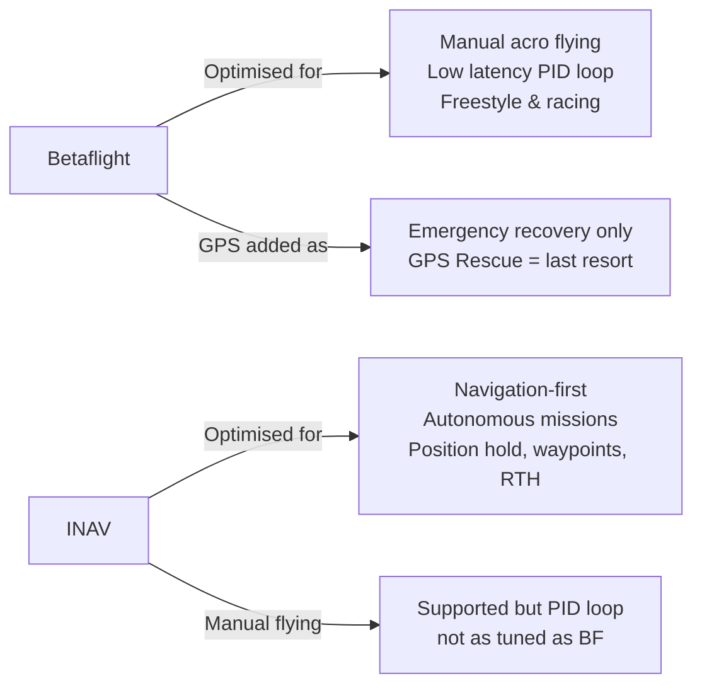
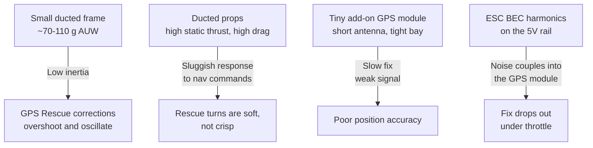
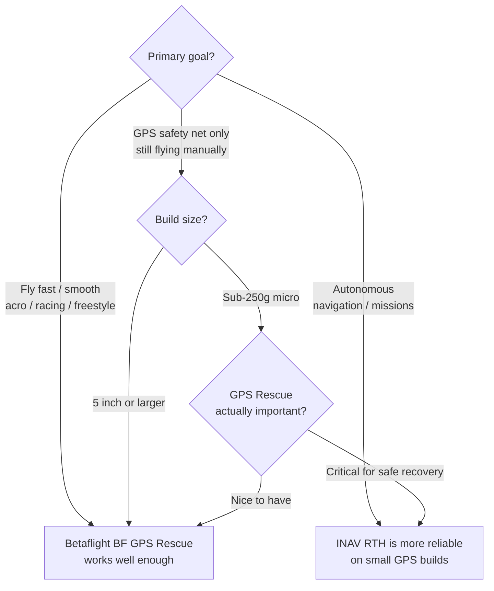

Betaflight and INAV are both open-source FC firmware. They share some code history but have diverged into distinct tools with different strengths. The wrong choice for a GPS build results in either a frustrating experience or wasted capability.

---

## Core Philosophy



Betaflight treats GPS as a safety feature. INAV treats GPS as the primary use case.

---

## Feature Comparison

| Feature                       | Betaflight        | INAV               |
|-------------------------------|-------------------|--------------------|
| Manual acro flying            | Excellent         | Good               |
| PID loop latency              | ~1ms target       | ~2–4ms typical     |
| GPS Rescue (RTH)              | Basic — emergency only | Full RTH with braking, hold, mission |
| Position Hold                 | Not available     | Yes — POSHOLD mode  |
| Waypoint missions             | Not available     | Yes — autonomous routes |
| Altitude hold                 | Not available     | Yes — ALTHOLD mode |
| Fixed-wing support            | No                | Yes — full support  |
| Blackbox / tuning tools       | Excellent         | Good               |
| OSD integration               | Excellent         | Good (more GPS data shown) |
| Community / forum support     | Larger            | Active but smaller  |
| Configurator UX               | Mature            | Mature, more complex |
| Failsafe                      | Stage 1/2, GPS Rescue | RTH with deceleration, EMERG land |

---

## When to Use Betaflight

- **Freestyle or racing builds** where PID loop quality is the priority
- **Cinewhoops and proximity builds** where smooth response matters more than navigation
- **Builds that only need GPS as a safety net** — you almost never trigger GPS Rescue, but it's there if something goes wrong
- **Any build on standard 5" freestyle frames** — the community tune resources (presets, Betaflight presets database) are vastly better

Betaflight GPS Rescue is functional and has improved significantly through 4.3/4.4 — but it's not designed for reliable autonomous navigation. It's a "get the quad home before the battery dies" feature.

---

## When to Use INAV

- **GPS explorers / long-range builds** where you want the quad to actually navigate autonomously
- **Waypoint mission flying** — INAV can fly a pre-programmed route, hold altitude, and return home without RC control
- **Fixed-wing hybrids** — INAV supports stabilized fixed-wing flight and mixing
- **Builds where you want POSHOLD** — the ability to release sticks and have the quad sit still in 3D space without drifting
- **Cinematic work with a gimbal** — INAV's position/altitude hold makes smooth dolly shots possible without constant correction

---

## Adding GPS to a Pavo20

The Pavo20 (Pro / Pro II) is a **2.2" ducted digital cinewhoop** — 3S power (LAVA 1104 7200 KV motors on Gemfan 2218 tri-blades), a DJI O3/O4/O4 Pro or Walksnail HD air unit, and **no GPS from the factory**. There is no analog, no 1S, no built-in navigation. Pilots who want GPS Rescue bolt on a micro GPS module (and usually a buzzer) themselves — and that retrofit is where the trouble starts:



The one people miss is **P4**: the AIO's BEC switches at a frequency whose harmonics land right on the GPS module's supply rail and leak into its RF front-end, so the fix degrades exactly when you spool the motors up. (I'm chasing this noise on my own Pavo20 — there'll be a separate write-up on hunting it down and killing it.)

INAV's navigation stack handles the *flight* side of a rescue better because it uses a proper position controller (rather than a rough emergency mode), and its RTH sequence includes deceleration and braking. INAV also has better barometer integration for altitude hold on builds without a solid GPS altitude lock — but note that none of this fixes a noisy GPS fix; that's a hardware problem (see below).

**Migrating a Pavo20 to INAV:**
- The Pavo20's F4 2-3S AIO must have an INAV target — verify against the [INAV target list](https://github.com/iNavFlight/inav/blob/master/docs/Boards.md)
- Expect to re-tune PIDs from scratch — INAV defaults are tuned for heavier GPS builds
- Sort out the GPS power noise *first*; INAV can't navigate on a fix that vanishes under throttle

---

## Signal Quality Affects Both Firmware

Regardless of firmware, GPS performance on small builds suffers from:

```chart
{
  "type": "bar",
  "data": {
    "labels": ["Clear sky\nopen field", "Suburban area\ntrees + buildings", "Under canopy\nor indoors", "Carbon frame\nshadowing GPS", "GPS near VTX\n5.8GHz interference"],
    "datasets": [{
      "label": "Typical GPS fix quality (1=terrible, 10=excellent)",
      "data": [9, 6, 2, 4, 3],
      "backgroundColor": [
        "rgba(34,197,94,0.7)",
        "rgba(132,204,22,0.7)",
        "rgba(239,68,68,0.7)",
        "rgba(249,115,22,0.7)",
        "rgba(239,68,68,0.7)"
      ],
      "borderWidth": 1
    }]
  },
  "options": {
    "indexAxis": "y",
    "responsive": true,
    "plugins": {
      "title": { "display": true, "text": "GPS Fix Quality by Environment (approximate)" },
      "legend": { "display": false }
    },
    "scales": {
      "x": { "beginAtZero": true, "max": 10 }
    }
  }
}
```

On a compact build the dominant problem is **power-rail noise**, not just the antenna environment. The AIO's ESC BEC (the switching regulator that makes 5V) throws off harmonics that couple straight into an add-on GPS module sharing that rail — so the fix weakens or drops the instant you throttle up. The 5.8 GHz digital air unit sitting centimetres away piles RF desense on top. Neither is something firmware can fix — both are hardware problems.

**Hardware mitigations:**
- Power the GPS from a clean/filtered 5V source, not straight off the noisy ESC BEC rail — an LC filter or a small separate low-noise regulator makes the biggest difference
- Keep the GPS antenna as far from the air-unit antenna as the frame allows
- Use a shielded GPS module (metal can lid over the module)
- Confirm the fix on the bench *at throttle*, not just at idle — the noise only shows up under load

---

## Summary Decision



For most freestyle and racing builds: **Betaflight**.  
For GPS-dependent navigation, long range, or autonomous missions: **INAV**.  
For a Pavo20 where GPS recovery reliability matters: consider **INAV**, accepting the manual flying trade-off.
