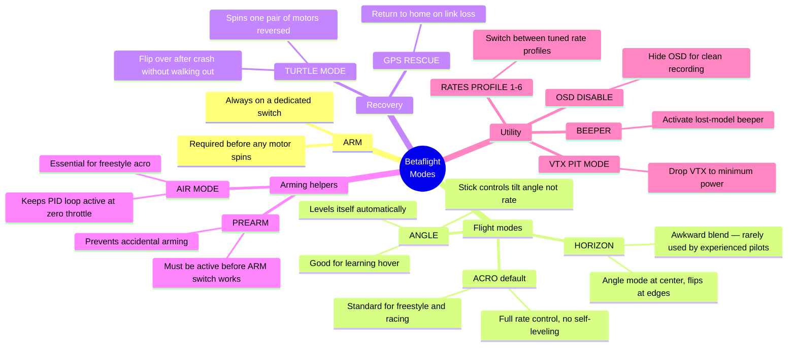
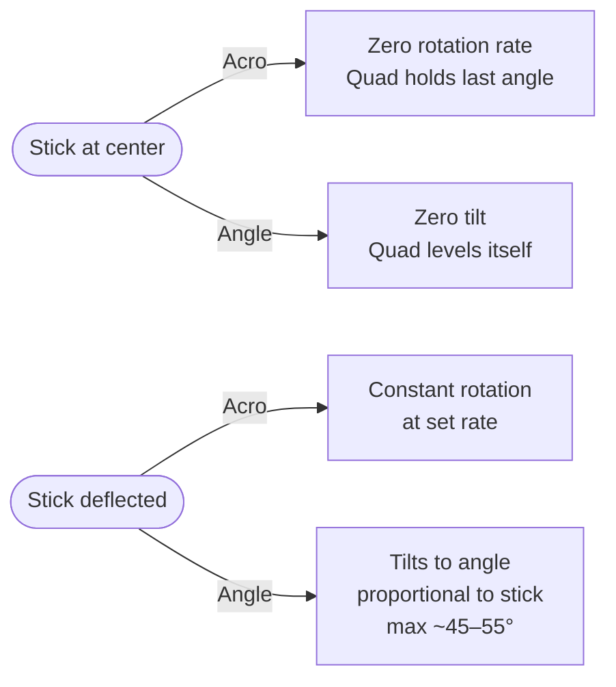

Betaflight mode'ai — tai sąlygos, priskirtos AUX kanalų ruožams. Kai jungiklio padėtis įvykdo sąlygą, FC įjungia tą mode'ą. Vieni mode'ai vienas kitą išjungia, kiti veikia kartu — o kartais tave nustebina lauke, kai supainioji, kuris jungiklis ką daro (klausk manęs, iš kur žinau).

---

## Mode'ų žemėlapis



---

## Rekomenduojamas jungiklių išdėstymas

| Jungiklis | Mode'ai              | Tipas      | Pastabos                                        |
|--------|----------------------|------------|-------------------------------------------------|
| SA     | ARM                  | 2 padėčių  | Svarbiausias; visada žinok, kuri padėtis yra disarm |
| SB     | ANGLE / ACRO         | 2 padėčių  | SB žemyn = acro, SB aukštyn = angle (parskridimui) |
| SC     | BEEPER / TURTLE      | 3 padėčių  | Vidurys = beeper, aukštyn = turtle po kritimo   |
| SD     | RATES PROFILE 1–3    | 3 padėčių  | Lėti / normalūs / greiti rate'ai                |
| SE     | GPS RESCUE / PREARM  | 2 padėčių  | Arba VTX galios lygiai ant ratuko               |

Kanalus priskirk radijo mikseryje: SA → CH5 (AUX1), SB → CH6 (AUX2) ir taip toliau.

---

## Acro vs Angle — kada kurį naudoti



**Acro (rate mode)** — numatytasis ir „teisingas“ mode'as bet kokiam freestyle ar lauko skraidymui. Jis duoda pilną valdymo laisvę — gali skristi apverstas, daryti flip'us ir laikyti bet kokį kampą. Dronas daro būtent tai, ką liepia stick'ai.

**Angle mode** išsilygina pats. Stick'as nurodo pasvirimo kampą, o ne sukimosi greitį. FC aktyviai priešinasi bet kokiam pasvirimui virš nustatyto maksimalaus kampo. Pravartu absoliutiems pradedantiesiems, mokantis kaboti, bet apribojimai neleidžia skristi apverstam ar daryti manevrų.

---

## Air Mode

Air Mode palaiko PID kilpą aktyvią, kai throttle yra nulyje. Be jo FC nukerpa PID išvestį prie nulinio throttle ir dronas nevaldomai vartaliojasi darant apverstus praskridimus ar manevrus be galios.

```
# Enable permanently (recommended for acro flying)
feature AIRMODE
set airmode_start_throttle_percent = 25   # throttle % where airmode fully engages
save

# Or assign to a switch in Modes tab → AIR MODE
```

Bet kokiam freestyle skraidymui įjunk Air Mode visam laikui. Vienintelis atvejis, kada verta jį išjungti: absoliutūs pradedantieji ant angle mode, kuriems naudinga, kad dronas iškart sustoja nukirtus throttle.

---

## Turtle Mode (apsivertimas po kritimo)

Po kritimo, kai dronas lieka gulėti apverstas, Turtle Mode suka propus atbuline kryptimi ant įstrižai išsidėsčiusių motorų porų, kad jį apverstų — nereikia eiti jo pasiimti.

**Kaip įjungti:**
1. Disarm (arm jungiklį į disarm)
2. Įjunk Turtle Mode jungiklį
3. Vėl arm
4. Roll/pitch stick'u apversk; dronas suka atitinkamus motorus
5. Kai atsistoja teisingai, disarm, išjunk Turtle, vėl arm įprastai

```
# Requires DSHOT — bidirectional not required, but the ESCs must support
# motor reversal command (all BLHeli_32 / AM32 ESCs do)
set beeper_dshot_beacon_tone = 1  # optional: beacon beeps while turtle active
```

Turtle Mode yra sunkus propams ir motorams — atbulinio sukimo jėga apkrauna guolius. Naudok saikingai; nevartaliok kelis kartus per tą patį kritimą (guoliai tau to neatleis).

---

## Prearm

Prideda dviejų žingsnių arm reikalavimą: Prearm jungiklis turi būti aktyvus, kad ARM jungiklis apskritai ką nors darytų. Apsaugo nuo netyčinio arm, kol neši droną.

Priskirk jungikliui, kurį sąmoningai įjungi, kai esi pasiruošęs skristi:

```
# In Modes tab: PREARM on AUX3 full range
# In practice: flip Prearm (SA up), then flip ARM (SB up)
# To disarm: flip ARM down. Prearm can stay active.
```

Labai rekomenduojama bet kokiam buildui su neuždengtais propais krepšyje ar dėže.

---

## OSD Disable

Pašalina visus OSD elementus iš vaizdo srauto. Naudinga, kai nori užrašyti švarią medžiagą montažui be piloto UI netvarkos:

```
# In Modes tab: OSD DISABLE on a switch position
# Flip to hide OSD for clean B-roll; flip back to see telemetry
```
