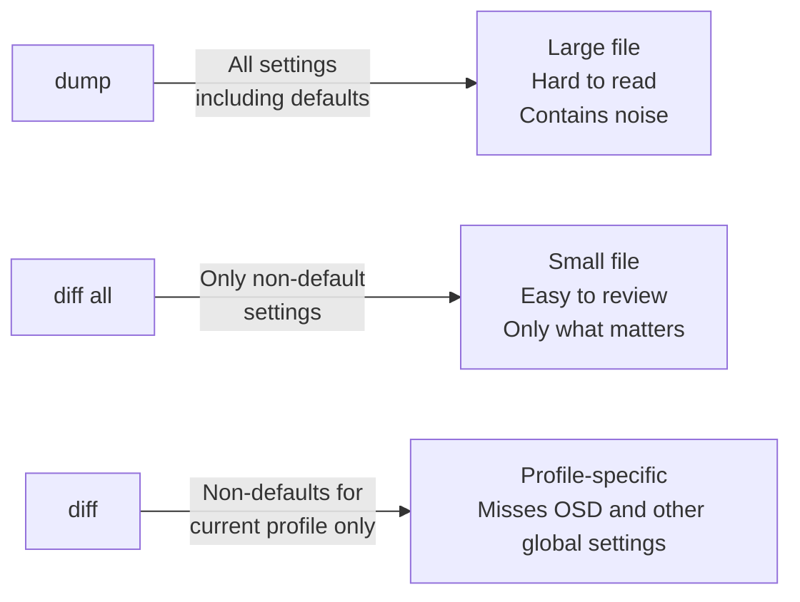
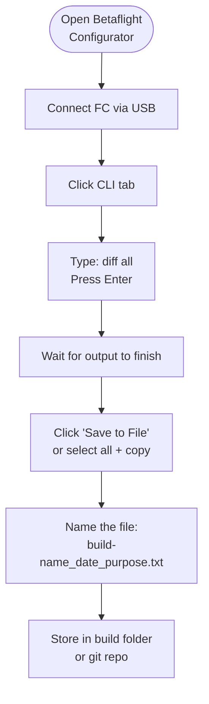
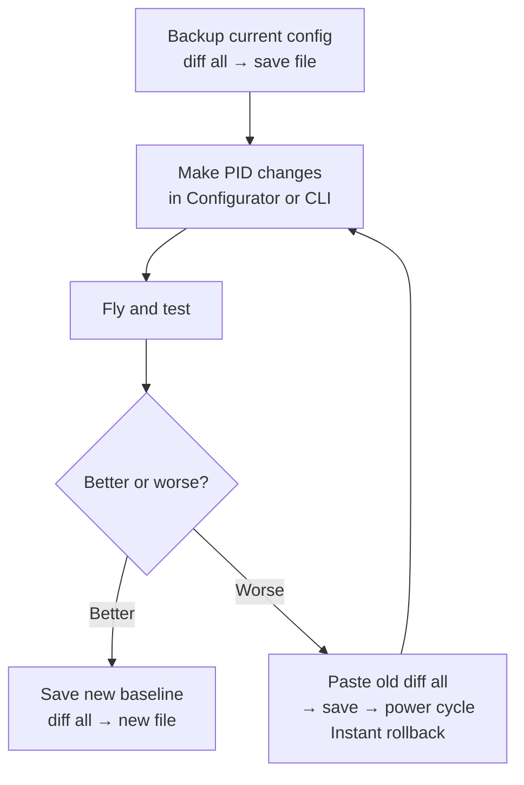

Betaflight CLI — vienintelis tiesos šaltinis pilnai buildo konfigūracijai. Konfigūratoriaus tab'ai rodo daugumą nustatymų, bet CLI parodo viską — įskaitant numatytuosius, kuriuos GUI slepia. Prieš bet kokį derinimo eksperimentą pasidaryk atsarginę kopiją su `diff all`. Po sesijos — pasidaryk vėl. Patikėk — vieną kartą praradus gerą derinimą, šio žingsnio nebepamirši niekada.

---

## Kodėl `diff all`, o ne `dump`



| Komanda    | Ką ji išsaugo              | Kam geriausiai tinka                   |
|------------|---------------------------|----------------------------------------|
| `dump`     | Viską, įskaitant numatytuosius | Pilna gamyklinio lygio kopija     |
| `diff all` | Tik tavo pakeitimus        | Kasdienė derinimo kopija               |
| `diff`     | Pakeitimus dabartiniame profilyje | Greita profilio nuotrauka       |

**Kiekvienai kopijai naudok `diff all`.** Jis lengvai skaitomas, laisvai telpa į tekstinį failą ir švariai atsistato ant tos pačios Betaflight versijos. `dump` naudok tik tada, kai reikia byte-for-byte viso FC klono arba kai perkeli konfigūraciją į kitą to paties modelio FC.

---

## Atsarginės kopijos darbo eiga



### CLI'e:

```
# Generate the backup
diff all

# The output scrolls in the terminal.
# Click "Save to File" in Configurator, OR:
# Select all output text (Ctrl+A in the text area), copy, paste to a .txt file.
```

Failą pavadink su kontekstu — ne tiesiog `backup.txt`:

```
pavo20_2026-07-13_pre-tune.txt
pavo20_2026-07-13_post-pid-tune.txt
freestyle5_2026-07-10_working-config.txt
```

---

## Atkūrimo darbo eiga

```
# In CLI tab, paste the diff all contents and press Enter
# Or use "Load from File" button

# After pasting, always end with:
save

# Then power cycle the FC (unplug USB, replug)
```

Betaflight apdoroja kiekvieną CLI komandą iš eilės. `diff all` failas — tai eilė `set` komandų plius `profile` ir `rateprofile` perjungimo komandos — tai galiojanti CLI įvestis.

---

## Saugus derinimo eksperimentavimas

Naudok šį principą, kad išbandytum naują derinimą nebijodamas prarasti to, kas veikė:



```
# Before any tune experiment:
diff all
# → Save to file immediately

# After a bad tune:
# Open the saved file, paste all contents into CLI, press Enter, then:
save
# Done — you're back to the working tune.
```

---

## Ką `diff all` užfiksuoja

- Visas PID reikšmes ir TPA nustatymus
- Visus rate profilius (RC Rate, Super Rate, Expo visoms ašims)
- Visas OSD elementų pozicijas
- Failsafe konfigūraciją
- ESC/motorų protokolo nustatymus
- RPM filtro konfigūraciją
- Visus mode'ų priskyrimus
- Blackbox nustatymus
- VTX galios lentelę
- GPS nustatymus (jei sukonfigūruoti)

**Ko jis NEUŽFIKSUOJA:**
- Imtuvo bind'o (saugoma pačiame RX)
- VTX kanalo/galios *dabartinio* pasirinkimo (kanalas/galia — tai runtime būsena)
- Motorų tvarkos/krypties (saugoma ESC firmware)

---

## Konfigūracijų laikymas Git'e

Rimtiems buildams laikyk savo `diff all` failus git repozitorijoje (taip, dronų konfigai git'e — kam gi ne :)):

```bash
mkdir quad-configs && cd quad-configs
git init
cp pavo20_2026-07-13.txt .
git add .
git commit -m "Pavo20: pre-tune baseline"

# After a tune session:
cp pavo20_2026-07-14_after-pid.txt .
git add .
git commit -m "Pavo20: P/D tuned, filter lowpass moved to 150Hz"
```

`git diff` tarp dviejų konfigūracijų parodo tiksliai, kas pasikeitė — kiekvieną `set` eilutę, kuri pajudėjo. Dėl to labai lengva suprasti, ką derinimo sesija iš tikrųjų pakeitė.

---

## Atsigavimas po „užmūrytos“ konfigūracijos

Jei FC neleidžia arm arba keistai elgiasi po įklijavimo:

```
# In CLI:
defaults nosave     # resets all settings but does NOT save — lets you verify first
# Verify arming works in Configurator
save
# Now paste your last known-good diff all
```

`defaults nosave` yra atšaukiamas — `save` padaro jį galutiniu. Visada išbandyk prieš išsaugodamas.
