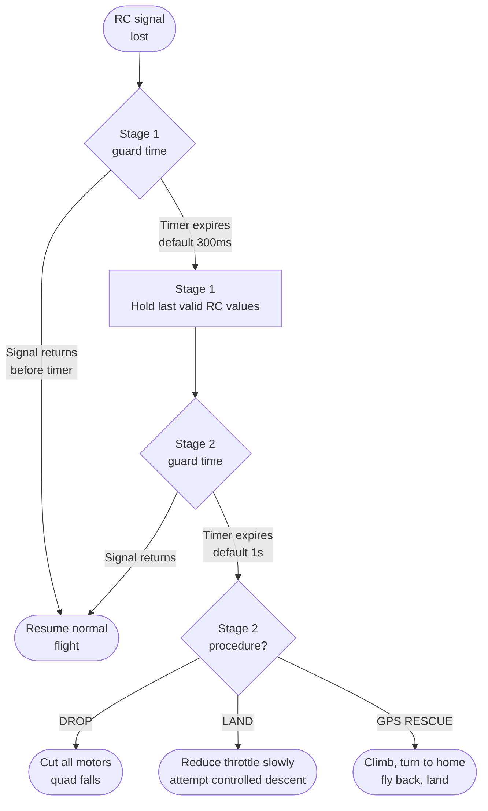

Failsafe — tai kas nutinka, kai RC ryšys nutrūksta skrydžio metu (o jis nutrūks — anksčiau ar vėliau). Be teisingos konfigūracijos ryšio praradimo įvykis nuvaro droną tolyn pilnu throttle arba numeta jį kaip akmenį. Nei viena, nei kita nėra gerai.

---

## Dviejų pakopų failsafe

Betaflight naudoja dviejų pakopų sistemą:



**Stage 1** sugeria trumpalaikius trikčius. Stage 1 metu FC laiko paskutines žinomas stick'ų padėtis — dronas skrenda taip, kaip skrido. Tai perka laiko ryšiui atsigauti.

**Stage 2** įsijungia po ilgesnio ryšio dingimo ir įvykdo sukonfigūruotą procedūrą.

---

## Imtuvo pusės failsafe

**Pats imtuvas** taip pat turi būti sukonfigūruotas išvesti failsafe būseną — o ne amžinai laikyti paskutines reikšmes. Jei imtuvas be perstojo siunčia „paskutinę žinomą padėtį“, Betaflight niekada neaptiks ryšio praradimo.

Dauguma šiuolaikinių imtuvų turi du režimus:
- **Hold** — išveda paskutines galiojančias reikšmes (pavojinga: Betaflight niekada nesuveikia failsafe)
- **No pulses / failsafe values** — išveda nulinį signalą arba iš anksto nustatytas reikšmes

Sukonfigūruok imtuvą išvesti **no pulses** arba jo paties failsafe padėtį. ELRS imtuvuose tai vyksta automatiškai — ELRS, nutrūkus ryšiui, išveda failsafe padėtį iš bind konfigūracijos.

---

## Betaflight konfigūracija

Konfigūratorius → **Failsafe** tab'as:

```
# Stage 1
set failsafe_delay = 4         # 4 × 0.1s = 400ms guard time before Stage 2 triggers
set failsafe_off_delay = 10    # 10 × 0.1s = 1s of landing before motors cut (Stage 2 duration)

# Stage 2 procedure
set failsafe_procedure = GPS-RESCUE  # or DROP or AUTO-LAND

# Throttle held during the AUTO-LAND procedure (0–2000); for GPS-RESCUE set to hover
set failsafe_throttle = 1300   # slightly below hover

# If throttle was already low this long before failsafe, just disarm instead of landing
set failsafe_throttle_low_delay = 100  # 100 × 0.1s = 10s
```

---

## Stage 2 procedūrų palyginimas

```chart
{
  "type": "bar",
  "data": {
    "labels": ["DROP", "LAND", "GPS RESCUE"],
    "datasets": [
      {
        "label": "Safe for flying over people",
        "data": [0, 4, 7],
        "backgroundColor": "rgba(239,68,68,0.7)"
      },
      {
        "label": "Quad recovery rate",
        "data": [1, 5, 9],
        "backgroundColor": "rgba(34,197,94,0.7)"
      },
      {
        "label": "Setup complexity",
        "data": [1, 3, 8],
        "backgroundColor": "rgba(59,130,246,0.7)"
      }
    ]
  },
  "options": {
    "responsive": true,
    "plugins": {
      "title": { "display": true, "text": "Stage 2 Failsafe Procedure Trade-offs (1=low, 10=high)" },
      "legend": { "position": "bottom" }
    },
    "scales": {
      "y": { "beginAtZero": true, "max": 10 }
    }
  }
}
```

**DROP** — iškart nukerpa visus motorus. Dronas krenta tiesiai žemyn iš ten, kur yra. Naudok tik skrisdamas žemai virš minkšto grunto — tai sugadins droną, bet jis nenuskris tolyn.

**LAND** — sumažina throttle iki nustatyto lygio ir lėtai leidžiasi. Veikia mažame aukštyje ramiomis sąlygomis; nepatikima vėjyje ar aukštyje.

**GPS RESCUE** — geriausias variantas, kai GPS yra prieinamas. Pakyla, pasisuka namų link, parskrenda ir nusileidžia. Žr. [GPS Rescue konfigūracija](../gps-rescue/).

---

## Su failsafe susiję arm patikrinimai

Betaflight blokuoja arm, jei failsafe konfigūracija nepilna:

```
# In CLI, run:
status

# Look for arming flags like:
# NOGYRO, RXLOSS, FAILSAFE, BADVIBES, etc.

# If RXLOSS is shown:
# - RC link is not connected
# - Receiver failsafe is active (check RX config)
# - UART not configured correctly for the RX protocol
```

---

## Sąrašas prieš kiekvieną skrydį

- [ ] Arm jungiklis DISARM padėtyje prieš įjungiant maitinimą
- [ ] Skrisk pakankamai toli, kad turėtum kelias sekundes įspėjimo prieš Stage 2 suveikimą
- [ ] Žinok, kur yra „namai“ — GPS Rescue skrenda arm taško link
- [ ] Išbandyk Stage 1 ant žemės: nukirsk TX maitinimą 300ms, dronas turi laikyti poziciją; grąžink maitinimą
- [ ] Niekada nepasitikėk failsafe žemiau nei 10m aukštyje — net GPS Rescue reikia laiko pakilti

---

## Pastabos

- ELRS pagal nutylėjimą, nutrūkus ryšiui, išveda failsafe reikšmes, jei tai nustatyta bind metu. Patikrink nukirsdamas TX ir įsitikindamas, kad Receiver tab'as Konfigūratoriuje rodo kanalų reikšmes, pasikeičiančias į failsafe padėtį.
- „No pulses“ failsafe išvestis yra geresnė už „hold“ — ji garantuoja, kad Betaflight aptiks praradimą per Stage 1 guard langą.
- Failsafe nėra pakaitalas neišskristi už ryšio ribų. Tai kraštutinė priemonė.
