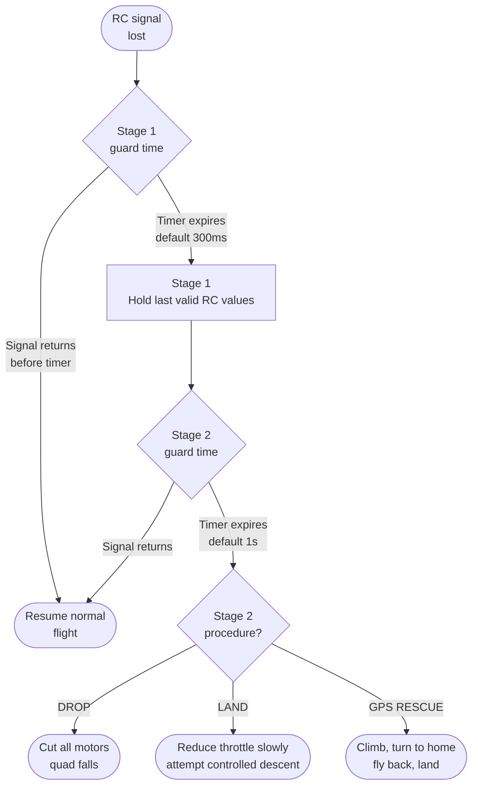

Failsafe is what happens when the RC link dies mid-flight. Without correct configuration, a link-loss event sends the quad flying away at full throttle or drops it like a stone. Neither is good.

---

## Two-Stage Failsafe

Betaflight uses a two-stage system:



**Stage 1** absorbs momentary glitches. During Stage 1 the FC holds the last known stick positions — the quad keeps flying as it was. This buys time for the link to recover.

**Stage 2** activates after a longer outage and executes the configured procedure.

---

## Receiver-Side Failsafe

The **receiver itself** must also be configured to output a failsafe condition — not just hold last values forever. If the receiver keeps sending "last known position" indefinitely, Betaflight never detects a link loss.

Most modern receivers have two modes:
- **Hold** — output last valid values (dangerous: Betaflight never triggers failsafe)
- **No pulses / failsafe values** — output zero signal or pre-set custom values

Configure the receiver to output **no pulses** or its own failsafe position. On ELRS receivers this is automatic — ELRS outputs the failsafe position from the binding configuration when the link drops.

---

## Betaflight Configuration

Configurator → **Failsafe** tab:

```
# Stage 1
set failsafe_delay = 4         # 4 × 0.1s = 400ms guard time before Stage 1
set failsafe_off_delay = 10    # 10 × 0.1s = 1s before Stage 2

# Stage 2 procedure
set failsafe_procedure = GPS-RESCUE  # or DROP or LAND

# Throttle value during LAND procedure (0–2000)
set failsafe_throttle = 1300   # slightly below hover

# Minimum throttle during landing approach
set failsafe_throttle_low_delay = 100  # 10s at low throttle before disarm
```

---

## Stage 2 Procedure Comparison

```chart
{
  "type": "bar",
  "data": {
    "labels": ["DROP", "LAND", "GPS RESCUE"],
    "datasets": [
      {
        "label": "Safe for flying over people",
        "data": [0, 4, 7],
        "backgroundColor": "rgba(239,68,68,0.7)"
      },
      {
        "label": "Quad recovery rate",
        "data": [1, 5, 9],
        "backgroundColor": "rgba(34,197,94,0.7)"
      },
      {
        "label": "Setup complexity",
        "data": [1, 3, 8],
        "backgroundColor": "rgba(59,130,246,0.7)"
      }
    ]
  },
  "options": {
    "responsive": true,
    "plugins": {
      "title": { "display": true, "text": "Stage 2 Failsafe Procedure Trade-offs (1=low, 10=high)" },
      "legend": { "position": "bottom" }
    },
    "scales": {
      "y": { "beginAtZero": true, "max": 10 }
    }
  }
}
```

**DROP** — immediately cuts all motors. The quad falls straight down from wherever it is. Use only when flying low over soft ground — it will destroy the quad but it won't fly away.

**LAND** — reduces throttle to a set level and descends slowly. Works at low altitude in calm conditions; unreliable in wind or at altitude.

**GPS RESCUE** — the best option when GPS is available. Climbs, turns toward home, flies back, and lands. See [GPS Rescue Configuration](../gps-rescue/).

---

## Arming Checks Related to Failsafe

Betaflight blocks arming if failsafe configuration is incomplete:

```
# In CLI, run:
status

# Look for arming flags like:
# NOGYRO, RXLOSS, FAILSAFE, BADVIBES, etc.

# If RXLOSS is shown:
# - RC link is not connected
# - Receiver failsafe is active (check RX config)
# - UART not configured correctly for the RX protocol
```

---

## Checklist Before Every Flight

- [ ] Arm switch in DISARM position before powering on
- [ ] Fly far enough away that you have a few seconds of warning before Stage 2 triggers
- [ ] Know which direction "home" is — GPS Rescue flies toward arming point
- [ ] Test Stage 1 on the ground: kill TX power for 300ms, quad should hold position; restore power
- [ ] Never trust failsafe at less than 10m altitude — even GPS Rescue needs climb time

---

## Notes

- ELRS defaults to outputting failsafe values on link loss if set during binding. Verify by killing the TX and confirming the Receiver tab in Configurator shows channel values changing to the failsafe position.
- "No pulses" failsafe output is preferred over "hold" — it guarantees Betaflight detects the loss within the Stage 1 guard window.
- Failsafe is not a substitute for not flying out of range. It is a last resort.
