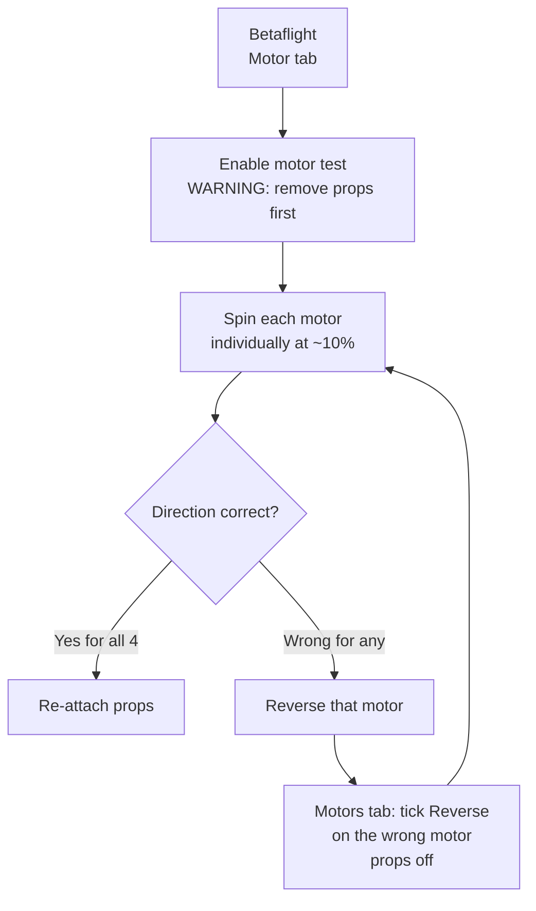
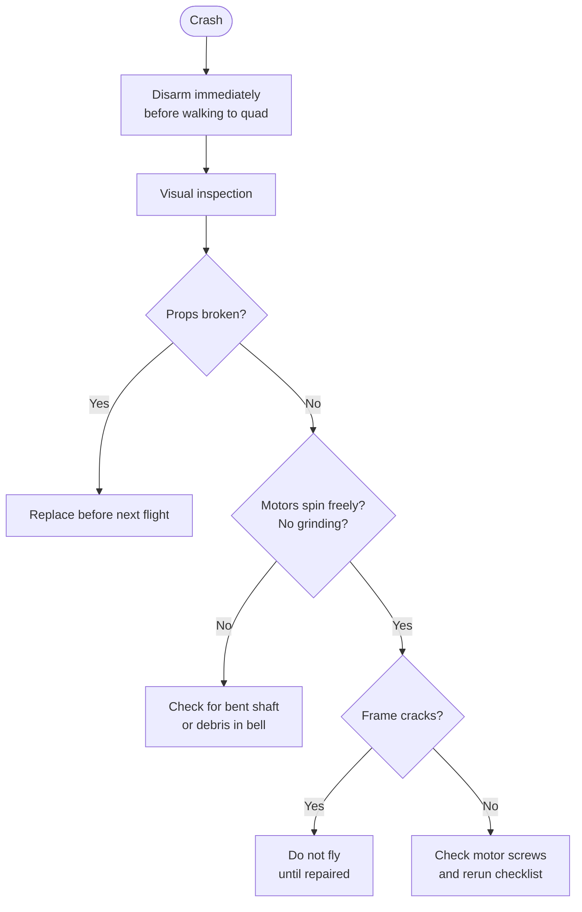

Metodiškas priešskrydžio patikrinimas užkerta kelią dažniausioms kritimų priežastims: neteisingai motorų krypčiai, atsilaisvinusiems propams, negyvam imtuvo ryšiui ir arm vėliavoms. Penkios minutės prieš kiekvieną sesiją, o ne tik prieš pirmą buildo skrydį — nuobodu, žinau, bet daug nuobodžiau vaikščioti ieškant nuolaužų.

---

## Pilnas sąrašas

### 1 — Baterija ir maitinimas

- [ ] Celių įtampos subalansuotos (viena nuo kitos ne daugiau kaip 0.05V skirtumas be apkrovos)
- [ ] Pakas įkrautas iki tikslinės įtampos (4.20V/celei pilnas, 4.35V/celei HV pakams)
- [ ] XT60/XT30 jungtis švari — jokių apdegusių ar korozuotų kontaktų
- [ ] Baterijos dirželis įtemptas; pakas negali pasislinkti nuo skrydžio apkrovų
- [ ] Jokio pūtimosi pake (matomai išsipūtusios celės = išimk iš naudojimo)

### 2 — Rėmas ir aparatūra

- [ ] Visi varžtai priveržti — motorų varžtai, šakų varžtai, standoff'ai, stack'o varžtai
- [ ] Propai priveržti ir iki galo užsėdę ant veleno
- [ ] Teisinga propų rotacija: **Props In** (vidinė briauna priekyje) arba **Props Out** — atitinka tavo motorų krypties nustatymą
- [ ] Jokių įtrūkimų šakose ar rėmo plokštėse (patikrink po bet kokio kritimo)
- [ ] Kameros kampas fiksuotas; jokio atsilaisvinusio pasukimo varžto

### 3 — Motorų kryptis

Tai pati dažniausia laidinimo klaida, sukelianti akimirksninį apsivertimą per pirmą pakilimą.



**Standartinis Betaflight išdėstymas (Props In / Butterflight stiliaus):**

| Motoras | Pozicija        | Kryptis   |
|-------|-----------------|-----------|
| M1    | Galinis dešinys | CCW       |
| M2    | Priekinis dešinys | CW      |
| M3    | Galinis kairys  | CW        |
| M4    | Priekinis kairys | CCW      |

**Testuok be propų. Visada.**

### 4 — RC ryšys

- [ ] Siųstuvas įjungtas PRIEŠ prijungiant bateriją
- [ ] ELRS/imtuvo LED dega pastoviai (susietas) — ne mirksi (ieško)
- [ ] Pajudink visus stick'us ir jungiklius; patikrink atsaką Betaflight Receiver tab'e
- [ ] Throttle nulyje prieš arm
- [ ] ARM jungiklis disarm padėtyje įjungiant maitinimą

### 5 — Betaflight arm vėliavos

Prijunk USB (lauke neprivaloma — naudok Betaflight app, jei yra) ir patikrink:

```
# In CLI:
status

# Arming prevention flags to resolve:
# RXLOSS    → receiver not connected / failsafe active
# NOGYRO    → IMU not detected (hardware fault)
# CALIB     → IMU still calibrating (wait ~10s after powerup)
# ANGLE     → Angle mode active but accelerometer not calibrated
# BADVIBES  → excessive vibration on IMU
# ARMSWITCH → ARM switch not in disarm position
```

Jei neturi USB prieigos, stebėk motorus ir OSD. Dauguma arm vėliavų rodomos OSD, jei sukonfigūruota.

### 6 — OSD ir vaizdas

- [ ] FPV akiniai gauna signalą; OSD matomas
- [ ] Baterijos įtampa rodoma OSD (sveiko proto patikra — turi atitikti paką)
- [ ] GPS palydovų skaičius (jei yra) — palauk pakankamos fiksacijos
- [ ] VTX ant teisingo kanalo šiai sesijai (venk konfliktų su kitais pilotais)

### 7 — Galutinis patikrinimas

- [ ] Skrydžio vieta legali: oro erdvė leidžiama, jokių ribojamų zonų virš galvos
- [ ] Žmonės pasitraukę nuo pakilimo zonos
- [ ] Rankinė propų patikra: pasuk kiekvieną propą ranka, patikrink, ar priveržti ir teisingos rotacijos
- [ ] Pirmas pasukimas: arm ant mažo throttle, patikrink, ar dronas pakyla lygiai — ne apsiverčia, ne pasvyra

---

## Po kiekvieno kritimo



Kritimas, kuris pasirodė nekaltas ant didelio throttle, gali nematomai sulenkti motoro veleną. Pasuk kiekvieną motorą ranka ir pajusk, ar nėra šiurkštaus guolio ar liuftavimo, prieš vėl skrisdamas (tą patyriau — atrodė gerai, kol antrą kartą nepakilo).

---

## Greita lauko kortelė (atsispausdink/nusifotografuok)

```
PRE-FLIGHT:
□ Battery: balanced, charged, strap tight
□ Props: tight, correct rotation
□ Motors: tested direction (remove props first!)
□ RC link: bound, all controls responding
□ ARM switch: DISARM position at powerup
□ OSD: voltage showing, GPS locked (if applicable)
□ Airspace: clear and legal

POST-CRASH:
□ Disarm before walking out
□ Props: check for chips or cracks
□ Motors: spin by hand — smooth and free?
□ Frame: no cracks in arms or plates
□ Battery: not puffed
□ Screws: check motor screws
```
