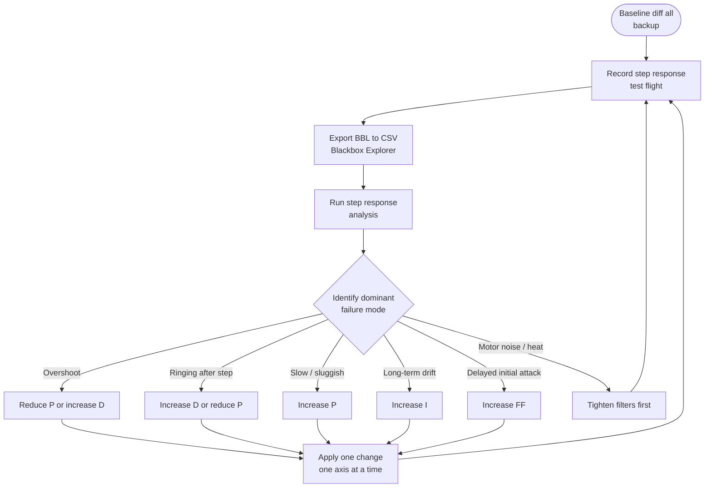
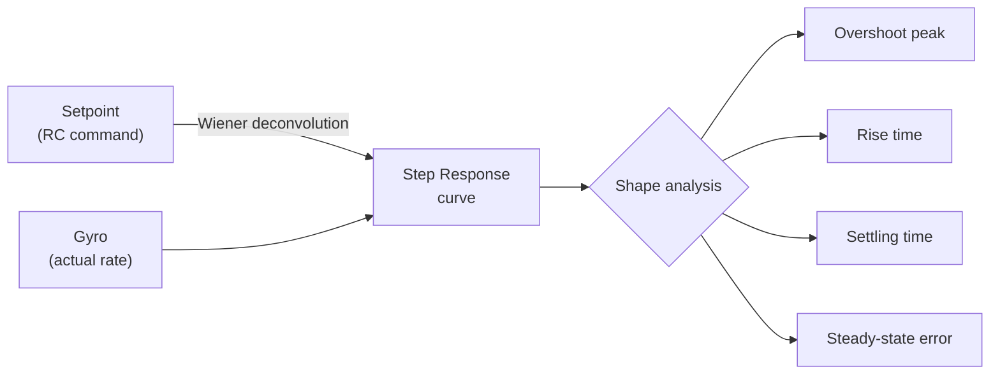
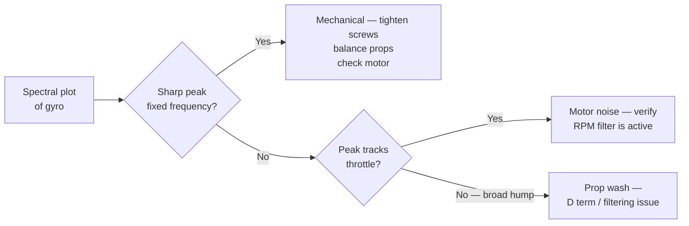
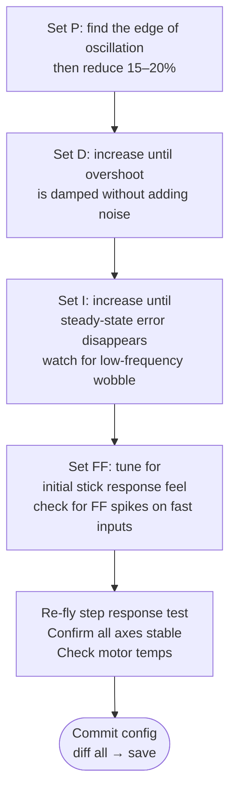

Struktūrizuotas, blackbox paremtas PID derinimo protokolas, pagrįstas step response analize. Išvestas iš metodologijos, įgyvendintos [PIDtoolbox](https://github.com/bw1129/PIDtoolbox) (Brian White, MATLAB), ir pritaikytas iteraciniam naudojimui lauke. Protokolui reikia `.bbl` log'o iš specialiai tam skirto testinio skrydžio; nebandyk derinti iš freestyle ar racing sesijos log'o — įvesties signalai per daug netaisyklingi. Taip, žinau, skristi „nuobodžiai“ tyčia yra sunkiau, nei atrodo — bet duomenys už tai atsidėkoja.

---

## Apžvalga



**Prieš liesdamas PID'us: įsitikink, kad tavo filtrai sukonfigūruoti teisingai.** Aukšti P gain'ai ant triukšmingo, nepakankamai filtruoto drono sukuria oscilaciją, kuri atrodo lygiai kaip P-per-didelis simptomas. Visada analizuok variklių kreives ir spektrinį triukšmo lygį prieš darydamas išvadą, kad reikia PID korekcijos.

---

## 1 žingsnis — Padaryk dabartinės konfigūracijos atsarginę kopiją

```
# In Betaflight CLI:
diff all
# Save output to a timestamped file before any change
# e.g.: build-name_2026-07-13_pre-tune.txt
```

Pilną eigą žiūrėk [CLI Backup and Restore](../../setup-safety/cli-backup-restore/).

---

## 2 žingsnis — Įrašyk tinkamą testinį skrydį

Step response testinis skrydis **nėra** normalus skraidymas. Tikslas — sugeneruoti švarias, kartotines greitas stick'o įvestis kiekvienoje ašyje atskirai.

### Manevrų protokolas

| Ašis | Įvestis | Aprašymas |
|------|-------|-------------|
| Roll | Greiti kairė–dešinė atlenkimai | Pilnas atlenkimas į vieną pusę, grįžimas į centrą, priešingas pilnas atlenkimas. ~0,5–1 s į kryptį. |
| Pitch | Greiti pirmyn–atgal atlenkimai | Tas pats modelis, švariame lygiame skrydyje. |
| Yaw | Greitas kairė–dešinė vairas | Lėčiau nei roll/pitch — yaw daugumoje build'ų yra per silpnai valdomas. |

**Kiekvieną ašį daryk atskirai savame log'o segmente arba bent jau padaryk pauzę tarp ašių.** Vienalaikių įvesčių maišymas sugadina step response analizę.

### Skrydžio sąlygos

- Kabėjimo aukštis 5–10 m ramiame ore (vėjas gadina analizę)
- Pastovus gazas įvesčių metu — gazo pokyčiai keičia kabėjimo tašką ir teršia duomenis
- Arms įjungti, Air Mode įjungtas
- Blackbox pilnu rate (denom = 1) arba puse rate (denom = 2) — žr. [Blackbox Logging](../blackbox-logging/)

### BBL nustatymai derinimo sesijoms

```
# Enable high-rate logging for tuning:
set blackbox_sample_rate = 1/2   # or 1/1 for max resolution
set blackbox_device = SPIFLASH   # or SDCARD if available

# Fields to ensure are logged:
set blackbox_disable_pids = OFF
set blackbox_disable_setpoint = OFF
set blackbox_disable_gyroraw = OFF
set blackbox_disable_motor = OFF
save
```

---

## 3 žingsnis — Eksportas iš Blackbox Explorer

1. Atidaryk Betaflight Blackbox Explorer, įkelk `.bbl` failą
2. Identifikuok švarius step response segmentus — ieškok ašių įvesčių vizualiai
3. Pasirink reikiamą segmentą (venk arming pereinamųjų procesų, nusileidimo ar crash'ų)
4. Eksportuok: **File → Export CSV**
5. Užsirašyk, kuris log numeris atitinka kurią ašį / tune iteraciją

---

## 4 žingsnis — Step response analizė

Step response apskaičiuojamas per Wiener dekonvoliuciją gyro atsako prieš setpoint. Rezultatas — kreivė, rodanti, kaip faktinis sukimosi rate laike seka užsakytą sukimosi rate.



### Tikslinė step response forma

```chart
{
  "type": "line",
  "data": {
    "labels": ["0","10","20","30","40","50","60","70","80","90","100","110","120","130","140","150"],
    "datasets": [
      {
        "label": "Ideal / well tuned",
        "data": [0,0.35,0.72,0.95,1.05,1.04,1.02,1.01,1.00,1.00,1.00,1.00,1.00,1.00,1.00,1.00],
        "borderColor": "rgba(34,197,94,1)",
        "backgroundColor": "transparent",
        "borderWidth": 2.5,
        "tension": 0.3,
        "pointRadius": 0
      },
      {
        "label": "P too high (overshoot + ringing)",
        "data": [0,0.42,0.90,1.25,1.20,1.10,1.18,1.08,1.13,1.05,1.08,1.02,1.04,1.01,1.02,1.00],
        "borderColor": "rgba(239,68,68,1)",
        "backgroundColor": "transparent",
        "borderWidth": 2,
        "tension": 0.3,
        "borderDash": [5,3],
        "pointRadius": 0
      },
      {
        "label": "P too low (slow, undershoots)",
        "data": [0,0.18,0.40,0.60,0.76,0.86,0.93,0.97,0.99,1.00,1.00,1.00,1.00,1.00,1.00,1.00],
        "borderColor": "rgba(249,115,22,1)",
        "backgroundColor": "transparent",
        "borderWidth": 2,
        "tension": 0.3,
        "borderDash": [4,2],
        "pointRadius": 0
      },
      {
        "label": "D too low (overshoot, slow settle)",
        "data": [0,0.38,0.78,1.10,1.18,1.14,1.08,1.05,1.03,1.02,1.01,1.00,1.00,1.00,1.00,1.00],
        "borderColor": "rgba(168,85,247,1)",
        "backgroundColor": "transparent",
        "borderWidth": 2,
        "tension": 0.3,
        "borderDash": [6,2],
        "pointRadius": 0
      },
      {
        "label": "I too low (steady-state error)",
        "data": [0,0.35,0.72,0.96,1.05,1.03,1.01,1.00,0.97,0.95,0.93,0.91,0.90,0.90,0.90,0.90],
        "borderColor": "rgba(234,179,8,1)",
        "backgroundColor": "transparent",
        "borderWidth": 2,
        "tension": 0.3,
        "borderDash": [3,2],
        "pointRadius": 0
      }
    ]
  },
  "options": {
    "responsive": true,
    "interaction": { "mode": "index", "intersect": false },
    "plugins": {
      "title": { "display": true, "text": "Step Response Shapes — Diagnosis Guide (normalized, t in ms)" },
      "legend": { "position": "bottom" }
    },
    "scales": {
      "x": { "title": { "display": true, "text": "Time (ms)" } },
      "y": {
        "min": 0,
        "max": 1.35,
        "title": { "display": true, "text": "Normalized rate response" }
      }
    }
  }
}
```

### Step response skaitymas

| Forma | Diagnozė | Pagrindinis sprendimas |
|-------|-----------|------------|
| Overshoot >10%, oscilliuoja atgal | P per didelis | Sumažink P 10–15% |
| Overshoot yra, bet nusistovi švariai, tik lėtai | D per mažas | Padidink D 10% |
| Lėtas kilimas, be overshoot, vangu | P per mažas | Padidink P 10–15% |
| Kyla greitai, milžiniškas overshoot, tęstinis ringing | P per didelis IR D per mažas | Pirma sumažink P, tada įvertink D |
| Gera forma analizėje, bet ringing freestyle metu | Triukšmo / filtro problema | Pirma patikrink variklių triukšmo spektrą |
| Steady-state error: atsakas nusistovi ties 0,92, o ne 1,0 | I per mažas | Padidink I 10–20% |
| Uždelstas kilimo startas (vėlinimas, kol prasideda atsakas) | FF per mažas | Padidink FF 10% |

---

## 5 žingsnis — Spektrinė analizė (triukšmo patikra)

Prieš bet kokią PID korekciją paleisk spektrinę analizę gyro ir variklių kreivėms. Ieškok:

- **Prop wash dažnis**: tipiškai 100–300 Hz, priklausomai nuo rėmo/propellerio dydžio. Platus kupstas gyro spektre.
- **Variklių triukšmas**: aštrūs pikai virš 300 Hz. RPM filtras čia turi įdėti notch'us.
- **ESC perjungimo triukšmas**: virš 1 kHz. Low-pass filtras turi su tuo susitvarkyti.
- **Mechaninis rezonansas**: aštrus siauras pikas ties fiksuotu dažniu, nepriklausomai nuo gazo. Patikrink variklių varžtus, propellerių balansą.



Prie PID korekcijos pereik tik tada, kai triukšmo lygis švarus arba suprastas.

---

## 6 žingsnis — Derinimo eiliškumas

Laikykis šios tvarkos. Nešok prie I ar FF, kol P ir D nėra stabilūs.



**Ašių tvarka**: pirma Roll (jautriausia), tada Pitch, tada Yaw. Roll ir Pitch simetriškuose rėmuose dažnai gali dalintis PID reikšmėmis — patikrink nustatęs abi.

---

## 7 žingsnis — Variklių temperatūros patikra

Po bet kokio PID pakeitimo pakabink 2–3 minutes ir iškart patikrink variklių temperatūras — pirštu, iškart po nusileidimo (na, ne visai delnu ant variklio, jei D tikrai per aukštas):

- **< 50°C** — saugu; PID'ai protingi
- **50–65°C** — šilta; D ar filtrai gali būti per agresyvūs, generuojantys perteklinį variklių aktyvumą
- **> 65°C** — karšta; sumažink D arba peržiūrėk filtrų cutoff'us prieš skrisdamas toliau

Variklius reikia tikrinti ta pačia tvarka (M1–M4) kiekvieną kartą. Jei vienas variklis kaista ženkliai labiau nei kiti, ta petis gali turėti vibraciją ar minkštą variklio tvirtinimą — spręsk mechaniškai prieš priskirdamas tai PID'ams.

---

## Nuorodos

- **PIDtoolbox** (Brian White): [github.com/bw1129/PIDtoolbox](https://github.com/bw1129/PIDtoolbox) — MATLAB įgyvendinimas step response analizei ir spektriniams įrankiams, iš kurio išvestas šis protokolas. Veikia MATLAB arba GNU Octave.
- **Betaflight Blackbox Explorer**: [github.com/betaflight/blackbox-log-viewer](https://github.com/betaflight/blackbox-log-viewer)
- **Rylo** — DI paremta BBL analizė: pasidalink savo `.bbl` log'u ir gauk step response, spektrinę diagnozę bei PID rekomendacijas be MATLAB. → [app.sintra.ai/community/helpers/rylo](https://app.sintra.ai/community/helpers/rylo)
- Susiję snippet'ai: [Blackbox Logging](../blackbox-logging/), [PID Basics](../pid-basics/), [CLI Backup and Restore](../../setup-safety/cli-backup-restore/), [Tuning Flight Protocol](../tuning-flight-protocol/), [Wobble-Test PID Protocol](../pid-tuning-wobble-test/)
