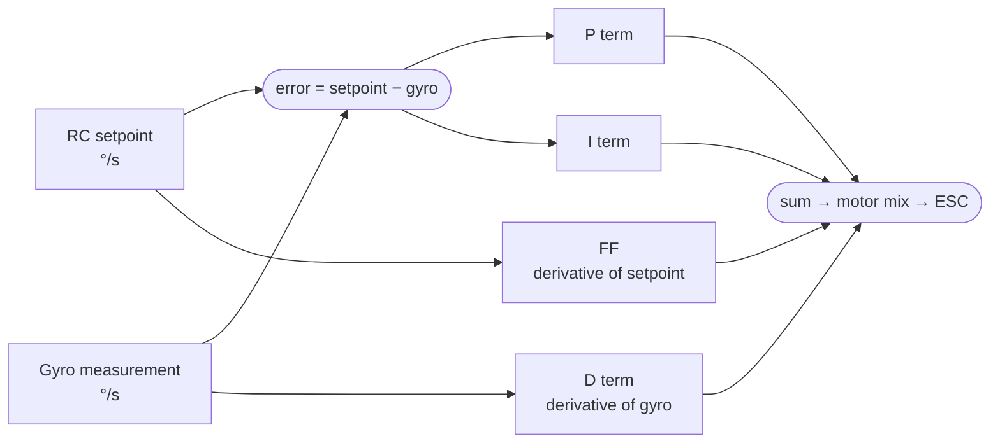

Kas vyksta Betaflight viduje, kai pastumi slankiklį. Čia pateiktos formulės išvestos iš `pid.c` Betaflight šaltinio kode. Suprasti matematiką reiškia, kad konfigūratoriaus slankikliai tampa nuspėjami, o ne mistiniai (o iki tol aš juos stumdydavau maždaug kaip radijo imtuvo rankenėles — kol nuskamba).

---

## PID valdymo kilpa



Kilpa sukasi gyro sample rate greičiu (tipiškai 8 kHz su ICM-42688-P). Kiekvienas terminas skaičiuojamas laipsnių-per-sekundę erdvėje ir susumuojamas prieš paverčiant jį variklių komandomis per mixer'į.

---

## P terminas — Proportional

**Formulė:**
```
error = setpoint − gyro_rate     [°/s]
P     = Kp × error
```

P reaguoja į dabartinį error. Pastumus P slankiklį, tiesiogiai skaliuojamas `Kp`.

| P reikšmė | Efektas |
|---------|--------|
| Per didelė | Greita ataka, bet oscilacija po nusistovėjimo — variklių „buzz“ |
| Teisinga | Aštrus atsakas, švariai nusistovi |
| Per maža | Vangu — dronas niekada nepasiekia užsakyto rate |

P taikomas error (setpoint − gyro). Kadangi **setpoint yra įtrauktas**, P sukuria „derivative kick“, kai setpoint šokteli. Būtent todėl D terminas sąmoningai taikomas vien gyro, o ne error — žr. žemiau.

---

## D terminas — Derivative

**Formulė:**
```
D = −Kd × d(gyro_rate)/dt
```

D — tai **vien gyro matavimo išvestinė**, o ne error. Tai daroma sąmoningai. Jei D būtų taikomas error, kiekviena stick'o įvestis sukeltų didelį D spike, nes setpoint keičiasi akimirksniu, o gyro — ne. Taikant D tik gyro, D reaguoja tik į realų sukimosi pagreitį, o ne į užsakytus šuolius.

Minuso ženklas atsiranda todėl, kad D priešinasi gyro rate pokyčiams: kai dronas greitėja link setpoint, D jį stabdo; kai jis peršoka, D stabdo grįžimą atgal.

> **D yra slopinimo terminas.** Jis neleidžia P terminui peršokti ir oscilliuoti. P/D balansas nulemia uždaros kilpos atsako slopinimo koeficientą.

D yra low-pass filtruojamas (dviejų pakopų, konfigūruojamas per `dterm_lpf1_hz` ir `dterm_lpf2_hz`), kad nebūtų sustiprintas gyro triukšmas. Per didelis D be tinkamo filtravimo sukuria būdingą aukšto dažnio oscilaciją ir variklių kaitimą.

---

## I terminas — Integral

**Formulė:**
```
I += Ki × error × dt
```

I kaupia error laike. Jei dronas turi nuolatinį error (pvz., nosį pučia vėjas ir ji niekada nepasiekia užsakyto rate), I galiausiai tampa pakankamai didelis, kad jį įveiktų. I koreguoja **steady-state error** — vien P ir D terminai visada turės kažkiek liekamojo error, nes error artėjant prie nulio, grąžinamoji jėga irgi artėja prie nulio.

### Anti-windup

I yra apribojamas iki `±PID_MAX_I`, kad būtų išvengta „windup“ — situacijos, kai I išaugo labai didelis (pvz., įsibėgėjimo ar flip'o metu) ir tada nustumia droną toli už taikinio, kai jis grįžta.

### iterm_relax

Darant greitas stick'o įvestis, I terminas gali „prisikrauti“, nes gyro reikia laiko pasiekti užsakytą rate flip'o metu. Šis papildomas krūvis sukelia **bounce-back** manevro pabaigoje. `iterm_relax` slopina I integravimą greitų įvesčių metu:

```
setpoint_hf   = |setpoint − low_pass_filtered(setpoint)|
relax_factor  = max(0, 1 − setpoint_hf / relax_threshold)
I            += Ki × error × dt × relax_factor
```

Kai stick'as juda greitai (`setpoint_hf` didelis), `relax_factor` krenta link 0 ir I nustoja kauptis. `iterm_relax_cutoff` parametras valdo slenksčio dažnį — didesnės reikšmės agresyviau slopina I greitų manevrų metu.

| Build dydis | iterm_relax_cutoff |
|------------|-------------------|
| 2–5" | 15 |
| 7" | 8 |
| 10"+ | 5 |

### anti_gravity

Staigiai numetus gazą, dronas linkęs šiek tiek pasukti pitch/roll, nes keliamosios jėgos ir svorio balansas staiga pasikeičia. `anti_gravity` laikinai pastiprina I terminą tam kompensuoti:

```
I_boost = I × (1 + anti_gravity_gain × |throttle_delta|)
```

Taikoma visada, kai `|d(throttle)/dt|` viršija jautrumo slenkstį. Tai laiko nosį lygią įvažiuojant į split-S ir išeinant iš dive'ų.

---

## Feedforward (FF)

**Formulė:**
```
FF = Kf × d(setpoint)/dt
```

FF yra proporcingas tam, **kaip greitai juda stick'as**, o ne kur jis yra. Jis numato, kokio variklių atsako reikės stick'o įvesčiai, ir įleidžia jį iškart, prieš P terminui spėjant sureaguoti į susidariusį error.

**Efektas:** FF pašalina vėlinimą tarp stick'o įvesties ir pradinio drono atsako. Aukštas FF = dronas reaguoja dar prieš atsiliekant — aštresnis pojūtis. Per daug FF = nervinga, spike'ai paleidus stick'ą.

> Nustatyk FF į 0 visiems derinimo duomenų skrydžiams. FF įleidžia savo laiko artefaktą į step response kreivę, todėl P/D analizė tampa nepatikima.

FF taip pat turi glotninimo filtrą (`ff_smooth_factor`), kuris low-pass filtruoja setpoint išvestinę, kad triukšmo spike'ai nevirstų variklių komandomis.

---

## Modeliuojamas step response: P, D, I, FF indėliai

```chart
{
  "type": "line",
  "data": {
    "labels": ["0","5","10","15","20","25","30","40","50","60","70","80","100","120","150"],
    "datasets": [
      {
        "label": "P only — underdamped, oscillates",
        "data": [0,0.28,0.73,1.12,1.24,1.17,1.12,1.08,1.10,1.06,1.04,1.01,1.01,1.00,1.00],
        "borderColor": "rgba(239,68,68,1)",
        "backgroundColor": "transparent",
        "borderWidth": 2,
        "borderDash": [6,3],
        "tension": 0.3,
        "pointRadius": 0
      },
      {
        "label": "P + D — damped, ~7% steady-state error",
        "data": [0,0.27,0.70,1.01,1.06,1.04,1.01,0.98,0.95,0.93,0.93,0.93,0.93,0.93,0.93],
        "borderColor": "rgba(249,115,22,1)",
        "backgroundColor": "transparent",
        "borderWidth": 2,
        "borderDash": [4,3],
        "tension": 0.3,
        "pointRadius": 0
      },
      {
        "label": "P + I + D — ideal tracking",
        "data": [0,0.27,0.70,1.01,1.06,1.04,1.01,1.00,1.00,1.00,1.00,1.00,1.00,1.00,1.00],
        "borderColor": "rgba(34,197,94,1)",
        "backgroundColor": "transparent",
        "borderWidth": 2.5,
        "tension": 0.3,
        "pointRadius": 0
      },
      {
        "label": "P + I + D + FF — faster initial attack",
        "data": [0,0.45,0.88,1.07,1.08,1.04,1.01,1.00,1.00,1.00,1.00,1.00,1.00,1.00,1.00],
        "borderColor": "rgba(99,102,241,1)",
        "backgroundColor": "transparent",
        "borderWidth": 2.5,
        "tension": 0.3,
        "pointRadius": 0
      }
    ]
  },
  "options": {
    "responsive": true,
    "interaction": { "mode": "index", "intersect": false },
    "plugins": {
      "title": { "display": true, "text": "Step Response: effect of each PID term (simulated, normalized)" },
      "legend": { "position": "bottom" }
    },
    "scales": {
      "x": { "title": { "display": true, "text": "Time after input (ms)" } },
      "y": {
        "min": 0,
        "max": 1.35,
        "title": { "display": true, "text": "Normalized rotation rate (1.0 = setpoint)" }
      }
    }
  }
}
```

---

## Slankiklis → neapdorota reikšmė (BF 4.3+ Tuning skirtukas)

Betaflight 4.3+ pakeitė tiesioginį P/I/D skaičių įvedimą slankikliais. Suprasti šį atvaizdavimą padeda išvengti painiavos:

| Slankiklis | Ką jis skaliuoja | Efektas |
|--------|---------------|--------|
| **Master Multiplier** | Visus P, I, D kartu | Proporcingai garsiau ar tyliau bendrai |
| **PD Balance** | P:D santykį (pastovi sandauga) | Perkelia energiją tarp P ir D nekeičiant bendro gain'o |
| **PD Gain** | P ir D kartu | Didina/mažina agresyvumą |
| **Stick Response / FF** | Feedforward Kf | Reguliuoja stick'o aštrumą; nustatyk į 0 duomenų skrydžiams |
| **Dynamic Damping** (D Max) | d_max lubas | Žr. d_min / d_max žemiau |

Neapdorotos reikšmės vis dar pasiekiamos per CLI (`set roll_p`, `set roll_i`, `set roll_d`). Konfigūratorius jas apskaičiuoja iš slankiklių pozicijų. Po rankinio PID pakeitimo per CLI slankikliai gali nebeatspindėti faktinių reikšmių — visada patikrink CLI.

---

## TPA — Throttle PID Attenuation

Esant dideliam gazui, varikliai gamina gerokai daugiau sukimo momento vienam komandos vienetui nei kabant vietoje. Be kompensacijos, PID'ai, kurie jaučiasi teisingi kabant, bus per daug atsakingi esant pilnam gazui — sukels oscilaciją ir variklių kaitimą greituose skrydžiuose.

**Formulė:**
```
tpa_factor = 1 − tpa_rate × max(0, (throttle − breakpoint) / (1 − breakpoint))
P_effective = P × tpa_factor
```

`set tpa_rate = 50` → 50% sumažinimas esant pilnam gazui. `set tpa_breakpoint = 1650` → slopinimas prasideda ties 65% gazo. (Tai iliustracinės reikšmės; realios numatytosios priklauso nuo Betaflight versijos.)

```chart
{
  "type": "line",
  "data": {
    "labels": ["0%","10%","20%","30%","40%","50%","60%","65%","70%","75%","80%","85%","90%","95%","100%"],
    "datasets": [
      {
        "label": "TPA disabled",
        "data": [1.0,1.0,1.0,1.0,1.0,1.0,1.0,1.0,1.0,1.0,1.0,1.0,1.0,1.0,1.0],
        "borderColor": "rgba(107,114,128,1)",
        "backgroundColor": "transparent",
        "borderWidth": 1.5,
        "borderDash": [4,3],
        "tension": 0,
        "pointRadius": 0
      },
      {
        "label": "TPA 30% mild (tpa_rate=30)",
        "data": [1.0,1.0,1.0,1.0,1.0,1.0,1.0,1.0,0.957,0.914,0.871,0.829,0.786,0.743,0.70],
        "borderColor": "rgba(249,115,22,1)",
        "backgroundColor": "transparent",
        "borderWidth": 2,
        "tension": 0.2,
        "pointRadius": 0
      },
      {
        "label": "TPA 50% default (tpa_rate=50)",
        "data": [1.0,1.0,1.0,1.0,1.0,1.0,1.0,1.0,0.929,0.857,0.786,0.714,0.643,0.571,0.50],
        "borderColor": "rgba(34,197,94,1)",
        "backgroundColor": "transparent",
        "borderWidth": 2.5,
        "tension": 0.2,
        "pointRadius": 0
      }
    ]
  },
  "options": {
    "responsive": true,
    "interaction": { "mode": "index", "intersect": false },
    "plugins": {
      "title": { "display": true, "text": "TPA: P gain multiplier vs throttle position (breakpoint = 65%)" },
      "legend": { "position": "bottom" }
    },
    "scales": {
      "x": { "title": { "display": true, "text": "Throttle %" } },
      "y": {
        "min": 0.4,
        "max": 1.05,
        "title": { "display": true, "text": "P gain multiplier" }
      }
    }
  }
}
```

> **2" ripper pastaba:** maži propelleriai turi labai aukštą RPM ir agresyviau reaguoja į komandų pokyčius. Pradėk nuo tpa_rate=60 (60% sumažinimas), breakpoint=60%.

---

## d_min / d_max

Standartinis D yra fiksuota reikšmė. `d_min` ir `d_max` leidžia D dinamiškai kisti priklausomai nuo stick'o įvesties greičio:

```
stick_velocity = |d(setpoint)/dt|
d_boost        = clamp(stick_velocity / d_min_boost_gain, 0, 1)
D_effective    = d_min + (d_max − d_min) × d_boost
```

- **Kabant vietoje / esant pastoviam rate**: stick_velocity ≈ 0 → `D_effective = d_min` (mažesnis D → mažiau variklių kaitimo)
- **Greito manevro metu**: stick_velocity aukštas → `D_effective` kyla link `d_max` (daugiau slopinimo įvesčiai)

Taip gauni geriausią iš abiejų pusių: sumažintą D triukšmą ir kaitimą kruizuojant, bet pilną D slopinimą agresyvių įvesčių metu.

**CLI komandos:**
```
set d_min_roll = 20    # base D (applied at rest)
set d_roll = 30        # D_max — the peak D reached at high stick velocity
```

Nustatyk `d_min_roll` lygų `d_roll` (abu = tavo D reikšmei), kad išjungtum dinaminį D diapazoną ir skristum su fiksuotu D — būtina švariems derinimo duomenų skrydžiams. Taip, tai reiškia, kad prieš loginant reikės tą fiksuotą D vėl atsukti atgal; pamiršti šitą žingsnį — tradicija, kurią atlieku maždaug kas antrą sesiją.

---

## RPM filtras

RPM filtras įdeda dinaminį notch ties kiekvieno variklio sukimosi dažniu ir jo harmonikomis:

```
motor_rpm      = motor_eRPM / (poles / 2)   # eRPM telemetry → mechanical RPM
fundamental_hz = motor_rpm / 60
notch_n        = fundamental_hz × n         # n = 1, 2, 3 — harmonics
```

(`eRPM`, pranešamas per dvikryptį DSHOT, yra *elektrinis* RPM; padalijus iš polių porų skaičiaus, gaunamas mechaninis sukimosi dažnis, kurį seka notch'ai.)

Filtras seka realiu laiku, naudodamas eRPM telemetriją iš dvikrypčio DSHOT. Tai pašalina variklių triukšmą, kuris kitaip prasiskverbtų į D terminą ir pasireikštų kaip oscilacija.

**Minimalaus dažnio apsauga:**
```
set rpm_filter_min_hz = lowest_expected_motor_Hz − 25
```

Žemiau šio dažnio RPM filtras išjungiamas, kad neįdėtų notch'ų į tą diapazoną, kuriame gyvena gyro skrydžio dinamika. Per maža reikšmė → filtras pašalina naudingą valdymo informaciją.

| Build | Minimalus Hz | Priežastis |
|-------|-----------|-----------|
| 2" | 150 | Variklių fundamentai kabant ~200 Hz |
| 3" | 100 | Variklių fundamentai kabant ~150 Hz |
| 5" | 80 | Variklių fundamentai kabant ~120 Hz |
| 7"+ | 60 | Didesni propelleriai, mažesnis RPM |

**Reikalauja:** įjungto dvikrypčio DSHOT, ESC firmware, palaikančio RPM telemetriją (BLHELI_32, AM32, BLHELI_S su BlueJay).

---

## Greita nuoroda

| Terminas | Ką pataiso | Ką daro perteklius |
|------|--------------|-------------------|
| P | Vangumą, steady-state error | Oscilaciją po įvesčių |
| I | Ilgalaikį dreifą, vėjo korekciją | Žemo dažnio wobble, pogo keičiant gazą |
| D | Overshoot, per silpną slopinimą | Variklių kaitimą, aukšto dažnio buzz |
| FF | Stick-follow vėlinimą | Nervingą pojūtį, spike'us paleidus stick'ą |
| iterm_relax | Bounce-back po flip'ų | Lėtesnį I atsaką į ilgalaikius trikdžius |
| anti_gravity | Aukščio kritimą numetus gazą | Nedidelį per didelį koregavimą numetant gazą |
| TPA | Oscilaciją esant dideliam gazui | Vangumą esant dideliam gazui |
| d_min | Variklių kaitimą kabant | Mažiau slopinimo esant mažiems stick rate |
| d_max | Slopinimą greitų įvesčių metu | Variklių kaitimą ir triukšmą manevrų metu |
| RPM filtras | Variklių harmonikų triukšmą D | Fazės vėlinimą, jei nustatyta per agresyviai |

---

## Susiję

- [Tuning Flight Protocol](../tuning-flight-protocol/) — kaip surinkti duomenis, kurie praktiškai išmatuoja šiuos terminus
- [Wobble-Test PID Protocol](../pid-tuning-wobble-test/) — nemokamų įrankių derinimo eiga
- [BBL-Based PID Tuning Protocol](../bbl-pid-tuning-protocol/) — step response analizės metodologija
- [Rate Modes](../rate-modes/) — kaip stick'o pozicija atvaizduojama į setpoint °/s
- **Rylo** — DI paremta analizė ir PID rekomendacijos iš tavo `.bbl` log'o → [app.sintra.ai/community/helpers/rylo](https://app.sintra.ai/community/helpers/rylo)
