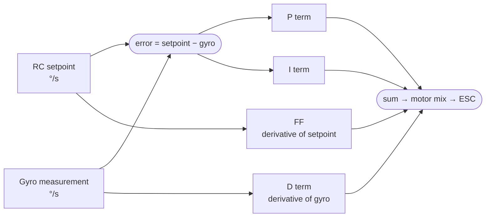

What happens inside Betaflight when you move a slider. The formulas here are derived from `pid.c` in the Betaflight source. Understanding the math makes the configurator sliders predictable rather than mysterious.

---

## The PID Control Loop



The loop runs at the gyro sample rate (typically 8 kHz on ICM-42688-P). Each term is computed in degrees-per-second space and summed before being converted to motor commands via the mixer.

---

## P Term — Proportional

**Formula:**
```
error = setpoint − gyro_rate     [°/s]
P     = Kp × error
```

P responds to the present error. Moving the P slider scales `Kp` directly.

| P value | Effect |
|---------|--------|
| Too high | Fast attack, but oscillation after settling — motor "buzz" |
| Correct | Crisp response, settles cleanly |
| Too low | Sluggish — quad never reaches the commanded rate |

P is applied to the error (setpoint − gyro). Because the **setpoint is included**, P does create a "derivative kick" when the setpoint jumps. This is why the D term is intentionally applied to the gyro alone, not the error — see below.

---

## D Term — Derivative

**Formula:**
```
D = −Kd × d(gyro_rate)/dt
```

D is the **derivative of the gyro measurement alone** — not the error. This is deliberate. If D were applied to the error, every stick input would cause a large D spike because the setpoint changes instantly while the gyro does not. Applying D to the gyro only means D reacts only to actual rotation acceleration, not commanded jumps.

The negative sign is because D opposes changes in gyro rate: when the quad is accelerating toward the setpoint, D brakes it; when it overshoots, D brakes the reversal.

> **D is the damping term.** It prevents the P term from overshooting and oscillating. The P/D balance determines the damping ratio of the closed-loop response.

D is low-pass filtered (two-stage, configurable via `dterm_lpf1_hz` and `dterm_lpf2_hz`) to prevent amplifying gyro noise. A D term that is too high without adequate filtering produces characteristic high-frequency oscillation and motor heat.

---

## I Term — Integral

**Formula:**
```
I += Ki × error × dt
```

I accumulates the error over time. If the quad has a persistent error (e.g., the nose is being blown by wind and never reaches the commanded rate), I eventually becomes large enough to overcome it. I corrects **steady-state error** — the P and D terms alone will always have some residual error because as error approaches zero, the restoring force also approaches zero.

### Anti-Windup

I is clamped to `±PID_MAX_I` to prevent "windup" — a situation where I has grown very large (e.g., during a spin-up or flip) and then drives the quad far past the target when it returns.

### iterm_relax

During fast stick inputs, the I term can "charge up" because the gyro takes time to reach the commanded rate during a flip. This extra charge causes **bounce-back** at the end of the maneuver. `iterm_relax` suppresses I integration during fast inputs:

```
setpoint_hf   = |setpoint − low_pass_filtered(setpoint)|
relax_factor  = max(0, 1 − setpoint_hf / relax_threshold)
I            += Ki × error × dt × relax_factor
```

When the stick is moving quickly (`setpoint_hf` is large), `relax_factor` drops toward 0 and I stops accumulating. The `iterm_relax_cutoff` parameter controls the threshold frequency — higher values suppress I more aggressively during fast moves.

| Build size | iterm_relax_cutoff |
|------------|-------------------|
| 2–5" | 15 |
| 7" | 8 |
| 10"+ | 5 |

### anti_gravity

On sharp throttle chops, the quad tends to pitch/roll slightly because the lift-to-weight balance changes abruptly. `anti_gravity` temporarily boosts the I term to compensate:

```
I_boost = I × (1 + anti_gravity_gain × |throttle_delta|)
```

Applied whenever `|d(throttle)/dt|` exceeds the sensitivity threshold. This keeps the nose level during split-S entries and dive exits.

---

## Feedforward (FF)

**Formula:**
```
FF = Kf × d(setpoint)/dt
```

FF is proportional to **how fast the stick is moving**, not where it is. It anticipates the expected motor response needed for a stick input and injects it immediately, before the P term has time to react to the resulting error.

**Effect:** FF removes the delay between a stick input and the quad's initial response. High FF = quad reacts before it's behind — sharper feel. Too much FF = twitchy, spikes on stick release.

> Set FF to 0 for all tuning data flights. FF injects its own timing artifact into the step response trace, making P/D analysis unreliable.

FF also has a smoothing filter (`ff_smooth_factor`) that low-passes the setpoint derivative to prevent noise spikes from becoming motor commands.

---

## Simulated Step Response: P, D, I, FF Contributions

```chart
{
  "type": "line",
  "data": {
    "labels": ["0","5","10","15","20","25","30","40","50","60","70","80","100","120","150"],
    "datasets": [
      {
        "label": "P only — underdamped, oscillates",
        "data": [0,0.28,0.73,1.12,1.24,1.17,1.12,1.08,1.10,1.06,1.04,1.01,1.01,1.00,1.00],
        "borderColor": "rgba(239,68,68,1)",
        "backgroundColor": "transparent",
        "borderWidth": 2,
        "borderDash": [6,3],
        "tension": 0.3,
        "pointRadius": 0
      },
      {
        "label": "P + D — damped, ~7% steady-state error",
        "data": [0,0.27,0.70,1.01,1.06,1.04,1.01,0.98,0.95,0.93,0.93,0.93,0.93,0.93,0.93],
        "borderColor": "rgba(249,115,22,1)",
        "backgroundColor": "transparent",
        "borderWidth": 2,
        "borderDash": [4,3],
        "tension": 0.3,
        "pointRadius": 0
      },
      {
        "label": "P + I + D — ideal tracking",
        "data": [0,0.27,0.70,1.01,1.06,1.04,1.01,1.00,1.00,1.00,1.00,1.00,1.00,1.00,1.00],
        "borderColor": "rgba(34,197,94,1)",
        "backgroundColor": "transparent",
        "borderWidth": 2.5,
        "tension": 0.3,
        "pointRadius": 0
      },
      {
        "label": "P + I + D + FF — faster initial attack",
        "data": [0,0.45,0.88,1.07,1.08,1.04,1.01,1.00,1.00,1.00,1.00,1.00,1.00,1.00,1.00],
        "borderColor": "rgba(99,102,241,1)",
        "backgroundColor": "transparent",
        "borderWidth": 2.5,
        "tension": 0.3,
        "pointRadius": 0
      }
    ]
  },
  "options": {
    "responsive": true,
    "interaction": { "mode": "index", "intersect": false },
    "plugins": {
      "title": { "display": true, "text": "Step Response: effect of each PID term (simulated, normalized)" },
      "legend": { "position": "bottom" }
    },
    "scales": {
      "x": { "title": { "display": true, "text": "Time after input (ms)" } },
      "y": {
        "min": 0,
        "max": 1.35,
        "title": { "display": true, "text": "Normalized rotation rate (1.0 = setpoint)" }
      }
    }
  }
}
```

---

## Slider → Raw Value Mapping (BF 4.3+ Tuning Tab)

Betaflight 4.3+ replaced direct P/I/D number entry with sliders. Understanding the mapping prevents confusion:

| Slider | What it scales | Effect |
|--------|---------------|--------|
| **Master Multiplier** | All P, I, D together | Proportionally louder or quieter overall |
| **PD Balance** | P:D ratio (constant product) | Shift energy between P and D without changing overall gain |
| **PD Gain** | Both P and D together | Increase/decrease aggressiveness |
| **Stick Response / FF** | Feedforward Kf | Adjust stick sharpness; set to 0 for data flights |
| **Dynamic Damping** (D Max) | d_max ceiling | See d_min / d_max below |

The underlying raw values are still accessible via CLI (`set roll_p`, `set roll_i`, `set roll_d`). The configurator computes them from slider positions. After a manual PID change via CLI, the sliders may not reflect the actual values — always verify in CLI.

---

## TPA — Throttle PID Attenuation

At high throttle, motors produce significantly more torque per command unit than at hover. Without compensation, PIDs that feel correct at hover will be over-responsive at full throttle — causing oscillation and motor heat during high-speed runs.

**Formula:**
```
tpa_factor = 1 − tpa_rate × max(0, (throttle − breakpoint) / (1 − breakpoint))
P_effective = P × tpa_factor
```

`set tpa_rate = 50` → 50% reduction at full throttle. `set tpa_breakpoint = 1650` → attenuation begins at 65% throttle. (These are illustrative values; actual defaults vary by Betaflight version.)

```chart
{
  "type": "line",
  "data": {
    "labels": ["0%","10%","20%","30%","40%","50%","60%","65%","70%","75%","80%","85%","90%","95%","100%"],
    "datasets": [
      {
        "label": "TPA disabled",
        "data": [1.0,1.0,1.0,1.0,1.0,1.0,1.0,1.0,1.0,1.0,1.0,1.0,1.0,1.0,1.0],
        "borderColor": "rgba(107,114,128,1)",
        "backgroundColor": "transparent",
        "borderWidth": 1.5,
        "borderDash": [4,3],
        "tension": 0,
        "pointRadius": 0
      },
      {
        "label": "TPA 30% mild (tpa_rate=30)",
        "data": [1.0,1.0,1.0,1.0,1.0,1.0,1.0,1.0,0.957,0.914,0.871,0.829,0.786,0.743,0.70],
        "borderColor": "rgba(249,115,22,1)",
        "backgroundColor": "transparent",
        "borderWidth": 2,
        "tension": 0.2,
        "pointRadius": 0
      },
      {
        "label": "TPA 50% default (tpa_rate=50)",
        "data": [1.0,1.0,1.0,1.0,1.0,1.0,1.0,1.0,0.929,0.857,0.786,0.714,0.643,0.571,0.50],
        "borderColor": "rgba(34,197,94,1)",
        "backgroundColor": "transparent",
        "borderWidth": 2.5,
        "tension": 0.2,
        "pointRadius": 0
      }
    ]
  },
  "options": {
    "responsive": true,
    "interaction": { "mode": "index", "intersect": false },
    "plugins": {
      "title": { "display": true, "text": "TPA: P gain multiplier vs throttle position (breakpoint = 65%)" },
      "legend": { "position": "bottom" }
    },
    "scales": {
      "x": { "title": { "display": true, "text": "Throttle %" } },
      "y": {
        "min": 0.4,
        "max": 1.05,
        "title": { "display": true, "text": "P gain multiplier" }
      }
    }
  }
}
```

> **2" ripper note:** Small props have very high RPM and respond more aggressively to command changes. Start with tpa_rate=60 (60% reduction), breakpoint=60%.

---

## d_min / d_max

Standard D is a fixed value. `d_min` and `d_max` allow D to vary dynamically with stick input speed:

```
stick_velocity = |d(setpoint)/dt|
d_boost        = clamp(stick_velocity / d_min_boost_gain, 0, 1)
D_effective    = d_min + (d_max − d_min) × d_boost
```

- **At hover / constant rate**: stick_velocity ≈ 0 → `D_effective = d_min` (lower D → less motor heat)
- **During fast maneuver**: stick_velocity high → `D_effective` ramps toward `d_max` (more damping on the input)

This gives you the best of both worlds: reduced D noise and heat during cruise, full D damping during aggressive inputs.

**CLI commands:**
```
set d_min_roll = 20    # base D (applied at rest)
set d_roll = 30        # D_max — the peak D reached at high stick velocity
```

Set `d_min_roll` equal to `d_roll` (both = your D value) to disable the dynamic D range and fly with a fixed D — required for clean tuning data flights.

---

## RPM Filter

The RPM filter places a dynamic notch at each motor's rotational frequency and its harmonics:

```
motor_rpm      = motor_eRPM / (poles / 2)   # eRPM telemetry → mechanical RPM
fundamental_hz = motor_rpm / 60
notch_n        = fundamental_hz × n         # n = 1, 2, 3 — harmonics
```

(The `eRPM` reported over bidirectional DSHOT is *electrical* RPM; dividing by the pole-pair count gives the mechanical rotation frequency the notches track.)

The filter tracks in real time using eRPM telemetry from bidirectional DSHOT. This removes motor noise that would otherwise bleed through into the D term and appear as oscillation.

**Minimum frequency guard:**
```
set rpm_filter_min_hz = lowest_expected_motor_Hz − 25
```

Below this frequency, the RPM filter is disabled to prevent it from placing notches in the range where gyro flight dynamics live. Too low a value → filter removes useful control information.

| Build | Minimum Hz | Rationale |
|-------|-----------|-----------|
| 2" | 150 | Motor fundamentals at hover ~200 Hz |
| 3" | 100 | Motor fundamentals at hover ~150 Hz |
| 5" | 80 | Motor fundamentals at hover ~120 Hz |
| 7"+ | 60 | Larger props, lower RPM |

**Requires:** bidirectional DSHOT enabled, ESC firmware that supports RPM telemetry (BLHELI_32, AM32, BLHELI_S with BlueJay).

---

## Quick Reference

| Term | What it fixes | What too much does |
|------|--------------|-------------------|
| P | Sluggishness, steady-state error | Oscillation after inputs |
| I | Long-term drift, wind correction | Low-frequency wobble, pogo on throttle |
| D | Overshoot, underdamping | Motor heat, high-frequency buzz |
| FF | Stick-follow latency | Twitchy feel, spikes on stick release |
| iterm_relax | Bounce-back after flips | Slower I response to sustained disturbances |
| anti_gravity | Altitude dip on throttle chop | Slight over-correction on chop |
| TPA | High-throttle oscillation | Sluggishness at high throttle |
| d_min | Motor heat at hover | Less damping at low stick rates |
| d_max | Damping during fast inputs | Motor heat and noise during moves |
| RPM filter | Motor harmonic noise in D | Phase lag if set too aggressively |

---

## Related

- [Tuning Flight Protocol](../tuning-flight-protocol/) — how to collect data that measures these terms in practice
- [Wobble-Test PID Protocol](../pid-tuning-wobble-test/) — free-tools tuning workflow
- [BBL-Based PID Tuning Protocol](../bbl-pid-tuning-protocol/) — step response analysis methodology
- [Rate Modes](../rate-modes/) — how stick position maps to setpoint °/s
- **Rylo** — AI-assisted analysis and PID recommendations from your `.bbl` log → [app.sintra.ai/community/helpers/rylo](https://app.sintra.ai/community/helpers/rylo)
