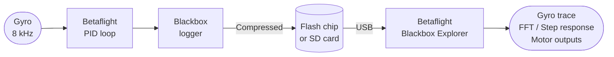

Blackbox įrašo kiekvieną jutiklio rodmenį, RC įvestį, PID išvestį ir variklio komandą dideliu dažniu. Tai pats galingiausias diagnostikos įrankis, koks tik yra — be jo derinimas tėra spėliojimas (o spėliojau aš ilgai, kol pagaliau įsijungiau log'us).

---

## Kaip veikia pipeline



Logger'is ima mėginius tavo sukonfigūruotu log rate greičiu (tipiškai 1–4 kHz) ir rašo suspaustus kadrus arba į onboard flash, arba į microSD kortelės lizdą ant FC.

---

## Logginimo įjungimas

Konfigūratorius → **Blackbox** skirtukas:

```
set blackbox_device = SPIFLASH     # or SDCARD
set blackbox_sample_rate = 1/2     # log every 2nd PID loop (4 kHz at 8 kHz loop)
set blackbox_mode = NORMAL         # log when armed
save
```

`blackbox_sample_rate`: mažesnė trupmena (`1/4`, `1/8`) = mažesnis log rate = ilgesnis įrašymas, kol prisipildys flash.

| Loop rate | sample_rate | Efektyvus log rate | ~Minutės 16MB flash |
|-----------|-------------|-------------------|------------------------|
| 8 kHz     | 1/1         | 8 kHz             | ~4 min                 |
| 8 kHz     | 1/2         | 4 kHz             | ~8 min                 |
| 8 kHz     | 1/4         | 2 kHz             | ~16 min                |
| 8 kHz     | 1/8         | 1 kHz             | ~32 min                |

**Derinimui: naudok 4 kHz (`1/2`).** Ilgoms sesijoms, kur nori tik crash duomenų: 1 kHz (`1/8`).

---

## Ką pasako kiekvienas laukas

```chart
{
  "type": "bar",
  "data": {
    "labels": [
      "gyroADC (raw gyro)",
      "gyroUnfilt (pre-filter)",
      "rcCommand (stick input)",
      "axisP/I/D/F (PID terms)",
      "motor[0-3] (output)",
      "rcData (RC channels)",
      "vbatLatest (voltage)",
      "amperageLatest (current)"
    ],
    "datasets": [{
      "label": "Diagnostic value for tuning",
      "data": [9, 8, 7, 10, 9, 5, 6, 6],
      "backgroundColor": [
        "rgba(59,130,246,0.7)",
        "rgba(59,130,246,0.5)",
        "rgba(34,197,94,0.7)",
        "rgba(249,115,22,0.9)",
        "rgba(239,68,68,0.8)",
        "rgba(156,163,175,0.6)",
        "rgba(168,85,247,0.7)",
        "rgba(168,85,247,0.6)"
      ],
      "borderWidth": 1
    }]
  },
  "options": {
    "indexAxis": "y",
    "responsive": true,
    "plugins": {
      "title": { "display": true, "text": "Blackbox Field Usefulness for Tuning (subjective 1–10)" },
      "legend": { "display": false }
    },
    "scales": {
      "x": { "beginAtZero": true, "max": 10, "title": { "display": true, "text": "Usefulness" } }
    }
  }
}
```

**axisP/I/D/F** — atskiros PID terminų išvestys. Vienintelis būdas sužinoti, kuris terminas oscilliuoja.

**motor[0–3]** — galutinės variklių komandos po viso PID ir filtravimo. Įsisotinimas (pasiekiamas 0 arba 2047) rodo sukimo momento ribojimą. Skirtumai tarp variklių rodo rėmo/variklių disbalansą.

**gyroADC** — filtruotas gyro. Tai, ką iš tikrųjų mato PID kilpa. Turėtų švariai sekti RC įvestį.

**gyroUnfilt** — neapdorotas gyro prieš bet kokį filtravimą. Palygink su gyroADC, kad pamatytum, ką tavo filtrai pašalina. Jei unfilt ir ADC atrodo vienodai, tavo filtrai nedaug ką daro (gali būti gerai arba blogai).

---

## Log'o skaitymas Blackbox Explorer'yje

1. Parsisiųsk [Betaflight Blackbox Explorer](https://github.com/betaflight/blackbox-log-viewer/releases)
2. Atidaryk `.bbl` failą (drag and drop)
3. Naudok **I/O klavišus**, kad slinktum pirmyn/atgal
4. Įjunk **FFT** (viršuje dešinėje), kad matytum dažnių srities triukšmo spektrą
5. Ieškok:
   - Gyro kreivių, kurios oscilliuoja be stick'o įvesties → filtro ar tune problema
   - Variklių kreivių, pasiekiančių max/min → sukimo momento įsisotinimas ar desync
   - P-term spike'ų ant roll → P per didelis arba nepakankamas filtravimas

---

## Flash trynimas

```
# In CLI
blackbox erase
# Wait for the confirmation beep / "Done" message, then save
```

Arba naudok Konfigūratorius → Blackbox skirtukas → **Erase Flash** mygtukas.

---

## Pastabos

- Logginimas išmatuojamai neveikia skrydžio našumo.
- Kai kurie FC turi tik 1–2 MB flash — pakanka vienam trumpam skrydžiui ties 4 kHz. Patikrink savo FC specifikacijas.
- SD kortelės logginimas suteikia neribotą talpą; flash yra patikimesnis (kortelės gali atsijungti skrydžio metu dėl vibracijos).
- Visada ištrink log'ą prieš derinimo sesiją, kad nereikėtų naršyti po senas sesijas. Klausiu iš patirties: nieko nėra smagiau, nei rasti tris savaites senų kabėjimų ir bandyti atspėti, kuris segmentas — šiandienos.
