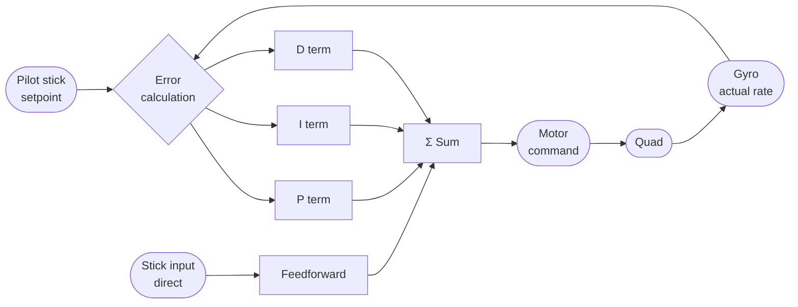
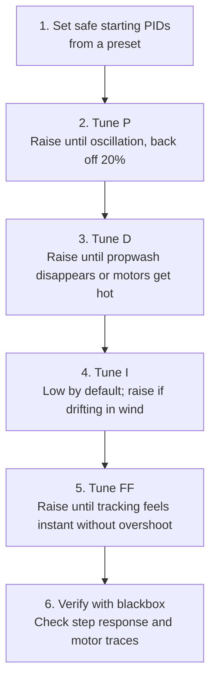

PID kontroleris — tai pati skrydžio kontrolerio veikimo esmė. Suprasti, ką daro kiekvienas terminas ir kaip atrodo, kai jį sugadini, yra būtina sąlyga bet kokiam prasmingam derinimui. Beje, „sugadini“ čia nėra teorinė sąvoka — aš kiekvieną iš šitų simptomų atpažinau ne iš vadovėlio, o iš savo paties dronų.

---

## Valdymo kilpa



Kontroleris mato **error** (setpoint − faktinė reikšmė), tada reaguoja keturiais indėliais, kurie susumuojami į variklio komandą.

---

## Ką daro kiekvienas terminas

### P — Proportional

Reaguoja į dabartinį error. Didesnis error → didesnė korekcija.

- **Per mažas:** dronas jaučiasi minkštas ir neatsakingas, prastai seka stick'us, klaidžioja darant greitus krypties pokyčius.
- **Per didelis:** oscilacijos darant aštrius manevrus ir keičiant gazą. Aukšto tono zyzimas varikliuose. Propwash pablogėja.

### I — Integral

Kaupia error laike. Koreguoja nuolatinį nuokrypį (vėjas, variklių disbalansas, netolygus propelleris).

- **Per mažas:** dronas lėtai dreifuoja į vieną pusę be stick'o įvesties; negali išlaikyti aukščio ar kurso vėjyje.
- **Per didelis:** atšokimas po staigaus sustojimo; lėta, „vata“ dvelkianti oscilacija, kuri nurimsta per kelias sekundes (I-term windup).

### D — Derivative

Reaguoja į tai, kaip greitai keičiasi error (pokyčio greitis). Slopina P-term atsaką ir apsaugo nuo overshoot.

- **Per mažas:** propwash, atšokimas paleidus stick'ą, oscilacija po flip'ų.
- **Per didelis:** aukšto dažnio oscilacijos (varikliai kaista), dronas zyzia/vibruoja tam tikrose gazo pozicijose, D-term triukšmą sustiprina filtravimas.

### Feedforward (FF)

Ne klasikinės PID kilpos dalis — jis skaito stick'o judėjimą tiesiogiai ir stumia variklius *prieš* susikaupiant error. Sumažina įgimtą vėlinimą grįžtamojo ryšio kontroleryje.

- **Per mažas:** sekimo vėlinimas; dronas jaučiasi šiek tiek atsiliekantis nuo stick'ų; „vata“ darant greitus krypties pokyčius.
- **Per didelis:** overshoot į stick'o įvestis; aštru, bet nervinga. Sustiprina RC linijos jitter'į.

---

## Vaizdinė iliustracija: step response koncepcija

Tai rodo, kas nutinka, kai staigiai duodi pilno atlenkimo roll komandą. Skirtingos kreivės atspindi PID derinimo kokybę:

```chart
{
  "type": "line",
  "data": {
    "labels": ["0","1","2","3","4","5","6","7","8","9","10","11","12","13","14","15"],
    "datasets": [
      {
        "label": "Setpoint (target rate)",
        "data": [0,0,100,100,100,100,100,100,100,100,100,100,100,100,100,100],
        "borderColor": "rgba(156,163,175,1)",
        "borderDash": [6,3],
        "borderWidth": 2,
        "pointRadius": 0,
        "fill": false,
        "tension": 0
      },
      {
        "label": "Well tuned",
        "data": [0,0,90,100,100,100,100,100,100,100,100,100,100,100,100,100],
        "borderColor": "rgba(34,197,94,1)",
        "borderWidth": 2.5,
        "pointRadius": 0,
        "fill": false,
        "tension": 0.2
      },
      {
        "label": "P too high (oscillation)",
        "data": [0,0,120,85,110,95,105,98,102,99,101,100,100,100,100,100],
        "borderColor": "rgba(249,115,22,1)",
        "borderWidth": 2.5,
        "pointRadius": 0,
        "fill": false,
        "tension": 0.2
      },
      {
        "label": "P too low / D too high (sluggish)",
        "data": [0,0,50,70,82,89,94,97,98,99,100,100,100,100,100,100],
        "borderColor": "rgba(239,68,68,1)",
        "borderWidth": 2.5,
        "pointRadius": 0,
        "fill": false,
        "tension": 0.3
      },
      {
        "label": "I too high (bounce-back)",
        "data": [0,0,95,102,104,103,101,100,99,99,100,100,100,100,100,100],
        "borderColor": "rgba(168,85,247,1)",
        "borderWidth": 2,
        "borderDash": [3,2],
        "pointRadius": 0,
        "fill": false,
        "tension": 0.25
      }
    ]
  },
  "options": {
    "responsive": true,
    "interaction": { "mode": "index", "intersect": false },
    "plugins": {
      "title": { "display": true, "text": "Step Response — How PID tuning affects stick tracking" },
      "legend": { "position": "bottom" }
    },
    "scales": {
      "x": { "title": { "display": true, "text": "Time (ms)" } },
      "y": {
        "beginAtZero": true,
        "title": { "display": true, "text": "Roll rate (% of setpoint)" }
      }
    }
  }
}
```

---

## Derinimo eiliškumas

Visada derink šia tvarka — ankstesni terminai veikia vėlesnių elgseną:



**Niekada nepradėk derinimo nuo I ar FF.** P ir D pirmiausia turi būti stabilūs, kitaip I windup ir FF overshoot supainios kiekvieną matavimą.

---

## Betaflight numatytieji PID diapazonai (5" freestyle, BF 4.4)

| Terminas | Numatytoji | Tipiškas diapazonas | Derinimo kryptis |
|------|---------|----------------|-------------------|
| Roll P | 47 | 35–65 | Aukštyn → aštriau, žemyn → minkščiau |
| Roll D | 35 | 25–55 | Aukštyn → slopina propwash, žemyn → mažiau variklių kaitimo |
| Roll I | 85 | 60–110 | Paprastai palik ramybėje, nebent dreifuoja vėjyje |
| Roll FF | 120 | 80–160 | Aukštyn → momentinis sekimas, žemyn → mažiau overshoot |
| Pitch ≈ Roll | — | ±10% nuo roll | Pitch paprastai 5–10% didesnis P/D nei roll |
| Yaw P | 45 | 30–60 | Mažesnis nei roll; yaw yra lėtesnė ašis |

---

## TPA (Throttle PID Attenuation)

Esant dideliam gazui, RPM aukštas, varikliai reaguoja greičiau, ir tie patys PID gain'ai tampa efektyviai „agresyvesni“. TPA automatiškai sumažina P (ir pasirinktinai D) virš tam tikro gazo slenksčio.

```
set tpa_rate = 65        # reduce P/D by 65% at full throttle
set tpa_breakpoint = 1500  # start reducing at 50% throttle (1500 µs)
set tpa_mode = PD        # apply to P and D
save
```

Be TPA: dronas gali oscilliuoti esant dideliam gazui, bet jaustis minkštas kabant vietoje. Su tinkamai nustatytu TPA: nuoseklus pojūtis per visą gazo diapazoną — ir, tiesą sakant, būtent TPA man kadaise „išgydė“ tą punch-out zyzimą, kurį pusę dienos gaudžiau kaltindamas viską, tik ne gazą.
