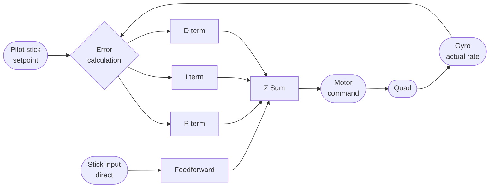
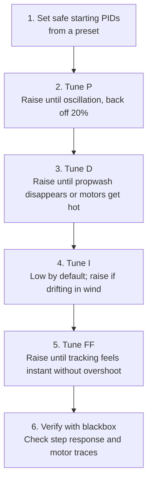

A PID controller is the core of what makes a flight controller work. Understanding what each term does — and what breaking it looks like — is prerequisite to any meaningful tuning.

---

## The Control Loop



The controller sees the **error** (setpoint − actual), then reacts with four contributions summed into a motor command.

---

## What Each Term Does

### P — Proportional

Reacts to the current error. Bigger error → bigger correction.

- **Too low:** Quad feels soft and unresponsive, doesn't track stick well, wanders on fast direction changes.
- **Too high:** Oscillations on sharp moves and at throttle transitions. High-pitched buzz in the motors. Propwash gets worse.

### I — Integral

Accumulates error over time. Corrects persistent bias (wind, motor imbalance, uneven prop).

- **Too low:** Quad drifts slowly in one direction without stick input; can't hold altitude or heading in wind.
- **Too high:** Bounce-back after a hard stop; slow, mushy-feeling oscillation that takes several seconds to damp out (I-term windup).

### D — Derivative

Reacts to how fast the error is changing (the rate of change). Damps the P-term response, preventing overshoot.

- **Too low:** Propwash, bounce on stick release, oscillation after flips.
- **Too high:** High-frequency oscillations (motors get hot), the quad buzzes/vibrates at certain throttle positions, D-term noise amplified by filtering.

### Feedforward (FF)

Not part of the classic PID loop — it reads stick movement directly and pushes the motors *before* error accumulates. Reduces the inherent lag in a feedback controller.

- **Too low:** Tracking delay; quad feels slightly behind the sticks; "mushy" on quick direction changes.
- **Too high:** Overshooting stick inputs; snappy but twitchy. Amplifies RC link jitter.

---

## Visual: Step Response Concept

This shows what happens when you give a sudden full-deflection roll command. The different curves represent PID tuning quality:

```chart
{
  "type": "line",
  "data": {
    "labels": ["0","1","2","3","4","5","6","7","8","9","10","11","12","13","14","15"],
    "datasets": [
      {
        "label": "Setpoint (target rate)",
        "data": [0,0,100,100,100,100,100,100,100,100,100,100,100,100,100,100],
        "borderColor": "rgba(156,163,175,1)",
        "borderDash": [6,3],
        "borderWidth": 2,
        "pointRadius": 0,
        "fill": false,
        "tension": 0
      },
      {
        "label": "Well tuned",
        "data": [0,0,90,100,100,100,100,100,100,100,100,100,100,100,100,100],
        "borderColor": "rgba(34,197,94,1)",
        "borderWidth": 2.5,
        "pointRadius": 0,
        "fill": false,
        "tension": 0.2
      },
      {
        "label": "P too high (oscillation)",
        "data": [0,0,120,85,110,95,105,98,102,99,101,100,100,100,100,100],
        "borderColor": "rgba(249,115,22,1)",
        "borderWidth": 2.5,
        "pointRadius": 0,
        "fill": false,
        "tension": 0.2
      },
      {
        "label": "P too low / D too high (sluggish)",
        "data": [0,0,50,70,82,89,94,97,98,99,100,100,100,100,100,100],
        "borderColor": "rgba(239,68,68,1)",
        "borderWidth": 2.5,
        "pointRadius": 0,
        "fill": false,
        "tension": 0.3
      },
      {
        "label": "I too high (bounce-back)",
        "data": [0,0,95,102,104,103,101,100,99,99,100,100,100,100,100,100],
        "borderColor": "rgba(168,85,247,1)",
        "borderWidth": 2,
        "borderDash": [3,2],
        "pointRadius": 0,
        "fill": false,
        "tension": 0.25
      }
    ]
  },
  "options": {
    "responsive": true,
    "interaction": { "mode": "index", "intersect": false },
    "plugins": {
      "title": { "display": true, "text": "Step Response — How PID tuning affects stick tracking" },
      "legend": { "position": "bottom" }
    },
    "scales": {
      "x": { "title": { "display": true, "text": "Time (ms)" } },
      "y": {
        "beginAtZero": true,
        "title": { "display": true, "text": "Roll rate (% of setpoint)" }
      }
    }
  }
}
```

---

## Tuning Order

Always tune in this order — earlier terms affect the behavior of later ones:



**Never start tuning with I or FF.** P and D have to be stable first or the I windup and FF overshoot will confuse every measurement.

---

## Betaflight Default PID Ranges (5" freestyle, BF 4.4)

| Term | Default | Typical range  | Direction to tune |
|------|---------|----------------|-------------------|
| Roll P | 47 | 35–65 | Up → snappier, Down → softer |
| Roll D | 35 | 25–55 | Up → damps propwash, Down → less motor heat |
| Roll I | 85 | 60–110 | Usually leave alone unless wind drift |
| Roll FF | 120 | 80–160 | Up → instant tracking, Down → less overshoot |
| Pitch ≈ Roll | — | ±10% of roll | Pitch usually 5–10% higher P/D than roll |
| Yaw P | 45 | 30–60 | Lower than roll; yaw is slower axis |

---

## TPA (Throttle PID Attenuation)

At high throttle, RPM is high, the motors react faster, and the same PID gains become effectively "more aggressive." TPA automatically reduces P (and optionally D) above a throttle threshold.

```
set tpa_rate = 65        # reduce P/D by 65% at full throttle
set tpa_breakpoint = 1500  # start reducing at 50% throttle (1500 µs)
set tpa_mode = PD        # apply to P and D
save
```

Without TPA: the quad may oscillate at high throttle but feel soft at hover. With TPA properly set: consistent feel across the throttle range.
