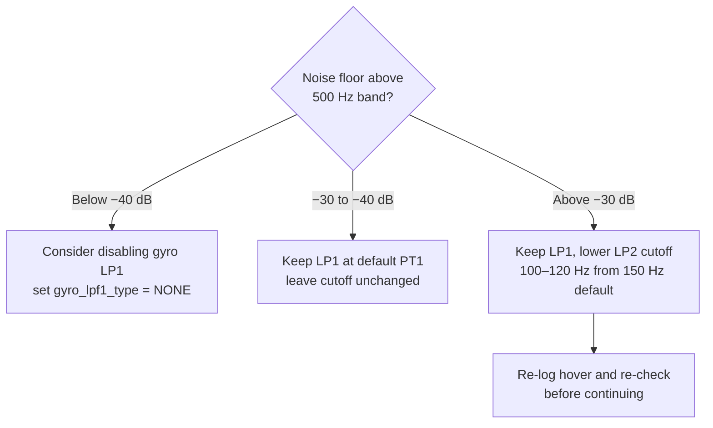
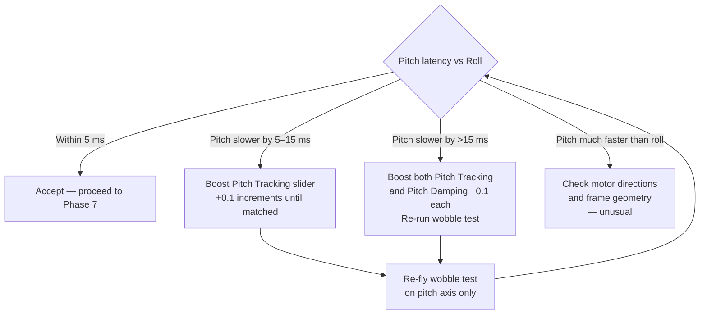
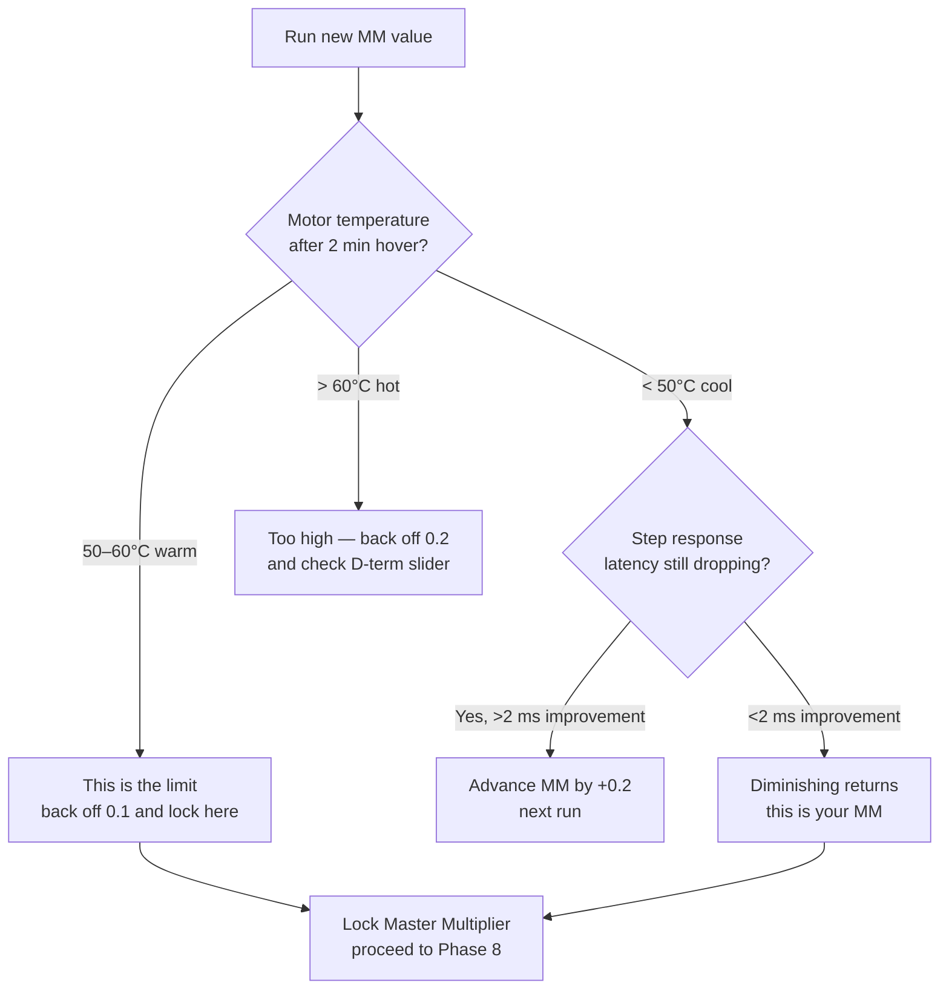

Sistemingas PID derinimo protokolas, pagrįstas Joshua Bardwell / Brian White wobble-test metodologija — perrašytas taip, kad veiktų vien su nemokamais įrankiais: Betaflight Blackbox Explorer, Betaflight Configurator ir Rylo. Jokio PID Toolbox, jokio MATLAB, jokių mokamų prenumeratų (nes, atvirai, aš tiesiog tingiu mokėti už tai, ką galima padaryti nemokamai).

Tai **praktinis lauko protokolas**. Jei nori matematikos, slypinčios už kiekvieno termino, žiūrėk [Betaflight Tuning Math](../betaflight-tuning-math/). Jei jau turi `.bbl` failą ir nori grynos step response analizės, žiūrėk [BBL-Based PID Tuning Protocol](../bbl-pid-tuning-protocol/).

---

## Kaip veikia šis protokolas

Pagrindinė įžvalga iš Brian White tyrimų: **PD balance ir master multiplier yra vieninteliai du reguliatoriai, kurie ženkliai veikia step response vėlinimą ir formą**. Visa kita (I, FF, d_max) derinama ant tvirto PD pagrindo.

Wobble testas duoda tau kontroliuojamą, kartotinę įvestį: greitą pilno atlenkimo stick'o judesį angle mode su ribota eiga ir tiesiniais rate'ais. Tai sukuria švarų step užsakytame sukimosi rate — idealu step response formos analizei be MATLAB.

```mermaid
flowchart TD
    A([Phase 0<br/>Mechanical prep]) --> B
    B([Phase 1<br/>Betaflight setup]) --> C
    C([Phase 2<br/>Baseline hover log<br/>+ spectral analysis]) --> D
    D([Phase 3<br/>RPM filter setup]) --> E
    E([Phase 4<br/>PID pre-configuration<br/>zero FF · zero d_max · low I]) --> F
    F([Phase 5<br/>PD balance sweep<br/>0.6 → 1.4]) --> G
    G([Phase 6<br/>Pitch / roll balance]) --> H
    H([Phase 7<br/>Master multiplier sweep<br/>FRESH BATTERY]) --> I
    I([Phase 8<br/>I term]) --> J
    J([Phase 9<br/>Feedforward]) --> K
    K([Phase 10<br/>D-max ← optional]) --> L
    L([Phase 11<br/>Verification flight])

    style A fill:#1a2a3a,stroke:#4a7aaa
    style H fill:#2a1a1a,stroke:#aa4a4a
```



---

## 0 fazė — Mechaninis pasiruošimas

Daryk tai prieš kiekvieną derinimo sesiją. Mechaninės problemos atrodo kaip derinimo problemos.

- [ ] Švieži propelleriai — neįskilę, nesulankstyti, įstatyti ir priveržti
- [ ] Visi variklių varžtai priveržti (M2 × 5 nerūdijantis, 4 vienam varikliui)
- [ ] FC tvirtai standoff'uose — guminės tarpinės nesuspaustos plokščiai, ne dingusios
- [ ] Kondensatorius prilituotas prie baterijos pad'ų (1000–2200 µF, 25 V ar daugiau 4S+)
- [ ] Jokių laisvų jungčių ar laidų, galinčių vibruoti prie rėmo
- [ ] Petys ir rėmo tvirtinimai priveržti

> **2" Ripper pastaba:** tikrink propellerių priveržimo momentą kiekvieną sesiją. Press-fit propelleriai ant whoop'ų ir 2" build'ų atsilaisvina greičiau nei T-mount propelleriai. Laisvas propelleris — didelis vibracijos šaltinis, kurio joks filtro nustatymas iki galo neišvalys. Keisk bet kokius propellerius su matomais galiukų įskilimais — net 0,5 mm įskilimas sukuria spektrinį spike.

---

## 1 fazė — Betaflight nustatymas

Vienkartinis nustatymas. Įsitikink, kad tai teisinga prieš bet kokią logginimo sesiją.

### Dvikryptis DSHOT

Reikalingas RPM filtrui. Patikrink Betaflight Configurator → Configuration skirtukas:

```
# CLI verification:
get motor_pwm_protocol   # should return DSHOT300 or DSHOT600
get dshot_bidir          # should return ON
```

Jei dvikryptis DSHOT išjungtas, RPM filtras neturi duomenų ir grįžta prie fiksuoto notch filtravimo.

### Blackbox konfigūracija

```
# In Betaflight CLI:
set blackbox_device = SPIFLASH       # or SDCARD if fitted
set blackbox_sample_rate = 1/1       # full rate — needed for spectral analysis
set blackbox_mode = NORMAL           # always logging when armed

# Debug mode — critical for spectral view in Blackbox Explorer:
set debug_mode = FFT_FREQ            # logs detected noise-peak frequencies for the spectral view

save
```

> **2" Ripper pastaba:** nustatyk `blackbox_sample_rate = 1/1` (4 kHz) be kompromisų. Variklių fundamentai 2" build'e, sukant 30 000+ RPM, yra ties 250–500 Hz. 2 kHz log rate tai užfiksuoja, bet palieka ploną atsargą. Ties 4 kHz švariai užfiksuoji dvi harmonikas. Patikrink Betaflight CPU apkrovą (Configurator pradinis ekranas) — jei ji viršija 50% nustačius 4 kHz logginimą, arba pereik prie greitesnio F7 FC, arba susitaikyk su 1/2 rate.

### RC linijos preset'as

Įkelk preset'ą, atitinkantį tavo radijo protokolą: Configurator → Presets → ieškok savo linijos (ELRS 250 Hz, ELRS 500 Hz, Crossfire ir t. t.). Tai nustato tinkamus filtrų cutoff'us ir feedforward glotninimą tavo paketų rate. **Nederink be įjungto teisingo linijos preset'o.**

### Prieš kiekvieną sesiją: ištrink flash

```
# After connecting, before arming:
blackbox erase
# Wait for the green light / CLI confirmation, then disconnect
```

---

## 2 fazė — Spektrinis baseline

**Tikslas**: identifikuoti variklių triukšmo dažnius ir patikrinti triukšmo lygį prieš liečiant PID'us.

### Kabėjimo log'o procedūra

1. Arm ir pakilk į 3–4 m AGL (virš ground effect — bent vienas propellerio skersmuo)
2. Laikyk stabilų kabėjimą **30–40 sekundžių** — jokių stick'o įvesčių, pastovus gazas
3. Švariai disarm
4. Parsisiųsk ir atidaryk log'ą Betaflight Blackbox Explorer'yje

### Spektrinė analizė Blackbox Explorer'yje

1. Atidaryk log'ą, spausk **Spectrum Analyser** (arba **Frequency** naujesnėse versijose)
2. Nustatyk **axis** išskleidžiamąjį meniu ties blogiausia ašimi (paprastai Roll)
3. Įjunk **debug** kreivę, jei yra — ji rodo pre-filter gyro signalą
4. Priartink dažnio ašį iki 0–1000 Hz

**Ko ieškoti:**

| Dažnio zona | Ką ji rodo |
|---------------|---------------|
| 0–20 Hz | Normali skrydžio dinamika — visada yra |
| 20–80 Hz | Prop wash / priekinio skrydžio trikdis — platus kupstas |
| 80–500 Hz | **Variklių fundamentas** — turi kilti su gazu |
| 2× ir 3× fundamentas | Variklių harmonikos — aukšti siauri pikai |
| Fiksuoto dažnio spike (bet koks) | Mechaninis rezonansas — rėmas, standoff'as, propellerių pažeidimas |

**Triukšmo lygio tikslai:**

| Lygis | Vertinimas |
|-------|-----------|
| Žemiau −40 dB (virš variklių harmonikų juostos) | Puiku — galima svarstyti gyro LP1 išjungimą |
| −30 iki −40 dB | Priimtina — standartinis RPM filtras + LP2 pakanka |
| −25 iki −30 dB | Padidėjęs — palik LP1, apsvarstyk cutoff sugriežtinimą |
| Virš −25 dB | Problematiška — diagnozuok prieš derindamas. Patikrink propellerių balansą, variklių varžtus, kondensatorių |

**Paklausk [Rylo](https://app.sintra.ai/community/helpers/rylo):** padaryk Blackbox Explorer spektrinio vaizdo ekrano nuotrauką ir pasidalink ja čia. Rylo identifikuos variklių fundamentalų dažnį, pažymės bet kokius anomalius pikus ir rekomenduos RPM filtro minimalų dažnį 3 fazei.

> **2" Ripper pastaba:** variklių fundamentai 2" build'e tipiškai yra **250–500 Hz** ties viduriniu gazu — gerokai aukščiau nei 5" (100–200 Hz). RPM filtro min dažnio numatytoji reikšmė 100 Hz gali reikėti pakelti iki 150 Hz ar daugiau. Bendras triukšmo lygis dažnai irgi aukštesnis; švarus 2" build gali vis tiek sėdėti ties −30 dB, o ne −40 dB kaip 5".

---

## 3 fazė — RPM filtro nustatymas

Nustatyk RPM filtro minimalų dažnį pagal 2 fazę.

```
# In CLI:
set rpm_filter_min_hz = <lowest_motor_Hz - 25>

# Example: if motor fundamental starts at 125 Hz:
set rpm_filter_min_hz = 100

# Harmonics — default 3 is correct for most builds:
set rpm_filter_harmonics = 3

save
```

### Low-pass filtro sprendimas

Nustatęs RPM filtrą, pakabink iš naujo ir vėl patikrink spektrinį vaizdą:



> **Nemažink filtrų agresyviai, kad kompensuotum mechaninį triukšmą.** Daugiau filtravimo = daugiau fazės vėlinimo = efektyviai mažesni PID'ai + daugiau vėlinimo. Pirma sutvarkyk mechaninį šaltinį.

---

## 4 fazė — PID pre-konfigūracija

Prieš wobble testą sukonfigūruok Betaflight slankiklius (Configurator → PID Tuning → Simplified Tuning) ir rates profilį taip, kad izoliuotum P ir D nuo visko kito.

### Slankiklių pradinis taškas

Jei tai šviežias build, pradėk visus slankiklius nuo **1.0** (numatytosios). Jei build jau skraido, pirma išsaugok savo dabartinę `diff all` atsarginę kopiją:

```
diff all
# Copy to file: build-name_2026-07-XX_pre-tune.txt
```

Tada:

| Slankiklis | Nustatyk į | Priežastis |
|--------|--------|--------|
| Master multiplier | 1.0 | Neutralus pradinis taškas |
| PD Balance | 1.0 | Pradinis taškas sweep'ui |
| PD Gain (Pitch/Roll) | 1.0 | Neutralu |
| **Stick Response (FF)** | **0** | **Pašalink FF iš step response** |
| **D-max** | **0** | **Laikyk D pastovų PD sweep metu** |

### I terminas

Nustatyk I į **minimalią reikšmę** — tiek, kad dronas nedreifuotų:

```
# In CLI (BF 4.4+ slider maps to these raw values approximately):
set iterm_relax = RP              # axes: roll + pitch (use RPY to include yaw)
set iterm_relax_type = SETPOINT   # SETPOINT or GYRO
set iterm_relax_cutoff = 15       # for 5"; see size table below
save
```

Pastumk PID Tuning slankiklių **I** dalį iki maždaug 0,3–0,4. Tai neleidžia I windup teršti step response analizės. Galutinę I termino reikšmę nustatysi 8 fazėje.

**iterm_relax_cutoff pagal build dydį:**

| Build | iterm_relax_cutoff |
|-------|-------------------|
| 2–3" | 15 (numatytoji) |
| 5" | 15 (numatytoji) |
| 7" | 8 |
| 10"+ / lifter'iai | 5 |

### Wobble test rates profilis

Betaflight Configurator → Rates sukurk specialų derinimo rates profilį (arba užsirašyk dabartines reikšmes, kad atkurtum vėliau):

| Parametras | Reikšmė | Priežastis |
|-----------|-------|--------|
| Roll rate (center/max) | 150 / 150 | Tiesinis, nuspėjamas step įvestis |
| Pitch rate (center/max) | 150 / 150 | Atitinka roll palyginimui |
| Yaw rate (center/max) | 150 / 150 | Ne fokusas, bet laikyk nuosekliai |
| Expo | 0 visiems | Tiesinis — jokio minkštumo centre |
| Angle limit (jei naudoji Angle mode) | 30° | Laiko testą žemai ir saugiai |

Tai suteikia vidutinę, lengvai valdomą eigą, kuri gamina švarias step įvestis nereikalaujant tikslių acro įgūdžių.

---

## 5 fazė — PD balance sweep

**Tikslas**: rasti PD damping slankiklio nustatymą, kur step response forma yra švariausia.

### Wobble test manevras

Kiekvienam PD damping slankiklio nustatymui:
1. Arm, pakabink iki ~3 m
2. Atlik 8–10 **greitų, pilno atlenkimo kairė-dešinė roll įvesčių** — snap į pilną kairę, snap atgal, snap į pilną dešinę, snap atgal. Kiekviena kryptis laikoma ~0,5 s.
3. Pakartok su **pitch pirmyn-atgal** įvestimis
4. Nusileisk, disarm

Tai generuoja švarias step įvestis, kurias tavo bbl-analizatorius gali apdoroti. Skrisk **Angle mode**, jei tavo skraidymo įgūdžiai riboti — angle limit apsaugo nuo apvirtimo, tuo pačiu vis tiek generuodamas pilno rate užsakytus step'us.

### Sweep nustatymai

| Bandymas | PD Damping slankiklis |
|-----|-----------------|
| 1 | 0.6 |
| 2 | 0.8 |
| 3 | 1.0 (baseline) |
| 4 | 1.2 |
| 5 | 1.4 |

Pakeisk slankiklį, save, ištrink flash ir skrisk kiekvieną bandymą su atskira baterija (arba ta pačia baterija paeiliui — užsirašyk, kuris segmentas yra kuris). Tu ieškai **taško, kur step response pereina iš overshoot į švarią**.

> **Trink flash tarp bandymų!** Jei netrinsi, visi bandymai bus tame pačiame log faile ir tau reikės identifikuoti segmentus pagal laiko žymą.

### Step response forma — ko ieškoti

```chart
{
  "type": "line",
  "data": {
    "labels": ["0","10","20","30","40","50","60","70","80","90","100","110","120","130","140","150"],
    "datasets": [
      {
        "label": "PD 0.6 — heavy overshoot",
        "data": [0,0.22,0.58,0.97,1.21,1.28,1.22,1.14,1.08,1.04,1.02,1.01,1.00,1.00,1.00,1.00],
        "borderColor": "rgba(239,68,68,1)",
        "backgroundColor": "transparent",
        "borderWidth": 2,
        "tension": 0.3,
        "pointRadius": 0
      },
      {
        "label": "PD 0.8 — moderate overshoot",
        "data": [0,0.28,0.68,1.02,1.16,1.14,1.08,1.04,1.02,1.01,1.00,1.00,1.00,1.00,1.00,1.00],
        "borderColor": "rgba(249,115,22,1)",
        "backgroundColor": "transparent",
        "borderWidth": 2,
        "tension": 0.3,
        "pointRadius": 0
      },
      {
        "label": "PD 1.0 — slight overshoot",
        "data": [0,0.33,0.75,1.03,1.07,1.05,1.02,1.01,1.00,1.00,1.00,1.00,1.00,1.00,1.00,1.00],
        "borderColor": "rgba(234,179,8,1)",
        "backgroundColor": "transparent",
        "borderWidth": 2,
        "tension": 0.3,
        "pointRadius": 0
      },
      {
        "label": "PD 1.2 — ideal (crisp, minimal overshoot)",
        "data": [0,0.37,0.80,1.01,1.03,1.02,1.01,1.00,1.00,1.00,1.00,1.00,1.00,1.00,1.00,1.00],
        "borderColor": "rgba(34,197,94,1)",
        "backgroundColor": "transparent",
        "borderWidth": 2.5,
        "tension": 0.3,
        "pointRadius": 0
      },
      {
        "label": "PD 1.4 — overdamped (clean but slower)",
        "data": [0,0.40,0.83,0.97,0.99,1.00,1.00,1.00,1.00,1.00,1.00,1.00,1.00,1.00,1.00,1.00],
        "borderColor": "rgba(99,102,241,1)",
        "backgroundColor": "transparent",
        "borderWidth": 2,
        "borderDash": [5,3],
        "tension": 0.3,
        "pointRadius": 0
      }
    ]
  },
  "options": {
    "responsive": true,
    "interaction": { "mode": "index", "intersect": false },
    "plugins": {
      "title": {
        "display": true,
        "text": "Step Response Shape vs PD Damping Slider (normalized, t in ms)"
      },
      "legend": { "position": "bottom" }
    },
    "scales": {
      "x": { "title": { "display": true, "text": "Time (ms)" } },
      "y": {
        "min": 0,
        "max": 1.40,
        "title": { "display": true, "text": "Normalized rate response" }
      }
    }
  }
}
```

**Tikslas**: step response, kuris kyla švariai, turi ≤5% overshoot ir nusistovi ties 1,0 be ringing. Grafike aukščiau PD 1.2 yra idealus. Tavo drono idealus taškas gali būti ties 1.0 ar 1.4, priklausomai nuo rėmo standumo, propellerio dydžio ir variklių inercijos.

### Analizė su Rylo

Po kiekvieno PD bandymo pasidalink `.bbl` log segmentu su [Rylo](https://app.sintra.ai/community/helpers/rylo) ir paprašyk step response analizės:

> *"Rylo, analyse this BBL log — PD balance slider at 1.2, wobble test roll axis. Show me the step response shape and the 50% rise time."*

bbl-analyzer skill'as apskaičiuos step response per dekonvoliuciją ir grąžins kreivės formą bei vėlinimo metriką. Palygink 50% rise time per visus penkis bandymus, kad rastum optimumą.

> **2" Ripper pastaba:** pradėk sweep nuo **PD 0.8**, o ne 0.6. 2" build'ai su aukšto KV varikliais ir lengvais propelleriais tipiškai jau yra ties kritiniu slopinimu ar arti jo su Betaflight numatytosiomis. PD 0.6 bandymas tikriausiai duos labai lengvą overshoot (ne tą dramatišką wobble, kokį matytum ant 5"). Tavo saldusis taškas tikriausiai bus ties **0.9–1.1**. Nenustebk, jei net 1.0 atrodys gerai — eik į 7 fazę ir naudok master multiplier diferencijavimui.

---

## 6 fazė — Pitch / roll balansas

Radęs geriausią PD damping reikšmę, palygink **50% rise time** pitch prieš roll.

Gerai subalansuotas dronas turi pitch vėlinimą **5 ms** ribose nuo roll vėlinimo. Ženklus skirtumas (>10 ms) tipiškai reiškia, kad pitch ašis turi skirtingą inerciją ar variklių atsaką.



Kai kurie rėmai niekada iki galo nesutaps (priekyje sunkus kinematografinis build, long-range cruiser'is su pastumtu CG) — nesivaikyk tobulo sutapimo perteklinio PD ant pitch kaina.

---

## 7 fazė — Master multiplier sweep

**Reikalauja šviežios baterijos. Nedaryk to su paketu, praėjusiu 2–6 fazes.**

Master multiplier proporcingai skaliuoja visus PID gain'us. Daugiau gain'o = mažesnis vėlinimas iki to taško, kur variklių triukšmas pradeda kilti arba tune tampa termiškai nestabilus.

### Pradinis taškas pagal build dydį

| Build dydis | Pradėk MM nuo |
|-----------|-------------|
| 2" | 0.7 |
| 3" | 0.8 |
| 5" | 1.0 |
| 7" | 1.0–1.2 |
| 10"+ | 1.2 |

### Sweep procedūra

| Bandymas | Master Multiplier | Šviežias paketas? |
|-----|-----------------|-------------|
| 1 | Pradinė reikšmė | ✓ Šviežias |
| 2 | Pradinė + 0.2 | ✓ Šviežias |
| 3 | Pradinė + 0.4 | ✓ Šviežias |
| 4 | Pradinė + 0.6 | ✓ Šviežias (jei temperatūros OK) |

Tarp kiekvieno bandymo: pakabink 2 minutes, nusileisk, **iškart patikrink variklių temperatūras**. Priimtina: vėsu iki šilto prisilietimo (< 50°C). Nustok kelti, jei bet kuris variklis karštas (> 60°C). Beje, tas bėgiojimas pirmyn-atgal prie drono po kiekvieno bandymo — nemokamas kardio, įskaičiuotas į protokolą :)

**Taip pat patikrink po kiekvieno bandymo** Blackbox Explorer'yje: D-term triukšmas wobble testo metu turi likti **žemiau −10 dB** spektriniame vaizde. Jei D-term triukšmas artėja prie −10 dB agresyvių įvesčių metu, tu esi ties termine riba ar arti jos, nepriklausomai nuo variklių temperatūros.

### Step response pagerėjimas su master multiplier

```chart
{
  "type": "bar",
  "data": {
    "labels": ["MM 0.7 (2\" start)", "MM 0.8", "MM 1.0", "MM 1.2", "MM 1.4", "MM 1.6"],
    "datasets": [
      {
        "label": "50% rise time (ms) — lower is better",
        "data": [38, 33, 28, 24, 21, 19],
        "backgroundColor": [
          "rgba(99,102,241,0.7)",
          "rgba(99,102,241,0.7)",
          "rgba(34,197,94,0.7)",
          "rgba(34,197,94,0.85)",
          "rgba(249,115,22,0.7)",
          "rgba(239,68,68,0.7)"
        ],
        "borderColor": [
          "rgba(99,102,241,1)",
          "rgba(99,102,241,1)",
          "rgba(34,197,94,1)",
          "rgba(34,197,94,1)",
          "rgba(249,115,22,1)",
          "rgba(239,68,68,1)"
        ],
        "borderWidth": 1.5
      }
    ]
  },
  "options": {
    "responsive": true,
    "plugins": {
      "title": {
        "display": true,
        "text": "Master Multiplier vs Step Response Latency (50% rise time, illustrative)"
      },
      "legend": { "display": false },
      "annotation": {}
    },
    "scales": {
      "y": {
        "min": 0,
        "title": { "display": true, "text": "50% rise time (ms)" }
      }
    }
  }
}
```

**Kada nustoti kelti MM:**



> **2" Ripper pastaba:** MM gain'as tipiškai išsilygina daug anksčiau ant 2". Variklių kaitimas lengvame build'e labiau matomas (maži varikliai su mažesne termine mase). Nustok, kai tik varikliai sušyla, net jei step response rodo dar erdvės pagerėti — 2" varikliai perkaista greitai esant pertekliniam D triukšmui.

---

## 8 fazė — I terminas

I terminas turi **platų priimtiną diapazoną** — daug platesnį nei P ir D. Jį sunku smarkiai supainioti. Tikslas — pakankamai I, kad nebūtų steady-state dreifo, bet be lėto roll/pitch wobble esant pastoviam gazui.

Numatytoji slankiklio reikšmė **1.0 yra geras pradinis taškas** daugumai build'ų.

### Greitas testas

Pridėk I atgal (nustatyk slankiklį į 1.0, po to kai jis buvo ~0,3 sweep metu) ir skrisk 1 minutės ratą su pastoviu gazu. Ieškok:

- **Žemo I simptomai** (slankiklis per žemas): dronas lėtai nuklysta nuo kurso ar aukščio po greitos įvesties; step response analizė rodo kreivę, nusistovinčią žemiau 1,0
- **Aukšto I simptomai** (slankiklis per aukštas): lėta oscilacija esant pastoviam greičiui, jaučiasi šiek tiek „wobbly“ kruizuojant; ant sunkių build'ų gali atsirasti overshoot, kuris nebuvo matomas esant mažam gazui

5" freestyle: **1.0–1.2 tipiška**. 7"+ / sunkiems: **0.6–0.8**. 2" ripper: **1.0** beveik visada tinka.

```
# If needed, adjust raw I term values via CLI:
set p_pitch = <auto from slider>
set i_pitch = <auto from slider>
set d_pitch = <auto from slider>
# Better: use the slider and let Betaflight compute all terms
```

---

## 9 fazė — Feedforward

Feedforward prideda komandą, proporcingą **stick'o greičiui** (kaip greitai judini stick'ą, ne kaip toli). Jis sumažina pradinį vėlinimą, kol dronas pradeda reaguoti į įvestį — todėl jis jaučiasi aštresnis ir tiesesnis.

### Vaizdinis efektas step response

```chart
{
  "type": "line",
  "data": {
    "labels": ["0","5","10","15","20","25","30","35","40","50","60","70","80","100","120","150"],
    "datasets": [
      {
        "label": "FF = 0 (step response base)",
        "data": [0,0.08,0.22,0.42,0.62,0.76,0.87,0.93,0.97,1.01,1.01,1.00,1.00,1.00,1.00,1.00],
        "borderColor": "rgba(99,102,241,1)",
        "backgroundColor": "transparent",
        "borderWidth": 2,
        "borderDash": [6,3],
        "tension": 0.3,
        "pointRadius": 0
      },
      {
        "label": "FF = 0.5 (~6 ms latency reduction)",
        "data": [0,0.18,0.42,0.65,0.82,0.92,0.98,1.01,1.02,1.01,1.00,1.00,1.00,1.00,1.00,1.00],
        "borderColor": "rgba(34,197,94,1)",
        "backgroundColor": "transparent",
        "borderWidth": 2.5,
        "tension": 0.3,
        "pointRadius": 0
      },
      {
        "label": "FF = 1.0 (~12 ms total reduction, slight overshoot)",
        "data": [0,0.28,0.60,0.83,0.96,1.03,1.05,1.03,1.01,1.00,1.00,1.00,1.00,1.00,1.00,1.00],
        "borderColor": "rgba(249,115,22,1)",
        "backgroundColor": "transparent",
        "borderWidth": 2,
        "tension": 0.3,
        "pointRadius": 0
      }
    ]
  },
  "options": {
    "responsive": true,
    "interaction": { "mode": "index", "intersect": false },
    "plugins": {
      "title": {
        "display": true,
        "text": "Feedforward vs Initial Step Response Attack (normalized, t in ms)"
      },
      "legend": { "position": "bottom" }
    },
    "scales": {
      "x": { "title": { "display": true, "text": "Time (ms)" } },
      "y": {
        "min": 0,
        "max": 1.20,
        "title": { "display": true, "text": "Normalized rate response" }
      }
    }
  }
}
```

Kiekvienas +0.5 ant Stick Response (FF) slankiklio yra maždaug **6 ms vėlinimo sumažinimas** ties 50% rise tašku.

### Derinimo procedūra

1. Atkurk Stick Response slankiklį iš 0 į **0.5** — skrisk ir jausk
2. Jei dronas jaučiasi labiau atsakingas be karštų variklių → kelk iki **1.0**
3. Nustok, jei: varikliai sušyla, step response rodo overshoot >10% arba P terminas artėja prie nulio

```
# Check P term with high FF:
# In CLI after adjusting slider:
get p_pitch
get p_roll
# If P goes negative — FF is too high. Back off the FF slider.
```

**Įspėjimas — aukšti ELRS paketų rate'ai (500 Hz, 1000 Hz):** esant labai aukštiems paketų rate'ams, setpoint signalas toks glotnus, kad FF gali sukurti netikėtas step response formas analizės įrankyje. Perjunk Blackbox Explorer į **raw data view** (o ne dekonvoliuotą step response) ir tikrink, ar P netampa neigiamas, kaip griežtą ribą.

> **2" Ripper pastaba:** ant 2" build'ų FF 0.5 dažnai pakanka ir jaučiasi labai tiesiai. Pilnas 1.0 gali padaryti droną nervingą ir įtemptą — ypač ankštose vietose. Lengvesnis rėmas turi mažesnę sukamąją inerciją, todėl kiekviena komanda ir taip greičiau virsta sukimusi. Derink FF pagal pojūtį, ne pagal specifikaciją.

---

## 10 fazė — D-Max (pasirinktinai)

Praleisk šią fazę, jei varikliai veikia vėsūs. D-max reikia tik tada, kai:
- D reikėjo nustatyti **labai aukštą**, kad numalšintum wobble testą
- Varikliai veikia šilti prie **kruizinio gazo** (ne tik peak įvesčių metu)

D-max nustato **viršutinę ribą** D — D terminas skaliuojasi nuo `d_min` kabant iki `d_max` greitų įvesčių metu, leidžiantis tau naudoti mažesnį kruizinį D (vėsesni varikliai), tuo pačiu turint aukštą D wobble atmetimui.

```
# Only adjust if motors are hot at cruise:
# Lower the PD damping slider by 0.1–0.2 from your final value
# Set d_max slider to the original D level
# The quad now runs less D at hover (cooler) but gets the full D on fast moves
```

Jei jo nereikia — nenaudok. Papildomi nustatymai — papildomas sudėtingumas.

---

## 11 fazė — Patikros skrydis

Užbaigus visas fazes:

1. Atkurk savo normalų skraidymo rates profilį
2. Skrisk standartinį testinį ratą: kabėjimas, punch-out, dive ir atsigavimas, lėta roll seka
3. Iškart po to patikrink: variklių temperatūras ant visų keturių variklių (turi būti panašios; bet kuris vienas ženkliai karštesnis variklis = mechaninė problema ant tos peties)
4. Užloginink skrydį ir paprašyk [Rylo](https://app.sintra.ai/community/helpers/rylo) patvirtinti, kad step response forma vis dar švari su galutiniu tune

Išsaugok galutinę konfigūraciją:

```
# In CLI:
diff all
# Save output to: build-name_2026-07-XX_final-tune.txt
```

---

## Greita nuoroda — dydžiui specifiniai pradiniai taškai

| Parametras | 2" | 3" | 5" | 7" | 10"+ |
|-----------|----|----|----|----|------|
| Log rate | 4 kHz | 4 kHz | 2–4 kHz | 2 kHz | 2 kHz |
| PD sweep pradžia | 0.8 | 0.8 | 0.6 | 0.6 | 0.6 |
| Master multiplier pradžia | 0.7 | 0.8 | 1.0 | 1.0 | 1.2 |
| iterm_relax_cutoff | 15 | 15 | 15 | 8 | 5 |
| Variklių kaitimo riba | 50°C | 55°C | 60°C | 60°C | 55°C |
| Variklių fundamentas (apytiksliai) | 250–500 Hz | 180–350 Hz | 100–200 Hz | 80–150 Hz | 60–120 Hz |
| RPM filtro min (apytiksliai) | 150 Hz | 120 Hz | 100 Hz | 80 Hz | 60 Hz |

---

## Reikalingi įrankiai

| Įrankis | Kaina | Paskirtis |
|------|------|---------|
| [Betaflight Configurator](https://github.com/betaflight/betaflight-configurator) | Nemokamas | Slankiklių sąsaja, CLI, preset'ų įkėlimas |
| [Betaflight Blackbox Explorer](https://github.com/betaflight/blackbox-log-viewer) | Nemokamas | Spektrinė analizė, kreivių perdengimas |
| [Rylo](https://app.sintra.ai/community/helpers/rylo) (bbl-analyzer skill'as) | Nemokamas | Step response skaičiavimas iš `.bbl` failų |
| Švieži 18650 / LiPo paketai | — | Po vieną kiekvienai fazei nuosekliai įtampai |

Jokio PID Toolbox. Jokio MATLAB. Jokios Patreon prenumeratos nereikia.

---

## Susiję snippet'ai

- [BBL-Based PID Tuning Protocol](../bbl-pid-tuning-protocol/) — PIDtoolbox-native versija su Wiener dekonvoliucijos detalėmis
- [Betaflight Tuning Math](../betaflight-tuning-math/) — P/I/D/FF formulės, iterm_relax matematika, RPM filtro matematika
- [FPV Terminology](../../reference/fpv-terminology/) — greita nuoroda visoms šio protokolo santrumpoms
- [Propwash](../../aerodynamics/propwash/) — kodėl D terminas svarbus dive atsigavimui
