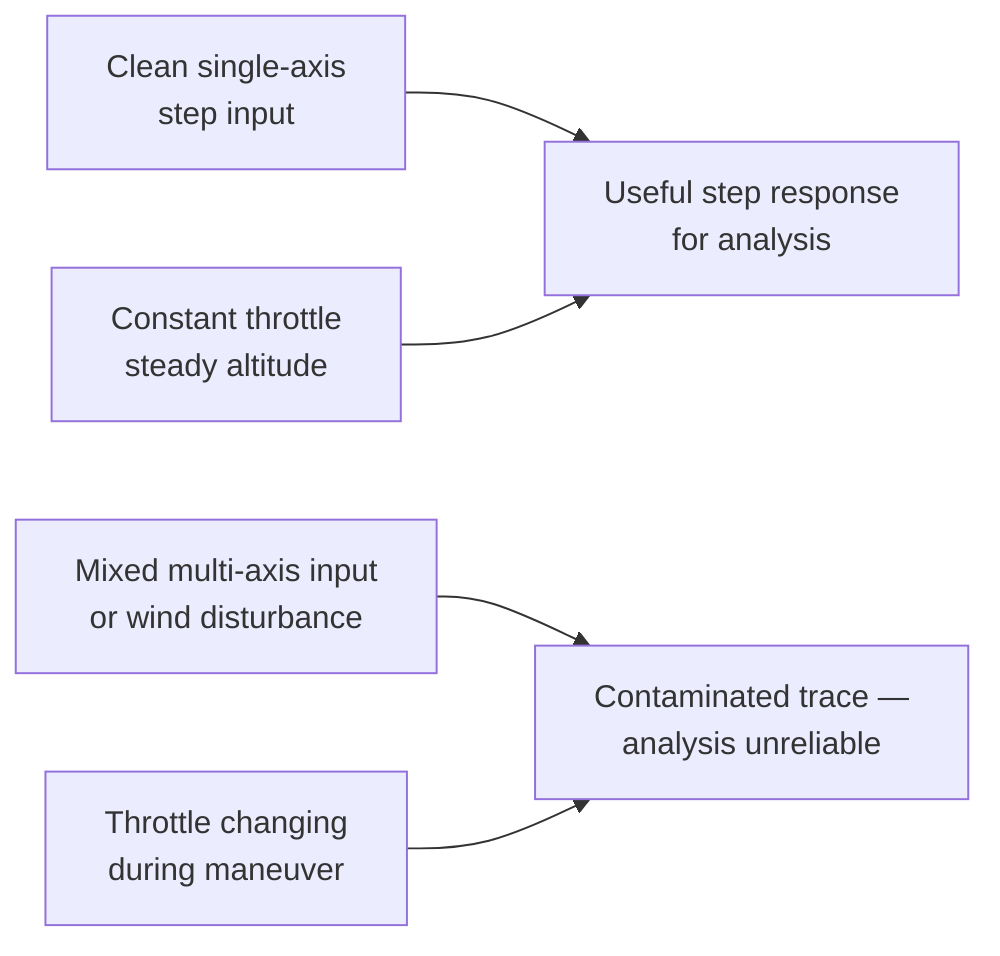

Norint gauti gerus PID analizės rezultatus, reikia konkrečios skrydžio sekos. Freestyle log'ai derinimui beveik nenaudingi — įvestys per daug chaotiškos, ašys persidengia, o gazas niekada nepastovus (taip, mano pirmieji „derinimo“ log'ai buvo būtent tokie — grynas menas, jokių duomenų). Šis protokolas apima tikslius judesius, kurie generuoja švarius, atskiriamus duomenis, reikalingus step response analizei, spektrinei analizei ir DI paremtai interpretacijai.

Čia aprašyti judesiai — ta pati seka, kurią Betaflight CHIRP autotune funkcija atlieka automatiškai. Rankiniam ir DI paremtam derinimui, atliekant juos sąmoningai, gauni lygiavertę duomenų kokybę.

Rylo gali analizuoti bet kokį `.bbl` log'ą, kurį sukuri pagal šį protokolą, ir duoti tau pilną step response, spektrinį triukšmo lygį ir PID rekomendacijas. → **[Išbandyk Rylo](https://app.sintra.ai/community/helpers/rylo)**

---

## Kodėl skrydžio duomenų kokybė svarbi

Bet kokio derinimo log'o tikslas — **maksimalus signalas, minimali tarša**:

- **Signalas** = drono atsakas į žinomą, kartotiną įvestį vienoje ašyje
- **Tarša** = vėjas, vienalaikės kelių ašių įvestys, gazo pokyčiai, ground effect, vibracija dėl propellerio pažeidimo

Step response analizė (skaičiuojanti, kaip greitai ir švariai dronas seka užsakytą rate) daro prielaidą, kad įvestis yra švarus step — o ne dreifas ar wobble. Jei roll ir pitch juda tuo pačiu metu, nei viena ašis negali būti švariai išanalizuota.



---

## Pasiruošimas prieš skrydį

### Betaflight konfigūracija

Prieš bet kokį derinimo skrydį:

```
# Verify in CLI:
get blackbox_device     # SPIFLASH or SDCARD — not USB
get blackbox_sample_rate  # should be 1/1 (full rate) or 1/2

# Debug mode — choose based on your goal:
# For spectral/chirp analysis:
set debug_mode = FFT_FREQ   # logs the detected noise-peak frequencies
# For CHIRP autotune:
set debug_mode = CHIRP

save
```

### Slankiklių pre-konfigūracija

Bet kokiam derinimo duomenų skrydžiui nustatyk tai prieš arming:

| Slankiklis | Reikšmė | Kodėl |
|--------|-------|-----|
| Stick Response (FF) | **0** | FF įleidžia savo laiko artefaktą į step response |
| Dynamic Damping (D-max) | **0** | Laiko D pastovų, kad jis nekistų su įvesties greičiu |
| Visi kiti | 1.0 (numatytoji) ar tavo dabartinė reikšmė | Nekeisk sesijos viduryje |

### Ištrink flash

Visada trink prieš specialiai skirtą derinimo sesiją:

```
blackbox erase
# Wait for CLI confirmation, then disconnect and arm
```

Netrinant turėsi kelis bandymus viename faile, todėl segmentų identifikavimas taps varginantis.

---

## Skrydžio seka

### Apžvalga

```mermaid
flowchart TD
    A([Take off<br/>climb to 8–12 m AGL]) --> B
    B([Phase 1<br/>Throttle ramps]) --> C
    C([Phase 2<br/>Steady hover baseline]) --> D
    D([Phase 3<br/>Roll axis inputs]) --> E
    E([Phase 4<br/>Pitch axis inputs]) --> F
    F([Phase 5<br/>Yaw axis inputs]) --> G
    G([Phase 6<br/>Single-axis flips]) --> H
    H([Disarm cleanly<br/>do not fly around after])

    style A fill:#1a2a1a,stroke:#4a8a4a
    style H fill:#1a2a1a,stroke:#4a8a4a
```



**Tikslinis aukštis: 8–12 m AGL.** Pakankamai aukštai, kad būtum už ground effect (>2 propellerių skersmenys), pakankamai žemai, kad būtum aiškiai matomas. Neskrisk stipresniame nei ~15 km/h vėjyje — vėjas prideda trikdžių triukšmo, kuris užgožia signalą.

---

### 1 fazė — Gazo ramp'ai

**Trukmė**: ~30 s | **Paskirtis**: variklių triukšmo spektro žemėlapis per visą RPM diapazoną

Sklandus, lėtas gazo ramp nuo minimalaus kabėjimo iki maksimalaus gazo ir atgal. Jokių stick'o įvesčių — tik gazas.

- Padaryk **2–3 pilnus ramp'us**
- Palaikyk ties pilnu gazu ~2 s prieš leisdamasis atgal
- Likk pozicijoje (naudok stick trim, jei reikia) — bet **nedaryk sąmoningų pitch/roll korekcijų**

**Ką tai užfiksuoja:** variklių triukšmo harmonikos šluoja per visus dažnius, kylant ir krentant RPM. Būtent tai leidžia spektriniam analizatoriui identifikuoti, kur variklių harmonikos sėdi kruizuojant prieš pilną gazą.

> **Idealu:** sklandus tęstinis ramp. Pjūklas = nelygus gazas = mažiau švarūs duomenys.

---

### 2 fazė — Stabilus kabėjimo baseline

**Trukmė**: ~30–40 s | **Paskirtis**: triukšmo lygio momentinė nuotrauka be jokio užsakyto judesio

Laikyk poziciją ties pastoviu aukščiu, minimalios stick'o korekcijos. Tikslas — beveik nulinės įvesties kabėjimas.

**Ką tai užfiksuoja:** triukšmo lygį, nesant sąmoningų įvesčių. Tai atskaitos taškas, naudojamas filtrų efektyvumui įvertinti. Jei matai triukšmą šioje fazėje, tai mechaninė ar filtro problema — ne derinimo problema.

> **2" Ripper pastaba:** ground effect labiau ryškus ant mažų rėmų (mažesnis disko plotas). Pakilk virš 1,5 m prieš pradėdamas kabėjimo baseline.

---

### 3 fazė — Roll ašies step įvestys

**Trukmė**: ~40–60 s | **Paskirtis**: roll step response duomenys

Atlik greitas, **pilno atlenkimo kairė-dešinė roll įvestis** su trumpomis pauzėmis tarp jų:

1. Snap kairį stick'ą į pilną roll-left, laikyk 0,3–0,5 s
2. Grįžk į centrą, laikyk 0,3 s
3. Snap į pilną roll-right, laikyk 0,3–0,5 s
4. Grįžk į centrą, laikyk 0,3 s
5. Pakartok 10–15 ciklų

**Kritinės taisyklės:**
- Nulinė pitch įvestis roll ciklų metu
- Pastovus gazas (reguliuok tik aukščiui išlaikyti)
- Skrisk acro mode — angle mode kryžmiškai sujungia ašis ir teršia roll kreivę

**Ką tai užfiksuoja:** švarius roll step response. Gyro kreivė parodys, kaip faktinis sukimosi rate seka (ar peršoka/atsilieka) užsakytą rate kiekviename step.

> **Jei naudoji Betaflight CHIRP mode:** perjunk chirp ant roll ašies ir leisk FC vykdyti automatiškai. Jis autonomiškai atliks dažnio sweep nuo ~1 Hz iki ~600 Hz. Palauk, kol OSD parodys **"chirp execution finished"**, prieš eidamas toliau.

---

### 4 fazė — Pitch ašies step įvestys

**Trukmė**: ~40–60 s | **Paskirtis**: pitch step response duomenys (atskirai nuo roll)

Tas pats protokolas kaip 3 fazėje, bet ant pitch ašies:

1. Snap pirmyn (pitch nosis žemyn), laikyk 0,3–0,5 s
2. Grįžk į centrą, laikyk 0,3 s
3. Snap atgal (pitch nosis aukštyn), laikyk 0,3–0,5 s
4. Grįžk į centrą, laikyk 0,3 s
5. Pakartok 10–15 ciklų

**Nemaišyk roll į šias įvestis.** Tikslas — grynas pitch.

**Kodėl atskirai nuo roll:** pitch inercija dažnai skiriasi nuo roll (ypač su GoPro ar baterija priekyje CG). Tarša nuo vienalaikių roll įvesčių užmaskuoja skirtumą ir neleidžia pitch-specifinės analizės.

> **CHIRP mode:** perjunk chirp ant pitch ašies. Palauk execution finished.

---

### 5 fazė — Yaw ašies įvestys

**Trukmė**: ~30 s | **Paskirtis**: yaw charakterizavimas

Greitos kairė-dešinė yaw įvestys:

1. Snap yaw-left, laikyk 0,5 s
2. Centras, laikyk 0,3 s
3. Snap yaw-right, laikyk 0,5 s
4. Pakartok 8–10 ciklų

Yaw dronuose yra per silpnai valdomas (tik du varikliai varo yaw), todėl atsakas visada bus lėtesnis nei roll/pitch. Tai normalu.

> **CHIRP mode:** perjunk chirp ant yaw ašies. Palauk execution finished.

---

### 6 fazė — Vienos ašies flip'ai ir roll'ai

**Trukmė**: ~30 s | **Paskirtis**: aukšto kampinio rate duomenys ir propwash charakterizavimas

Atlik **vienos ašies** flip ir roll manevrus:

- 3–4 pilni roll'ai (grynas roll, be pitch)
- 3–4 pilni flip'ai (grynas pitch, be roll)
- 3–4 yaw spin'ai (grynas yaw)

Tai generuoja aukšto kampinio rate duomenis, kurie stresuoja PID kilpą kitaip nei lėtos step įvestys aukščiau. Jie taip pat gamina gazo numetimus ir leidimusis, kurie atskleidžia propwash elgseną.

> **Po 6 fazės: nusileisk iškart.** Netęsk freestyle skraidymo. Derinimo log'as užbaigtas. Papildomas nekontroliuojamas skraidymas tik prideda triukšmo ir apsunkina reikiamų segmentų identifikavimą. Žinau, pagunda „dar vieną ratą“ didelė — bet tą ratą palik kitai baterijai.

---

### Pilnos CHIRP sekos santrauka

Jei naudoji Betaflight CHIRP autotune (reikalauja firmware su įjungta CHIRP funkcija):

| Žingsnis | Kas vyksta | Trukmė |
|------|-------------|---------|
| Gazo ramp'ai (rankinis) | Variklių spektro sweep | ~30 s |
| Chirp — Roll | FC auto-vykdo roll dažnio sweep | ~15–20 s |
| Chirp — Pitch | FC auto-vykdo pitch dažnio sweep | ~15–20 s |
| Chirp — Yaw | FC auto-vykdo yaw dažnio sweep | ~15–20 s |
| Pakartok chirp roll/pitch/yaw | Antras praėjimas koherencijai | ~45–60 s |
| Vienos ašies flip'ai (rankinis) | Aukšto rate duomenys + propwash | ~30 s |
| **Nusileisk ir disarm** | | |

Kad CHIRP veiktų, turi būti nustatytas `debug_mode = CHIRP` ir CHIRP mode turi būti ant jungiklio. OSD rodys **"chirp execution finished"**, kai kiekvienos ašies sweep bus baigtas.

**Koherencijos patikra po skrydžio:** įkėlus log'ą į Betaflight autotune analizatorių, ieškok „Petrova linijos“ — ryškaus, tęstinio įstrižo pėdsako spektrogramoje nuo žemo iki aukšto dažnio. Jei ši linija blanki ar jos nėra, chirp signalas nebuvo užfiksuotas teisingai. Dažnos priežastys: neteisingas debug mode, per žemas blackbox sample rate arba perteklinis vėjas. Išmesk ir perskrisk.

> **Koherencijos tikslas:** aukštesni 80-tieji iki 90-tųjų % ašiai. Žemiau 80% = nepatikimi duomenys tai ašiai.

---

## Kaip atrodo „geri duomenys“

### Blackbox Explorer'yje

Kai įkeli log'ą ir žiūri gyro + setpoint perdengimą 3 fazei (roll įvestys):

- Setpoint kreivė: švarūs stačiakampiai step'ai — plokščia viršūnė, greiti kraštai
- Gyro kreivė: seka setpoint su trumpu vėlinimu, tada nusistovi. Neturi oscilliuoti ar smukti.
- Variklių kreivės: visos keturios panašios amplitudės — jei vienas variklis ženkliai garsesnis, patikrink tą variklį/propellerį

**Raudonos vėliavos:**

| Ką matai | Problema |
|-------------|---------|
| Setpoint dantytas / ne stačiakampis | Per daug RC smoothing arba stick'o įvestis nešvari |
| Gyro kreivė oscilliuoja po kiekvieno step | P/D disbalansas — pereik prie derinimo |
| Gyro kreivė niekada nepasiekia setpoint | I per mažas arba P per mažas |
| Roll ir pitch gyro abu juda roll įvesčių metu | Angle mode kryžminis sujungimas arba yaw sujungimas — perjunk į acro |
| Variklių kreivės nepastovios / spike'uoja | Propellerio pažeidimas, laisvas variklio varžtas, kondensatoriaus problema — sutvarkyk prieš analizę |

### Spektrinė kokybė

Spektriniame vaizde (2 fazė — kabėjimo baseline):

- Variklių harmonikų pikai: aukšti ir siauri, sekantys su gazu
- Triukšmo lygis tarp harmonikų: žemiau −30 dB (žemiau −40 dB yra idealu)
- Jokių fiksuoto dažnio pikų, nepriklausomų nuo gazo (tie yra mechaniniai)

---

## Sąlygų kontrolinis sąrašas

Prieš skrisdamas derinimo sesiją:

- [ ] Vėjas < 15 km/h (idealiai < 8 km/h)
- [ ] Švieži propelleriai — jokių įskilimų, subalansuoti
- [ ] Pilna baterija — įtampos kritimas veikia vėlinimo matavimą
- [ ] Atvira oro erdvė — jokių medžių, kuriuos reikia apeiti (jokių priverstinių kelių ašių korekcijų)
- [ ] Flash ištrintas — švari log pradžia
- [ ] FF slankiklis ties 0, D-max slankiklis ties 0
- [ ] Nustatytas teisingas debug mode (`FFT_FREQ` arba `CHIRP`)
- [ ] Blackbox sample rate: 1/1 dydžiams 2–3", priimtina iki 1/2 dydžiams 5"+

---

## Analizė po skrydžio

Kai turi log'ą:

**Variantas A — Rylo (DI paremta):**
Pasidalink `.bbl` failu su Rylo ir aprašyk skrydį: kurie segmentai turi kurias fazes, kokio dydžio build, kokia firmware versija. Rylo paleis bbl-analyzer skill'ą ir grąžins:
- Step response kreivę kiekvienai ašiai
- 50% rise time (vėlinimo metrika)
- Triukšmo lygio įvertinimą
- Konkrečias PID korekcijos rekomendacijas

→ **[Pasikalbėk su Rylo](https://app.sintra.ai/community/helpers/rylo)**

**Variantas B — Betaflight Autotune skirtukas (tik CHIRP skrydžiams):**
Įkelk log'ą į master/2026 Betaflight Configurator autotune puslapį. Peržiūrėk keturis grafikus (magnitude tracking, phase delay, sensitivity, step response) prieš imdamasis PID rekomendacijų — 2026 leidime rekomendacijos yra naudingas rodiklis, bet neturi būti taikomos aklai. Įsitikink, kad step response grafikas atrodo teisingai, prieš taikydamas bet kokius gain'us.

**Variantas C — rankinis Blackbox Explorer:**
Pilnos rankinės analizės eigos, naudojant vien nemokamus įrankius, žiūrėk [Wobble-Test PID Protocol](../pid-tuning-wobble-test/).

---

## Susiję snippet'ai

- [Wobble-Test PID Protocol](../pid-tuning-wobble-test/) — pilna rankinio derinimo eiga naudojant šiuos duomenis
- [BBL-Based PID Tuning Protocol](../bbl-pid-tuning-protocol/) — step response analizės metodologija
- [Betaflight Tuning Math](../betaflight-tuning-math/) — matematika, slypinti už to, ką matuoja šie grafikai
- [Propwash](../../aerodynamics/propwash/) — kodėl 6 fazės duomenys atskleidžia propwash elgseną
