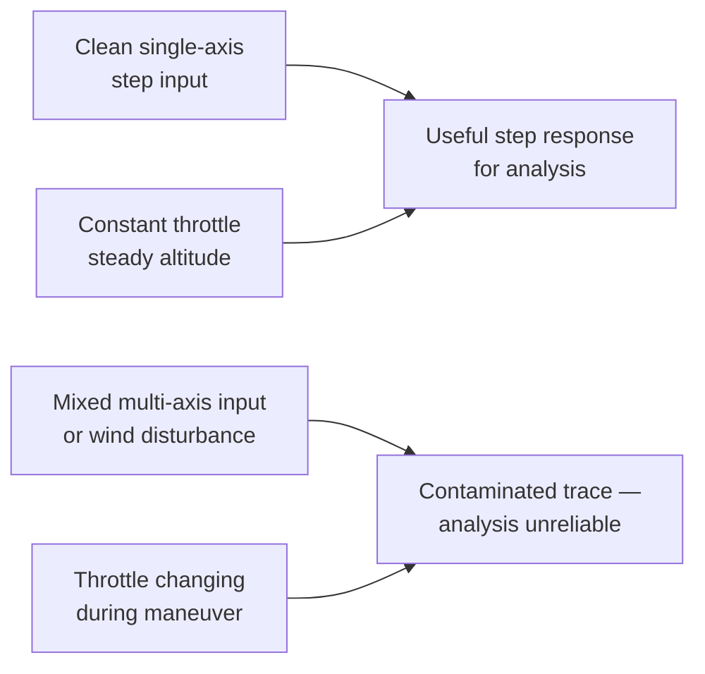

Getting good PID analysis results requires a specific flight sequence. Freestyle logs are almost useless for tuning — the inputs are too chaotic, axes overlap, and throttle is never constant. This protocol covers the exact movements that generate the clean, separable data needed for step response analysis, spectral analysis, and AI-assisted interpretation.

The movements described here are the same sequence the Betaflight CHIRP autotune feature performs automatically. For manual and AI-assisted tuning, executing them deliberately gives you equivalent data quality.

Rylo can analyze any `.bbl` log you produce from this protocol and give you a full step response, spectral noise floor, and PID recommendations. → **[Try Rylo](https://app.sintra.ai/community/helpers/rylo)**

---

## Why Flight Data Quality Matters

The goal of any tuning log is **maximum signal, minimum contamination**:

- **Signal** = the quad's response to a known, repeatable input on a single axis
- **Contamination** = wind, simultaneous multi-axis inputs, throttle changes, ground effect, vibration from prop damage

Step response analysis (computing how quickly and cleanly the quad follows a commanded rate) assumes the input is a clean step — not a drift or a wobble. If both roll and pitch move at the same time, neither axis can be cleanly analyzed.



---

## Pre-Flight Setup

### Betaflight Configuration

Before any tuning flight:

```
# Verify in CLI:
get blackbox_device     # SPIFLASH or SDCARD — not USB
get blackbox_sample_rate  # should be 1/1 (full rate) or 1/2

# Debug mode — choose based on your goal:
# For spectral/chirp analysis:
set debug_mode = FFT_FREQ   # BF 4.5+ (replaced GYRO_SCALED)
# For CHIRP autotune:
set debug_mode = CHIRP

save
```

### Slider Pre-Configuration

For any tuning data flight, set these before arming:

| Slider | Value | Why |
|--------|-------|-----|
| Stick Response (FF) | **0** | FF injects its own timing artifact into the step response |
| Dynamic Damping (D-max) | **0** | Keeps D constant so it doesn't vary with input speed |
| All others | 1.0 (default) or your current value | Do not change mid-session |

### Erase Flash

Always erase before a dedicated tuning session:

```
blackbox erase
# Wait for CLI confirmation, then disconnect and arm
```

Without erasing, you'll have multiple runs in one file, making segment identification tedious.

---

## The Flight Sequence

### Overview

```mermaid
flowchart TD
    A([Take off<br/>climb to 8–12 m AGL]) --> B
    B([Phase 1<br/>Throttle ramps]) --> C
    C([Phase 2<br/>Steady hover baseline]) --> D
    D([Phase 3<br/>Roll axis inputs]) --> E
    E([Phase 4<br/>Pitch axis inputs]) --> F
    F([Phase 5<br/>Yaw axis inputs]) --> G
    G([Phase 6<br/>Single-axis flips]) --> H
    H([Disarm cleanly<br/>do not fly around after])

    style A fill:#1a2a1a,stroke:#4a8a4a
    style H fill:#1a2a1a,stroke:#4a8a4a
```



**Target altitude: 8–12 m AGL.** High enough to be out of ground effect (>2 prop diameters), low enough to be clearly visible. Do not fly in wind stronger than ~15 km/h — wind adds disturbance noise that obscures the signal.

---

### Phase 1 — Throttle Ramps

**Duration**: ~30 s | **Purpose**: Map motor noise spectrum across the full RPM range

Smooth, slow throttle ramp from minimum hover to maximum throttle and back. No stick inputs — just throttle.

- Do **2–3 complete ramps**
- Hold at full throttle for ~2 s before ramping back down
- Stay in position (use stick trim if needed) — but **do not make deliberate pitch/roll corrections**

**What this captures:** The motor noise harmonics sweep through all frequencies as RPM rises and falls. This is what lets the spectral analyser identify where motor harmonics sit at cruise vs full throttle.

> **Ideal:** a smooth continuous ramp. Sawtooth = bumpy throttle = less clean data.

---

### Phase 2 — Steady Hover Baseline

**Duration**: ~30–40 s | **Purpose**: Noise floor snapshot without any commanded motion

Hold station at constant altitude, minimum stick corrections. The goal is a near-zero-input hover.

**What this captures:** The noise floor in the absence of deliberate inputs. This is the reference used to evaluate filter effectiveness. If you see noise in this phase, it's a mechanical or filter problem — not a tuning problem.

> **2" Ripper note:** Ground effect is more pronounced on small frames (smaller disk area). Get above 1.5 m before starting the hover baseline.

---

### Phase 3 — Roll Axis Step Inputs

**Duration**: ~40–60 s | **Purpose**: Roll step response data

Execute rapid, **full-deflection left-right roll inputs** with brief pauses in between:

1. Snap left stick to full roll-left, hold 0.3–0.5 s
2. Return to center, hold 0.3 s
3. Snap to full roll-right, hold 0.3–0.5 s
4. Return to center, hold 0.3 s
5. Repeat 10–15 cycles

**Critical rules:**
- Zero pitch input during roll cycles
- Constant throttle (adjust only to maintain altitude)
- Fly in acro mode — angle mode cross-couples axes and pollutes the roll trace

**What this captures:** Clean roll step responses. The gyro trace will show how the actual rotation rate follows (or overshoots/lags) the commanded rate on each step.

> **If using Betaflight CHIRP mode:** switch in chirp on roll axis and let the FC execute automatically. It will perform a frequency sweep from ~1 Hz to ~600 Hz autonomously. Wait for the OSD to show **"chirp execution finished"** before moving on.

---

### Phase 4 — Pitch Axis Step Inputs

**Duration**: ~40–60 s | **Purpose**: Pitch step response data (separate from roll)

Same protocol as Phase 3, but on the pitch axis:

1. Snap forward (pitch nose down), hold 0.3–0.5 s
2. Return to center, hold 0.3 s
3. Snap back (pitch nose up), hold 0.3–0.5 s
4. Return to center, hold 0.3 s
5. Repeat 10–15 cycles

**Do not mix roll into these inputs.** Pure pitch is the target.

**Why separate from roll:** Pitch inertia is often different from roll (especially with a GoPro or battery forward of CG). Contamination from simultaneous roll inputs masks the difference and prevents pitch-specific analysis.

> **CHIRP mode:** switch in chirp on pitch axis. Wait for execution finished.

---

### Phase 5 — Yaw Axis Inputs

**Duration**: ~30 s | **Purpose**: Yaw characterization

Rapid left-right yaw inputs:

1. Snap yaw-left, hold 0.5 s
2. Center, hold 0.3 s
3. Snap yaw-right, hold 0.5 s
4. Repeat 8–10 cycles

Yaw is under-actuated on quads (only two motors drive yaw) so the response will always be slower than roll/pitch. This is expected.

> **CHIRP mode:** switch in chirp on yaw axis. Wait for execution finished.

---

### Phase 6 — Single-Axis Flips and Rolls

**Duration**: ~30 s | **Purpose**: High-angular-rate data and propwash characterization

Execute **single-axis** flip and roll maneuvers:

- 3–4 full rolls (pure roll, no pitch)
- 3–4 full flips (pure pitch, no roll)
- 3–4 yaw spins (pure yaw)

These generate high-angular-rate data that stresses the PID loop differently from the slow step inputs above. They also produce the throttle chops and descents that expose propwash behaviour.

> **After Phase 6: land immediately.** Do not continue with freestyle flying. The tuning log is complete. Additional uncontrolled flying only adds noise and makes the relevant segments harder to identify.

---

### Complete CHIRP Sequence Summary

If using Betaflight CHIRP autotune (requires firmware with CHIRP feature enabled):

| Step | What happens | Duration |
|------|-------------|---------|
| Throttle ramps (manual) | Motor spectrum sweep | ~30 s |
| Chirp — Roll | FC auto-executes roll frequency sweep | ~15–20 s |
| Chirp — Pitch | FC auto-executes pitch frequency sweep | ~15–20 s |
| Chirp — Yaw | FC auto-executes yaw frequency sweep | ~15–20 s |
| Repeat chirp roll/pitch/yaw | Second pass for coherence | ~45–60 s |
| Single-axis flips (manual) | High-rate data + propwash | ~30 s |
| **Land and disarm** | | |

For CHIRP to work, `debug_mode = CHIRP` must be set and the CHIRP mode must be on a switch. The OSD will display **"chirp execution finished"** when each axis sweep is complete.

**Coherence check after the flight:** When you load the log into the Betaflight autotune analyser, look for the "Petrova line" — a bright, continuous diagonal trace in the spectrogram from low to high frequency. If this line is faint or absent, the chirp signal was not captured correctly. Common causes: wrong debug mode, blackbox sample rate too low, or excessive wind. Discard and re-fly.

> **Coherence target:** Upper 80s to 90s% per axis. Below 80% = unreliable data for that axis.

---

## What "Good Data" Looks Like

### In Blackbox Explorer

When you load the log and look at the gyro + setpoint overlay for Phase 3 (roll inputs):

- Setpoint trace: clean rectangular steps — flat top, fast edges
- Gyro trace: follows setpoint with a brief lag then settles. Should not oscillate or droop.
- Motor traces: all four similar amplitude — if one motor is significantly louder, check that motor/prop

**Red flags:**

| What you see | Problem |
|-------------|---------|
| Setpoint is jagged / not rectangular | Too much RC smoothing, or stick input not clean |
| Gyro trace oscillates after each step | P/D imbalance — proceed to tuning |
| Gyro trace never reaches setpoint | I too low, or P too low |
| Roll and pitch gyro both moving during roll inputs | Angle mode cross-coupling, or yaw coupling — switch to acro |
| Motor traces erratic / spiking | Prop damage, loose motor screw, cap issue — fix before analysis |

### Spectral Quality

In the spectral view (Phase 2 — hover baseline):

- Motor harmonic peaks: tall and narrow, tracking with throttle
- Noise floor between harmonics: below −30 dB (below −40 dB is ideal)
- No fixed-frequency peaks independent of throttle (those are mechanical)

---

## Conditions Checklist

Before flying a tuning session:

- [ ] Wind < 15 km/h (ideally < 8 km/h)
- [ ] Fresh props — no chips, balanced
- [ ] Full battery — voltage sag affects latency measurement
- [ ] Open airspace — no trees to dodge (no forced multi-axis corrections)
- [ ] Flash erased — clean log start
- [ ] FF slider at 0, D-max slider at 0
- [ ] Correct debug mode set (`FFT_FREQ` or `CHIRP`)
- [ ] Blackbox sample rate: 1/1 for 2–3", acceptable to 1/2 for 5"+

---

## Analysis After the Flight

Once you have the log:

**Option A — Rylo (AI-assisted):**
Share the `.bbl` file with Rylo and describe the flight: which segments contain which phases, what size build, what firmware version. Rylo will run the bbl-analyzer skill and return:
- Step response curve for each axis
- 50% rise time (latency metric)
- Noise floor assessment
- Specific PID adjustment recommendations

→ **[Talk to Rylo](https://app.sintra.ai/community/helpers/rylo)**

**Option B — Betaflight Autotune tab (CHIRP flights only):**
Load the log in the master/2026 Betaflight Configurator autotune page. Review the four graphs (magnitude tracking, phase delay, sensitivity, step response) before acting on the PID recommendations — as of the 2026 release the recommendations are a useful indicator but should not be applied blindly. Verify the step response graph looks correct before applying any gains.

**Option C — Manual Blackbox Explorer:**
See [Wobble-Test PID Protocol](../pid-tuning-wobble-test/) for the full manual analysis workflow using free tools only.

---

## Related Snippets

- [Wobble-Test PID Protocol](../pid-tuning-wobble-test/) — the full manual tuning workflow using this data
- [BBL-Based PID Tuning Protocol](../bbl-pid-tuning-protocol/) — step response analysis methodology
- [Betaflight Tuning Math](../betaflight-tuning-math/) — the math behind what these graphs measure
- [Propwash](../../aerodynamics/propwash/) — why Phase 6 data exposes propwash behaviour
