Easy-level AI/ML interview questions with LangChain examples and Mermaid diagrams.

## Q1: What is the difference between supervised and unsupervised learning?

**Answer**:



```mermaid
graph TB
    subgraph Supervised["🎯 Supervised Learning"]
        A1[Labeled Data<br/>X, y pairs] --> B1[Train Model]
        B1 --> C1[Predict y<br/>for new X]
        style A1 fill:#90EE90
        style C1 fill:#87CEEB
    end
    
    subgraph Unsupervised["🔍 Unsupervised Learning"]
        A2[Unlabeled Data<br/>X only] --> B2[Find Patterns]
        B2 --> C2[Clusters/<br/>Structure]
        style A2 fill:#FFB6C1
        style C2 fill:#DDA0DD
    end
```

**Supervised**: Has labels (input → output mapping)
**Unsupervised**: No labels (discover structure)

**LangChain Example**:
```python
from langchain.prompts import FewShotPromptTemplate, PromptTemplate
from langchain.llms import OpenAI

# Supervised: Few-shot learning with labeled examples
examples = [
    {"text": "I love this product!", "label": "Positive"},
    {"text": "Terrible experience.", "label": "Negative"},
    {"text": "It's okay.", "label": "Neutral"}
]

example_prompt = PromptTemplate(
    input_variables=["text", "label"],
    template="Text: {text}\nSentiment: {label}"
)

few_shot_prompt = FewShotPromptTemplate(
    examples=examples,
    example_prompt=example_prompt,
    prefix="Classify sentiment:",
    suffix="Text: {input}\nSentiment:",
    input_variables=["input"]
)

llm = OpenAI()
result = llm(few_shot_prompt.format(input="This is amazing!"))
```

---

## Q2: Explain the ML pipeline.

**Answer**:


**LangChain Pipeline**:
```python
from langchain.chains import SequentialChain, LLMChain
from langchain.prompts import PromptTemplate

# Stage 1: Preprocess
preprocess = LLMChain(
    llm=OpenAI(),
    prompt=PromptTemplate(
        input_variables=["raw_text"],
        template="Clean this text: {raw_text}\nCleaned:"
    ),
    output_key="cleaned"
)

# Stage 2: Extract features
extract = LLMChain(
    llm=OpenAI(),
    prompt=PromptTemplate(
        input_variables=["cleaned"],
        template="Extract key topics: {cleaned}\nTopics:"
    ),
    output_key="topics"
)

# Stage 3: Classify
classify = LLMChain(
    llm=OpenAI(),
    prompt=PromptTemplate(
        input_variables=["topics"],
        template="Classify: {topics}\nCategory:"
    ),
    output_key="category"
)

# Complete pipeline
pipeline = SequentialChain(
    chains=[preprocess, extract, classify],
    input_variables=["raw_text"],
    output_variables=["cleaned", "topics", "category"]
)

result = pipeline({"raw_text": "Check out this AI tool!!!"})
```

---

## Q3: What is overfitting?

**Answer**:


**Prevention**: More data, regularization, cross-validation, early stopping

**LangChain Example**:
```python
# Overfitting in few-shot: Too many examples memorized
# Good balance: 3-5 diverse examples

from langchain.prompts import FewShotPromptTemplate

# Good: Balanced examples
good_examples = [
    {"input": "I love this!", "output": "Positive"},
    {"input": "Terrible.", "output": "Negative"},
    {"input": "It's okay.", "output": "Neutral"}
]

# Overfitting: Too specific, won't generalize
overfit_examples = [
    {"input": "I love this product!", "output": "Positive"},
    {"input": "I love this service!", "output": "Positive"},
    {"input": "I love this app!", "output": "Positive"},
    # ... 20 more similar examples
]
```

---

## Q4: Explain precision vs. recall.

**Answer**:

```mermaid
graph TB
    subgraph ConfusionMatrix["Confusion Matrix"]
        A[Predicted<br/>Positive] --> TP[True<br/>Positive]
        A --> FP[False<br/>Positive]
        B[Predicted<br/>Negative] --> FN[False<br/>Negative]
        B --> TN[True<br/>Negative]
        
        style TP fill:#90EE90
        style TN fill:#90EE90
        style FP fill:#FF6B6B
        style FN fill:#FF6B6B
    end
    
    TP --> P[Precision<br/>TP/(TP+FP)]
    TP --> R[Recall<br/>TP/(TP+FN)]
    FP --> P
    FN --> R
```

**Precision**: Of predicted positives, how many correct?
**Recall**: Of actual positives, how many found?

**LangChain Evaluation**:
```python
from langchain.evaluation import load_evaluator

evaluator = load_evaluator("labeled_criteria", llm=OpenAI())

predictions = [
    {"input": "I love this!", "output": "Positive", "reference": "Positive"},  # TP
    {"input": "It's okay.", "output": "Positive", "reference": "Neutral"},     # FP
    {"input": "Terrible!", "output": "Negative", "reference": "Negative"},     # TN
    {"input": "Not good.", "output": "Neutral", "reference": "Negative"}       # FN
]

# Calculate metrics
tp = sum(1 for p in predictions if p["output"] == p["reference"] == "Positive")
fp = sum(1 for p in predictions if p["output"] == "Positive" != p["reference"])
fn = sum(1 for p in predictions if p["output"] != "Positive" == p["reference"])

precision = tp / (tp + fp) if (tp + fp) > 0 else 0
recall = tp / (tp + fn) if (tp + fn) > 0 else 0
```

---

## Q5: What is cross-validation?

**Answer**:


**Purpose**: Robust evaluation using all data

**LangChain Example**:
```python
from langchain.evaluation import load_evaluator
import numpy as np

def cross_validate_prompt(examples, k=5):
    fold_size = len(examples) // k
    scores = []
    
    for i in range(k):
        # Split data
        test_start = i * fold_size
        test_end = test_start + fold_size
        
        test_set = examples[test_start:test_end]
        train_set = examples[:test_start] + examples[test_end:]
        
        # Create prompt with training examples
        few_shot_prompt = create_few_shot_prompt(train_set)
        
        # Evaluate on test set
        evaluator = load_evaluator("criteria", llm=OpenAI())
        fold_score = evaluate_test_set(few_shot_prompt, test_set, evaluator)
        scores.append(fold_score)
    
    return {
        "mean": np.mean(scores),
        "std": np.std(scores)
    }
```

---

## Q6: Classification vs. Regression?

**Answer**:


**LangChain Examples**:
```python
# Classification: Discrete output
classify_chain = LLMChain(
    llm=OpenAI(),
    prompt=PromptTemplate(
        template="Classify: {email}\nCategory: [Spam/Important/Normal]",
        input_variables=["email"]
    )
)
result = classify_chain.run(email="Win free iPhone!")
# Output: "Spam"

# Regression: Continuous output
score_chain = LLMChain(
    llm=OpenAI(),
    prompt=PromptTemplate(
        template="Rate sentiment 0-100: {review}\nScore:",
        input_variables=["review"]
    )
)
result = score_chain.run(review="Pretty good product")
# Output: "72.5"
```

---

## Q7: What is feature engineering?

**Answer**:


**LangChain Example**:
```python
from langchain.chains import TransformChain, SequentialChain

# Extract features
def extract_features(inputs: dict) -> dict:
    text = inputs["text"]
    return {
        "length": len(text),
        "word_count": len(text.split()),
        "has_exclamation": "!" in text,
        "uppercase_ratio": sum(1 for c in text if c.isupper()) / len(text),
        "text": text
    }

feature_chain = TransformChain(
    input_variables=["text"],
    output_variables=["length", "word_count", "has_exclamation", "uppercase_ratio", "text"],
    transform=extract_features
)

# Use features for classification
classify_chain = LLMChain(
    llm=OpenAI(),
    prompt=PromptTemplate(
        template="""Features:
- Text: {text}
- Length: {length}
- Words: {word_count}
- Has !: {has_exclamation}
- Uppercase: {uppercase_ratio}

Sentiment:""",
        input_variables=["text", "length", "word_count", "has_exclamation", "uppercase_ratio"]
    )
)

pipeline = SequentialChain(
    chains=[feature_chain, classify_chain],
    input_variables=["text"]
)
```

---

## Q8: Batch vs. Online Learning?

**Answer**:


**LangChain Example**:
```python
from langchain.vectorstores import FAISS
from langchain.embeddings import OpenAIEmbeddings

# Batch: Index all at once
documents = load_all_documents()
vectorstore = FAISS.from_documents(documents, OpenAIEmbeddings())

# Online: Add incrementally
vectorstore = FAISS.from_documents(initial_docs, OpenAIEmbeddings())

def on_new_document(doc):
    vectorstore.add_documents([doc])  # Incremental update

while True:
    new_doc = wait_for_new_document()
    on_new_document(new_doc)
```

---

## Q9: What is transfer learning?

**Answer**:


**LangChain Example**:
```python
from langchain.llms import OpenAI
from langchain.chains import LLMChain

# Transfer: Use pre-trained LLM for specific task
llm = OpenAI(model="gpt-3.5-turbo")  # Pre-trained

# Adapt to medical domain with few-shot
medical_chain = LLMChain(
    llm=llm,
    prompt=PromptTemplate(
        template="""Medical assistant. Use general knowledge for medical context.

Examples:
Q: What is hypertension?
A: High blood pressure condition.

Q: {question}
A:""",
        input_variables=["question"]
    )
)

# Transfers general knowledge to medical domain
result = medical_chain.run(question="What causes diabetes?")
```

---

## Q10: What is data augmentation?

**Answer**:


**LangChain Example**:
```python
from langchain.chains import LLMChain

# Augment by paraphrasing
augment_chain = LLMChain(
    llm=OpenAI(),
    prompt=PromptTemplate(
        template="""Generate 3 paraphrases preserving meaning:

Original: {text}

Paraphrases:
1.""",
        input_variables=["text"]
    )
)

# Original
original = "I love this product!"

# Generate variations
augmented = augment_chain.run(text=original)

# Now have multiple training examples:
# - "I love this product!"
# - "This product is amazing!"
# - "I'm really happy with this!"
# - "This product is fantastic!"
```

---

## Summary

Key ML concepts with LangChain:
- **Learning types**: Supervised vs. Unsupervised
- **Pipeline**: Data → Model → Deploy
- **Overfitting**: Prevention strategies
- **Metrics**: Precision, Recall
- **Cross-validation**: Robust evaluation
- **Tasks**: Classification vs. Regression
- **Features**: Engineering and extraction
- **Learning modes**: Batch vs. Online
- **Transfer**: Leverage pre-trained models
- **Augmentation**: Increase training data

All with practical LangChain implementations!

