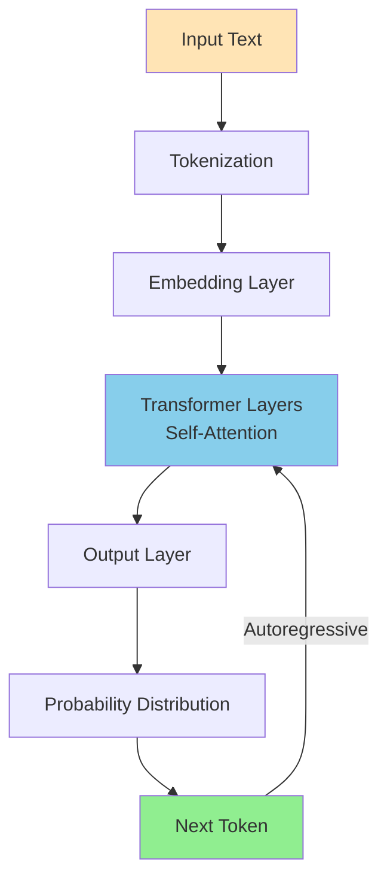
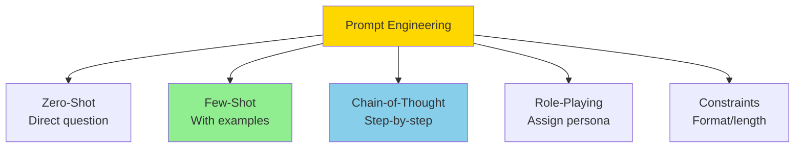
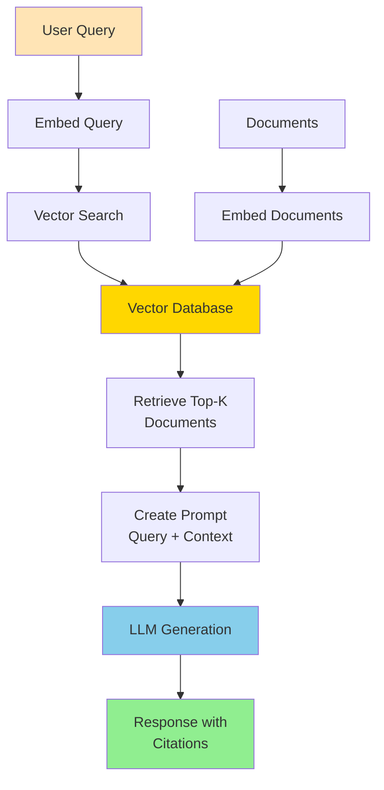

Easy-level LLM and Agentic AI interview questions covering fundamentals, prompting, and basic agent concepts.

## Q1: What is a Large Language Model (LLM)?

**Answer**:

**Definition**: Neural network trained on massive text data to predict next tokens, enabling text generation and understanding.



**Key Characteristics**:
- **Large**: Billions of parameters (GPT-3: 175B, GPT-4: estimated 1.7T)
- **Transformer-based**: Uses self-attention mechanism
- **Pre-trained**: Trained on diverse internet text
- **Few-shot learning**: Can perform tasks with minimal examples

**How It Works**:
1. Input text → tokenized into pieces
2. Each token converted to embedding vector
3. Transformer layers process with attention
4. Output: probability distribution over next tokens
5. Sample or pick most likely token
6. Repeat autoregressively

**LangChain Example**:
```python
from langchain.llms import OpenAI
from langchain.prompts import PromptTemplate
from langchain.chains import LLMChain

# Initialize LLM
llm = OpenAI(temperature=0.7, model_name="gpt-3.5-turbo")

# Create prompt template
template = "The future of {topic} is"
prompt = PromptTemplate(template=template, input_variables=["topic"])

# Create chain
chain = LLMChain(llm=llm, prompt=prompt)

# Generate
result = chain.run(topic="AI")
print(result)
```

**Use Cases**: Text generation, summarization, translation, Q&A, code generation

---

## Q2: What is prompt engineering?

**Answer**:

**Definition**: Crafting input text (prompts) to get desired outputs from LLMs.



**Why It Matters**: LLMs are sensitive to how questions are phrased.

**Basic Techniques**:

### 1. Zero-Shot
Just ask directly:
```
Classify sentiment: "I love this product!"
```

### 2. Few-Shot
Provide examples:
```
Classify sentiment:
"Great service!" → Positive
"Terrible experience." → Negative
"It's okay." → Neutral
"I love this product!" → 
```

### 3. Chain-of-Thought
Ask for step-by-step reasoning:
```
Q: Roger has 5 tennis balls. He buys 2 more cans of 3 balls each. How many balls does he have?
A: Let's think step by step:
1. Roger starts with 5 balls
2. He buys 2 cans with 3 balls each: 2 × 3 = 6 balls
3. Total: 5 + 6 = 11 balls
```

### 4. Role-Playing
Give the model a role:
```
You are an expert Python developer. Explain list comprehensions to a beginner.
```

### 5. Constraints
Specify format/length:
```
Summarize this article in exactly 3 bullet points.
```

**Best Practices**:
- Be specific and clear
- Provide context
- Use examples when possible
- Iterate and refine
- Test different phrasings

**LangChain Implementation**:
```python
from langchain.prompts import (
    FewShotPromptTemplate,
    PromptTemplate,
    ChatPromptTemplate,
    SystemMessagePromptTemplate,
    HumanMessagePromptTemplate
)
from langchain.llms import OpenAI

# Few-Shot Example
examples = [
    {"input": "What's 2+2?", "output": "4"},
    {"input": "What's 5*3?", "output": "15"}
]

example_prompt = PromptTemplate(
    input_variables=["input", "output"],
    template="Input: {input}\nOutput: {output}"
)

few_shot_prompt = FewShotPromptTemplate(
    examples=examples,
    example_prompt=example_prompt,
    prefix="You are a helpful math tutor.",
    suffix="Input: {input}\nOutput:",
    input_variables=["input"]
)

llm = OpenAI(temperature=0)
result = llm(few_shot_prompt.format(input="What's 7+8?"))
print(result)  # Output: 15

# Role-Playing with System Message
system_template = "You are an expert {role}. Explain {topic} to a beginner."
system_prompt = SystemMessagePromptTemplate.from_template(system_template)

human_template = "{question}"
human_prompt = HumanMessagePromptTemplate.from_template(human_template)

chat_prompt = ChatPromptTemplate.from_messages([system_prompt, human_prompt])

from langchain.chat_models import ChatOpenAI
chat = ChatOpenAI()

result = chat(chat_prompt.format_messages(
    role="Python developer",
    topic="list comprehensions",
    question="How do list comprehensions work?"
))
```

---

## Q3: What is temperature in LLM generation?

**Answer**:

**Definition**: Parameter controlling randomness of token selection.

**How It Works**:

Before sampling, divide logits by temperature:
$$
p_i = \frac{e^{z_i / T}}{\sum_j e^{z_j / T}}
$$

where $T$ is temperature.

**Effects**:

**Temperature = 0**: Greedy (always pick most likely)
```
"The sky is" → "blue" (deterministic)
```

**Temperature = 0.7** (default): Balanced creativity
```
"The sky is" → "blue" or "clear" or "bright"
```

**Temperature = 1.5**: Very creative/random
```
"The sky is" → "purple" or "singing" or "infinite"
```

**Implementation**:
```python
import torch
import torch.nn.functional as F

def sample_with_temperature(logits, temperature=1.0):
    """Sample next token with temperature"""
    # Apply temperature
    logits = logits / temperature
    
    # Convert to probabilities
    probs = F.softmax(logits, dim=-1)
    
    # Sample
    next_token = torch.multinomial(probs, num_samples=1)
    
    return next_token

# Example
logits = torch.tensor([2.0, 1.0, 0.5, 0.1])

print("Temperature 0.1 (focused):")
for _ in range(5):
    token = sample_with_temperature(logits, temperature=0.1)
    print(token.item())

print("\nTemperature 2.0 (creative):")
for _ in range(5):
    token = sample_with_temperature(logits, temperature=2.0)
    print(token.item())
```

**When to Use**:
- **Low (0.1-0.5)**: Factual tasks, code generation, translation
- **Medium (0.7-1.0)**: General chat, creative writing
- **High (1.5-2.0)**: Brainstorming, poetry, experimental

---

## Q4: What is an AI agent?

**Answer**:

**Definition**: System that perceives environment, makes decisions, and takes actions to achieve goals.

**LLM-Based Agent**: Uses LLM as reasoning engine to decide actions.

**Core Components**:
1. **Perception**: Observe environment (user input, tool outputs)
2. **Reasoning**: LLM decides what to do
3. **Action**: Execute tools/functions
4. **Memory**: Remember past interactions

**Simple Agent Loop**:
```
while not done:
    observation = get_observation()
    action = llm.decide_action(observation, memory)
    result = execute_action(action)
    memory.add(observation, action, result)
    done = check_if_goal_achieved()
```

**Example Implementation**:
```python
class SimpleAgent:
    def __init__(self, llm, tools):
        self.llm = llm
        self.tools = tools
        self.memory = []
    
    def run(self, task, max_steps=10):
        for step in range(max_steps):
            # Create prompt with task and available tools
            prompt = self._create_prompt(task)
            
            # LLM decides next action
            response = self.llm.generate(prompt)
            action, args = self._parse_action(response)
            
            # Execute action
            if action == "FINISH":
                return args["answer"]
            
            result = self.tools[action](**args)
            
            # Update memory
            self.memory.append({
                "action": action,
                "args": args,
                "result": result
            })
        
        return "Max steps reached"
    
    def _create_prompt(self, task):
        prompt = f"Task: {task}\n\n"
        prompt += "Available tools:\n"
        for name, tool in self.tools.items():
            prompt += f"- {name}: {tool.__doc__}\n"
        
        if self.memory:
            prompt += "\nPrevious actions:\n"
            for mem in self.memory:
                prompt += f"{mem['action']}({mem['args']}) → {mem['result']}\n"
        
        prompt += "\nWhat should I do next? (respond with action and args)"
        return prompt
    
    def _parse_action(self, response):
        # Parse LLM response to extract action and arguments
        # Simplified - real implementation would be more robust
        lines = response.strip().split('\n')
        action = lines[0].split(':')[1].strip()
        args = eval(lines[1].split(':')[1].strip())
        return action, args

# Usage
def search_web(query):
    """Search the web for information"""
    return f"Search results for: {query}"

def calculate(expression):
    """Calculate mathematical expression"""
    return eval(expression)

tools = {
    "search": search_web,
    "calculate": calculate,
    "FINISH": lambda answer: answer
}

agent = SimpleAgent(llm=my_llm, tools=tools)
result = agent.run("What is 15% of 240?")
```

**Types of Agents**:
- **ReAct**: Reasoning + Acting (think, then act)
- **Tool-using**: Can call external functions
- **Conversational**: Maintains dialogue context
- **Multi-agent**: Multiple agents collaborate

---

## Q5: What is Retrieval-Augmented Generation (RAG)?

**Answer**:

**Definition**: Enhance LLM responses by retrieving relevant information from external knowledge base.



**Problem RAG Solves**:
- LLMs have knowledge cutoff date
- Can't access private/proprietary data
- May hallucinate facts

**How RAG Works**:
1. **Index**: Embed documents into vector database
2. **Retrieve**: Find relevant docs for query
3. **Augment**: Add retrieved docs to prompt
4. **Generate**: LLM answers using retrieved context

**LangChain Implementation**:
```python
from langchain.embeddings import OpenAIEmbeddings
from langchain.vectorstores import FAISS
from langchain.text_splitter import CharacterTextSplitter
from langchain.chains import RetrievalQA
from langchain.llms import OpenAI
from langchain.document_loaders import TextLoader

# Load documents
loader = TextLoader('documents.txt')
documents = loader.load()

# Split into chunks
text_splitter = CharacterTextSplitter(chunk_size=1000, chunk_overlap=200)
texts = text_splitter.split_documents(documents)

# Create embeddings and vector store
embeddings = OpenAIEmbeddings()
vectorstore = FAISS.from_documents(texts, embeddings)

# Create RAG chain
llm = OpenAI(temperature=0)
qa_chain = RetrievalQA.from_chain_type(
    llm=llm,
    chain_type="stuff",
    retriever=vectorstore.as_retriever(search_kwargs={"k": 3}),
    return_source_documents=True
)

# Query
query = "Who created Python?"
result = qa_chain({"query": query})

print(f"Answer: {result['result']}")
print(f"\nSources:")
for doc in result['source_documents']:
    print(f"- {doc.page_content[:100]}...")

# Alternative: Custom RAG with more control
from langchain.chains import LLMChain
from langchain.prompts import PromptTemplate

# Custom prompt template
template = """Use the following pieces of context to answer the question at the end.
If you don't know the answer, just say that you don't know, don't try to make up an answer.

Context:
{context}

Question: {question}

Answer:"""

prompt = PromptTemplate(template=template, input_variables=["context", "question"])

# Retrieval + Generation
def rag_query(question, top_k=3):
    # Retrieve
    docs = vectorstore.similarity_search(question, k=top_k)
    context = "\n\n".join([doc.page_content for doc in docs])
    
    # Generate
    chain = LLMChain(llm=llm, prompt=prompt)
    answer = chain.run(context=context, question=question)
    
    return answer, docs

answer, sources = rag_query("What is Python known for?")
print(answer)
```

**Key Components**:
- **Embedding Model**: Convert text to vectors (OpenAI, Cohere, HuggingFace)
- **Vector Database**: Store and search embeddings (FAISS, Pinecone, Weaviate, Chroma)
- **Retrieval Strategy**: Similarity search, MMR, threshold filtering
- **Prompt Template**: How to format context + query

**Benefits**:
- Up-to-date information
- Access to private data
- Reduced hallucinations
- Citable sources

---

## Q6: What is few-shot learning in LLMs?

**Answer**:

**Definition**: LLM learns task from just a few examples in the prompt (no fine-tuning).

**How It Works**: LLM recognizes pattern from examples and applies to new input.

**Example**:
```python
def few_shot_classification(text, examples):
    """Classify text using few-shot learning"""
    prompt = "Classify the sentiment:\n\n"
    
    # Add examples
    for example_text, label in examples:
        prompt += f'Text: "{example_text}"\nSentiment: {label}\n\n'
    
    # Add query
    prompt += f'Text: "{text}"\nSentiment:'
    
    return llm.generate(prompt)

# Usage
examples = [
    ("I love this product!", "Positive"),
    ("Terrible service.", "Negative"),
    ("It's okay, nothing special.", "Neutral")
]

result = few_shot_classification("This is amazing!", examples)
# Output: "Positive"
```

**Variants**:

**Zero-Shot**: No examples
```
Translate to French: "Hello"
```

**One-Shot**: One example
```
Translate to French:
English: "Goodbye" → French: "Au revoir"
English: "Hello" → French:
```

**Few-Shot**: Multiple examples (typically 3-10)

**Why It Works**:
- LLM learned patterns during pre-training
- Examples activate relevant knowledge
- In-context learning (no weight updates)

**Best Practices**:
- Use diverse, representative examples
- Order matters (put similar examples last)
- More examples = better (but limited by context window)
- Balance classes in classification tasks

---

## Q7: What is the context window in LLMs?

**Answer**:

**Definition**: Maximum number of tokens LLM can process at once (input + output).

**Examples**:
- GPT-3.5: 4,096 tokens (~3,000 words)
- GPT-4: 8,192 or 32,768 tokens
- Claude 2: 100,000 tokens
- GPT-4 Turbo: 128,000 tokens

**Why It Matters**:
- Limits how much context you can provide
- Affects RAG (how many documents to include)
- Determines conversation history length

**Token Counting**:
```python
from transformers import GPT2Tokenizer

tokenizer = GPT2Tokenizer.from_pretrained('gpt2')

text = "Hello, how are you today?"
tokens = tokenizer.encode(text)

print(f"Text: {text}")
print(f"Tokens: {tokens}")
print(f"Token count: {len(tokens)}")

# Approximate: 1 token ≈ 0.75 words (English)
# So 1,000 tokens ≈ 750 words
```

**Handling Long Texts**:

1. **Chunking**: Split into smaller pieces
```python
def chunk_text(text, max_tokens=1000):
    tokens = tokenizer.encode(text)
    chunks = []
    
    for i in range(0, len(tokens), max_tokens):
        chunk_tokens = tokens[i:i+max_tokens]
        chunk_text = tokenizer.decode(chunk_tokens)
        chunks.append(chunk_text)
    
    return chunks
```

2. **Summarization**: Summarize long context
```python
def summarize_long_text(text):
    chunks = chunk_text(text)
    summaries = []
    
    for chunk in chunks:
        summary = llm.generate(f"Summarize: {chunk}")
        summaries.append(summary)
    
    # Combine summaries
    combined = " ".join(summaries)
    
    # Final summary if still too long
    if len(tokenizer.encode(combined)) > max_tokens:
        return llm.generate(f"Summarize: {combined}")
    
    return combined
```

3. **Sliding Window**: Process with overlap
4. **Hierarchical**: Summarize sections, then combine

---

## Q8: What are embeddings in NLP?

**Answer**:

**Definition**: Dense vector representations of text that capture semantic meaning.

**Key Property**: Similar meanings → similar vectors

**Example**:
```
"king" → [0.2, 0.5, -0.1, ...]
"queen" → [0.3, 0.4, -0.2, ...]
"car" → [-0.5, 0.1, 0.8, ...]
```

"king" and "queen" are closer than "king" and "car"

**How to Get Embeddings**:

```python
from sentence_transformers import SentenceTransformer

model = SentenceTransformer('all-MiniLM-L6-v2')

# Get embeddings
texts = ["I love programming", "Coding is fun", "I hate bugs"]
embeddings = model.encode(texts)

print(f"Shape: {embeddings.shape}")  # (3, 384)

# Calculate similarity
from sklearn.metrics.pairwise import cosine_similarity

similarities = cosine_similarity(embeddings)
print(similarities)
# [[1.0, 0.8, 0.3],   # "love programming" similar to "coding is fun"
#  [0.8, 1.0, 0.2],
#  [0.3, 0.2, 1.0]]
```

**Use Cases**:
- **Semantic search**: Find similar documents
- **RAG**: Retrieve relevant context
- **Clustering**: Group similar texts
- **Classification**: Use as features

**Popular Models**:
- sentence-transformers (SBERT)
- OpenAI embeddings (text-embedding-ada-002)
- Cohere embeddings
- Google Universal Sentence Encoder

---

## Q9: What is fine-tuning vs. prompting?

**Answer**:

### Prompting (In-Context Learning)

**What**: Provide examples/instructions in prompt, no model changes

**Pros**:
- No training needed
- Instant
- Flexible (change anytime)
- No data labeling

**Cons**:
- Limited by context window
- Less consistent
- Higher inference cost (longer prompts)

**Example**:
```python
prompt = """You are a customer service bot. Be polite and helpful.

User: I want a refund!
Bot: I understand your frustration. Let me help you with that refund.

User: This product is broken!
Bot:"""

response = llm.generate(prompt)
```

### Fine-Tuning

**What**: Update model weights on task-specific data

**Pros**:
- Better performance
- More consistent
- Shorter prompts (lower cost)
- Can learn new knowledge

**Cons**:
- Requires labeled data
- Training time/cost
- Less flexible
- May forget general knowledge

**Example**:
```python
from transformers import Trainer, TrainingArguments

# Prepare dataset
train_dataset = [
    {"input": "User: I want a refund!", "output": "I understand..."},
    {"input": "User: This is broken!", "output": "I'm sorry..."},
    # ... more examples
]

# Fine-tune
training_args = TrainingArguments(
    output_dir="./results",
    num_train_epochs=3,
    per_device_train_batch_size=4,
    learning_rate=2e-5
)

trainer = Trainer(
    model=model,
    args=training_args,
    train_dataset=train_dataset
)

trainer.train()
```

### When to Use Each

**Use Prompting**:
- Quick prototyping
- Few examples available
- Task changes frequently
- General-purpose use

**Use Fine-Tuning**:
- Have lots of labeled data (1000+)
- Need consistent behavior
- Specific domain/style
- High-volume inference (cost savings)

---

## Q10: What is chain-of-thought prompting?

**Answer**:

**Definition**: Ask LLM to show step-by-step reasoning before answering.

**Why It Works**: Breaking down complex problems improves accuracy.

**Basic Example**:
```
Q: Roger has 5 tennis balls. He buys 2 more cans of 3 balls each. 
   How many balls does he have?

Without CoT:
A: 11

With CoT:
A: Let's think step by step:
1. Roger starts with 5 balls
2. He buys 2 cans
3. Each can has 3 balls
4. So he buys 2 × 3 = 6 balls
5. Total: 5 + 6 = 11 balls

Answer: 11
```

**Implementation**:
```python
def chain_of_thought(question):
    prompt = f"""{question}

Let's solve this step by step:
1."""
    
    return llm.generate(prompt)

# Usage
question = "If a train travels 60 mph for 2.5 hours, how far does it go?"
answer = chain_of_thought(question)
```

**Variants**:

**Zero-Shot CoT**: Just add "Let's think step by step"
```python
prompt = f"{question}\n\nLet's think step by step:"
```

**Few-Shot CoT**: Provide examples with reasoning
```python
prompt = """Q: If 3 apples cost $6, how much do 5 apples cost?
A: Let's think:
1. 3 apples = $6
2. 1 apple = $6 / 3 = $2
3. 5 apples = 5 × $2 = $10

Q: {new_question}
A: Let's think:"""
```

**Self-Consistency**: Generate multiple reasoning paths, pick most common answer

**Benefits**:
- Better accuracy on math/logic problems
- Interpretable (can see reasoning)
- Catches mistakes in reasoning

**When to Use**:
- Math problems
- Logic puzzles
- Multi-step reasoning
- Complex questions

---

## Summary

Key LLM/Agent concepts:
- **LLMs**: Large models that predict next tokens
- **Prompting**: Craft inputs to guide outputs
- **Temperature**: Control randomness
- **Agents**: LLMs that take actions
- **RAG**: Retrieve context for better answers
- **Embeddings**: Vector representations of text
- **Context Window**: Token limit
- **Fine-tuning vs. Prompting**: Training vs. in-context learning
- **Chain-of-Thought**: Step-by-step reasoning

