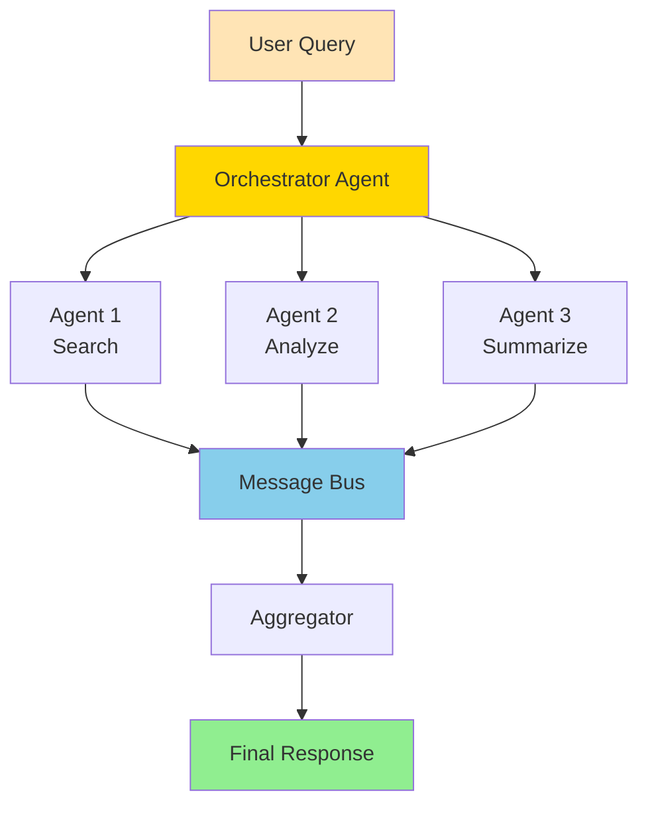
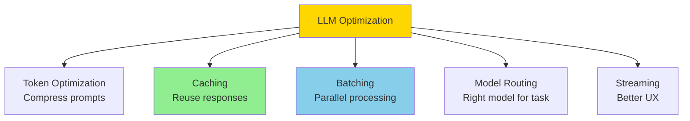
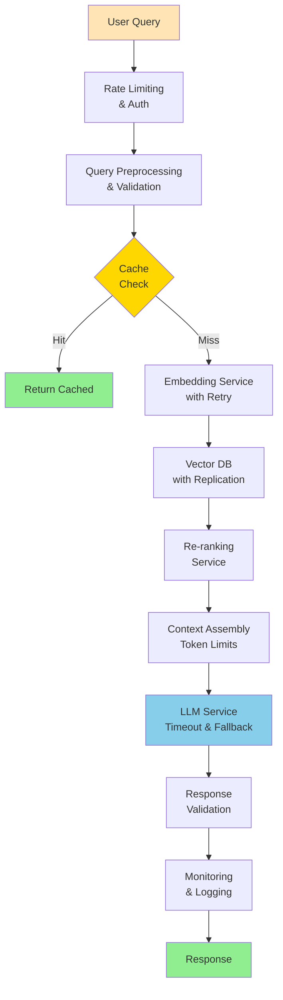

Hard-level LLM and Agentic AI interview questions covering multi-agent systems, production optimization, and advanced architectures.

## Q1: Design a multi-agent system with agent communication and coordination.

**Answer**:

**How Multi-Agent Systems Work**:

Multiple specialized agents collaborate, communicate, and coordinate to solve complex tasks.



**LangChain Implementation**:
```python
from langchain.agents import initialize_agent, AgentType, AgentExecutor
from langchain.agents import create_openai_functions_agent
from langchain.tools import Tool
from langchain.llms import OpenAI
from langchain.chat_models import ChatOpenAI
from langchain.chains import LLMChain, SequentialChain
from langchain.prompts import PromptTemplate, ChatPromptTemplate
from langchain.schema import HumanMessage, SystemMessage
from langchain.utilities import WikipediaAPIWrapper
from typing import Dict, List
import json

# Define specialized tools for each agent
wikipedia = WikipediaAPIWrapper()

def search_tool(query: str) -> str:
    """Search for information"""
    return wikipedia.run(query)

def analyze_tool(data: str) -> str:
    """Analyze data and extract insights"""
    # This would use an analysis LLM chain
    return f"Analysis of: {data[:100]}..."

def synthesize_tool(inputs: str) -> str:
    """Synthesize multiple inputs"""
    # This would use a synthesis LLM chain
    return f"Synthesized from: {inputs[:100]}..."

# Create tools for each agent
research_tools = [
    Tool(
        name="search",
        func=search_tool,
        description="Search for information on a topic"
    )
]

analysis_tools = [
    Tool(
        name="analyze",
        func=analyze_tool,
        description="Analyze data and extract insights"
    )
]

synthesis_tools = [
    Tool(
        name="synthesize",
        func=synthesize_tool,
        description="Synthesize information from multiple sources"
    )
]

# Initialize LLMs
llm = OpenAI(temperature=0)
chat_llm = ChatOpenAI(temperature=0)

# Create specialized agents
research_agent = initialize_agent(
    tools=research_tools,
    llm=llm,
    agent=AgentType.ZERO_SHOT_REACT_DESCRIPTION,
    verbose=True,
    agent_kwargs={
        "prefix": "You are a research agent. Your job is to search for and gather information."
    }
)

analysis_agent = initialize_agent(
    tools=analysis_tools,
    llm=llm,
    agent=AgentType.ZERO_SHOT_REACT_DESCRIPTION,
    verbose=True,
    agent_kwargs={
        "prefix": "You are an analysis agent. Your job is to analyze data and extract insights."
    }
)

# Synthesis agent using LLMChain
synthesis_prompt = PromptTemplate(
    input_variables=["inputs"],
    template="""Synthesize the following information from multiple agents into a coherent response:

{inputs}

Create a comprehensive, well-structured answer that:
1. Integrates all relevant information
2. Resolves any contradictions
3. Provides clear conclusions

Synthesis:"""
)

synthesis_chain = LLMChain(llm=llm, prompt=synthesis_prompt)

# Orchestrator agent
class MultiAgentOrchestrator:
    def __init__(self, research_agent, analysis_agent, synthesis_chain, llm):
        self.research_agent = research_agent
        self.analysis_agent = analysis_agent
        self.synthesis_chain = synthesis_chain
        self.llm = llm
    
    def create_plan(self, query: str) -> List[Dict]:
        """Use LLM to create execution plan"""
        plan_prompt = f"""Given this query: "{query}"

Available agents:
- research_agent: Search and gather information
- analysis_agent: Analyze data and extract insights
- synthesis_chain: Synthesize multiple inputs

Create an execution plan. Respond with JSON:
{{
    "steps": [
        {{"agent": "research_agent", "task": "description"}},
        {{"agent": "analysis_agent", "task": "description"}},
        {{"agent": "synthesis_chain", "task": "description"}}
    ]
}}"""
        
        response = self.llm(plan_prompt)
        try:
            plan = json.loads(response)
            return plan.get("steps", [])
        except:
            # Fallback plan
            return [
                {"agent": "research_agent", "task": query},
                {"agent": "analysis_agent", "task": "analyze research results"},
                {"agent": "synthesis_chain", "task": "synthesize all results"}
            ]
    
    def execute(self, query: str) -> Dict:
        """Execute multi-agent workflow"""
        # Step 1: Create plan
        plan = self.create_plan(query)
        
        results = {}
        
        # Step 2: Execute each agent
        for step in plan:
            agent_name = step["agent"]
            task = step["task"]
            
            if agent_name == "research_agent":
                result = self.research_agent.run(task)
                results["research"] = result
            
            elif agent_name == "analysis_agent":
                # Use research results if available
                data = results.get("research", task)
                result = self.analysis_agent.run(f"Analyze: {data}")
                results["analysis"] = result
            
            elif agent_name == "synthesis_chain":
                # Combine all results
                inputs = "\n\n".join([
                    f"{key}: {value}"
                    for key, value in results.items()
                ])
                result = self.synthesis_chain.run(inputs=inputs)
                results["synthesis"] = result
        
        return results

# Usage
orchestrator = MultiAgentOrchestrator(
    research_agent=research_agent,
    analysis_agent=analysis_agent,
    synthesis_chain=synthesis_chain,
    llm=llm
)

result = orchestrator.execute("What are the latest developments in quantum computing?")
print(json.dumps(result, indent=2))

# Alternative: Using SequentialChain for orchestration
research_prompt = PromptTemplate(
    input_variables=["query"],
    template="Research the following query: {query}\n\nProvide comprehensive information:"
)

analysis_prompt = PromptTemplate(
    input_variables=["research"],
    template="Analyze the following research: {research}\n\nExtract key insights:"
)

synthesis_prompt = PromptTemplate(
    input_variables=["research", "analysis"],
    template="Synthesize:\nResearch: {research}\nAnalysis: {analysis}\n\nFinal answer:"
)

# Create chains
research_chain = LLMChain(llm=llm, prompt=research_prompt, output_key="research")
analysis_chain = LLMChain(llm=llm, prompt=analysis_prompt, output_key="analysis")
synthesis_chain = LLMChain(llm=llm, prompt=synthesis_prompt, output_key="answer")

# Sequential execution
multi_agent_chain = SequentialChain(
    chains=[research_chain, analysis_chain, synthesis_chain],
    input_variables=["query"],
    output_variables=["research", "analysis", "answer"],
    verbose=True
)

result = multi_agent_chain({"query": "What are the latest developments in quantum computing?"})
print(result["answer"])
```

**Key Design Decisions**:
1. **Message Bus**: Decouples agents, enables async communication
2. **Orchestrator**: Central coordinator for complex workflows
3. **Dependency Management**: Agents can depend on others' results
4. **Async Execution**: Parallel agent execution when possible
5. **Correlation IDs**: Track request-response pairs

**Benefits**:
- Specialization (each agent is expert in domain)
- Scalability (add new agents easily)
- Fault tolerance (one agent failure doesn't break system)
- Flexibility (dynamic planning based on query)

---

## Q2: Optimize LLM inference for production (latency, throughput, cost).

**Answer**:



**Optimization Strategies**:

### 1. Token Usage Optimization

**LangChain Implementation**:
```python
class TokenOptimizer:
    def __init__(self, tokenizer, max_tokens: int = 4096):
        self.tokenizer = tokenizer
        self.max_tokens = max_tokens
    
    def compress_prompt(self, prompt: str, target_tokens: int) -> str:
        """Compress prompt to target token count"""
        tokens = self.tokenizer.encode(prompt)
        
        if len(tokens) <= target_tokens:
            return prompt
        
        # Strategy 1: Remove middle content (keep start and end)
        keep_start = target_tokens // 2
        keep_end = target_tokens - keep_start
        
        compressed_tokens = tokens[:keep_start] + tokens[-keep_end:]
        
        return self.tokenizer.decode(compressed_tokens)
    
    def summarize_context(self, context: str, llm, max_summary_tokens: int = 500) -> str:
        """Summarize long context"""
        tokens = self.tokenizer.encode(context)
        
        if len(tokens) <= max_summary_tokens:
            return context
        
        prompt = f"""Summarize the following in under {max_summary_tokens} tokens, preserving key information:

{context}

Summary:"""
        
        summary = llm.generate(prompt, max_tokens=max_summary_tokens)
        return summary
    
    def extract_relevant_chunks(self, context: str, query: str, 
                                embedding_model, max_chunks: int = 3) -> str:
        """Extract only relevant parts of context"""
        # Split into chunks
        chunks = context.split('\n\n')
        
        # Embed query and chunks
        query_emb = embedding_model.encode([query])[0]
        chunk_embs = embedding_model.encode(chunks)
        
        # Calculate similarities
        similarities = np.dot(chunk_embs, query_emb)
        similarities /= (np.linalg.norm(chunk_embs, axis=1) * np.linalg.norm(query_emb))
        
        # Get top chunks
        top_indices = np.argsort(similarities)[-max_chunks:][::-1]
        
        return '\n\n'.join([chunks[i] for i in top_indices])

### 2. Caching Strategy

**LangChain Implementation**:
```python
from langchain.cache import InMemoryCache, RedisCache
from langchain.globals import set_llm_cache
from langchain.llms import OpenAI
import redis

# In-memory caching
set_llm_cache(InMemoryCache())

# Redis caching
redis_client = redis.Redis(host='localhost', port=6379, db=0)
set_llm_cache(RedisCache(redis_client))

# Usage - caching is automatic
llm = OpenAI(temperature=0)

# First call - generates and caches
result1 = llm("What is Python?")

# Second call - returns from cache (instant)
result2 = llm("What is Python?")

# Custom caching wrapper
from langchain.cache import BaseCache
from typing import Optional
import hashlib

class CustomCache(BaseCache):
    def __init__(self, redis_client):
        self.redis = redis_client
    
    def lookup(self, prompt: str, llm_string: str) -> Optional[str]:
        """Look up cached result"""
        key = self._generate_key(prompt, llm_string)
        cached = self.redis.get(key)
        if cached:
            return cached.decode()
        return None
    
    def update(self, prompt: str, llm_string: str, return_val: str):
        """Cache result"""
        key = self._generate_key(prompt, llm_string)
        self.redis.setex(key, 3600, return_val)  # 1 hour TTL
    
    def _generate_key(self, prompt: str, llm_string: str) -> str:
        """Generate cache key"""
        content = f"{prompt}|{llm_string}"
        return hashlib.md5(content.encode()).hexdigest()

# Use custom cache
custom_cache = CustomCache(redis_client)
set_llm_cache(custom_cache)
```

### 3. Batching and Parallelization

**LangChain Implementation**:
```python
from langchain.llms import OpenAI
from langchain.chains import LLMChain
from langchain.prompts import PromptTemplate
from langchain.callbacks import get_openai_callback
import asyncio
from typing import List

# Batch processing with LangChain
llm = OpenAI(temperature=0, batch_size=10)

# Process multiple prompts in batch
prompts = [
    "What is Python?",
    "What is JavaScript?",
    "What is Go?",
]

# Batch generation (if LLM supports it)
results = llm.generate(prompts)

# Parallel processing with async
from langchain.chat_models import ChatOpenAI

async def process_prompt_async(llm, prompt: str) -> str:
    """Process single prompt asynchronously"""
    result = await llm.agenerate([prompt])
    return result.generations[0][0].text

async def process_batch_async(prompts: List[str]) -> List[str]:
    """Process batch of prompts in parallel"""
    chat_llm = ChatOpenAI(temperature=0)
    
    tasks = [process_prompt_async(chat_llm, prompt) for prompt in prompts]
    results = await asyncio.gather(*tasks)
    
    return results

# Usage
results = asyncio.run(process_batch_async(prompts))

# Batch processing with chains
template = "Answer: {question}"
prompt = PromptTemplate(template=template, input_variables=["question"])
chain = LLMChain(llm=llm, prompt=prompt)

# Process multiple inputs
inputs = [{"question": q} for q in prompts]
results = chain.apply(inputs)

# With token tracking
with get_openai_callback() as cb:
    results = chain.apply(inputs)
    print(f"Total tokens: {cb.total_tokens}")
    print(f"Total cost: ${cb.total_cost:.4f}")
```

### 4. Model Selection and Routing

**LangChain Implementation**:
```python
from langchain.llms import OpenAI
from langchain.chat_models import ChatOpenAI
from langchain.chains import LLMChain
from langchain.prompts import PromptTemplate

class ModelRouter:
    def __init__(self):
        self.models = {
            "fast": ChatOpenAI(model="gpt-3.5-turbo", temperature=0),
            "balanced": ChatOpenAI(model="gpt-4", temperature=0),
            "powerful": ChatOpenAI(model="gpt-4-turbo-preview", temperature=0)
        }
    
    def route(self, prompt: str, requirements: dict) -> str:
        """Route to appropriate model based on requirements"""
        max_latency = requirements.get("max_latency", float('inf'))
        max_cost = requirements.get("max_cost", float('inf'))
        min_quality = requirements.get("min_quality", 0)
        
        # Estimate complexity
        complexity = self._estimate_complexity(prompt)
        
        # Select model
        if complexity < 0.3 and max_latency < 2.0:
            return "fast"
        elif max_cost < 0.01:
            return "fast"
        elif complexity > 0.7 or min_quality > 0.8:
            return "powerful"
        else:
            return "balanced"
    
    def _estimate_complexity(self, prompt: str) -> float:
        """Estimate query complexity (0-1)"""
        indicators = {
            "complex": ["analyze", "compare", "evaluate", "design"],
            "simple": ["what", "when", "who", "list"]
        }
        
        prompt_lower = prompt.lower()
        complex_count = sum(1 for word in indicators["complex"] if word in prompt_lower)
        simple_count = sum(1 for word in indicators["simple"] if word in prompt_lower)
        
        if complex_count + simple_count == 0:
            return 0.5
        
        return complex_count / (complex_count + simple_count)
    
    def generate(self, prompt: str, requirements: dict = None) -> str:
        """Generate using routed model"""
        model_key = self.route(prompt, requirements or {})
        llm = self.models[model_key]
        return llm(prompt)

# Usage
router = ModelRouter()
result = router.generate("What is Python?", {"max_latency": 1.5})
```

### 5. Streaming for Better UX

**LangChain Implementation**:
```python
from langchain.callbacks.streaming_stdout import StreamingStdOutCallbackHandler
from langchain.llms import OpenAI
from langchain.chat_models import ChatOpenAI

# Streaming with callback
llm = OpenAI(
    temperature=0,
    streaming=True,
    callbacks=[StreamingStdOutCallbackHandler()]
)

# Generate with streaming
llm("Explain quantum computing in detail")

# Async streaming
from langchain.callbacks import AsyncCallbackHandler

class AsyncStreamingHandler(AsyncCallbackHandler):
    async def on_llm_new_token(self, token: str, **kwargs) -> None:
        print(token, end='', flush=True)

chat_llm = ChatOpenAI(
    temperature=0,
    streaming=True,
    callbacks=[AsyncStreamingHandler()]
)

# Stream response
async def stream_response(prompt: str):
    async for chunk in chat_llm.astream(prompt):
        print(chunk.content, end='', flush=True)

import asyncio
asyncio.run(stream_response("Explain quantum computing"))
```

**Production Metrics to Track**:
- **Latency**: p50, p95, p99 response times
- **Throughput**: Requests per second
- **Cost**: $ per 1K tokens
- **Cache hit rate**: % of cached responses
- **Token usage**: Average tokens per request
- **Error rate**: % of failed requests

---

## Q3: Design a production-grade RAG system with monitoring and failure handling.

**Answer**:

**Production RAG Architecture**:



**LangChain Implementation**:
```python
from langchain.embeddings import OpenAIEmbeddings
from langchain.vectorstores import FAISS, Chroma
from langchain.retrievers import ContextualCompressionRetriever
from langchain.retrievers.document_compressors import LLMChainExtractor, CrossEncoderReranker
from langchain.chains import RetrievalQA
from langchain.llms import OpenAI
from langchain.cache import RedisCache
from langchain.callbacks import get_openai_callback
from langchain.prompts import PromptTemplate
from langchain.text_splitter import RecursiveCharacterTextSplitter
from typing import List, Optional, Dict
import logging
import time
import asyncio
from dataclasses import dataclass
from prometheus_client import Counter, Histogram, Gauge

# Metrics
request_counter = Counter('rag_requests_total', 'Total RAG requests')
request_duration = Histogram('rag_request_duration_seconds', 'Request duration')
cache_hits = Counter('rag_cache_hits_total', 'Cache hits')
errors = Counter('rag_errors_total', 'Errors', ['error_type'])

@dataclass
class RAGConfig:
    max_retries: int = 3
    timeout: float = 30.0
    cache_ttl: int = 3600
    max_context_tokens: int = 3000
    min_similarity_threshold: float = 0.7
    enable_reranking: bool = True
    fallback_enabled: bool = True

class ProductionRAG:
    def __init__(self, config: RAGConfig, llm, embeddings, vectorstore, cache):
        self.config = config
        self.llm = llm
        self.embeddings = embeddings
        self.vectorstore = vectorstore
        self.cache = cache
        self.logger = logging.getLogger(__name__)
        
        # Create retriever with LangChain
        self.retriever = vectorstore.as_retriever(
            search_kwargs={"k": 5, "score_threshold": config.min_similarity_threshold}
        )
        
        # Add re-ranking if enabled
        if config.enable_reranking:
            from sentence_transformers import CrossEncoder
            reranker = CrossEncoder('cross-encoder/ms-marco-MiniLM-L-6-v2')
            compressor = CrossEncoderReranker(model=reranker, top_n=3)
            self.retriever = ContextualCompressionRetriever(
                base_compressor=compressor,
                base_retriever=self.retriever
            )
        
        # Create QA chain with LangChain
        prompt_template = """Use the following pieces of context to answer the question.
If you don't know the answer, just say that you don't know.

Context: {context}

Question: {question}

Answer:"""
        
        PROMPT = PromptTemplate(
            template=prompt_template,
            input_variables=["context", "question"]
        )
        
        self.qa_chain = RetrievalQA.from_chain_type(
            llm=llm,
            chain_type="stuff",
            retriever=self.retriever,
            return_source_documents=True,
            chain_type_kwargs={"prompt": PROMPT}
        )
        
        # Enable caching
        from langchain.globals import set_llm_cache
        set_llm_cache(RedisCache(redis_client=cache))
    
    def query(self, question: str, user_id: str) -> Dict:
        """Main query endpoint with full production features using LangChain"""
        request_counter.inc()
        start_time = time.time()
        
        try:
            # 1. Validate input
            validation_error = self._validate_input(question)
            if validation_error:
                errors.inc({'error_type': 'validation'})
                return {"error": validation_error, "status": "invalid_input"}
            
            # 2. Check cache (LangChain handles this automatically via set_llm_cache)
            # Cache is checked automatically by LangChain
            
            # 3. Query using LangChain QA chain with retry
            try:
                result = self.qa_chain({"query": question})
                
                # 4. Prepare response
                answer = result["result"]
                sources = [
                    {
                        "text": doc.page_content,
                        "metadata": doc.metadata,
                        "score": getattr(doc, 'score', 0.0)
                    }
                    for doc in result.get("source_documents", [])
                ]
                
                # 5. Validate response
                if not self._validate_response(answer):
                    errors.inc({'error_type': 'invalid_response'})
                    if self.config.fallback_enabled:
                        return self._fallback_response(question)
                
                # 6. Prepare result
                response = {
                    "answer": answer,
                    "sources": sources,
                    "status": "success",
                    "metadata": {
                        "num_sources": len(sources),
                        "cache_hit": False,  # LangChain handles caching
                        "duration_ms": (time.time() - start_time) * 1000
                    }
                }
                
                # 7. Log metrics
                request_duration.observe(time.time() - start_time)
                self.logger.info(f"Successfully processed query for user {user_id}")
                
                return response
                
            except Exception as e:
                errors.inc({'error_type': 'generation'})
                self.logger.error(f"Error generating answer: {str(e)}")
                
                if self.config.fallback_enabled:
                    return self._fallback_response(question)
                
                return {"error": "Failed to generate answer", "status": "error"}
            
        except Exception as e:
            errors.inc({'error_type': 'unexpected'})
            self.logger.error(f"Unexpected error: {str(e)}", exc_info=True)
            
            if self.config.fallback_enabled:
                return self._fallback_response(question)
            
            return {"error": "Internal error", "status": "error"}
    
    def _validate_input(self, question: str) -> Optional[str]:
        """Validate user input"""
        if not question or len(question.strip()) == 0:
            return "Question cannot be empty"
        
        if len(question) > 1000:
            return "Question too long (max 1000 characters)"
        
        # Check for malicious content
        if self._contains_injection_attempt(question):
            return "Invalid characters detected"
        
        return None
    
    def _contains_injection_attempt(self, text: str) -> bool:
        """Simple injection detection"""
        dangerous_patterns = ["<script>", "javascript:", "eval(", "exec("]
        return any(pattern in text.lower() for pattern in dangerous_patterns)
    
    async def _retrieve_with_retry(self, question: str) -> List[Dict]:
        """Retrieve documents with retry logic"""
        last_error = None
        
        for attempt in range(self.config.max_retries):
            try:
                # Embed query
                embedding = await self._embed_with_fallback(question)
                
                # Search vector DB
                results = await self.vector_db.search(
                    embedding,
                    top_k=20,
                    min_score=self.config.min_similarity_threshold
                )
                
                # Re-rank if enabled
                if self.config.enable_reranking and results:
                    results = await self._rerank(question, results)
                
                # Filter and limit
                filtered = [r for r in results if r["score"] >= self.config.min_similarity_threshold]
                
                return filtered[:5]  # Top 5
                
            except Exception as e:
                last_error = e
                self.logger.warning(f"Retrieval attempt {attempt + 1} failed: {str(e)}")
                
                if attempt < self.config.max_retries - 1:
                    await asyncio.sleep(2 ** attempt)  # Exponential backoff
        
        self.logger.error(f"All retrieval attempts failed: {str(last_error)}")
        return []
    
    async def _embed_with_fallback(self, text: str) -> np.ndarray:
        """Embed with fallback to different model"""
        try:
            return self.embedding_model.encode([text])[0]
        except Exception as e:
            self.logger.warning(f"Primary embedding failed: {str(e)}, using fallback")
            # Fallback to simpler model
            return self.fallback_embedding_model.encode([text])[0]
    
    async def _generate_answer(self, question: str, documents: List[Dict]) -> str:
        """Generate answer from documents"""
        # Assemble context
        context = self._assemble_context(documents)
        
        # Create prompt
        prompt = f"""Context:
{context}

Question: {question}

Provide a comprehensive answer based on the context. Include citations [1], [2], etc.

Answer:"""
        
        # Generate
        answer = await self.llm.generate_async(prompt)
        
        return answer
    
    def _assemble_context(self, documents: List[Dict]) -> str:
        """Assemble context within token limits"""
        context_parts = []
        total_tokens = 0
        
        for i, doc in enumerate(documents):
            text = doc["text"]
            tokens = len(self.tokenizer.encode(text))
            
            if total_tokens + tokens > self.config.max_context_tokens:
                break
            
            context_parts.append(f"[{i+1}] {text}")
            total_tokens += tokens
        
        return "\n\n".join(context_parts)
    
    def _validate_response(self, answer: str) -> bool:
        """Validate generated response"""
        if not answer or len(answer.strip()) < 10:
            return False
        
        # Check for common failure patterns
        failure_patterns = [
            "I don't know",
            "I cannot answer",
            "No information available"
        ]
        
        return not any(pattern.lower() in answer.lower() for pattern in failure_patterns)
    
    async def _fallback_response(self, question: str) -> Dict:
        """Fallback when main pipeline fails"""
        self.logger.info("Using fallback response")
        
        # Simple LLM call without RAG
        prompt = f"Answer this question concisely: {question}"
        answer = await self.llm.generate_async(prompt)
        
        return {
            "answer": answer,
            "sources": [],
            "status": "fallback",
            "metadata": {"fallback": True}
        }
    
    def _get_cache_key(self, question: str, user_id: str) -> str:
        """Generate cache key"""
        import hashlib
        content = f"{question}|{user_id}"
        return hashlib.md5(content.encode()).hexdigest()
```

**Monitoring Dashboard**:
```python
from prometheus_client import start_http_server, generate_latest

# Start metrics server
start_http_server(8000)

# Grafana queries:
# - Request rate: rate(rag_requests_total[5m])
# - Error rate: rate(rag_errors_total[5m]) / rate(rag_requests_total[5m])
# - Latency p95: histogram_quantile(0.95, rag_request_duration_seconds)
# - Cache hit rate: rate(rag_cache_hits_total[5m]) / rate(rag_requests_total[5m])
```

**Key Production Features**:
- ✅ Input validation & sanitization
- ✅ Caching (multi-layer)
- ✅ Retry logic with exponential backoff
- ✅ Timeouts
- ✅ Fallback mechanisms
- ✅ Comprehensive logging
- ✅ Metrics & monitoring
- ✅ Error handling
- ✅ Rate limiting (not shown, but should be added)
- ✅ A/B testing capability

---

## Summary

Hard LLM/Agent topics require:
- **Multi-agent systems**: Orchestration, communication, coordination
- **Production optimization**: Caching, batching, model routing
- **Robust RAG**: Monitoring, failure handling, fallbacks
- **System design**: Scalability, reliability, observability

**Production Checklist**:
- ✅ Comprehensive error handling
- ✅ Retry logic & timeouts
- ✅ Caching strategies
- ✅ Monitoring & alerting
- ✅ Logging & debugging
- ✅ Fallback mechanisms
- ✅ Input validation
- ✅ Rate limiting
- ✅ Cost optimization
- ✅ A/B testing
- ✅ Documentation

**Key Skills**:
- Design distributed systems
- Optimize for latency & cost
- Handle failures gracefully
- Monitor & debug production issues
- Scale to high traffic

