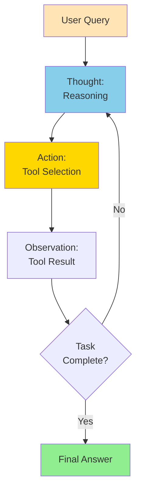
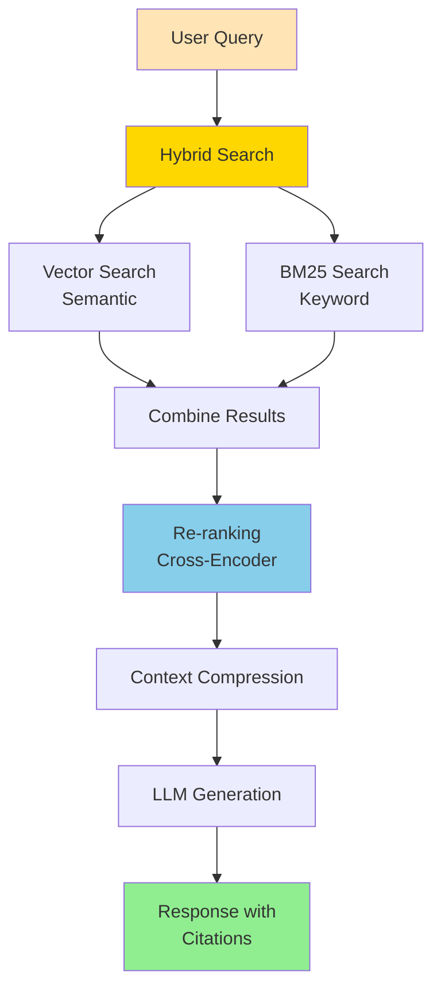
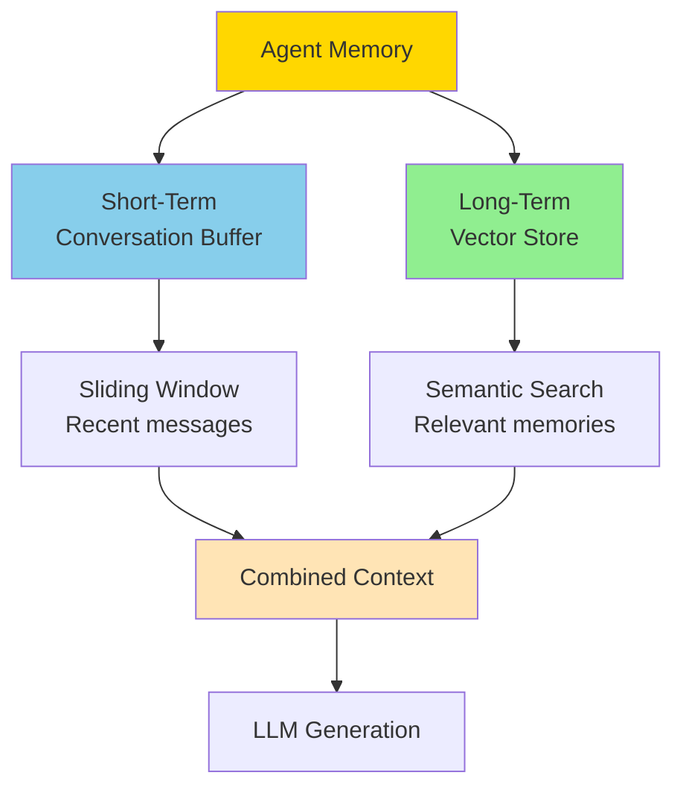
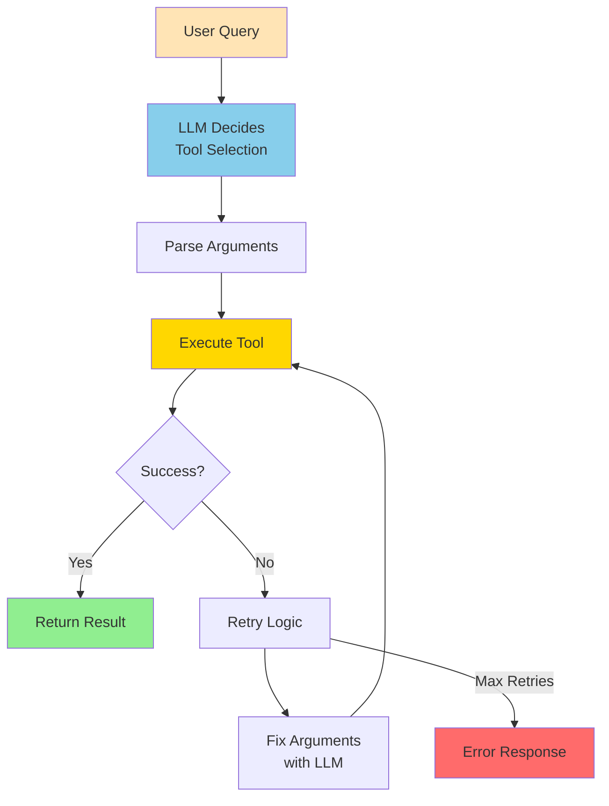

Medium-level LLM and Agentic AI interview questions covering agent architectures, RAG optimization, and production systems.

## Q1: Design and implement a ReAct (Reasoning + Acting) agent.

**Answer**:

**How ReAct Works**:

ReAct alternates between reasoning (thinking) and acting (using tools) to solve problems.



**Pattern**:
```
Thought: I need to find information about X
Action: search("X")
Observation: [search results]
Thought: Now I need to calculate Y
Action: calculate("Y")
Observation: [result]
Thought: I have enough information to answer
Action: FINISH("answer")
```

**LangChain Implementation**:
```python
from langchain.agents import initialize_agent, AgentType, Tool
from langchain.llms import OpenAI
from langchain.chains import LLMChain
from langchain.prompts import PromptTemplate
from langchain.agents.react.base import ReActDocstoreAgent
from langchain.agents import AgentExecutor
from langchain.tools import Tool
from langchain.utilities import WikipediaAPIWrapper, PythonREPL

# Initialize LLM
llm = OpenAI(temperature=0)

# Define tools
wikipedia = WikipediaAPIWrapper()
python_repl = PythonREPL()

def calculate(expression: str) -> str:
    """Evaluate mathematical expression safely"""
    try:
        result = eval(expression, {"__builtins__": {}}, {})
        return str(result)
    except Exception as e:
        return f"Error: {str(e)}"

def get_current_date() -> str:
    """Get current date"""
    from datetime import datetime
    return datetime.now().strftime("%Y-%m-%d")

# Create tools list
tools = [
    Tool(
        name="Wikipedia",
        func=wikipedia.run,
        description="Search Wikipedia for information about a topic"
    ),
    Tool(
        name="Calculator",
        func=calculate,
        description="Evaluate mathematical expressions. Input should be a valid Python expression."
    ),
    Tool(
        name="CurrentDate",
        func=get_current_date,
        description="Get the current date in YYYY-MM-DD format"
    ),
]

# Initialize ReAct agent
agent = initialize_agent(
    tools=tools,
    llm=llm,
    agent=AgentType.REACT_DOCSTORE,
    verbose=True,
    max_iterations=10,
    handle_parsing_errors=True
)

# Run agent
result = agent.run("What is 15% of the population of France?")
print(result)

# Alternative: Custom ReAct with more control
from langchain.agents import AgentExecutor, create_react_agent
from langchain.prompts import PromptTemplate

# Custom ReAct prompt template
react_prompt = PromptTemplate.from_template("""
You are a helpful assistant that can use tools to answer questions.

You have access to the following tools:
{tools}

Use the following format:

Question: the input question you must answer
Thought: you should always think about what to do
Action: the action to take, should be one of [{tool_names}]
Action Input: the input to the action
Observation: the result of the action
... (this Thought/Action/Action Input/Observation can repeat N times)
Thought: I now know the final answer
Final Answer: the final answer to the original input question

Begin!

Question: {input}
Thought: {agent_scratchpad}
""")

# Create agent
agent = create_react_agent(llm, tools, react_prompt)
agent_executor = AgentExecutor(
    agent=agent,
    tools=tools,
    verbose=True,
    max_iterations=10
)

# Execute
result = agent_executor.invoke({
    "input": "What is 15% of the population of France?"
})
print(result["output"])
```

**Why ReAct Works**:
- **Reasoning**: Helps agent plan and reflect
- **Acting**: Grounds reasoning in real actions
- **Observation**: Provides feedback to adjust plan

**Key Design Decisions**:
- How to parse LLM output (regex, JSON, structured)
- Error handling (invalid actions, tool failures)
- When to stop (max steps, success criteria)
- How to format history (token efficiency)

---

## Q2: Implement an advanced RAG system with re-ranking and hybrid search.

**Answer**:

**How Advanced RAG Works**:



1. **Hybrid Search**: Combine semantic (vector) + keyword (BM25) search
2. **Re-ranking**: Use cross-encoder to re-score top results
3. **Context Compression**: Remove irrelevant parts
4. **Citation**: Track which chunks were used

**LangChain Implementation**:
```python
from langchain.embeddings import OpenAIEmbeddings, HuggingFaceEmbeddings
from langchain.vectorstores import FAISS, Chroma
from langchain.retrievers import ContextualCompressionRetriever
from langchain.retrievers.document_compressors import LLMChainExtractor
from langchain.retrievers import BM25Retriever, EnsembleRetriever
from langchain.retrievers import ContextualCompressionRetriever
from langchain.retrievers.document_compressors import CrossEncoderReranker
from langchain.text_splitter import RecursiveCharacterTextSplitter
from langchain.chains import RetrievalQA
from langchain.llms import OpenAI
from langchain.prompts import PromptTemplate
from langchain.document_loaders import TextLoader

# Initialize components
llm = OpenAI(temperature=0)
embeddings = OpenAIEmbeddings()  # or HuggingFaceEmbeddings(model_name="all-MiniLM-L6-v2")

# Load and split documents
loader = TextLoader("documents.txt")
documents = loader.load()

text_splitter = RecursiveCharacterTextSplitter(
    chunk_size=1000,
    chunk_overlap=200
)
texts = text_splitter.split_documents(documents)

# Create vector store for semantic search
vectorstore = FAISS.from_documents(texts, embeddings)

# Create BM25 retriever for keyword search
bm25_retriever = BM25Retriever.from_documents(texts)
bm25_retriever.k = 10

# Create ensemble retriever (hybrid search)
vector_retriever = vectorstore.as_retriever(search_kwargs={"k": 10})
ensemble_retriever = EnsembleRetriever(
    retrievers=[vector_retriever, bm25_retriever],
    weights=[0.7, 0.3]  # 70% semantic, 30% keyword
)

# Re-ranking with cross-encoder
from sentence_transformers import CrossEncoder
reranker = CrossEncoder('cross-encoder/ms-marco-MiniLM-L-6-v2')

compressor = CrossEncoderReranker(
    model=reranker,
    top_n=5
)

# Context compression
compression_retriever = ContextualCompressionRetriever(
    base_compressor=compressor,
    base_retriever=ensemble_retriever
)

# Alternative: LLM-based compression
llm_compressor = LLMChainExtractor.from_llm(llm)
compression_retriever_llm = ContextualCompressionRetriever(
    base_compressor=llm_compressor,
    base_retriever=ensemble_retriever
)

# Create QA chain with citations
prompt_template = """Use the following pieces of context to answer the question at the end.
If you don't know the answer, just say that you don't know, don't try to make up an answer.

Context:
{context}

Question: {question}

Answer based on the context above. Include citations [1], [2], etc. for each source used.

Answer:"""

PROMPT = PromptTemplate(
    template=prompt_template,
    input_variables=["context", "question"]
)

qa_chain = RetrievalQA.from_chain_type(
    llm=llm,
    chain_type="stuff",
    retriever=compression_retriever,
    return_source_documents=True,
    chain_type_kwargs={"prompt": PROMPT}
)

# Query with advanced RAG
query = "Who created Python and when?"
result = qa_chain({"query": query})

print(f"Answer: {result['result']}")
print(f"\nSources:")
for i, doc in enumerate(result['source_documents'], 1):
    print(f"[{i}] {doc.page_content[:100]}...")
    print(f"    Metadata: {doc.metadata}\n")

# Custom advanced RAG class
from langchain.chains import LLMChain
from typing import List, Dict

class AdvancedRAG:
    def __init__(self, llm, embeddings, documents):
        self.llm = llm
        self.embeddings = embeddings
        
        # Split documents
        text_splitter = RecursiveCharacterTextSplitter(
            chunk_size=1000,
            chunk_overlap=200
        )
        self.texts = text_splitter.split_documents(documents)
        
        # Create retrievers
        self.vectorstore = FAISS.from_documents(self.texts, embeddings)
        self.vector_retriever = self.vectorstore.as_retriever(search_kwargs={"k": 20})
        self.bm25_retriever = BM25Retriever.from_documents(self.texts)
        self.bm25_retriever.k = 20
        
        # Ensemble retriever
        self.ensemble_retriever = EnsembleRetriever(
            retrievers=[self.vector_retriever, self.bm25_retriever],
            weights=[0.7, 0.3]
        )
        
        # Re-ranker
        reranker_model = CrossEncoder('cross-encoder/ms-marco-MiniLM-L-6-v2')
        self.compressor = CrossEncoderReranker(model=reranker_model, top_n=5)
        
        # Compression retriever
        self.compression_retriever = ContextualCompressionRetriever(
            base_compressor=self.compressor,
            base_retriever=self.ensemble_retriever
        )
        
        # Prompt
        self.prompt = PromptTemplate(
            template=prompt_template,
            input_variables=["context", "question"]
        )
        self.chain = LLMChain(llm=llm, prompt=self.prompt)
    
    def query(self, question: str) -> Dict:
        # Retrieve and compress
        docs = self.compression_retriever.get_relevant_documents(question)
        
        # Format context with citations
        context = "\n\n".join([
            f"[{i+1}] {doc.page_content}"
            for i, doc in enumerate(docs)
        ])
        
        # Generate answer
        answer = self.chain.run(context=context, question=question)
        
        # Prepare sources
        sources = [
            {
                "index": i+1,
                "text": doc.page_content,
                "metadata": doc.metadata
            }
            for i, doc in enumerate(docs)
        ]
        
        return {
            "answer": answer,
            "sources": sources
        }

# Usage
rag = AdvancedRAG(llm, embeddings, documents)
result = rag.query("Who created Python and when?")
print(f"Answer: {result['answer']}")
print(f"\nSources: {len(result['sources'])} documents")
```

**Key Improvements**:
1. **Hybrid Search**: Better recall (finds more relevant docs)
2. **Re-ranking**: Better precision (ranks best docs higher)
3. **Compression**: Reduces token usage, focuses on relevant parts
4. **Citations**: Provides source attribution

**Trade-offs**:
- More compute (multiple models)
- Higher latency
- Better quality

---

## Q3: Implement agent memory (short-term and long-term).

**Answer**:

**How Agent Memory Works**:



**Short-term**: Recent conversation context (sliding window)
**Long-term**: Persistent storage of important information (vector DB)

**LangChain Implementation**:
```python
from langchain.memory import ConversationBufferWindowMemory, ConversationSummaryMemory
from langchain.memory import ConversationBufferMemory
from langchain.memory import VectorStoreRetrieverMemory
from langchain.vectorstores import FAISS
from langchain.embeddings import OpenAIEmbeddings
from langchain.llms import OpenAI
from langchain.chains import ConversationChain
from langchain.schema import Document
from typing import List

class AgentMemory:
    def __init__(self, llm, embeddings, max_short_term=10):
        self.llm = llm
        self.embeddings = embeddings
        
        # Short-term memory: Conversation buffer with sliding window
        self.short_term_memory = ConversationBufferWindowMemory(
            k=max_short_term,
            return_messages=True
        )
        
        # Alternative: Summary memory (compresses old messages)
        self.summary_memory = ConversationSummaryMemory(
            llm=llm,
            return_messages=True
        )
        
        # Long-term memory: Vector store for semantic search
        self.long_term_store = FAISS.from_texts(
            [""],  # Initialize with empty text
            embeddings
        )
        self.long_term_memory = VectorStoreRetrieverMemory(
            retriever=self.long_term_store.as_retriever(search_kwargs={"k": 3})
        )
    
    def add_message(self, role: str, content: str, metadata: dict = None):
        """Add message to short-term memory"""
        if role == "user":
            self.short_term_memory.chat_memory.add_user_message(content)
        else:
            self.short_term_memory.chat_memory.add_ai_message(content)
        
        # Check if important for long-term storage
        if self._is_important(content):
            self.add_to_long_term(content, metadata)
    
    def _is_important(self, content: str) -> bool:
        """Determine if content should be stored long-term"""
        important_keywords = ["remember", "important", "always", "never", "prefer", "name is"]
        return any(keyword in content.lower() for keyword in important_keywords)
    
    def add_to_long_term(self, content: str, metadata: dict = None):
        """Store in long-term memory (vector store)"""
        # Create document with metadata
        doc = Document(
            page_content=content,
            metadata=metadata or {}
        )
        
        # Add to vector store
        self.long_term_store.add_documents([doc])
        
        # Update retriever
        self.long_term_memory.retriever = self.long_term_store.as_retriever(
            search_kwargs={"k": 3}
        )
    
    def get_full_context(self, query: str) -> str:
        """Combine short-term and long-term memories"""
        # Get short-term context
        short_term = self.short_term_memory.load_memory_variables({})
        
        # Get long-term relevant memories
        long_term = self.long_term_memory.load_memory_variables({"prompt": query})
        
        # Combine
        context = ""
        if long_term.get("history"):
            context += f"Relevant memories:\n{long_term['history']}\n\n"
        
        if short_term.get("history"):
            context += f"Recent conversation:\n{short_term['history']}"
        
        return context
    
    def summarize_old_messages(self):
        """Summarize and compress old messages"""
        # Use summary memory to compress
        summary = self.summary_memory.load_memory_variables({})
        if summary.get("history"):
            # Store summary in long-term
            self.add_to_long_term(summary["history"], {"type": "summary"})

# Usage with LangChain chains
llm = OpenAI(temperature=0)
embeddings = OpenAIEmbeddings()

memory = AgentMemory(llm, embeddings, max_short_term=10)

# Add messages
memory.add_message("user", "My name is Alice")
memory.add_message("assistant", "Nice to meet you, Alice!")
memory.add_message("user", "I prefer Python over JavaScript")
memory.add_message("assistant", "Noted! I'll remember your preference for Python.")

# Create conversation chain with memory
conversation = ConversationChain(
    llm=llm,
    memory=memory.short_term_memory,
    verbose=True
)

# Query with full context
query = "What programming language do I like?"
context = memory.get_full_context(query)

# Use in chain
response = conversation.predict(input=query)
print(response)

# Alternative: Using ConversationSummaryBufferMemory
from langchain.memory import ConversationSummaryBufferMemory

summary_memory = ConversationSummaryBufferMemory(
    llm=llm,
    max_token_limit=1000,
    return_messages=True
)

# Add messages
summary_memory.chat_memory.add_user_message("My name is Alice")
summary_memory.chat_memory.add_ai_message("Nice to meet you, Alice!")
summary_memory.chat_memory.add_user_message("I prefer Python over JavaScript")

# Memory automatically summarizes when token limit is reached
conversation_with_summary = ConversationChain(
    llm=llm,
    memory=summary_memory,
    verbose=True
)

# Query
result = conversation_with_summary.predict(
    input="What programming language do I like?"
)
print(result)
```

**Key Features**:
- **Sliding window**: Recent context always available
- **Semantic search**: Find relevant past information
- **Importance filtering**: Only store meaningful content
- **Summarization**: Compress old conversations
- **Persistence**: Save/load across sessions

---

## Q4: Implement tool/function calling with error handling and retry logic.

**Answer**:

**How Tool Calling Works**:



LLM decides which tool to call and with what arguments. System executes and returns result.

**LangChain Implementation with Robust Error Handling**:
```python
from langchain.agents import initialize_agent, AgentType, Tool
from langchain.agents import AgentExecutor
from langchain.tools import Tool
from langchain.llms import OpenAI
from langchain.callbacks import get_openai_callback
from langchain.agents import create_openai_functions_agent
from langchain.prompts import ChatPromptTemplate, MessagesPlaceholder
from langchain.schema import SystemMessage
import time
from typing import Dict, Any

# Define tools with error handling
def search_web(query: str, max_results: int = 5) -> str:
    """Search the web for information.
    
    Args:
        query: Search query (must be at least 3 characters)
        max_results: Maximum number of results (1-10)
    
    Returns:
        JSON string with search results
    """
    if not query or len(query) < 3:
        raise ValueError("Query must be at least 3 characters")
    if max_results < 1 or max_results > 10:
        raise ValueError("max_results must be between 1 and 10")
    
    # Simulated search
    results = [f"Result {i} for '{query}'" for i in range(max_results)]
    return str({"results": results})

def calculate(expression: str) -> str:
    """Evaluate mathematical expression safely.
    
    Args:
        expression: Mathematical expression to evaluate
    
    Returns:
        Result as string
    """
    try:
        # Safe evaluation (in production, use ast.literal_eval)
        result = eval(expression, {"__builtins__": {}}, {})
        return str(float(result))
    except Exception as e:
        raise ValueError(f"Invalid expression: {e}")

def send_email(to: str, subject: str, body: str) -> str:
    """Send an email.
    
    Args:
        to: Email address (must contain @)
        subject: Email subject (cannot be empty)
        body: Email body
    
    Returns:
        Status message
    """
    if "@" not in to:
        raise ValueError("Invalid email address")
    if not subject:
        raise ValueError("Subject cannot be empty")
    
    # Simulated email sending
    return f"Email sent to {to} with subject '{subject}'"

# Create tools with retry wrapper
class RetryTool:
    def __init__(self, tool: Tool, max_retries: int = 3):
        self.tool = tool
        self.max_retries = max_retries
    
    def run(self, *args, **kwargs) -> str:
        """Execute tool with retry logic"""
        last_error = None
        
        for attempt in range(self.max_retries):
            try:
                return self.tool.run(*args, **kwargs)
            except Exception as e:
                last_error = str(e)
                if attempt < self.max_retries - 1:
                    # Exponential backoff
                    time.sleep(2 ** attempt)
                else:
                    return f"Error after {self.max_retries} attempts: {last_error}"
        
        return f"Error: {last_error}"

# Create tools
tools = [
    Tool(
        name="search_web",
        func=search_web,
        description="Search the web for information. Input should be a search query string."
    ),
    Tool(
        name="calculate",
        func=calculate,
        description="Evaluate mathematical expressions. Input should be a valid Python expression."
    ),
    Tool(
        name="send_email",
        func=send_email,
        description="Send an email. Input should be a dictionary with 'to', 'subject', and 'body' keys."
    ),
]

# Wrap tools with retry logic
retry_tools = [RetryTool(tool, max_retries=3) for tool in tools]

# Initialize agent with error handling
llm = OpenAI(temperature=0)

agent = initialize_agent(
    tools=tools,
    llm=llm,
    agent=AgentType.ZERO_SHOT_REACT_DESCRIPTION,
    verbose=True,
    max_iterations=10,
    handle_parsing_errors=True,  # Handle parsing errors gracefully
    return_intermediate_steps=True
)

# Usage with error handling
try:
    result = agent.run("What is 15% of 240?")
    print(f"Result: {result}")
except Exception as e:
    print(f"Agent error: {e}")

# Alternative: Using OpenAI Functions (structured tool calling)
from langchain.chat_models import ChatOpenAI
from langchain.agents import create_openai_functions_agent
from langchain.prompts import ChatPromptTemplate, MessagesPlaceholder

chat_llm = ChatOpenAI(temperature=0, model="gpt-3.5-turbo")

# Create function-calling agent
prompt = ChatPromptTemplate.from_messages([
    ("system", "You are a helpful assistant with access to tools."),
    ("user", "{input}"),
    MessagesPlaceholder(variable_name="agent_scratchpad"),
])

agent = create_openai_functions_agent(chat_llm, tools, prompt)
agent_executor = AgentExecutor(
    agent=agent,
    tools=tools,
    verbose=True,
    handle_parsing_errors=True,
    max_iterations=10
)

# Execute with callback for monitoring
with get_openai_callback() as cb:
    result = agent_executor.invoke({
        "input": "What is 15% of 240? Use the calculator tool."
    })
    print(f"Result: {result['output']}")
    print(f"Tokens used: {cb.total_tokens}")

# Custom tool executor with advanced error handling
from langchain.tools import StructuredTool
from pydantic import BaseModel, Field

class SearchInput(BaseModel):
    query: str = Field(description="Search query")
    max_results: int = Field(default=5, description="Maximum results", ge=1, le=10)

def search_with_validation(query: str, max_results: int = 5) -> str:
    """Search with Pydantic validation"""
    return search_web(query, max_results)

# Structured tool with validation
structured_tool = StructuredTool.from_function(
    func=search_with_validation,
    name="search",
    description="Search the web",
    args_schema=SearchInput
)

# Agent with structured tools
structured_agent = initialize_agent(
    tools=[structured_tool] + tools[1:],
    llm=llm,
    agent=AgentType.STRUCTURED_CHAT_ZERO_SHOT_REACT_DESCRIPTION,
    verbose=True
)
```

**Key Features**:
- **Schema validation**: Tools define expected inputs
- **Retry logic**: Automatic retries with exponential backoff
- **Error recovery**: LLM attempts to fix invalid arguments
- **Detailed results**: Track attempts and errors

---

## Q5: How do you evaluate LLM outputs in production?

**Answer**:

**Evaluation Strategies**:

### 1. Automated Metrics

**Implementation**:
```python
from typing import List, Dict
import numpy as np

class LLMEvaluator:
    def __init__(self, embedding_model):
        self.embedding_model = embedding_model
    
    def semantic_similarity(self, generated: str, reference: str) -> float:
        """Measure semantic similarity between generated and reference"""
        emb1 = self.embedding_model.encode([generated])[0]
        emb2 = self.embedding_model.encode([reference])[0]
        
        similarity = np.dot(emb1, emb2) / (np.linalg.norm(emb1) * np.linalg.norm(emb2))
        return float(similarity)
    
    def factual_consistency(self, generated: str, context: str) -> float:
        """Check if generated text is consistent with context"""
        # Use NLI model to check entailment
        from transformers import pipeline
        
        nli = pipeline("text-classification", 
                      model="microsoft/deberta-base-mnli")
        
        result = nli(f"{context} [SEP] {generated}")
        
        # Return probability of entailment
        if result[0]["label"] == "ENTAILMENT":
            return result[0]["score"]
        return 0.0
    
    def toxicity_score(self, text: str) -> float:
        """Measure toxicity of generated text"""
        from transformers import pipeline
        
        toxicity = pipeline("text-classification",
                           model="unitary/toxic-bert")
        
        result = toxicity(text)
        return result[0]["score"] if result[0]["label"] == "toxic" else 0.0
    
    def evaluate_batch(self, generations: List[Dict]) -> Dict:
        """Evaluate a batch of generations"""
        results = {
            "semantic_similarity": [],
            "factual_consistency": [],
            "toxicity": [],
            "length": []
        }
        
        for gen in generations:
            if "reference" in gen:
                results["semantic_similarity"].append(
                    self.semantic_similarity(gen["generated"], gen["reference"])
                )
            
            if "context" in gen:
                results["factual_consistency"].append(
                    self.factual_consistency(gen["generated"], gen["context"])
                )
            
            results["toxicity"].append(self.toxicity_score(gen["generated"]))
            results["length"].append(len(gen["generated"].split()))
        
        # Aggregate
        summary = {}
        for metric, values in results.items():
            if values:
                summary[metric] = {
                    "mean": np.mean(values),
                    "std": np.std(values),
                    "min": np.min(values),
                    "max": np.max(values)
                }
        
        return summary
```

### 2. LLM-as-Judge

**Implementation**:
```python
def llm_judge(generated: str, criteria: str, judge_llm) -> Dict:
    """Use LLM to evaluate another LLM's output"""
    prompt = f"""Evaluate the following response based on these criteria:
{criteria}

Response to evaluate:
{generated}

Provide:
1. Score (1-10)
2. Reasoning
3. Specific issues (if any)

Format as JSON:
{{
    "score": <1-10>,
    "reasoning": "<explanation>",
    "issues": ["<issue1>", "<issue2>"]
}}"""
    
    response = judge_llm.generate(prompt)
    
    try:
        evaluation = json.loads(response)
        return evaluation
    except:
        return {"score": 0, "reasoning": "Failed to parse", "issues": []}

# Usage
criteria = """
- Accuracy: Is the information correct?
- Relevance: Does it answer the question?
- Clarity: Is it easy to understand?
- Completeness: Does it cover all aspects?
"""

evaluation = llm_judge(generated_text, criteria, judge_llm)
print(f"Score: {evaluation['score']}/10")
print(f"Reasoning: {evaluation['reasoning']}")
```

### 3. Human Feedback Loop

**Implementation**:
```python
class FeedbackCollector:
    def __init__(self):
        self.feedback_db = []
    
    def collect_feedback(self, query: str, response: str, 
                        rating: int, comments: str = ""):
        """Collect user feedback"""
        feedback = {
            "timestamp": datetime.now().isoformat(),
            "query": query,
            "response": response,
            "rating": rating,  # 1-5 stars
            "comments": comments
        }
        self.feedback_db.append(feedback)
    
    def get_low_rated_samples(self, threshold: int = 3) -> List[Dict]:
        """Get samples that need improvement"""
        return [f for f in self.feedback_db if f["rating"] < threshold]
    
    def analyze_feedback(self) -> Dict:
        """Analyze feedback trends"""
        if not self.feedback_db:
            return {}
        
        ratings = [f["rating"] for f in self.feedback_db]
        
        return {
            "total_samples": len(self.feedback_db),
            "average_rating": np.mean(ratings),
            "rating_distribution": {
                i: ratings.count(i) for i in range(1, 6)
            },
            "low_rated_count": len(self.get_low_rated_samples())
        }
```

### 4. A/B Testing

**Implementation**:
```python
import random

class ABTester:
    def __init__(self):
        self.results = {"A": [], "B": []}
    
    def get_variant(self, user_id: str) -> str:
        """Assign user to variant (consistent hashing)"""
        hash_val = hash(user_id)
        return "A" if hash_val % 2 == 0 else "B"
    
    def log_result(self, variant: str, metric: float):
        """Log result for variant"""
        self.results[variant].append(metric)
    
    def analyze(self) -> Dict:
        """Statistical analysis of A/B test"""
        from scipy import stats
        
        a_results = self.results["A"]
        b_results = self.results["B"]
        
        if not a_results or not b_results:
            return {"error": "Insufficient data"}
        
        # T-test
        t_stat, p_value = stats.ttest_ind(a_results, b_results)
        
        return {
            "variant_A": {
                "mean": np.mean(a_results),
                "std": np.std(a_results),
                "count": len(a_results)
            },
            "variant_B": {
                "mean": np.mean(b_results),
                "std": np.std(b_results),
                "count": len(b_results)
            },
            "p_value": p_value,
            "significant": p_value < 0.05,
            "winner": "B" if np.mean(b_results) > np.mean(a_results) and p_value < 0.05 else "A"
        }
```

**Production Evaluation Checklist**:
- ✅ Automated metrics (similarity, consistency, toxicity)
- ✅ LLM-as-judge for qualitative assessment
- ✅ Human feedback collection
- ✅ A/B testing for improvements
- ✅ Monitoring dashboards
- ✅ Alert thresholds
- ✅ Regular manual review

---

## Summary

Medium-level LLM/Agent topics:
- **ReAct agents**: Reasoning + acting pattern
- **Advanced RAG**: Hybrid search, re-ranking, compression
- **Agent memory**: Short-term and long-term storage
- **Tool calling**: Robust execution with error handling
- **Evaluation**: Automated metrics, LLM-as-judge, human feedback

**Key Skills**:
- Design agent architectures
- Optimize RAG pipelines
- Handle errors gracefully
- Evaluate quality in production
- Iterate based on feedback

