Hard-level software architecture interview questions covering advanced distributed systems, consensus, and complex patterns.

## Q1: Explain distributed consensus algorithms (Raft, Paxos).

**Answer**:

**Problem**: How do multiple nodes agree on a value in presence of failures?


### Raft Algorithm

**Roles**:
- **Leader**: Handles all client requests, replicates log
- **Follower**: Passive, responds to leader/candidate
- **Candidate**: Seeks votes to become leader

**Leader Election**:


**Log Replication**:
1. Client sends command to leader
2. Leader appends to local log
3. Leader replicates to followers
4. Once majority acknowledges, leader commits
5. Leader notifies followers to commit

**Safety Properties**:
- **Election Safety**: At most one leader per term
- **Leader Append-Only**: Leader never overwrites log
- **Log Matching**: If two logs contain same entry, all preceding entries identical
- **Leader Completeness**: If entry committed, present in all future leaders
- **State Machine Safety**: If server applies log entry, no other server applies different entry at that index

### Paxos Algorithm

**Phases**:


**Phase 1 (Prepare)**:
- Proposer selects proposal number n
- Sends Prepare(n) to majority of acceptors
- Acceptors promise not to accept proposals < n

**Phase 2 (Accept)**:
- If majority promises, proposer sends Accept(n, value)
- Acceptors accept if haven't promised higher number
- Once majority accepts, value is chosen

**Comparison**:

| Aspect | Raft | Paxos |
|--------|------|-------|
| Understandability | Easier | Complex |
| Leader | Strong leader | No fixed leader |
| Log Structure | Strongly consistent | More flexible |
| Implementation | Simpler | More variants |

**Use Cases**:
- **Raft**: etcd, Consul, CockroachDB
- **Paxos**: Google Chubby, Apache ZooKeeper (ZAB variant)

---

## Q2: Design a globally distributed system with multi-region consistency.

**Answer**:


### Key Challenges

**1. Data Consistency**:


**Strategies**:
- **Strong Consistency**: Synchronous replication (slow, high latency)
- **Eventual Consistency**: Async replication (fast, temporary inconsistency)
- **Causal Consistency**: Preserve causality, allow concurrent updates

**2. Conflict Resolution**:


**3. Latency Optimization**:
- **Read-Local**: Serve reads from nearest region
- **Write-Local**: Accept writes locally, replicate async
- **CDN**: Cache static content globally
- **Edge Computing**: Process at edge locations

**4. Failure Handling**:
- **Circuit Breakers**: Prevent cascade failures
- **Fallback**: Serve stale data if region unavailable
- **Health Checks**: Monitor region health
- **Automatic Failover**: Route traffic to healthy regions

### Implementation Patterns

**Multi-Master Replication**:


**CRDT (Conflict-Free Replicated Data Types)**:
- Guaranteed convergence without coordination
- Types: G-Counter, PN-Counter, LWW-Register, OR-Set
- Use: Collaborative editing, distributed counters

**Vector Clocks**:
- Track causality across replicas
- Detect concurrent updates
- Enable causal consistency

---

## Q3: Explain event sourcing and CQRS at scale.

**Answer**:


### Event Sourcing

**Core Concept**: Store all changes as sequence of events, not current state.

**Event Store Structure**:


**Benefits**:
- Complete audit trail
- Time travel (reconstruct past states)
- Event replay for debugging
- Multiple projections from same events

**Challenges at Scale**:

**1. Event Store Growth**:


**Snapshots**:
- Periodically save aggregate state
- Replay only events after snapshot
- Reduces reconstruction time

**2. Projection Lag**:


**Solutions**:
- Accept eventual consistency
- Show "processing" state to users
- Use optimistic UI updates
- Prioritize critical projections

**3. Event Versioning**:

```mermaid
graph LR
    A[Event V1] --> B{Schema Change}
    B --> C[Upcasting]
    B --> D[Multiple Versions]
    B --> E[Event Migration]
    
    C --> F[Convert V1→V2<br/>on Read]
    D --> G[Handle Both<br/>Versions]
    E --> H[Rewrite Events<br/>to V2]
    
    style A fill:#FFE4B5
    style F fill:#90EE90
    style G fill:#FFD700
    style H fill:#87CEEB
```


### CQRS at Scale

**Read Model Optimization**:
- Denormalized for query performance
- Multiple read models for different use cases
- Can use different databases (SQL, NoSQL, Search)

**Scaling Reads**:


**Scaling Writes**:
- Partition event store by aggregate ID
- Shard across multiple nodes
- Use distributed event bus (Kafka, Pulsar)

---

## Q4: Design a real-time collaborative editing system (like Google Docs).

**Answer**:


### Key Challenges

**1. Concurrent Edits**:


**Solutions**:

**Operational Transformation (OT)**:
- Transform operations based on concurrent ops
- Maintains convergence and intention
- Complex to implement correctly

**CRDTs (Conflict-Free Replicated Data Types)**:
- Mathematically guaranteed convergence
- No central coordination needed
- Simpler than OT

**2. Real-Time Synchronization**:


**Optimizations**:
- **Optimistic Updates**: Apply locally immediately
- **Batching**: Group operations to reduce network calls
- **Compression**: Compress operation payloads
- **Presence**: Show who's editing what

**3. Scalability**:


**Strategies**:
- **Sticky Sessions**: Route user to same server
- **Pub/Sub**: Broadcast operations across servers
- **Shared State**: Use Redis for document state
- **Sharding**: Partition documents across servers

**4. Persistence**:
- **Periodic Snapshots**: Save full document periodically
- **Operation Log**: Store all operations
- **Hybrid**: Snapshot + operations since snapshot

### Implementation Considerations

**Conflict Resolution**:
- Last Write Wins (LWW)
- Version Vectors
- Application-specific logic

**Offline Support**:
- Queue operations while offline
- Sync when reconnected
- Handle conflicts on reconnection

**Performance**:
- Sub-100ms latency for operations
- Support 100+ concurrent editors per document
- Handle documents up to 10MB

---

## Q5: Explain chaos engineering and how to implement it.

**Answer**:


### Chaos Experiments

**Types of Failures to Inject**:


### Implementation Levels

**1. Development**:
- Unit tests with mocked failures
- Integration tests with fault injection
- Local chaos testing

**2. Staging**:
- Automated chaos experiments
- Full system tests
- Performance under failure

**3. Production**:
- Controlled experiments
- Gradual rollout
- Automated rollback

### Chaos Tools


### Best Practices

**Start Small**:
```mermaid
graph LR
    A[Dev Environment] --> B[Single Service]
    B --> C[Staging]
    C --> D[Production<br/>1% Traffic]
    D --> E[Production<br/>Full Traffic]
    
    style A fill:#90EE90
    style E fill:#FF6B6B
```

**Observability**:
- Comprehensive monitoring
- Distributed tracing
- Log aggregation
- Real-time alerting

**Safety Measures**:
- **Blast Radius**: Limit scope of experiments
- **Abort Conditions**: Auto-stop if critical metrics degrade
- **Business Hours**: Run during staffed hours initially
- **Gradual Rollout**: Increase scope over time

### Example Scenarios

**Network Partition**:
- Simulate split-brain scenario
- Verify consensus algorithm works
- Check data consistency

**Service Degradation**:
- Slow down database
- Verify timeouts and retries
- Check circuit breakers activate

**Resource Exhaustion**:
- Fill disk space
- Exhaust memory
- Max out CPU
- Verify graceful degradation

### Measuring Success

**Metrics**:
- **MTTR** (Mean Time To Recovery): How fast system recovers
- **Availability**: Percentage uptime during chaos
- **Error Rate**: Increase in errors
- **Latency**: Impact on response times

**Goals**:
- No customer-facing impact
- Automatic recovery
- Graceful degradation
- Clear alerts and runbooks

---

## Summary

Hard architecture topics:
- **Distributed Consensus**: Raft, Paxos for agreement
- **Global Distribution**: Multi-region consistency strategies
- **Event Sourcing + CQRS**: Scalable event-driven systems
- **Collaborative Editing**: OT, CRDTs for real-time sync
- **Chaos Engineering**: Testing resilience through failure injection

These patterns enable building highly available, scalable, and resilient distributed systems.

