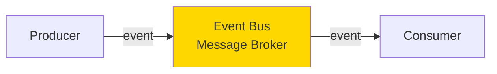
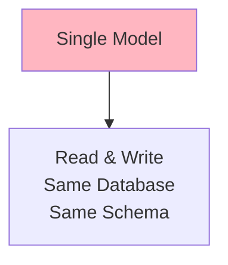
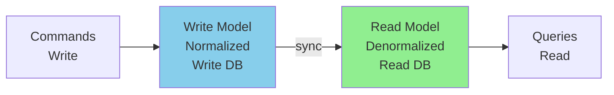
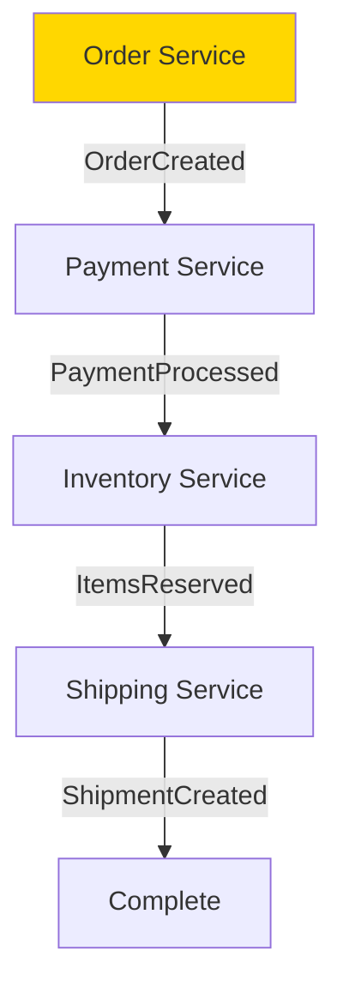
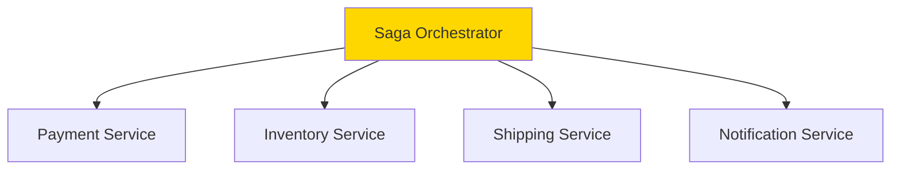
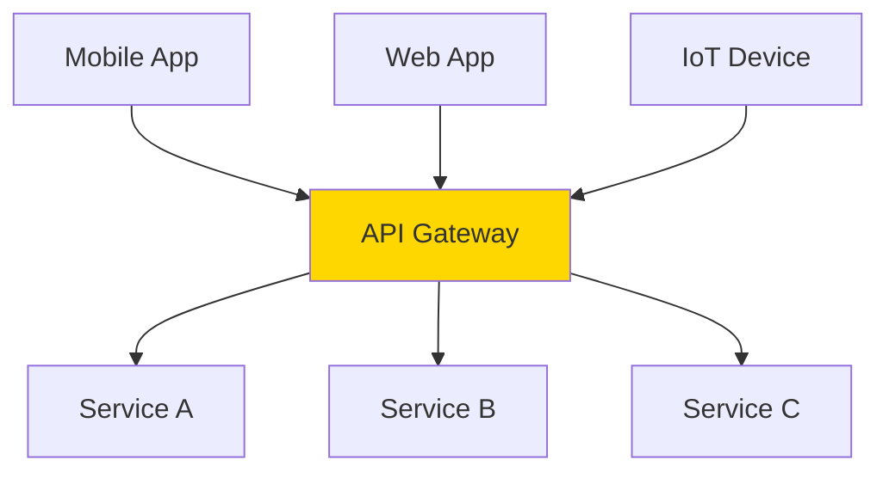
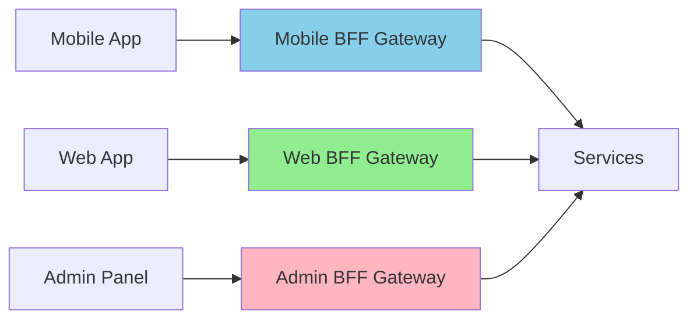
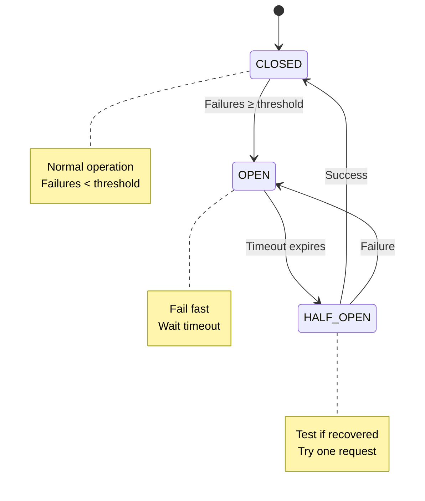

Medium-level software architecture interview questions covering distributed systems, event-driven architecture, and advanced patterns.

## Q1: Explain Event-Driven Architecture and its benefits.

**Answer**:

**Definition**: Architecture where components communicate through events (state changes) rather than direct calls.

**Core Concepts**:

### Components



**Event**: Immutable fact about something that happened
```json
{
  "eventType": "OrderPlaced",
  "timestamp": "2025-12-13T10:30:00Z",
  "data": {
    "orderId": "12345",
    "userId": "user-789",
    "amount": 99.99
  }
}
```

### Patterns

**1. Pub/Sub (Publish-Subscribe)**:
```
Publisher → Topic → [Subscriber1, Subscriber2, Subscriber3]
```
- Publishers don't know subscribers
- Multiple subscribers can listen to same event
- Loose coupling

**2. Event Streaming**:
```
Producer → Stream (Kafka, Kinesis) → Consumers
```
- Events stored in order
- Consumers can replay events
- Event sourcing possible

**3. Event Notification**:
```
Service A → Event: "User Created" → Service B reacts
```
- Minimal data in event
- Consumers fetch details if needed

**4. Event-Carried State Transfer**:
```
Event contains full state:
{
  "eventType": "UserUpdated",
  "user": {complete user object}
}
```
- No need to query for details
- Larger events

### Benefits

**Loose Coupling**:
- Services don't need to know about each other
- Add/remove consumers without affecting producers
- Independent deployment

**Scalability**:
- Async processing
- Consumers scale independently
- Buffer spikes with message queue

**Flexibility**:
- Easy to add new features (new consumers)
- Change business logic without modifying producers

**Resilience**:
- Failures isolated
- Messages persisted (retry possible)
- Graceful degradation

**Audit Trail**:
- All events logged
- Replay for debugging
- Event sourcing for complete history

### Challenges

**Complexity**:
- Harder to trace flow
- Debugging distributed events
- Need monitoring/observability

**Eventual Consistency**:
- Not immediately consistent
- Must handle out-of-order events
- Idempotency required

**Event Schema Evolution**:
- Backward/forward compatibility needed
- Versioning strategy required

### Example Use Case

**E-commerce Order System**:
```
1. User places order
   → OrderPlaced event

2. Multiple services react:
   - Inventory Service: Reserve items
   - Payment Service: Process payment
   - Notification Service: Send confirmation email
   - Analytics Service: Track metrics
   - Shipping Service: Create shipment

3. Each service emits own events:
   - PaymentProcessed
   - ItemsReserved
   - EmailSent
   - ShipmentCreated
```

**Traditional (synchronous)**:
```
OrderService calls:
  → InventoryService.reserve()
  → PaymentService.process()
  → NotificationService.send()
  → ...
(If any fails, entire operation fails)
```

**Event-Driven (asynchronous)**:
```
OrderService emits OrderPlaced event
Each service independently:
  - Listens for event
  - Processes asynchronously
  - Emits own events
(Failures isolated, can retry)
```

---

## Q2: What is CQRS (Command Query Responsibility Segregation)?

**Answer**:

**Definition**: Separate read and write operations into different models.

**Traditional Approach**:



**CQRS Approach**:



### Commands (Write Side)

**Purpose**: Modify state

**Characteristics**:
- Validates business rules
- Emits domain events
- Optimized for writes
- Normalized schema

**Example**:
```
Command: PlaceOrder
{
  "userId": "123",
  "items": [...],
  "shippingAddress": {...}
}

Processing:
1. Validate user exists
2. Check inventory
3. Calculate total
4. Create order
5. Emit OrderPlaced event
```

### Queries (Read Side)

**Purpose**: Retrieve data

**Characteristics**:
- No business logic
- Optimized for reads
- Denormalized (pre-joined)
- Can have multiple read models

**Example**:
```
Query: GetUserOrderHistory
{
  "userId": "123"
}

Returns:
{
  "orders": [
    {
      "orderId": "...",
      "date": "...",
      "total": 99.99,
      "items": [...],  // Pre-joined
      "status": "..."
    }
  ]
}
```

### Synchronization

**Eventual Consistency**:
```
1. Command updates Write DB
2. Emits event
3. Event handler updates Read DB
4. Small delay (milliseconds to seconds)
```

**Strategies**:
- Event-driven (recommended)
- Database triggers
- Change data capture (CDC)
- Scheduled sync

### Benefits

**Performance**:
- Optimize read and write separately
- Scale independently
- Different databases (SQL for writes, NoSQL for reads)

**Flexibility**:
- Multiple read models for different views
- Add new read models without affecting writes

**Scalability**:
- Read replicas
- Caching strategies
- Different scaling strategies

**Simplicity**:
- Simpler models (not trying to serve both)
- Clear separation of concerns

### When to Use

✅ **Use CQRS when**:
- Complex domain logic
- Read/write patterns very different
- Need to scale reads and writes independently
- Multiple views of same data needed

❌ **Don't use CQRS when**:
- Simple CRUD application
- Read/write patterns similar
- Team unfamiliar with pattern
- Eventual consistency unacceptable

### Example: E-commerce

**Write Model** (Orders):
```
Orders Table:
- order_id
- user_id
- status
- created_at

OrderItems Table:
- order_item_id
- order_id
- product_id
- quantity
- price
```

**Read Model** (Order History View):
```
OrderHistoryView (Denormalized):
{
  "orderId": "...",
  "userName": "Alice",
  "userEmail": "alice@example.com",
  "orderDate": "...",
  "totalAmount": 99.99,
  "items": [
    {
      "productName": "Widget",
      "quantity": 2,
      "price": 49.99
    }
  ],
  "shippingAddress": "...",
  "status": "Shipped"
}
```

**Read Model** (Admin Dashboard):
```
OrderStatistics:
{
  "totalOrders": 1000,
  "totalRevenue": 50000,
  "averageOrderValue": 50,
  "topProducts": [...]
}
```

---

## Q3: Explain the Saga pattern for distributed transactions.

**Answer**:

**Problem**: Distributed transactions across microservices (no 2PC/XA transactions).

**Definition**: Sequence of local transactions where each transaction updates database and publishes event/message to trigger next step.

### Saga Types

#### 1. Choreography (Event-Driven)

**How it works**: Each service listens for events and decides what to do.



**Pros**:
- No central coordinator
- Loose coupling
- Simple for simple workflows

**Cons**:
- Hard to track overall state
- Cyclic dependencies possible
- Difficult to understand flow

#### 2. Orchestration (Command-Driven)

**How it works**: Central orchestrator tells each service what to do.



**Pros**:
- Clear workflow
- Easy to track state
- Centralized error handling

**Cons**:
- Single point of failure
- Orchestrator can become complex

### Compensating Transactions

**Problem**: How to rollback when step fails?

**Solution**: Each step has compensating transaction.

**Example - Order Saga**:

**Happy Path**:
```
1. Create Order → Success
2. Process Payment → Success
3. Reserve Inventory → Success
4. Create Shipment → Success
```

**Failure Scenario**:
```
1. Create Order → Success
2. Process Payment → Success
3. Reserve Inventory → FAIL

Compensate:
3. Unreserve Inventory (N/A - failed)
2. Refund Payment ← Compensate
1. Cancel Order ← Compensate
```

### Implementation Example (Orchestration)

**Saga Definition**:
```javascript
class OrderSaga {
  steps = [
    {
      name: "CreateOrder",
      action: (data) => orderService.create(data),
      compensate: (data) => orderService.cancel(data.orderId)
    },
    {
      name: "ProcessPayment",
      action: (data) => paymentService.charge(data),
      compensate: (data) => paymentService.refund(data.paymentId)
    },
    {
      name: "ReserveInventory",
      action: (data) => inventoryService.reserve(data),
      compensate: (data) => inventoryService.release(data.reservationId)
    },
    {
      name: "CreateShipment",
      action: (data) => shippingService.create(data),
      compensate: (data) => shippingService.cancel(data.shipmentId)
    }
  ];
  
  async execute(orderData) {
    const completedSteps = [];
    
    try {
      for (const step of this.steps) {
        const result = await step.action(orderData);
        completedSteps.push({ step, result });
        
        // Update orderData with results for next steps
        Object.assign(orderData, result);
      }
      
      return { success: true, data: orderData };
      
    } catch (error) {
      // Compensate in reverse order
      for (const { step, result } of completedSteps.reverse()) {
        try {
          await step.compensate({ ...orderData, ...result });
        } catch (compensateError) {
          // Log and alert - manual intervention may be needed
          logger.error("Compensation failed", compensateError);
        }
      }
      
      return { success: false, error };
    }
  }
}
```

### Saga State Management

**Track saga state**:
```
SagaInstance:
{
  "sagaId": "saga-12345",
  "type": "OrderSaga",
  "status": "InProgress",
  "currentStep": "ProcessPayment",
  "completedSteps": ["CreateOrder"],
  "data": {...},
  "startedAt": "...",
  "updatedAt": "..."
}
```

### Handling Failures

**Idempotency**: Each step must be idempotent (can be retried safely)
```
// Check if already processed
if (alreadyProcessed(requestId)) {
  return previousResult;
}

// Process
result = process();

// Store result with requestId
store(requestId, result);
return result;
```

**Timeout Handling**:
```
try {
  result = await withTimeout(step.action(data), 30000);
} catch (TimeoutError) {
  // Decide: retry or compensate
}
```

### When to Use Saga

✅ **Use when**:
- Distributed transactions needed
- Long-running processes
- Need to maintain consistency across services

❌ **Don't use when**:
- Single database (use local transactions)
- Immediate consistency required
- Simple workflows

---

## Q4: What is API Gateway pattern and what problems does it solve?

**Answer**:

**Definition**: Single entry point for all client requests to microservices.

**Architecture**:



### Problems It Solves

**1. Multiple Client Types**:
- Mobile needs different data than web
- Different protocols (HTTP, WebSocket, gRPC)
- Gateway adapts responses per client

**2. Cross-Cutting Concerns**:
- Authentication/Authorization
- Rate limiting
- Logging/Monitoring
- SSL termination
- Caching

**3. Service Discovery**:
- Clients don't need to know service locations
- Gateway routes to appropriate service
- Load balancing

**4. Protocol Translation**:
- External: REST/HTTP
- Internal: gRPC, message queues
- Gateway translates

### Key Responsibilities

#### 1. Request Routing
```
GET /api/users/123 → User Service
GET /api/orders/456 → Order Service
GET /api/products/789 → Product Service
```

#### 2. Request Aggregation
```
Client requests: GET /api/user-dashboard/123

Gateway:
1. GET /users/123 → User Service
2. GET /orders?userId=123 → Order Service
3. GET /recommendations/123 → Recommendation Service

Combine results:
{
  "user": {...},
  "recentOrders": [...],
  "recommendations": [...]
}
```

#### 3. Authentication/Authorization
```
1. Client sends request with token
2. Gateway validates token
3. If valid, forwards to service with user context
4. If invalid, returns 401
```

#### 4. Rate Limiting
```
User tier limits:
- Free: 100 requests/hour
- Premium: 1000 requests/hour
- Enterprise: Unlimited

Gateway tracks and enforces limits
```

#### 5. Response Transformation
```
Internal service response:
{
  "user_id": 123,
  "first_name": "Alice",
  "last_name": "Smith",
  "created_timestamp": 1702468800
}

Gateway transforms for mobile:
{
  "id": 123,
  "name": "Alice Smith",
  "memberSince": "2023-12-13"
}
```

### Implementation Patterns

**Backend for Frontend (BFF)**:



Each client type has dedicated gateway optimized for its needs.

### Popular API Gateway Solutions

**Cloud**:
- AWS API Gateway
- Azure API Management
- Google Cloud API Gateway

**Self-Hosted**:
- Kong
- Tyk
- Apigee
- Ambassador

**Lightweight**:
- Nginx
- Traefik
- Envoy

### Example Configuration (Kong)

```yaml
services:
  - name: user-service
    url: http://user-service:8080
    routes:
      - name: user-route
        paths:
          - /api/users
    plugins:
      - name: rate-limiting
        config:
          minute: 100
      - name: jwt
        config:
          claims_to_verify:
            - exp
      - name: cors
        config:
          origins:
            - "*"
```

### Challenges

**Single Point of Failure**:
- Solution: Multiple gateway instances with load balancer
- Health checks and auto-scaling

**Performance Bottleneck**:
- Solution: Horizontal scaling
- Caching
- Async processing where possible

**Complexity**:
- Can become bloated with too much logic
- Keep gateway thin (routing, auth, basic transforms only)
- Complex logic belongs in services

### Best Practices

1. **Keep it thin**: Routing and cross-cutting concerns only
2. **Don't put business logic**: Belongs in services
3. **Cache aggressively**: Reduce backend load
4. **Monitor closely**: Gateway is critical path
5. **Version APIs**: Support multiple API versions
6. **Use circuit breakers**: Prevent cascade failures

---

## Q5: Explain Circuit Breaker pattern.

**Answer**:

**Problem**: Prevent cascading failures when service is down.

**Definition**: Monitor failures and "open circuit" to fail fast instead of waiting for timeouts.

### States



### How It Works

**CLOSED State** (Normal):
```
1. All requests pass through
2. Track failures
3. If failures ≥ threshold → OPEN
```

**OPEN State** (Failing):
```
1. Immediately return error (fail fast)
2. Don't call service
3. After timeout → HALF-OPEN
```

**HALF-OPEN State** (Testing):
```
1. Allow limited requests through
2. If successful → CLOSED
3. If failed → OPEN
```

### Implementation Example

```javascript
class CircuitBreaker {
  constructor(options = {}) {
    this.failureThreshold = options.failureThreshold || 5;
    this.timeout = options.timeout || 60000; // 60 seconds
    this.monitoringPeriod = options.monitoringPeriod || 10000; // 10 seconds
    
    this.state = 'CLOSED';
    this.failureCount = 0;
    this.nextAttempt = Date.now();
    this.successCount = 0;
  }
  
  async execute(operation) {
    if (this.state === 'OPEN') {
      if (Date.now() < this.nextAttempt) {
        throw new Error('Circuit breaker is OPEN');
      }
      // Timeout expired, try again
      this.state = 'HALF-OPEN';
      this.successCount = 0;
    }
    
    try {
      const result = await operation();
      this.onSuccess();
      return result;
    } catch (error) {
      this.onFailure();
      throw error;
    }
  }
  
  onSuccess() {
    this.failureCount = 0;
    
    if (this.state === 'HALF-OPEN') {
      this.successCount++;
      if (this.successCount >= 3) {
        this.state = 'CLOSED';
        console.log('Circuit breaker CLOSED');
      }
    }
  }
  
  onFailure() {
    this.failureCount++;
    
    if (this.state === 'HALF-OPEN') {
      this.state = 'OPEN';
      this.nextAttempt = Date.now() + this.timeout;
      console.log('Circuit breaker OPEN (from HALF-OPEN)');
      return;
    }
    
    if (this.failureCount >= this.failureThreshold) {
      this.state = 'OPEN';
      this.nextAttempt = Date.now() + this.timeout;
      console.log('Circuit breaker OPEN');
    }
  }
  
  getState() {
    return {
      state: this.state,
      failureCount: this.failureCount,
      nextAttempt: new Date(this.nextAttempt)
    };
  }
}

// Usage
const breaker = new CircuitBreaker({
  failureThreshold: 5,
  timeout: 60000
});

async function callExternalService() {
  try {
    return await breaker.execute(async () => {
      const response = await fetch('https://api.example.com/data');
      if (!response.ok) throw new Error('Service error');
      return await response.json();
    });
  } catch (error) {
    if (error.message === 'Circuit breaker is OPEN') {
      // Return fallback or cached data
      return getFallbackData();
    }
    throw error;
  }
}
```

### Benefits

**Prevent Cascade Failures**:
```
Without Circuit Breaker:
Service A → Service B (down)
  ↓ waits for timeout (30s)
  ↓ all threads blocked
  ↓ Service A becomes unresponsive
  ↓ Services calling A also block
  ↓ Entire system fails

With Circuit Breaker:
Service A → Circuit Breaker → Service B (down)
  ↓ Circuit opens after 5 failures
  ↓ Fail fast (immediate response)
  ↓ Service A remains responsive
  ↓ System degraded but functional
```

**Faster Recovery**:
- Don't overwhelm failing service
- Give it time to recover
- Gradually test recovery (HALF-OPEN)

**Better User Experience**:
- Fast failures (no waiting)
- Can return cached/fallback data
- Clear error messages

### Advanced Features

**Fallback**:
```javascript
async function callWithFallback() {
  try {
    return await breaker.execute(() => fetchFromAPI());
  } catch (error) {
    return await fetchFromCache();
  }
}
```

**Monitoring**:
```javascript
breaker.on('open', () => {
  metrics.increment('circuit_breaker.open');
  alerting.notify('Circuit breaker opened for service X');
});

breaker.on('half-open', () => {
  metrics.increment('circuit_breaker.half_open');
});

breaker.on('closed', () => {
  metrics.increment('circuit_breaker.closed');
});
```

**Per-Endpoint Breakers**:
```javascript
const breakers = {
  userService: new CircuitBreaker({...}),
  orderService: new CircuitBreaker({...}),
  paymentService: new CircuitBreaker({...})
};
```

### When to Use

✅ **Use when**:
- Calling external services
- Service failures expected
- Want to prevent cascade failures
- Need graceful degradation

❌ **Don't use when**:
- Internal method calls
- Database queries (use connection pooling instead)
- Critical operations that must succeed

---

## Summary

Medium architecture topics:
- **Event-Driven Architecture**: Async, decoupled communication
- **CQRS**: Separate read/write models
- **Saga Pattern**: Distributed transactions
- **API Gateway**: Single entry point, cross-cutting concerns
- **Circuit Breaker**: Prevent cascade failures

These patterns enable building scalable, resilient distributed systems.

