Easy-level scalability interview questions covering fundamental scaling concepts.

## Q1: What is scalability and why does it matter?

**Answer**:

**Definition**: System's ability to handle increased load by adding resources.

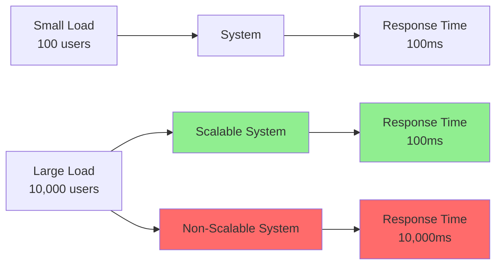
```mermaid
graph LR
    A[Small Load<br/>100 users] --> B[System]
    B --> C[Response Time<br/>100ms]
    
    D[Large Load<br/>10,000 users] --> E[Scalable System]
    E --> F[Response Time<br/>100ms]
    
    D --> G[Non-Scalable System]
    G --> H[Response Time<br/>10,000ms]
    
    style E fill:#90EE90
    style F fill:#90EE90
    style G fill:#FF6B6B
    style H fill:#FF6B6B
```

**Why It Matters**:
- Handle growth without rewriting
- Maintain performance under load
- Cost-effective resource usage
- Better user experience

---

## Q2: Explain vertical vs. horizontal scaling.

**Answer**:

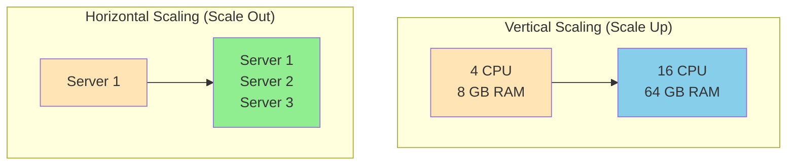
```mermaid
graph TB
    subgraph Vertical["Vertical Scaling (Scale Up)"]
        A1[4 CPU<br/>8 GB RAM] --> A2[16 CPU<br/>64 GB RAM]
        style A1 fill:#FFE4B5
        style A2 fill:#87CEEB
    end
    
    subgraph Horizontal["Horizontal Scaling (Scale Out)"]
        B1[Server 1] --> B2[Server 1<br/>Server 2<br/>Server 3]
        style B1 fill:#FFE4B5
        style B2 fill:#90EE90
    end
```

**Vertical Scaling**:
- Add more power to existing machine
- Simple (no code changes)
- Limited by hardware
- Single point of failure
- **Use for**: Databases, monoliths

**Horizontal Scaling**:
- Add more machines
- Nearly unlimited scaling
- Requires load balancing
- Better fault tolerance
- **Use for**: Web servers, microservices

---

## Q3: What is a load balancer and how does it work?

**Answer**:

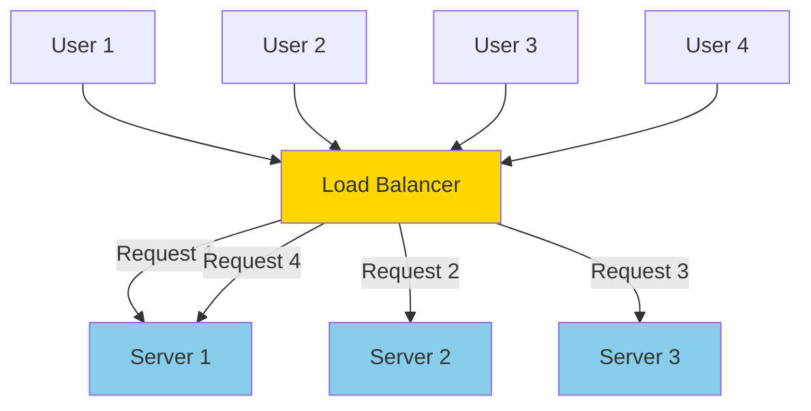
```mermaid
graph TB
    U1[User 1] --> LB[Load Balancer]
    U2[User 2] --> LB
    U3[User 3] --> LB
    U4[User 4] --> LB
    
    LB -->|Request 1| S1[Server 1]
    LB -->|Request 2| S2[Server 2]
    LB -->|Request 3| S3[Server 3]
    LB -->|Request 4| S1
    
    style LB fill:#FFD700
    style S1 fill:#87CEEB
    style S2 fill:#87CEEB
    style S3 fill:#87CEEB
```

**Purpose**: Distribute traffic across multiple servers

**Algorithms**:

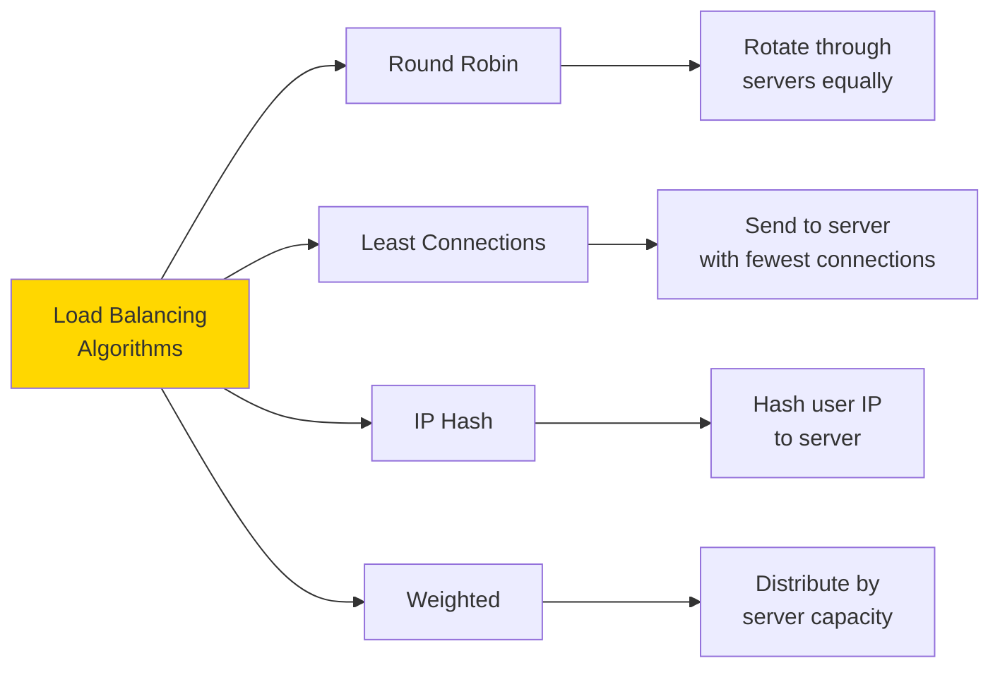
```mermaid
graph LR
    A[Load Balancing<br/>Algorithms] --> B1[Round Robin]
    A --> B2[Least Connections]
    A --> B3[IP Hash]
    A --> B4[Weighted]
    
    B1 --> C1[Rotate through<br/>servers equally]
    B2 --> C2[Send to server<br/>with fewest connections]
    B3 --> C3[Hash user IP<br/>to server]
    B4 --> C4[Distribute by<br/>server capacity]
    
    style A fill:#FFD700
```

**Benefits**:
- Distribute load evenly
- Remove single point of failure
- Enable rolling updates
- Health checks

---

## Q4: What is database replication?

**Answer**:

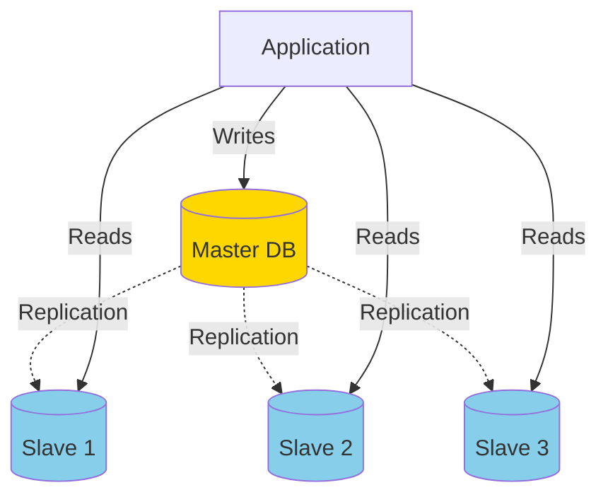
```mermaid
graph TB
    APP[Application] -->|Writes| MASTER[(Master DB)]
    
    MASTER -.->|Replication| SLAVE1[(Slave 1)]
    MASTER -.->|Replication| SLAVE2[(Slave 2)]
    MASTER -.->|Replication| SLAVE3[(Slave 3)]
    
    APP -->|Reads| SLAVE1
    APP -->|Reads| SLAVE2
    APP -->|Reads| SLAVE3
    
    style MASTER fill:#FFD700
    style SLAVE1 fill:#87CEEB
    style SLAVE2 fill:#87CEEB
    style SLAVE3 fill:#87CEEB
```

**Purpose**: Copy data from master to replicas

**Benefits**:
- **Read scaling**: Distribute read queries
- **High availability**: Failover if master fails
- **Backup**: Real-time backup
- **Geographic distribution**: Replicas in different regions

**Replication Types**:

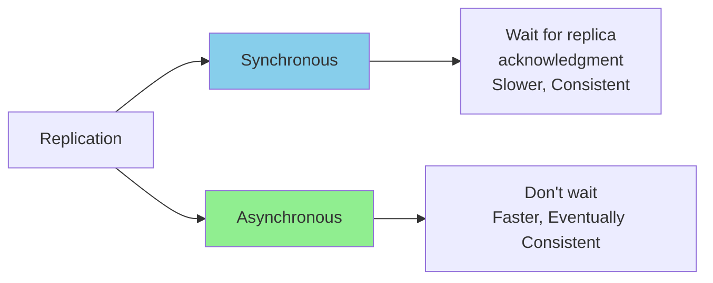
```mermaid
graph LR
    A[Replication] --> B[Synchronous]
    A --> C[Asynchronous]
    
    B --> D[Wait for replica<br/>acknowledgment<br/>Slower, Consistent]
    C --> E[Don't wait<br/>Faster, Eventually Consistent]
    
    style B fill:#87CEEB
    style C fill:#90EE90
```

---

## Q5: What is database sharding?

**Answer**:

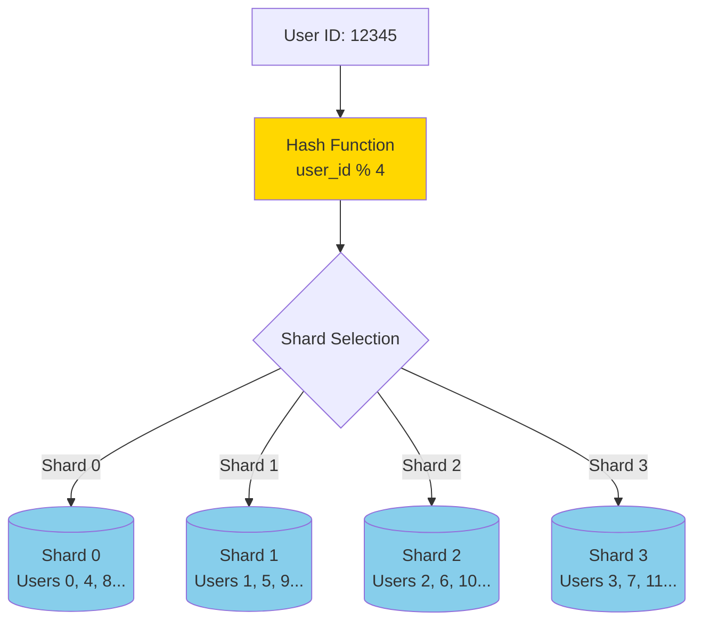
```mermaid
graph TB
    A[User ID: 12345] --> B[Hash Function<br/>user_id % 4]
    
    B --> C{Shard Selection}
    
    C -->|Shard 0| D1[(Shard 0<br/>Users 0, 4, 8...)]
    C -->|Shard 1| D2[(Shard 1<br/>Users 1, 5, 9...)]
    C -->|Shard 2| D3[(Shard 2<br/>Users 2, 6, 10...)]
    C -->|Shard 3| D4[(Shard 3<br/>Users 3, 7, 11...)]
    
    style B fill:#FFD700
    style D1 fill:#87CEEB
    style D2 fill:#87CEEB
    style D3 fill:#87CEEB
    style D4 fill:#87CEEB
```

**Purpose**: Partition data across multiple databases

**Sharding Strategies**:

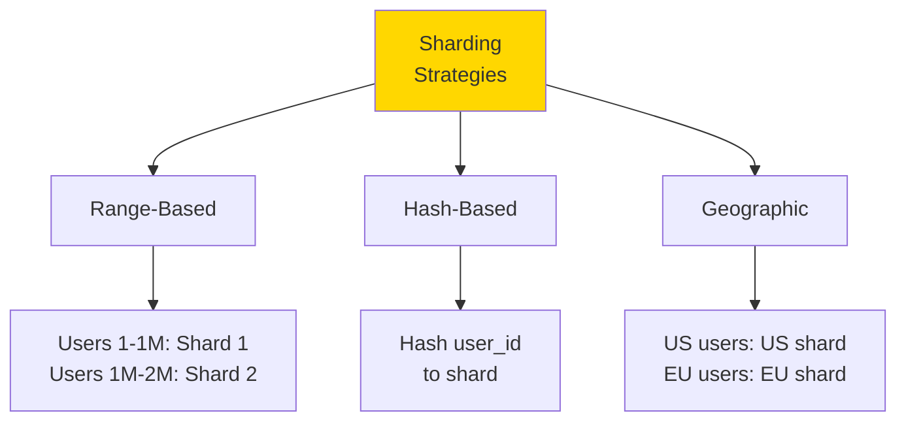
```mermaid
graph TB
    A[Sharding<br/>Strategies] --> B1[Range-Based]
    A --> B2[Hash-Based]
    A --> B3[Geographic]
    
    B1 --> C1[Users 1-1M: Shard 1<br/>Users 1M-2M: Shard 2]
    B2 --> C2[Hash user_id<br/>to shard]
    B3 --> C3[US users: US shard<br/>EU users: EU shard]
    
    style A fill:#FFD700
```

**Benefits**:
- Horizontal scaling for writes
- Distribute load
- Smaller indexes (faster queries)

**Challenges**:
- Complex queries across shards
- Rebalancing when adding shards
- Transactions across shards

---

## Q6: What is caching and where to use it?

**Answer**:

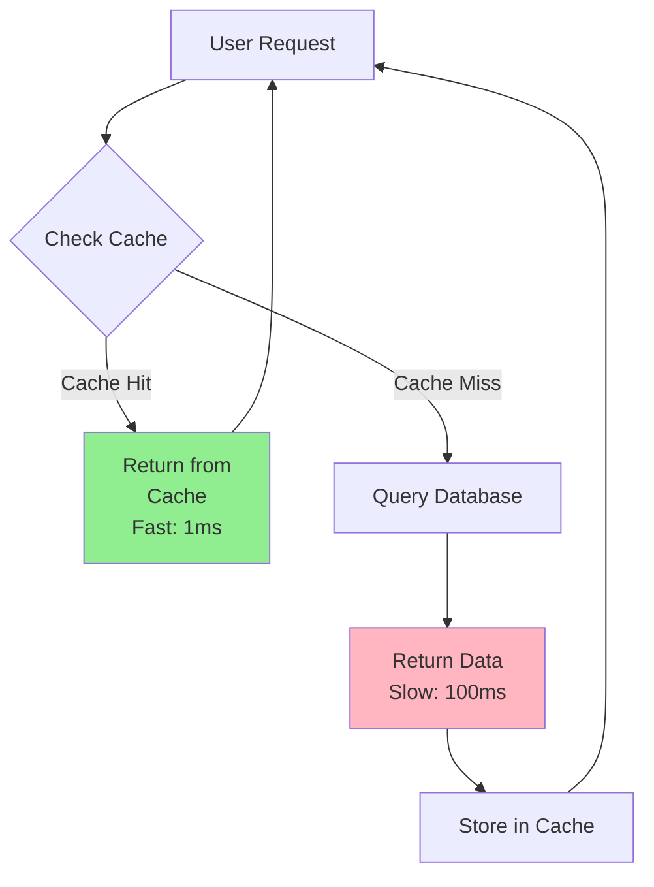
```mermaid
graph TB
    U[User Request] --> A{Check Cache}
    
    A -->|Cache Hit| B[Return from<br/>Cache<br/>Fast: 1ms]
    
    A -->|Cache Miss| C[Query Database]
    C --> D[Return Data<br/>Slow: 100ms]
    D --> E[Store in Cache]
    E --> U
    
    B --> U
    
    style B fill:#90EE90
    style D fill:#FFB6C1
```

**Cache Layers**:

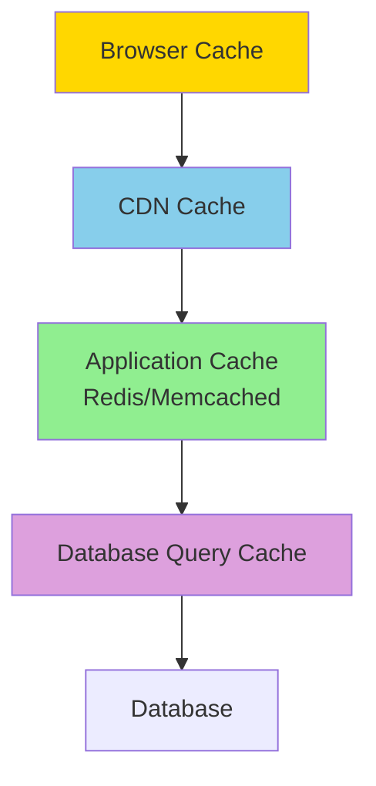
```mermaid
graph TB
    A[Browser Cache] --> B[CDN Cache]
    B --> C[Application Cache<br/>Redis/Memcached]
    C --> D[Database Query Cache]
    D --> E[Database]
    
    style A fill:#FFD700
    style B fill:#87CEEB
    style C fill:#90EE90
    style D fill:#DDA0DD
```

**When to Cache**:
- Frequently accessed data
- Expensive computations
- Rarely changing data
- Database query results

**Cache Strategies**:
- **Cache-Aside**: App checks cache, loads from DB if miss
- **Write-Through**: Write to cache and DB simultaneously
- **Write-Behind**: Write to cache, async write to DB

---

## Q7: What is a CDN (Content Delivery Network)?

**Answer**:

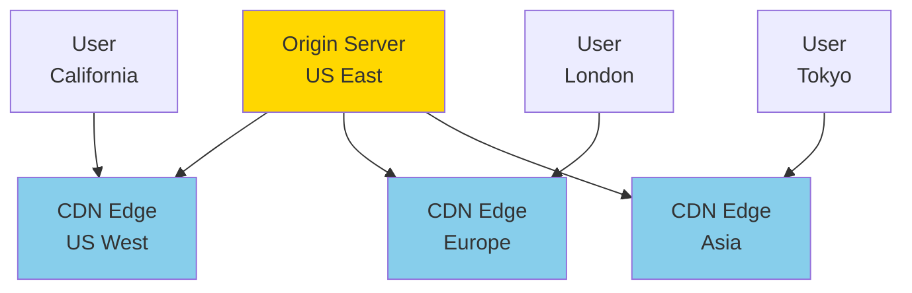
```mermaid
graph TB
    ORIGIN[Origin Server<br/>US East] --> CDN1[CDN Edge<br/>US West]
    ORIGIN --> CDN2[CDN Edge<br/>Europe]
    ORIGIN --> CDN3[CDN Edge<br/>Asia]
    
    U1[User<br/>California] --> CDN1
    U2[User<br/>London] --> CDN2
    U3[User<br/>Tokyo] --> CDN3
    
    style ORIGIN fill:#FFD700
    style CDN1 fill:#87CEEB
    style CDN2 fill:#87CEEB
    style CDN3 fill:#87CEEB
```

**Purpose**: Distribute static content globally

**How It Works**:

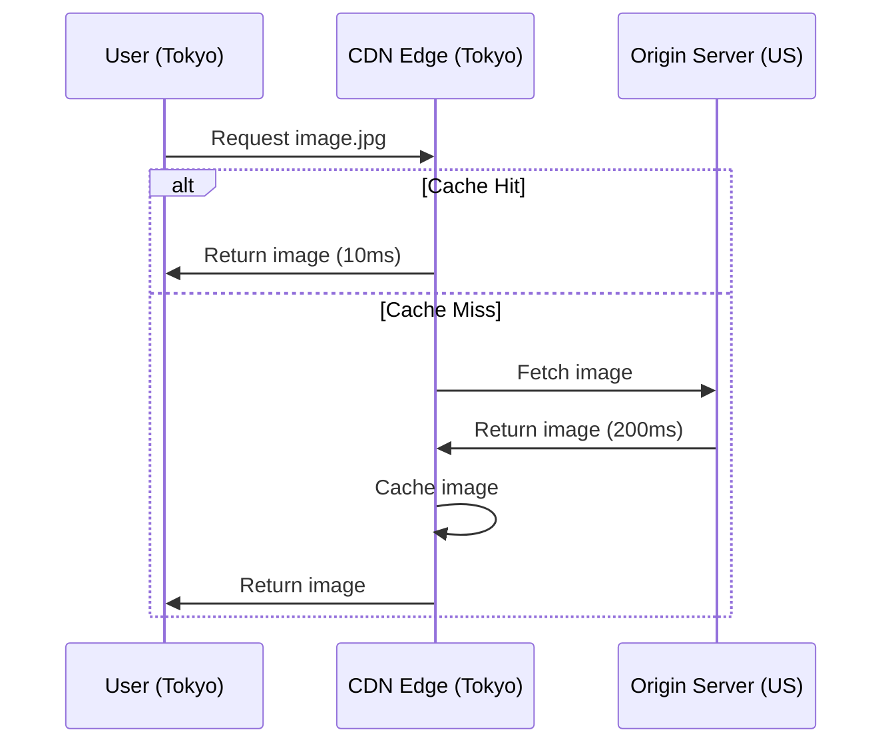
```mermaid
sequenceDiagram
    participant U as User (Tokyo)
    participant CDN as CDN Edge (Tokyo)
    participant Origin as Origin Server (US)
    
    U->>CDN: Request image.jpg
    
    alt Cache Hit
        CDN->>U: Return image (10ms)
    else Cache Miss
        CDN->>Origin: Fetch image
        Origin->>CDN: Return image (200ms)
        CDN->>CDN: Cache image
        CDN->>U: Return image
    end
```

**Benefits**:
- Reduced latency (serve from nearby edge)
- Reduced origin server load
- Better availability
- DDoS protection

**What to Cache**:
- Images, videos
- CSS, JavaScript
- Static HTML
- Downloads

---

## Q8: What is database indexing?

**Answer**:

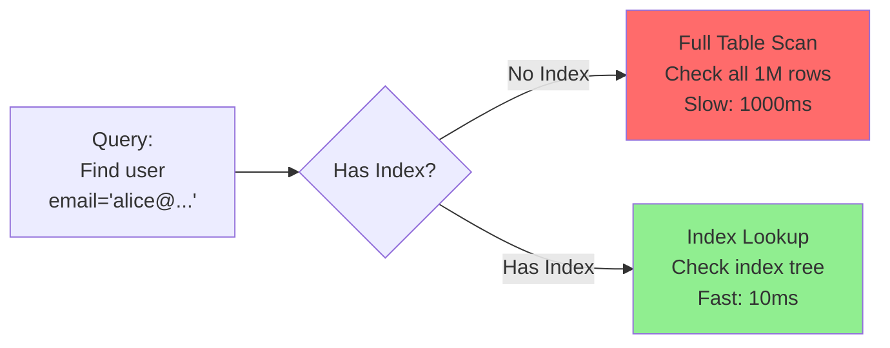
```mermaid
graph LR
    A[Query:<br/>Find user<br/>email='alice@...'] --> B{Has Index?}
    
    B -->|No Index| C[Full Table Scan<br/>Check all 1M rows<br/>Slow: 1000ms]
    
    B -->|Has Index| D[Index Lookup<br/>Check index tree<br/>Fast: 10ms]
    
    style C fill:#FF6B6B
    style D fill:#90EE90
```

**Index Structure (B-Tree)**:

```mermaid
graph TB
    ROOT[Root<br/>M-Z] --> L1[A-F]
    ROOT --> L2[G-L]
    ROOT --> L3[M-Z]
    
    L1 --> A[alice@...]
    L1 --> B[bob@...]
    L2 --> C[charlie@...]
    L3 --> D[zoe@...]
    
    style ROOT fill:#FFD700
    style L1 fill:#87CEEB
    style L2 fill:#87CEEB
    style L3 fill:#87CEEB
```

**When to Index**:
- Columns in WHERE clauses
- Columns in JOIN conditions
- Columns in ORDER BY
- Foreign keys

**Trade-offs**:
- ✅ Faster reads
- ❌ Slower writes (update index)
- ❌ Extra storage

---

## Q9: What is connection pooling?

**Answer**:

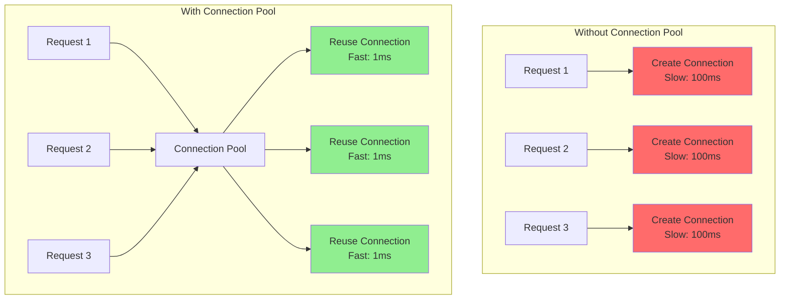
```mermaid
graph TB
    subgraph Without["Without Connection Pool"]
        A1[Request 1] --> B1[Create Connection<br/>Slow: 100ms]
        A2[Request 2] --> B2[Create Connection<br/>Slow: 100ms]
        A3[Request 3] --> B3[Create Connection<br/>Slow: 100ms]
    end
    
    subgraph With["With Connection Pool"]
        C1[Request 1] --> D[Connection Pool]
        C2[Request 2] --> D
        C3[Request 3] --> D
        
        D --> E1[Reuse Connection<br/>Fast: 1ms]
        D --> E2[Reuse Connection<br/>Fast: 1ms]
        D --> E3[Reuse Connection<br/>Fast: 1ms]
    end
    
    style B1 fill:#FF6B6B
    style B2 fill:#FF6B6B
    style B3 fill:#FF6B6B
    style E1 fill:#90EE90
    style E2 fill:#90EE90
    style E3 fill:#90EE90
```

**Purpose**: Reuse database connections instead of creating new ones

**How It Works**:

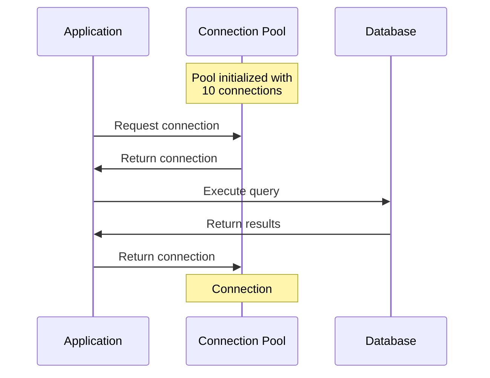
```mermaid
sequenceDiagram
    participant App as Application
    participant Pool as Connection Pool
    participant DB as Database
    
    Note over Pool: Pool initialized with<br/>10 connections
    
    App->>Pool: Request connection
    Pool->>App: Return connection #1
    App->>DB: Execute query
    DB->>App: Return results
    App->>Pool: Return connection #1
    
    Note over Pool: Connection #1 back in pool<br/>ready for reuse
```

**Benefits**:
- Faster (no connection overhead)
- Limited connections (prevent DB overload)
- Better resource management

**Configuration**:
- **Min connections**: Keep alive
- **Max connections**: Upper limit
- **Timeout**: How long to wait for connection

---

## Q10: What is rate limiting?

**Answer**:

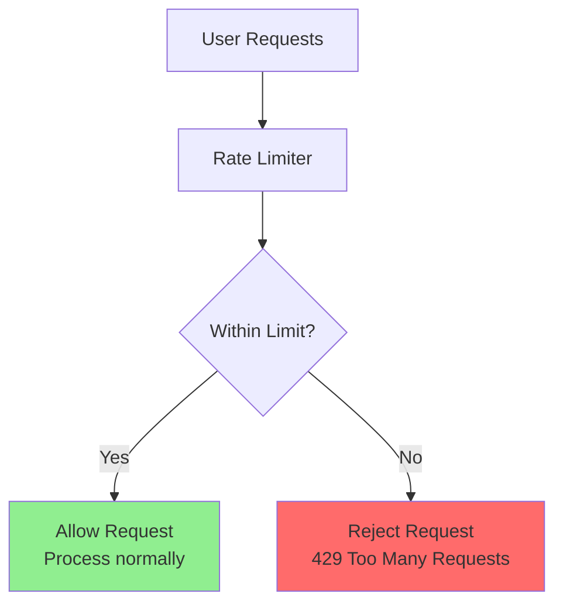
```mermaid
graph TB
    U[User Requests] --> RL[Rate Limiter]
    
    RL --> C{Within Limit?}
    
    C -->|Yes| A[Allow Request<br/>Process normally]
    C -->|No| B[Reject Request<br/>429 Too Many Requests]
    
    style A fill:#90EE90
    style B fill:#FF6B6B
```

**Algorithms**:

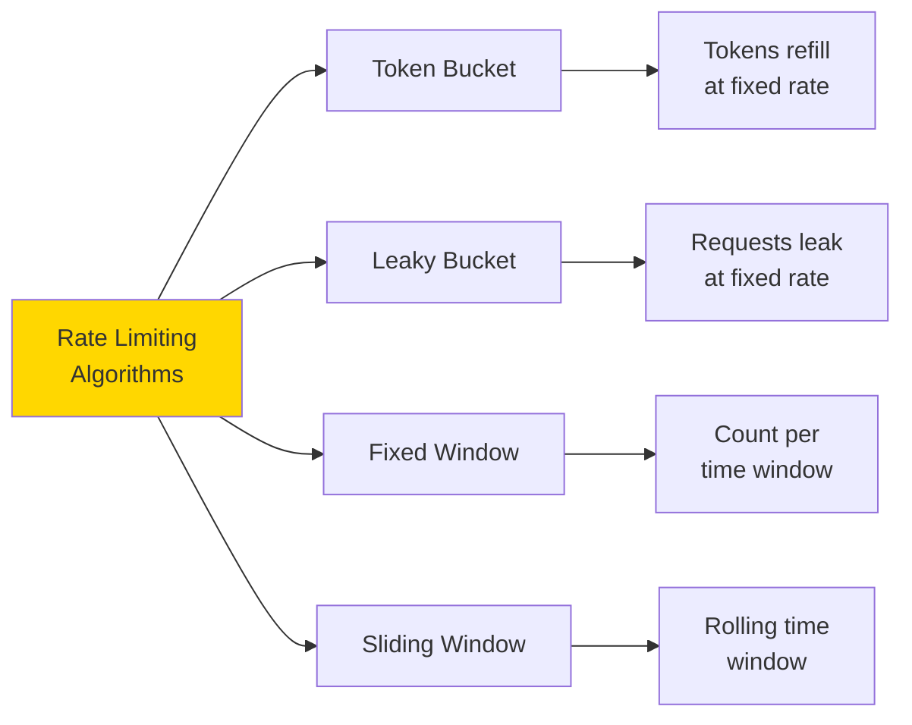
```mermaid
graph LR
    A[Rate Limiting<br/>Algorithms] --> B1[Token Bucket]
    A --> B2[Leaky Bucket]
    A --> B3[Fixed Window]
    A --> B4[Sliding Window]
    
    B1 --> C1[Tokens refill<br/>at fixed rate]
    B2 --> C2[Requests leak<br/>at fixed rate]
    B3 --> C3[Count per<br/>time window]
    B4 --> C4[Rolling time<br/>window]
    
    style A fill:#FFD700
```

**Token Bucket Example**:

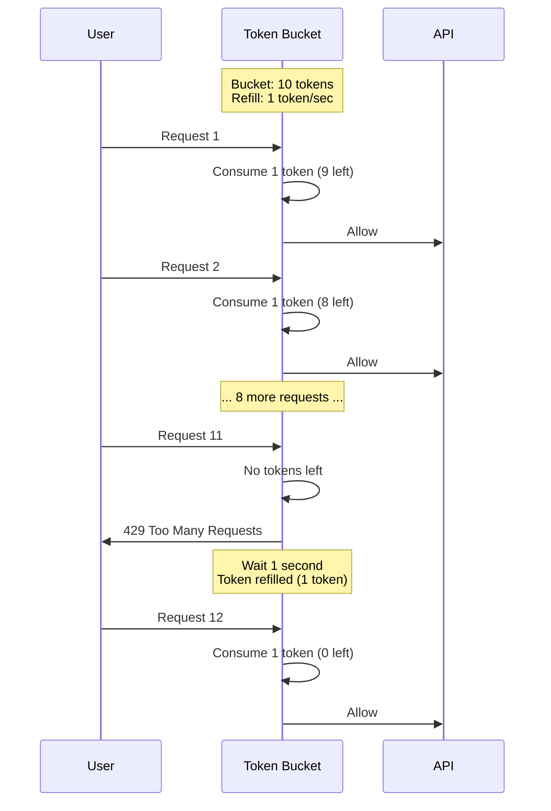
```mermaid
sequenceDiagram
    participant U as User
    participant TB as Token Bucket
    participant API as API
    
    Note over TB: Bucket: 10 tokens<br/>Refill: 1 token/sec
    
    U->>TB: Request 1
    TB->>TB: Consume 1 token (9 left)
    TB->>API: Allow
    
    U->>TB: Request 2
    TB->>TB: Consume 1 token (8 left)
    TB->>API: Allow
    
    Note over TB: ... 8 more requests ...
    
    U->>TB: Request 11
    TB->>TB: No tokens left
    TB->>U: 429 Too Many Requests
    
    Note over TB: Wait 1 second<br/>Token refilled (1 token)
    
    U->>TB: Request 12
    TB->>TB: Consume 1 token (0 left)
    TB->>API: Allow
```

**Why Rate Limit**:
- Prevent abuse
- Protect from DDoS
- Ensure fair usage
- Control costs

---

## Summary

Key scalability concepts:
- **Vertical vs. Horizontal**: Scale up vs. scale out
- **Load Balancing**: Distribute traffic
- **Database Replication**: Scale reads
- **Database Sharding**: Scale writes
- **Caching**: Reduce latency
- **CDN**: Global content delivery
- **Indexing**: Fast queries
- **Connection Pooling**: Reuse connections
- **Rate Limiting**: Prevent abuse

These fundamentals enable building scalable systems.

