Hard-level scalability interview questions covering extreme scale, global distribution, and advanced optimization.

## Q1: Design a globally distributed database with strong consistency.

**Answer**:

**Challenge**: CAP theorem - can't have all three (Consistency, Availability, Partition tolerance).

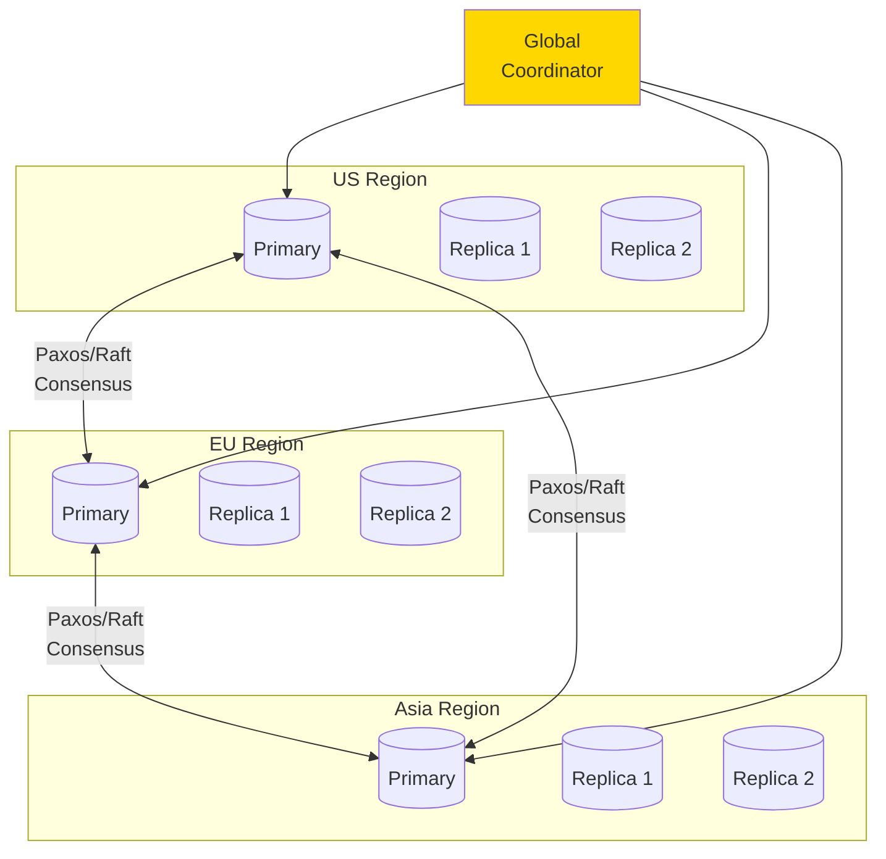
```mermaid
graph TB
    subgraph US["US Region"]
        US_DB[(Primary)]
        US_R1[(Replica 1)]
        US_R2[(Replica 2)]
    end
    
    subgraph EU["EU Region"]
        EU_DB[(Primary)]
        EU_R1[(Replica 1)]
        EU_R2[(Replica 2)]
    end
    
    subgraph ASIA["Asia Region"]
        ASIA_DB[(Primary)]
        ASIA_R1[(Replica 1)]
        ASIA_R2[(Replica 2)]
    end
    
    US_DB <-->|Paxos/Raft<br/>Consensus| EU_DB
    EU_DB <-->|Paxos/Raft<br/>Consensus| ASIA_DB
    ASIA_DB <-->|Paxos/Raft<br/>Consensus| US_DB
    
    COORD[Global<br/>Coordinator] --> US_DB
    COORD --> EU_DB
    COORD --> ASIA_DB
    
    style COORD fill:#FFD700
```

**Two-Phase Commit (2PC)**:

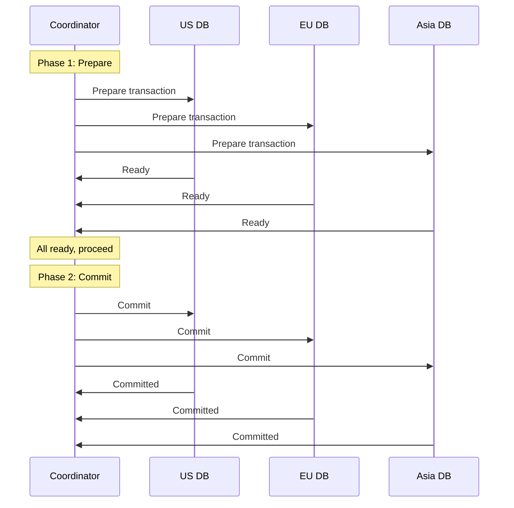
```mermaid
sequenceDiagram
    participant C as Coordinator
    participant US as US DB
    participant EU as EU DB
    participant ASIA as Asia DB
    
    Note over C: Phase 1: Prepare
    
    C->>US: Prepare transaction
    C->>EU: Prepare transaction
    C->>ASIA: Prepare transaction
    
    US->>C: Ready
    EU->>C: Ready
    ASIA->>C: Ready
    
    Note over C: All ready, proceed
    Note over C: Phase 2: Commit
    
    C->>US: Commit
    C->>EU: Commit
    C->>ASIA: Commit
    
    US->>C: Committed
    EU->>C: Committed
    ASIA->>C: Committed
```

**Spanner-like Architecture** (Google Spanner):

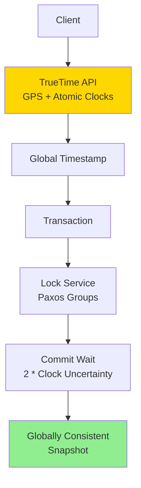
```mermaid
graph TB
    A[Client] --> B[TrueTime API<br/>GPS + Atomic Clocks]
    B --> C[Global Timestamp]
    
    C --> D[Transaction]
    D --> E[Lock Service<br/>Paxos Groups]
    
    E --> F[Commit Wait<br/>2 * Clock Uncertainty]
    
    F --> G[Globally Consistent<br/>Snapshot]
    
    style B fill:#FFD700
    style G fill:#90EE90
```

---

## Q2: How do you handle 1 million concurrent WebSocket connections?

**Answer**:

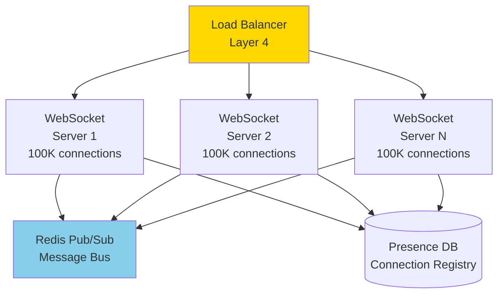
```mermaid
graph TB
    LB[Load Balancer<br/>Layer 4] --> WS1[WebSocket<br/>Server 1<br/>100K connections]
    LB --> WS2[WebSocket<br/>Server 2<br/>100K connections]
    LB --> WS3[WebSocket<br/>Server N<br/>100K connections]
    
    WS1 --> REDIS[Redis Pub/Sub<br/>Message Bus]
    WS2 --> REDIS
    WS3 --> REDIS
    
    WS1 --> PRESENCE[(Presence DB<br/>Connection Registry)]
    WS2 --> PRESENCE
    WS3 --> PRESENCE
    
    style LB fill:#FFD700
    style REDIS fill:#87CEEB
```

**Connection Distribution**:

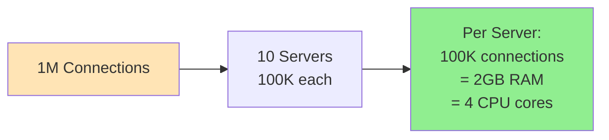
```mermaid
graph LR
    A[1M Connections] --> B[10 Servers<br/>100K each]
    
    B --> C[Per Server:<br/>100K connections<br/>= 2GB RAM<br/>= 4 CPU cores]
    
    style A fill:#FFE4B5
    style C fill:#90EE90
```

**Message Broadcasting**:

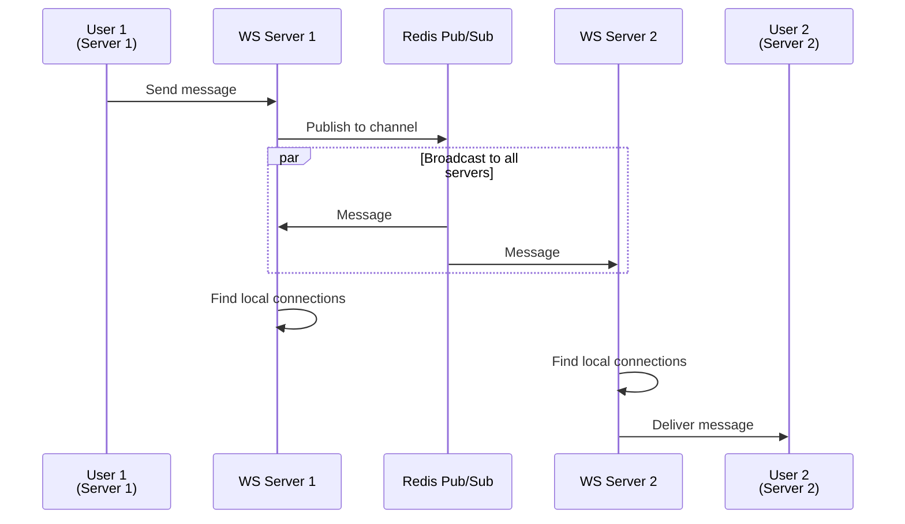
```mermaid
sequenceDiagram
    participant U1 as User 1<br/>(Server 1)
    participant S1 as WS Server 1
    participant Redis as Redis Pub/Sub
    participant S2 as WS Server 2
    participant U2 as User 2<br/>(Server 2)
    
    U1->>S1: Send message
    S1->>Redis: Publish to channel
    
    par Broadcast to all servers
        Redis->>S1: Message
        Redis->>S2: Message
    end
    
    S1->>S1: Find local connections
    S2->>S2: Find local connections
    
    S2->>U2: Deliver message
```

**Optimization Techniques**:

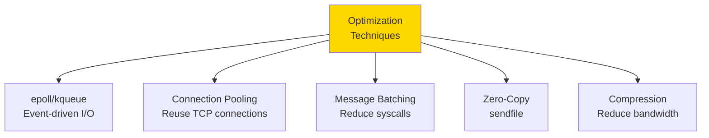
```mermaid
graph TB
    A[Optimization<br/>Techniques] --> B1[epoll/kqueue<br/>Event-driven I/O]
    A --> B2[Connection Pooling<br/>Reuse TCP connections]
    A --> B3[Message Batching<br/>Reduce syscalls]
    A --> B4[Zero-Copy<br/>sendfile]
    A --> B5[Compression<br/>Reduce bandwidth]
    
    style A fill:#FFD700
```

---

## Q3: Design a system to handle 1 billion daily active users.

**Answer**:

**Scale Requirements**:
- 1B DAU
- Peak: 100K requests/sec
- 99.99% uptime
- <100ms latency globally

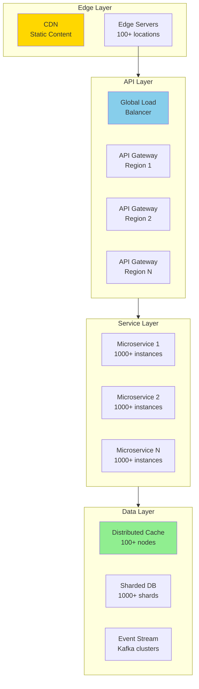
```mermaid
graph TB
    subgraph Edge["Edge Layer"]
        CDN[CDN<br/>Static Content]
        EDGE[Edge Servers<br/>100+ locations]
    end
    
    subgraph API["API Layer"]
        LB[Global Load<br/>Balancer]
        API1[API Gateway<br/>Region 1]
        API2[API Gateway<br/>Region 2]
        API3[API Gateway<br/>Region N]
    end
    
    subgraph Services["Service Layer"]
        MS1[Microservice 1<br/>1000+ instances]
        MS2[Microservice 2<br/>1000+ instances]
        MS3[Microservice N<br/>1000+ instances]
    end
    
    subgraph Data["Data Layer"]
        CACHE[Distributed Cache<br/>100+ nodes]
        DB[Sharded DB<br/>1000+ shards]
        STREAM[Event Stream<br/>Kafka clusters]
    end
    
    EDGE --> API
    API --> Services
    Services --> Data
    
    style CDN fill:#FFD700
    style LB fill:#87CEEB
    style CACHE fill:#90EE90
```

**Regional Architecture**:

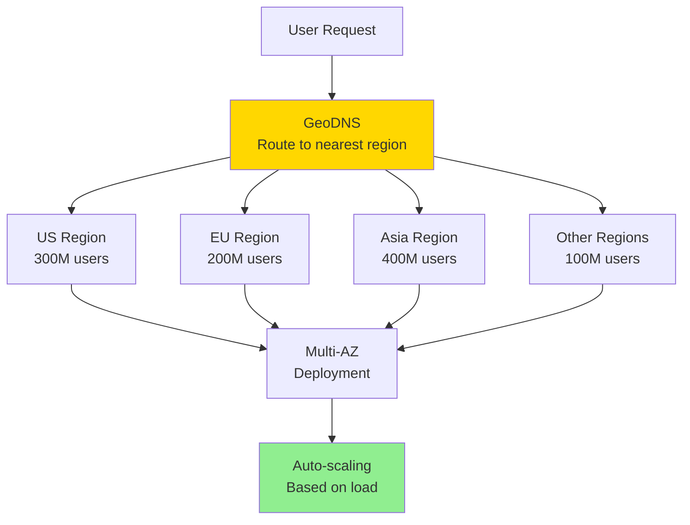
```mermaid
graph TB
    A[User Request] --> B[GeoDNS<br/>Route to nearest region]
    
    B --> C1[US Region<br/>300M users]
    B --> C2[EU Region<br/>200M users]
    B --> C3[Asia Region<br/>400M users]
    B --> C4[Other Regions<br/>100M users]
    
    C1 --> D[Multi-AZ<br/>Deployment]
    C2 --> D
    C3 --> D
    C4 --> D
    
    D --> E[Auto-scaling<br/>Based on load]
    
    style B fill:#FFD700
    style E fill:#90EE90
```

**Data Sharding Strategy**:

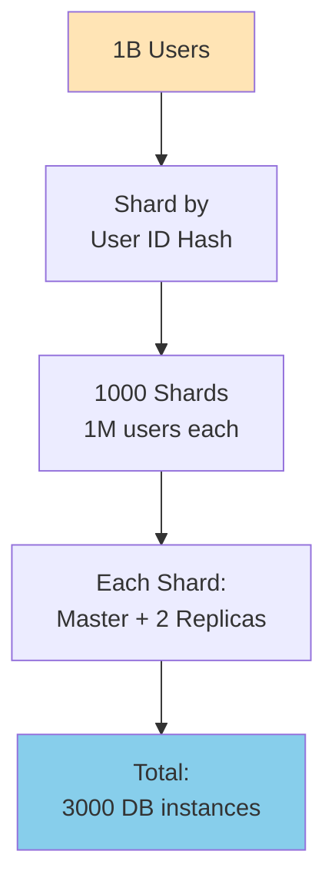
```mermaid
graph TB
    A[1B Users] --> B[Shard by<br/>User ID Hash]
    
    B --> C[1000 Shards<br/>1M users each]
    
    C --> D[Each Shard:<br/>Master + 2 Replicas]
    
    D --> E[Total:<br/>3000 DB instances]
    
    style A fill:#FFE4B5
    style E fill:#87CEEB
```

---

## Q4: Implement distributed rate limiting across data centers.

**Answer**:

**Challenge**: Maintain accurate counts across regions with minimal latency.

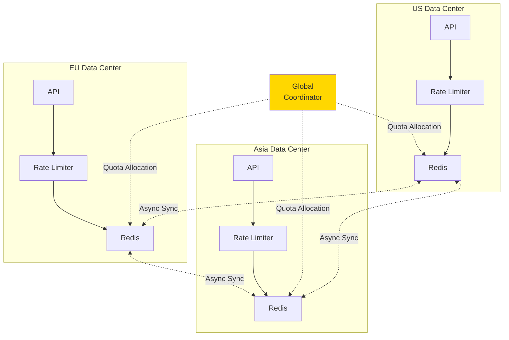
```mermaid
graph TB
    subgraph US["US Data Center"]
        US_API[API] --> US_RL[Rate Limiter]
        US_RL --> US_REDIS[Redis]
    end
    
    subgraph EU["EU Data Center"]
        EU_API[API] --> EU_RL[Rate Limiter]
        EU_RL --> EU_REDIS[Redis]
    end
    
    subgraph ASIA["Asia Data Center"]
        ASIA_API[API] --> ASIA_RL[Rate Limiter]
        ASIA_RL --> ASIA_REDIS[Redis]
    end
    
    US_REDIS <-.->|Async Sync| EU_REDIS
    EU_REDIS <-.->|Async Sync| ASIA_REDIS
    ASIA_REDIS <-.->|Async Sync| US_REDIS
    
    GLOBAL[Global<br/>Coordinator] -.->|Quota Allocation| US_REDIS
    GLOBAL -.->|Quota Allocation| EU_REDIS
    GLOBAL -.->|Quota Allocation| ASIA_REDIS
    
    style GLOBAL fill:#FFD700
```

**Quota Allocation Strategy**:

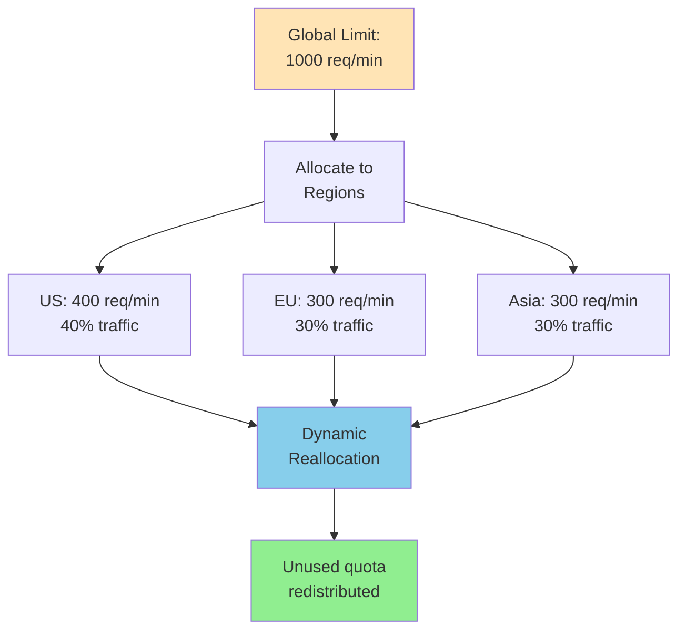
```mermaid
graph TB
    A[Global Limit:<br/>1000 req/min] --> B[Allocate to<br/>Regions]
    
    B --> C1[US: 400 req/min<br/>40% traffic]
    B --> C2[EU: 300 req/min<br/>30% traffic]
    B --> C3[Asia: 300 req/min<br/>30% traffic]
    
    C1 --> D[Dynamic<br/>Reallocation]
    C2 --> D
    C3 --> D
    
    D --> E[Unused quota<br/>redistributed]
    
    style A fill:#FFE4B5
    style D fill:#87CEEB
    style E fill:#90EE90
```

**Token Bucket with Gossip Protocol**:

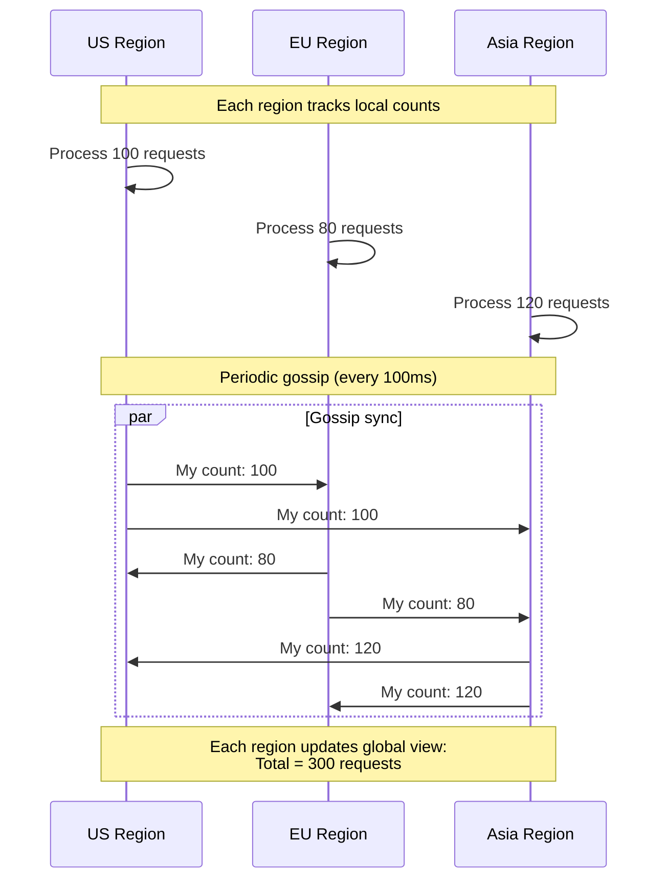
```mermaid
sequenceDiagram
    participant US as US Region
    participant EU as EU Region
    participant ASIA as Asia Region
    
    Note over US,ASIA: Each region tracks local counts
    
    US->>US: Process 100 requests
    EU->>EU: Process 80 requests
    ASIA->>ASIA: Process 120 requests
    
    Note over US,ASIA: Periodic gossip (every 100ms)
    
    par Gossip sync
        US->>EU: My count: 100
        US->>ASIA: My count: 100
        EU->>US: My count: 80
        EU->>ASIA: My count: 80
        ASIA->>US: My count: 120
        ASIA->>EU: My count: 120
    end
    
    Note over US,ASIA: Each region updates global view:<br/>Total = 300 requests
```

---

## Q5: Design auto-scaling for unpredictable traffic spikes.

**Answer**:

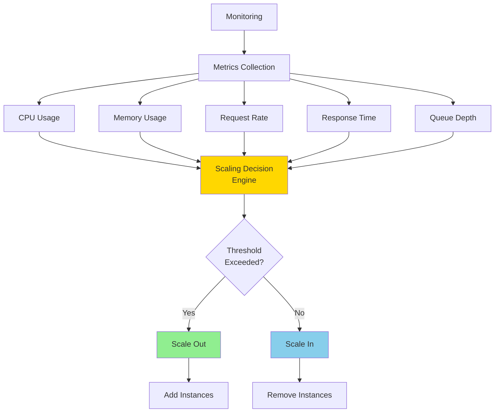
```mermaid
graph TB
    A[Monitoring] --> B[Metrics Collection]
    
    B --> C1[CPU Usage]
    B --> C2[Memory Usage]
    B --> C3[Request Rate]
    B --> C4[Response Time]
    B --> C5[Queue Depth]
    
    C1 --> D[Scaling Decision<br/>Engine]
    C2 --> D
    C3 --> D
    C4 --> D
    C5 --> D
    
    D --> E{Threshold<br/>Exceeded?}
    
    E -->|Yes| F[Scale Out]
    E -->|No| G[Scale In]
    
    F --> H[Add Instances]
    G --> I[Remove Instances]
    
    style D fill:#FFD700
    style F fill:#90EE90
    style G fill:#87CEEB
```

**Predictive Scaling**:

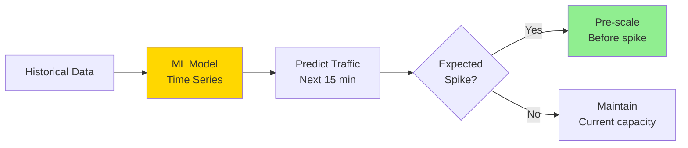
```mermaid
graph LR
    A[Historical Data] --> B[ML Model<br/>Time Series]
    
    B --> C[Predict Traffic<br/>Next 15 min]
    
    C --> D{Expected<br/>Spike?}
    
    D -->|Yes| E[Pre-scale<br/>Before spike]
    D -->|No| F[Maintain<br/>Current capacity]
    
    style B fill:#FFD700
    style E fill:#90EE90
```

**Multi-Tier Scaling**:

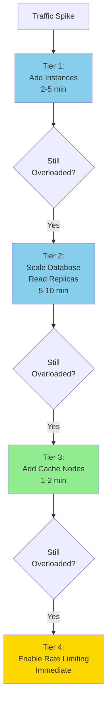
```mermaid
graph TB
    A[Traffic Spike] --> B[Tier 1:<br/>Add Instances<br/>2-5 min]
    
    B --> C{Still<br/>Overloaded?}
    
    C -->|Yes| D[Tier 2:<br/>Scale Database<br/>Read Replicas<br/>5-10 min]
    
    D --> E{Still<br/>Overloaded?}
    
    E -->|Yes| F[Tier 3:<br/>Add Cache Nodes<br/>1-2 min]
    
    F --> G{Still<br/>Overloaded?}
    
    G -->|Yes| H[Tier 4:<br/>Enable Rate Limiting<br/>Immediate]
    
    style B fill:#87CEEB
    style D fill:#87CEEB
    style F fill:#90EE90
    style H fill:#FFD700
```

**Scaling Policies**:

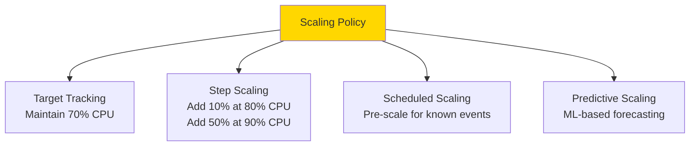
```mermaid
graph TB
    A[Scaling Policy] --> B1[Target Tracking<br/>Maintain 70% CPU]
    A --> B2[Step Scaling<br/>Add 10% at 80% CPU<br/>Add 50% at 90% CPU]
    A --> B3[Scheduled Scaling<br/>Pre-scale for known events]
    A --> B4[Predictive Scaling<br/>ML-based forecasting]
    
    style A fill:#FFD700
```

---

## Q6: How do you handle database migrations at scale with zero downtime?

**Answer**:

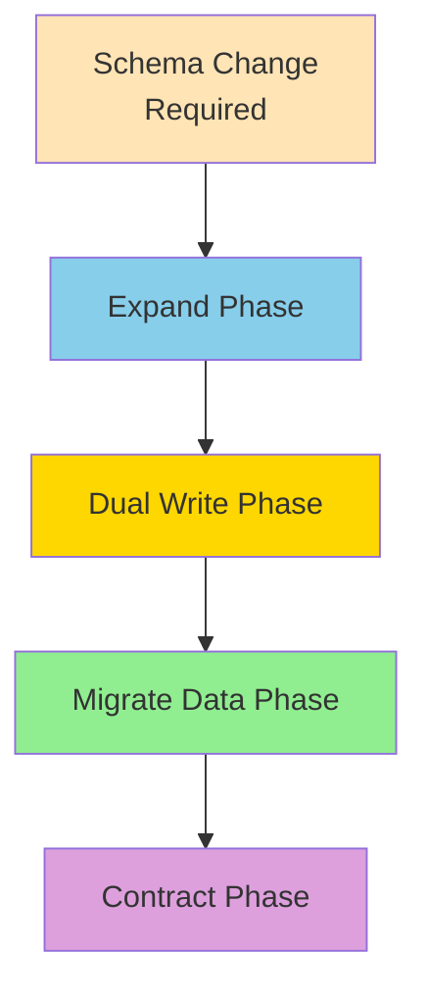
```mermaid
graph TB
    A[Schema Change<br/>Required] --> B[Expand Phase]
    B --> C[Dual Write Phase]
    C --> D[Migrate Data Phase]
    D --> E[Contract Phase]
    
    style A fill:#FFE4B5
    style B fill:#87CEEB
    style C fill:#FFD700
    style D fill:#90EE90
    style E fill:#DDA0DD
```

**Expand-Contract Pattern**:

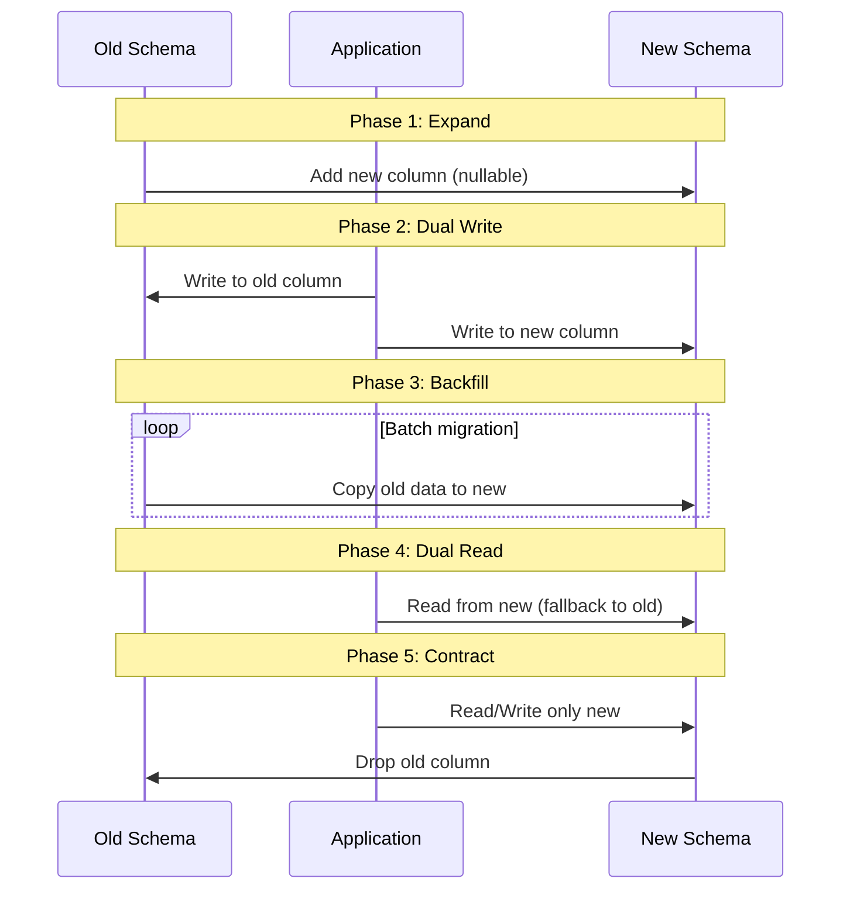
```mermaid
sequenceDiagram
    participant Old as Old Schema
    participant App as Application
    participant New as New Schema
    
    Note over Old,New: Phase 1: Expand
    Old->>New: Add new column (nullable)
    
    Note over Old,New: Phase 2: Dual Write
    App->>Old: Write to old column
    App->>New: Write to new column
    
    Note over Old,New: Phase 3: Backfill
    loop Batch migration
        Old->>New: Copy old data to new
    end
    
    Note over Old,New: Phase 4: Dual Read
    App->>New: Read from new (fallback to old)
    
    Note over Old,New: Phase 5: Contract
    App->>New: Read/Write only new
    New->>Old: Drop old column
```

**Online Schema Change Tools**:

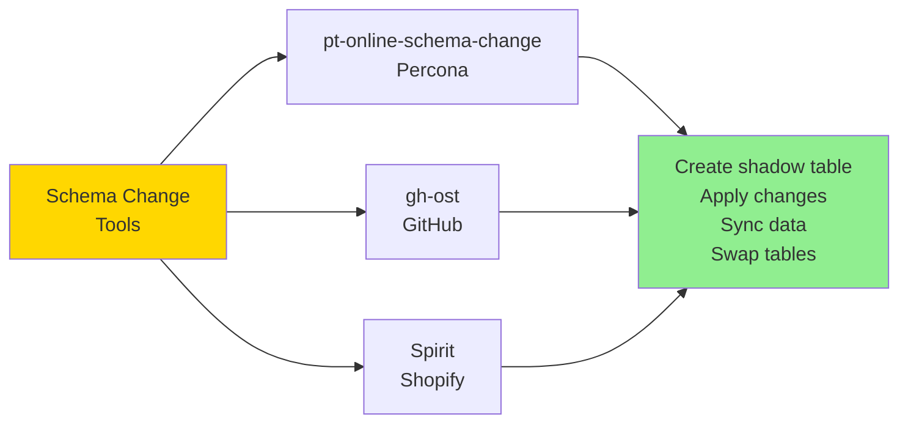
```mermaid
graph LR
    A[Schema Change<br/>Tools] --> B1[pt-online-schema-change<br/>Percona]
    A --> B2[gh-ost<br/>GitHub]
    A --> B3[Spirit<br/>Shopify]
    
    B1 --> C[Create shadow table<br/>Apply changes<br/>Sync data<br/>Swap tables]
    B2 --> C
    B3 --> C
    
    style A fill:#FFD700
    style C fill:#90EE90
```

---

## Q7: Design a system to deduplicate 1PB of data.

**Answer**:

```mermaid
graph TB
    A[1PB Data] --> B[Content-Addressable<br/>Storage]
    
    B --> C[Hash Function<br/>SHA-256]
    
    C --> D[Bloom Filter<br/>Quick existence check]
    
    D --> E{Probably<br/>Exists?}
    
    E -->|No| F[Store New Block]
    E -->|Yes| G[Check Hash Table]
    
    G --> H{Exact<br/>Match?}
    
    H -->|Yes| I[Reference<br/>Existing Block]
    H -->|No| F
    
    style C fill:#FFD700
    style D fill:#87CEEB
    style I fill:#90EE90
```

**Chunking Strategy**:

```mermaid
graph LR
    A[File: 100MB] --> B[Fixed-Size<br/>Chunking<br/>4MB blocks]
    A --> C[Variable-Size<br/>Chunking<br/>Rabin fingerprint]
    
    B --> D[25 chunks<br/>Simple, less dedup]
    C --> E[~25 chunks<br/>Better dedup]
    
    style C fill:#90EE90
```

**Distributed Deduplication**:

```mermaid
graph TB
    A[Incoming Data] --> B[Hash Calculation]
    
    B --> C[Consistent Hashing]
    
    C --> D1[Dedup Node 1<br/>Hashes: A-F]
    C --> D2[Dedup Node 2<br/>Hashes: G-M]
    C --> D3[Dedup Node 3<br/>Hashes: N-Z]
    
    D1 --> E[(Storage<br/>Cluster 1)]
    D2 --> F[(Storage<br/>Cluster 2)]
    D3 --> G[(Storage<br/>Cluster 3)]
    
    style C fill:#FFD700
```

**Bloom Filter for Scale**:

```mermaid
graph TB
    A[10B Blocks] --> B[Bloom Filter<br/>10GB memory<br/>0.1% false positive]
    
    B --> C{Bloom says<br/>exists?}
    
    C -->|No| D[Definitely new<br/>Store immediately]
    C -->|Yes| E[Check hash table<br/>Confirm existence]
    
    E --> F{Really<br/>exists?}
    F -->|Yes| G[Reference]
    F -->|No| H[Store<br/>False positive]
    
    style B fill:#87CEEB
    style D fill:#90EE90
```

---

## Q8: Implement distributed tracing for microservices.

**Answer**:

```mermaid
graph LR
    A[User Request] --> B[API Gateway<br/>Trace ID: abc123]
    
    B --> C[Auth Service<br/>Span ID: 1]
    B --> D[User Service<br/>Span ID: 2]
    
    D --> E[DB Query<br/>Span ID: 2.1]
    D --> F[Cache Query<br/>Span ID: 2.2]
    
    B --> G[Order Service<br/>Span ID: 3]
    
    G --> H[Payment Service<br/>Span ID: 3.1]
    G --> I[Inventory Service<br/>Span ID: 3.2]
    
    style B fill:#FFD700
```

**Trace Context Propagation**:

```mermaid
sequenceDiagram
    participant Client as Client
    participant Gateway as API Gateway
    participant Auth as Auth Service
    participant User as User Service
    participant DB as Database
    
    Client->>Gateway: Request
    Gateway->>Gateway: Generate Trace ID: abc123<br/>Span ID: 1
    
    Gateway->>Auth: Headers:<br/>X-Trace-ID: abc123<br/>X-Parent-Span: 1
    Auth->>Auth: Create Span ID: 1.1
    Auth->>Gateway: Response
    
    Gateway->>User: Headers:<br/>X-Trace-ID: abc123<br/>X-Parent-Span: 1
    User->>User: Create Span ID: 1.2
    
    User->>DB: Headers:<br/>X-Trace-ID: abc123<br/>X-Parent-Span: 1.2
    User->>User: Create Span ID: 1.2.1
    DB->>User: Response
    
    User->>Gateway: Response
    Gateway->>Client: Response
    
    Note over Client,DB: All spans linked by Trace ID
```

**Trace Visualization**:

```mermaid
graph TB
    A[Trace: abc123<br/>Total: 250ms] --> B[Gateway<br/>Span 1: 250ms]
    
    B --> C[Auth<br/>Span 1.1: 20ms]
    B --> D[User Service<br/>Span 1.2: 150ms]
    B --> E[Order Service<br/>Span 1.3: 80ms]
    
    D --> F[DB Query<br/>Span 1.2.1: 100ms]
    D --> G[Cache<br/>Span 1.2.2: 10ms]
    
    E --> H[Payment<br/>Span 1.3.1: 50ms]
    E --> I[Inventory<br/>Span 1.3.2: 30ms]
    
    style F fill:#FF6B6B
    style A fill:#FFD700
```

---

## Q9: Design a system for real-time analytics on streaming data.

**Answer**:

```mermaid
graph TB
    A[Data Sources] --> B[Kafka<br/>Event Stream]
    
    B --> C[Stream Processing<br/>Flink/Spark]
    
    C --> D1[Windowing<br/>Tumbling/Sliding]
    C --> D2[Aggregation<br/>Count/Sum/Avg]
    C --> D3[Filtering<br/>Complex Events]
    
    D1 --> E[Time-Series DB<br/>InfluxDB/TimescaleDB]
    D2 --> E
    D3 --> E
    
    E --> F[Real-Time<br/>Dashboard]
    
    C --> G[OLAP DB<br/>ClickHouse/Druid]
    
    G --> H[Analytics<br/>Queries]
    
    style B fill:#FFD700
    style C fill:#87CEEB
    style E fill:#90EE90
```

**Lambda Architecture**:

```mermaid
graph TB
    A[Data Stream] --> B[Speed Layer<br/>Real-time processing]
    A --> C[Batch Layer<br/>Batch processing]
    
    B --> D[Real-Time Views<br/>Approximate]
    C --> E[Batch Views<br/>Accurate]
    
    D --> F[Serving Layer<br/>Merge views]
    E --> F
    
    F --> G[Query Interface]
    
    style B fill:#FFD700
    style C fill:#87CEEB
    style F fill:#90EE90
```

**Windowing Strategies**:

```mermaid
graph TB
    A[Event Stream] --> B[Tumbling Window<br/>Non-overlapping<br/>0-5s, 5-10s, 10-15s]
    A --> C[Sliding Window<br/>Overlapping<br/>0-5s, 1-6s, 2-7s]
    A --> D[Session Window<br/>Gap-based<br/>Activity bursts]
    
    style A fill:#FFE4B5
    style B fill:#87CEEB
    style C fill:#90EE90
    style D fill:#DDA0DD
```

---

## Q10: How do you handle cascading failures in microservices?

**Answer**:

```mermaid
graph TB
    A[Service A<br/>Healthy] --> B[Service B<br/>Slow]
    
    B --> C[Service C<br/>Failing]
    
    A --> D[Threads Blocked<br/>Waiting for B]
    D --> E[Service A<br/>Degraded]
    E --> F[Service A<br/>Failing]
    
    F --> G[Cascade<br/>Complete]
    
    style A fill:#90EE90
    style B fill:#FFD700
    style C fill:#FF6B6B
    style F fill:#FF6B6B
```

**Prevention Strategies**:

```mermaid
graph TB
    A[Cascading Failure<br/>Prevention] --> B1[Circuit Breaker<br/>Stop calling failed service]
    A --> B2[Bulkhead Pattern<br/>Isolate resources]
    A --> B3[Timeout<br/>Fail fast]
    A --> B4[Rate Limiting<br/>Limit load]
    A --> B5[Backpressure<br/>Push back on clients]
    
    style A fill:#FFD700
```

**Bulkhead Pattern**:

```mermaid
graph TB
    A[Service A] --> B[Thread Pool 1<br/>Service B calls<br/>20 threads]
    A --> C[Thread Pool 2<br/>Service C calls<br/>20 threads]
    A --> D[Thread Pool 3<br/>Service D calls<br/>20 threads]
    
    B --> E[Service B<br/>Fails]
    
    Note[Pool 1 exhausted<br/>but Pools 2 & 3<br/>still functional]
    
    style B fill:#FF6B6B
    style C fill:#90EE90
    style D fill:#90EE90
```

---

## Summary

Hard scalability topics:
- **Global Consistency**: Spanner, 2PC, consensus
- **Million Connections**: WebSocket scaling, event-driven I/O
- **Billion Users**: Regional architecture, sharding
- **Distributed Rate Limiting**: Quota allocation, gossip
- **Auto-Scaling**: Predictive, multi-tier
- **Zero-Downtime Migrations**: Expand-contract pattern
- **Deduplication at Scale**: Content-addressable storage, Bloom filters
- **Distributed Tracing**: Span propagation, visualization
- **Real-Time Analytics**: Stream processing, windowing
- **Cascading Failures**: Circuit breakers, bulkheads

These techniques enable building systems at extreme scale with high reliability.

