Medium-level scalability interview questions covering advanced scaling techniques and optimization.

## Q1: Explain database partitioning strategies.

**Answer**:

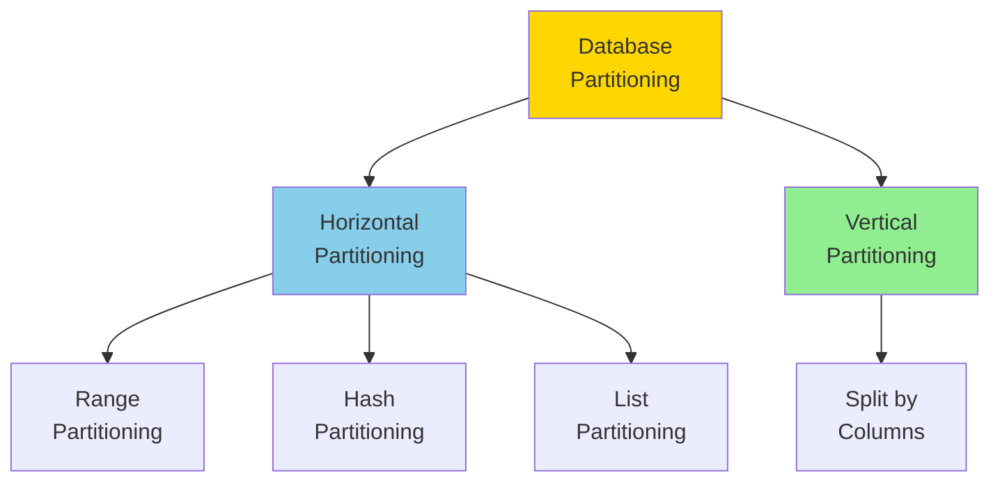
```mermaid
graph TB
    A[Database<br/>Partitioning] --> B[Horizontal<br/>Partitioning]
    A --> C[Vertical<br/>Partitioning]
    
    B --> D1[Range<br/>Partitioning]
    B --> D2[Hash<br/>Partitioning]
    B --> D3[List<br/>Partitioning]
    
    C --> E[Split by<br/>Columns]
    
    style A fill:#FFD700
    style B fill:#87CEEB
    style C fill:#90EE90
```

### Horizontal Partitioning (Sharding)

**Range Partitioning**:
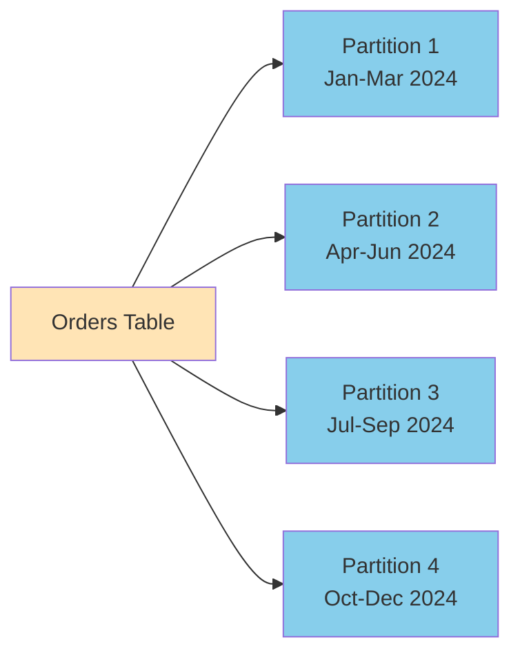
```mermaid
graph LR
    A[Orders Table] --> B[Partition 1<br/>Jan-Mar 2024]
    A --> C[Partition 2<br/>Apr-Jun 2024]
    A --> D[Partition 3<br/>Jul-Sep 2024]
    A --> E[Partition 4<br/>Oct-Dec 2024]
    
    style A fill:#FFE4B5
    style B fill:#87CEEB
    style C fill:#87CEEB
    style D fill:#87CEEB
    style E fill:#87CEEB
```

**Hash Partitioning**:
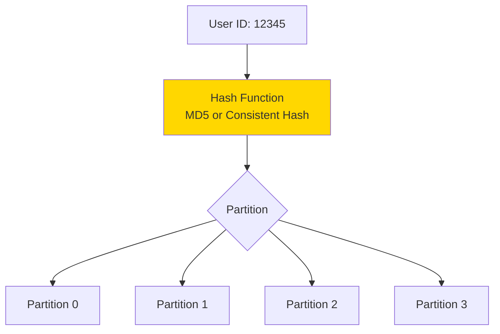
```mermaid
graph TB
    A[User ID: 12345] --> B[Hash Function<br/>MD5 or Consistent Hash]
    B --> C{Partition}
    C --> D1[Partition 0]
    C --> D2[Partition 1]
    C --> D3[Partition 2]
    C --> D4[Partition 3]
    
    style B fill:#FFD700
```

### Vertical Partitioning

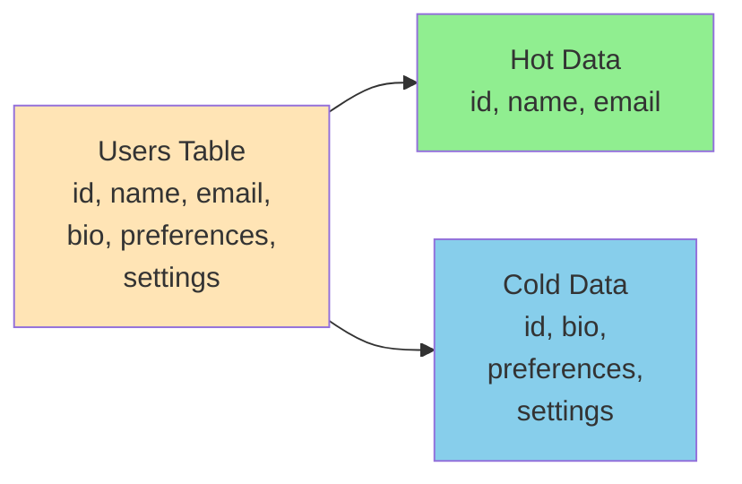
```mermaid
graph LR
    A[Users Table<br/>id, name, email,<br/>bio, preferences,<br/>settings] --> B[Hot Data<br/>id, name, email]
    A --> C[Cold Data<br/>id, bio,<br/>preferences,<br/>settings]
    
    style A fill:#FFE4B5
    style B fill:#90EE90
    style C fill:#87CEEB
```

---

## Q2: How do you handle database hotspots?

**Answer**:

**Problem**: Uneven data distribution causing some shards to be overloaded.

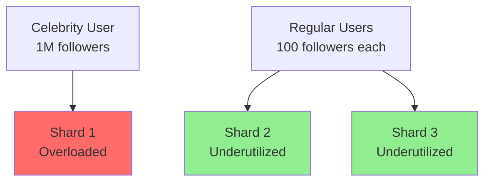
```mermaid
graph TB
    A[Celebrity User<br/>1M followers] --> B[Shard 1<br/>Overloaded]
    C[Regular Users<br/>100 followers each] --> D[Shard 2<br/>Underutilized]
    C --> E[Shard 3<br/>Underutilized]
    
    style B fill:#FF6B6B
    style D fill:#90EE90
    style E fill:#90EE90
```

**Solutions**:

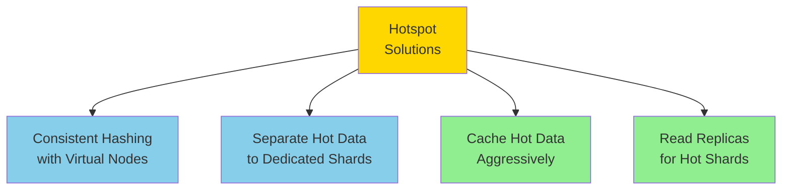
```mermaid
graph TB
    A[Hotspot<br/>Solutions] --> B1[Consistent Hashing<br/>with Virtual Nodes]
    A --> B2[Separate Hot Data<br/>to Dedicated Shards]
    A --> B3[Cache Hot Data<br/>Aggressively]
    A --> B4[Read Replicas<br/>for Hot Shards]
    
    style A fill:#FFD700
    style B1 fill:#87CEEB
    style B2 fill:#87CEEB
    style B3 fill:#90EE90
    style B4 fill:#90EE90
```

**Consistent Hashing with Virtual Nodes**:
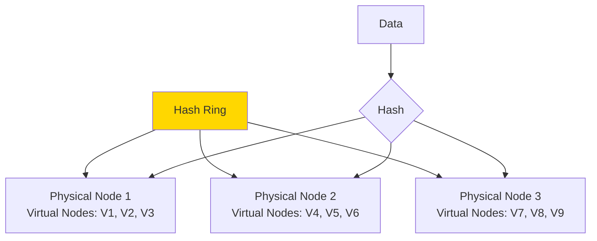
```mermaid
graph TB
    A[Hash Ring] --> B[Physical Node 1<br/>Virtual Nodes: V1, V2, V3]
    A --> C[Physical Node 2<br/>Virtual Nodes: V4, V5, V6]
    A --> D[Physical Node 3<br/>Virtual Nodes: V7, V8, V9]
    
    E[Data] --> F{Hash}
    F --> B
    F --> C
    F --> D
    
    style A fill:#FFD700
```

---

## Q3: Explain the Thundering Herd problem and solutions.

**Answer**:

**Problem**: Many requests hit backend simultaneously when cache expires.

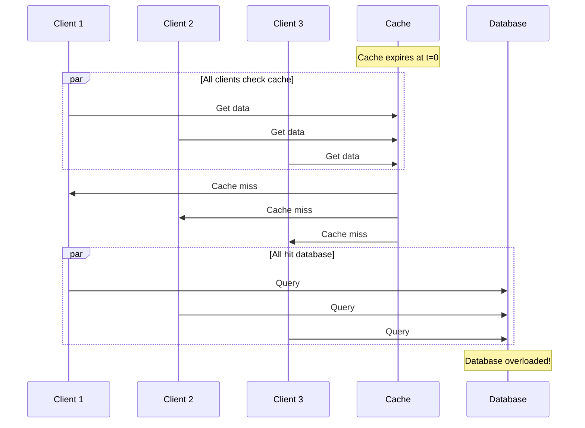
```mermaid
sequenceDiagram
    participant C1 as Client 1
    participant C2 as Client 2
    participant C3 as Client 3
    participant Cache as Cache
    participant DB as Database
    
    Note over Cache: Cache expires at t=0
    
    par All clients check cache
        C1->>Cache: Get data
        C2->>Cache: Get data
        C3->>Cache: Get data
    end
    
    Cache->>C1: Cache miss
    Cache->>C2: Cache miss
    Cache->>C3: Cache miss
    
    par All hit database
        C1->>DB: Query
        C2->>DB: Query
        C3->>DB: Query
    end
    
    Note over DB: Database overloaded!
```

**Solutions**:

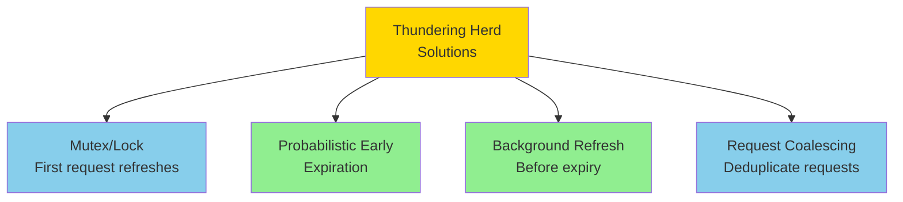
```mermaid
graph TB
    A[Thundering Herd<br/>Solutions] --> B1[Mutex/Lock<br/>First request refreshes]
    A --> B2[Probabilistic Early<br/>Expiration]
    A --> B3[Background Refresh<br/>Before expiry]
    A --> B4[Request Coalescing<br/>Deduplicate requests]
    
    style A fill:#FFD700
    style B1 fill:#87CEEB
    style B2 fill:#90EE90
    style B3 fill:#90EE90
    style B4 fill:#87CEEB
```

**Request Coalescing**:
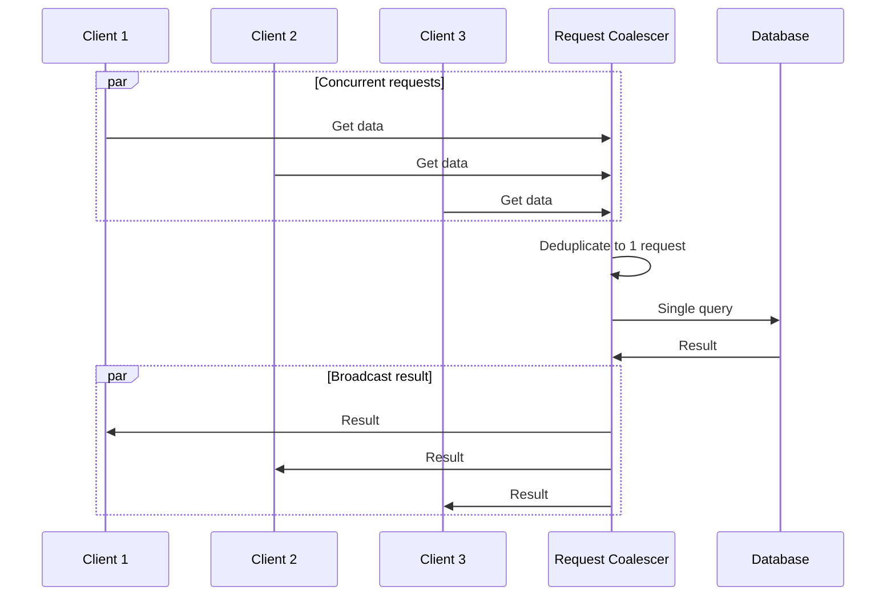
```mermaid
sequenceDiagram
    participant C1 as Client 1
    participant C2 as Client 2
    participant C3 as Client 3
    participant Coalesce as Request Coalescer
    participant DB as Database
    
    par Concurrent requests
        C1->>Coalesce: Get data
        C2->>Coalesce: Get data
        C3->>Coalesce: Get data
    end
    
    Coalesce->>Coalesce: Deduplicate to 1 request
    Coalesce->>DB: Single query
    DB->>Coalesce: Result
    
    par Broadcast result
        Coalesce->>C1: Result
        Coalesce->>C2: Result
        Coalesce->>C3: Result
    end
```

---

## Q4: How do you implement distributed caching?

**Answer**:

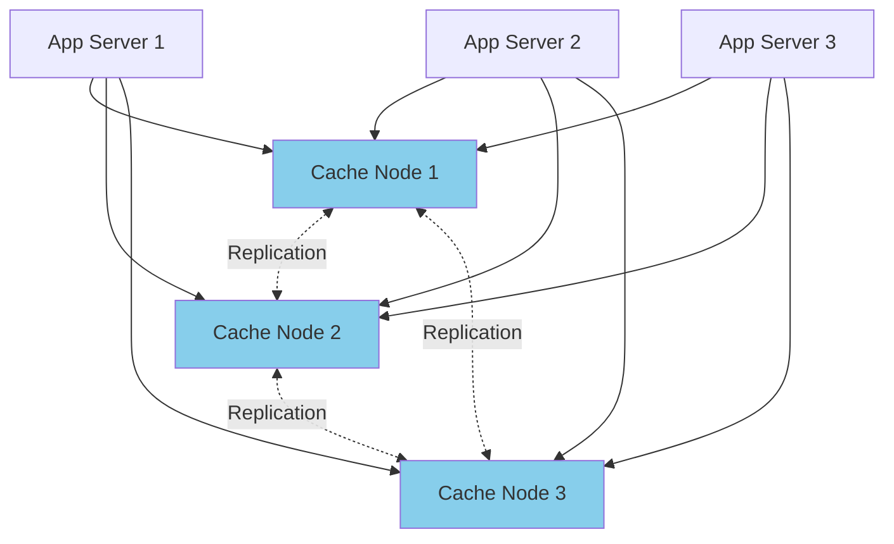
```mermaid
graph TB
    APP1[App Server 1] --> CACHE1[Cache Node 1]
    APP1 --> CACHE2[Cache Node 2]
    APP1 --> CACHE3[Cache Node 3]
    
    APP2[App Server 2] --> CACHE1
    APP2 --> CACHE2
    APP2 --> CACHE3
    
    APP3[App Server 3] --> CACHE1
    APP3 --> CACHE2
    APP3 --> CACHE3
    
    CACHE1 <-.->|Replication| CACHE2
    CACHE2 <-.->|Replication| CACHE3
    CACHE3 <-.->|Replication| CACHE1
    
    style CACHE1 fill:#87CEEB
    style CACHE2 fill:#87CEEB
    style CACHE3 fill:#87CEEB
```

**Cache Distribution Strategies**:

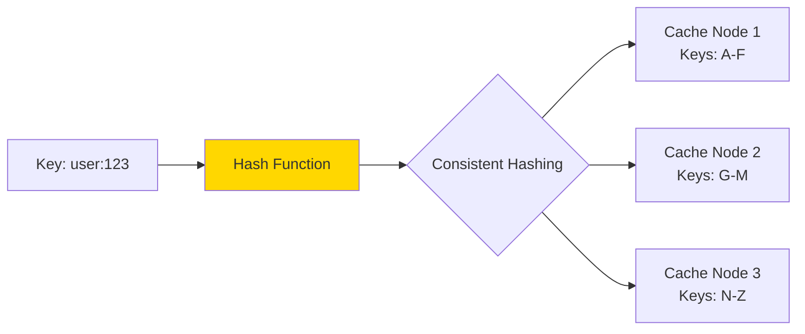
```mermaid
graph LR
    A[Key: user:123] --> B[Hash Function]
    B --> C{Consistent Hashing}
    C --> D1[Cache Node 1<br/>Keys: A-F]
    C --> D2[Cache Node 2<br/>Keys: G-M]
    C --> D3[Cache Node 3<br/>Keys: N-Z]
    
    style B fill:#FFD700
```

**Cache Invalidation**:

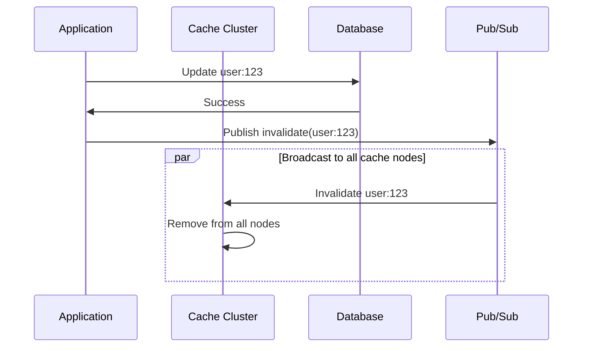
```mermaid
sequenceDiagram
    participant App as Application
    participant Cache as Cache Cluster
    participant DB as Database
    participant PubSub as Pub/Sub
    
    App->>DB: Update user:123
    DB->>App: Success
    
    App->>PubSub: Publish invalidate(user:123)
    
    par Broadcast to all cache nodes
        PubSub->>Cache: Invalidate user:123
        Cache->>Cache: Remove from all nodes
    end
```

---

## Q5: Explain async processing and message queues.

**Answer**:

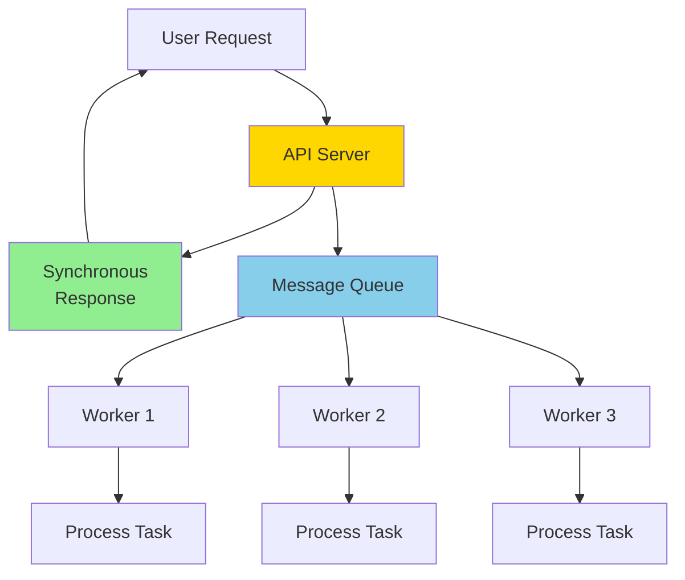
```mermaid
graph TB
    U[User Request] --> API[API Server]
    
    API --> SYNC[Synchronous<br/>Response]
    API --> QUEUE[Message Queue]
    
    SYNC --> U
    
    QUEUE --> W1[Worker 1]
    QUEUE --> W2[Worker 2]
    QUEUE --> W3[Worker 3]
    
    W1 --> TASK1[Process Task]
    W2 --> TASK2[Process Task]
    W3 --> TASK3[Process Task]
    
    style API fill:#FFD700
    style QUEUE fill:#87CEEB
    style SYNC fill:#90EE90
```

**Use Cases**:

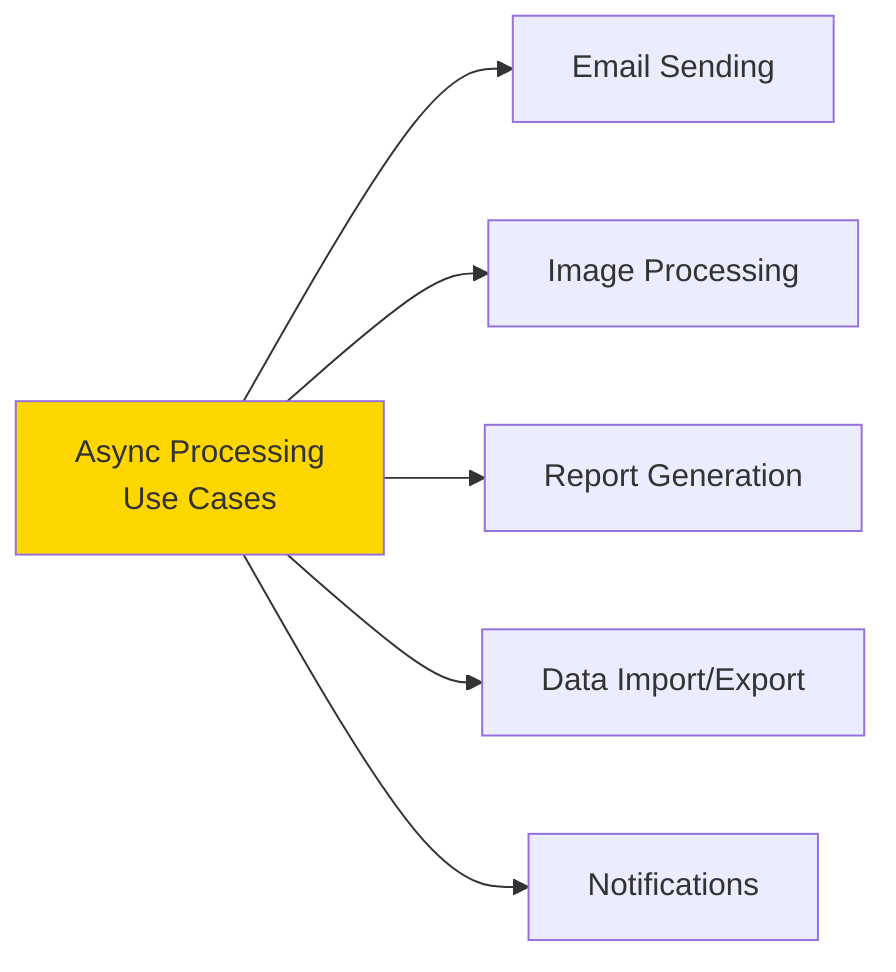
```mermaid
graph LR
    A[Async Processing<br/>Use Cases] --> B1[Email Sending]
    A --> B2[Image Processing]
    A --> B3[Report Generation]
    A --> B4[Data Import/Export]
    A --> B5[Notifications]
    
    style A fill:#FFD700
```

**Message Queue Patterns**:

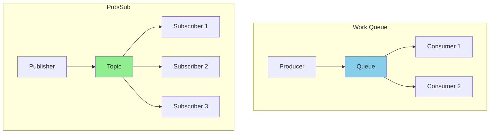
```mermaid
graph TB
    subgraph WorkQueue["Work Queue"]
        P1[Producer] --> Q1[Queue]
        Q1 --> C1[Consumer 1]
        Q1 --> C2[Consumer 2]
    end
    
    subgraph PubSub["Pub/Sub"]
        P2[Publisher] --> T[Topic]
        T --> S1[Subscriber 1]
        T --> S2[Subscriber 2]
        T --> S3[Subscriber 3]
    end
    
    style Q1 fill:#87CEEB
    style T fill:#90EE90
```

---

## Q6: How do you handle session management at scale?

**Answer**:

**Problem**: Sticky sessions don't scale well.

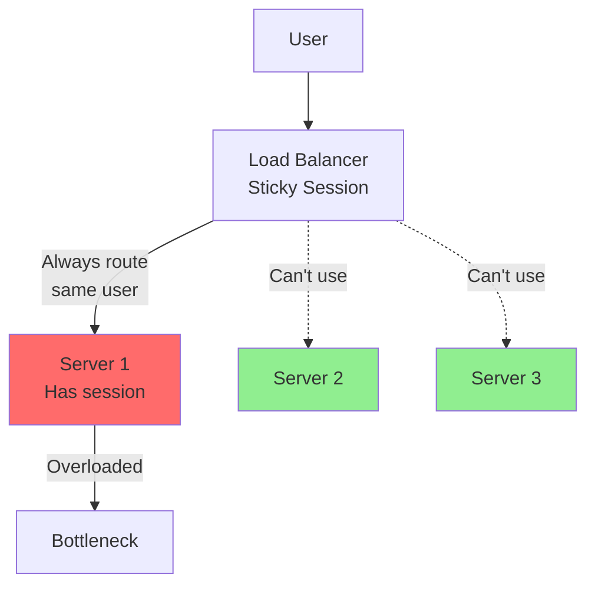
```mermaid
graph TB
    U[User] --> LB[Load Balancer<br/>Sticky Session]
    
    LB -->|Always route<br/>same user| S1[Server 1<br/>Has session]
    LB -.->|Can't use| S2[Server 2]
    LB -.->|Can't use| S3[Server 3]
    
    S1 -->|Overloaded| X[Bottleneck]
    
    style S1 fill:#FF6B6B
    style S2 fill:#90EE90
    style S3 fill:#90EE90
```

**Solution**: Centralized session storage.

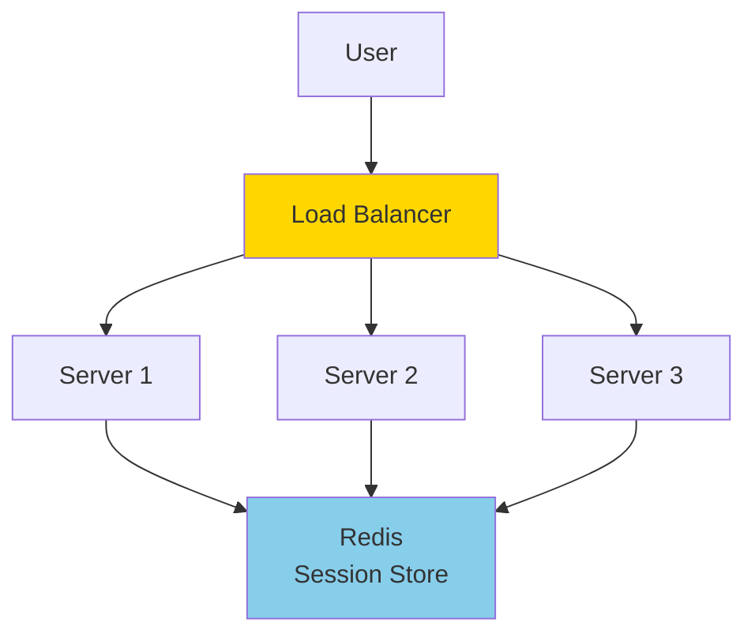
```mermaid
graph TB
    U[User] --> LB[Load Balancer]
    
    LB --> S1[Server 1]
    LB --> S2[Server 2]
    LB --> S3[Server 3]
    
    S1 --> REDIS[Redis<br/>Session Store]
    S2 --> REDIS
    S3 --> REDIS
    
    style LB fill:#FFD700
    style REDIS fill:#87CEEB
```

**Session Storage Options**:

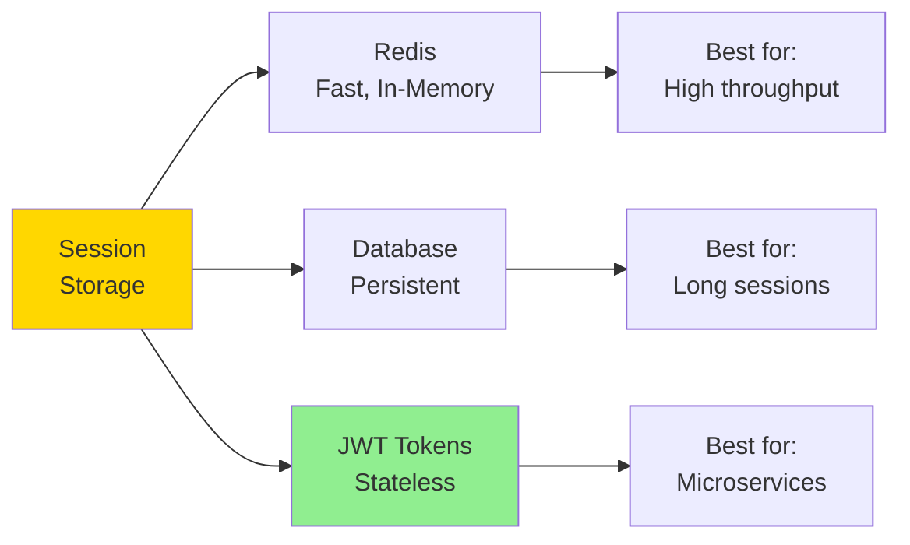
```mermaid
graph LR
    A[Session<br/>Storage] --> B1[Redis<br/>Fast, In-Memory]
    A --> B2[Database<br/>Persistent]
    A --> B3[JWT Tokens<br/>Stateless]
    
    B1 --> C1[Best for:<br/>High throughput]
    B2 --> C2[Best for:<br/>Long sessions]
    B3 --> C3[Best for:<br/>Microservices]
    
    style A fill:#FFD700
    style B3 fill:#90EE90
```

---

## Q7: Explain database connection pooling optimization.

**Answer**:

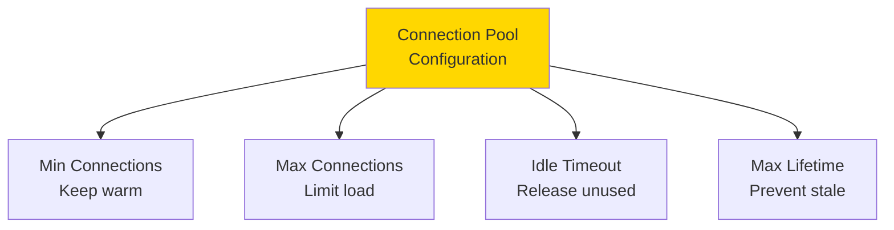
```mermaid
graph TB
    A[Connection Pool<br/>Configuration] --> B1[Min Connections<br/>Keep warm]
    A --> B2[Max Connections<br/>Limit load]
    A --> B3[Idle Timeout<br/>Release unused]
    A --> B4[Max Lifetime<br/>Prevent stale]
    
    style A fill:#FFD700
```

**Pool Sizing Formula**:

```mermaid
graph LR
    A[Optimal Pool Size] --> B[connections = <br/>threads × 2 + 1]
    
    B --> C[Example:<br/>100 threads<br/>= 201 connections]
    
    style A fill:#FFD700
    style C fill:#90EE90
```

**Connection Lifecycle**:

```mermaid
sequenceDiagram
    participant App as Application
    participant Pool as Connection Pool
    participant DB as Database
    
    Note over Pool: Initialize pool<br/>Create min connections
    
    App->>Pool: Request connection
    
    alt Pool has idle connection
        Pool->>App: Return connection
    else Pool at max, has idle
        Pool->>App: Return connection
    else Pool at max, none idle
        Pool->>App: Wait or timeout
    end
    
    App->>DB: Execute query
    DB->>App: Results
    App->>Pool: Return connection
    
    Pool->>Pool: Mark as idle
    
    Note over Pool: After idle timeout<br/>Close excess connections
```

---

## Q8: How do you implement rate limiting at scale?

**Answer**:

**Distributed Rate Limiting**:

```mermaid
graph TB
    U1[User Request] --> LB[Load Balancer]
    U2[User Request] --> LB
    
    LB --> S1[Server 1]
    LB --> S2[Server 2]
    LB --> S3[Server 3]
    
    S1 --> REDIS[Redis<br/>Shared Counter]
    S2 --> REDIS
    S3 --> REDIS
    
    REDIS --> CHECK{Rate Limit<br/>Exceeded?}
    CHECK -->|No| ALLOW[Allow Request]
    CHECK -->|Yes| DENY[Deny Request<br/>429]
    
    style REDIS fill:#87CEEB
    style ALLOW fill:#90EE90
    style DENY fill:#FF6B6B
```

**Sliding Window Algorithm**:

```mermaid
sequenceDiagram
    participant U as User
    participant RL as Rate Limiter
    participant Redis as Redis
    
    Note over Redis: Limit: 10 req/min
    
    U->>RL: Request at t=0
    RL->>Redis: ZADD user:123 0 req1
    RL->>Redis: ZCOUNT user:123 -60 0
    Redis->>RL: Count: 1
    RL->>U: Allow (1/10)
    
    U->>RL: Request at t=30
    RL->>Redis: ZADD user:123 30 req2
    RL->>Redis: ZCOUNT user:123 -30 30
    Redis->>RL: Count: 2
    RL->>U: Allow (2/10)
    
    Note over U: ... 8 more requests ...
    
    U->>RL: Request at t=45
    RL->>Redis: ZCOUNT user:123 -15 45
    Redis->>RL: Count: 10
    RL->>U: Deny 429
```

**Multi-Tier Rate Limiting**:

```mermaid
graph TB
    A[Request] --> B[IP Rate Limit<br/>1000/hour]
    B --> C{Pass?}
    C -->|Yes| D[User Rate Limit<br/>100/hour]
    C -->|No| E[Block]
    D --> F{Pass?}
    F -->|Yes| G[API Key Limit<br/>10/min]
    F -->|No| E
    G --> H{Pass?}
    H -->|Yes| I[Allow]
    H -->|No| E
    
    style I fill:#90EE90
    style E fill:#FF6B6B
```

---

## Q9: Explain database query optimization techniques.

**Answer**:

```mermaid
graph TB
    A[Query<br/>Optimization] --> B1[Indexing]
    A --> B2[Query Rewriting]
    A --> B3[Denormalization]
    A --> B4[Caching]
    A --> B5[Partitioning]
    
    style A fill:#FFD700
```

**Query Execution Plan**:

```mermaid
graph TB
    A[SELECT * FROM users<br/>WHERE email = 'alice@...'] --> B{Has Index<br/>on email?}
    
    B -->|No| C[Sequential Scan<br/>Cost: 1000]
    B -->|Yes| D[Index Scan<br/>Cost: 10]
    
    C --> E[Slow Query<br/>1000ms]
    D --> F[Fast Query<br/>10ms]
    
    style C fill:#FF6B6B
    style D fill:#90EE90
```

**N+1 Query Problem**:

```mermaid
sequenceDiagram
    participant App as Application
    participant DB as Database
    
    Note over App,DB: Bad: N+1 Queries
    
    App->>DB: SELECT * FROM posts
    DB->>App: 100 posts
    
    loop For each post
        App->>DB: SELECT * FROM users WHERE id=?
    end
    
    Note over App,DB: 101 queries total!
    
    Note over App,DB: Good: JOIN
    
    App->>DB: SELECT posts.*, users.*<br/>FROM posts JOIN users
    DB->>App: All data
    
    Note over App,DB: 1 query total!
```

**Denormalization for Read Performance**:

```mermaid
graph LR
    A[Normalized<br/>3 tables<br/>3 JOINs] --> B[Denormalized<br/>1 table<br/>No JOINs]
    
    A --> C[Slower reads<br/>Faster writes]
    B --> D[Faster reads<br/>Slower writes]
    
    style A fill:#FFB6C1
    style B fill:#90EE90
```

---

## Q10: How do you handle file uploads at scale?

**Answer**:

```mermaid
graph TB
    U[User] --> LB[Load Balancer]
    
    LB --> API[API Server]
    
    API --> S3[Object Storage<br/>S3/Blob]
    
    API --> QUEUE[Processing Queue]
    
    QUEUE --> W1[Worker 1<br/>Resize]
    QUEUE --> W2[Worker 2<br/>Compress]
    QUEUE --> W3[Worker 3<br/>Scan Virus]
    
    W1 --> S3
    W2 --> S3
    W3 --> S3
    
    API --> META_DB[(Metadata DB)]
    
    style S3 fill:#87CEEB
    style QUEUE fill:#DDA0DD
```

**Chunked Upload**:

```mermaid
sequenceDiagram
    participant U as User
    participant API as API Server
    participant S3 as Object Storage
    
    U->>API: Initiate upload (100MB file)
    API->>S3: Create multipart upload
    S3->>API: Upload ID
    API->>U: Upload ID
    
    par Upload chunks in parallel
        U->>S3: Upload chunk 1 (10MB)
        U->>S3: Upload chunk 2 (10MB)
        U->>S3: Upload chunk 3 (10MB)
    end
    
    Note over U: ... chunks 4-10 ...
    
    U->>API: Complete upload
    API->>S3: Complete multipart
    S3->>API: Success
    API->>U: Upload complete
```

**Direct Upload (Presigned URL)**:

```mermaid
sequenceDiagram
    participant U as User
    participant API as API Server
    participant S3 as S3
    
    U->>API: Request upload URL
    API->>S3: Generate presigned URL
    S3->>API: Presigned URL (valid 15min)
    API->>U: Upload URL
    
    U->>S3: Upload directly to S3
    S3->>U: Upload complete
    
    U->>API: Confirm upload
    API->>DB: Save metadata
```

---

## Summary

Medium scalability topics:
- **Partitioning**: Range, hash, vertical strategies
- **Hotspots**: Consistent hashing, caching solutions
- **Thundering Herd**: Request coalescing, mutex locks
- **Distributed Caching**: Consistent hashing, invalidation
- **Async Processing**: Message queues, workers
- **Session Management**: Centralized storage, JWT
- **Connection Pooling**: Optimal sizing, lifecycle
- **Rate Limiting**: Distributed, sliding window
- **Query Optimization**: Indexing, denormalization
- **File Uploads**: Chunking, direct upload, async processing

These techniques enable handling millions of users efficiently.

