Easy-level system design interview questions covering fundamental system design concepts and simple applications.

## Q1: Design a URL shortener (like bit.ly).

**Answer**:

### Requirements
- Shorten long URLs to short codes
- Redirect short URLs to original
- Track click statistics
- High availability

### High-Level Design

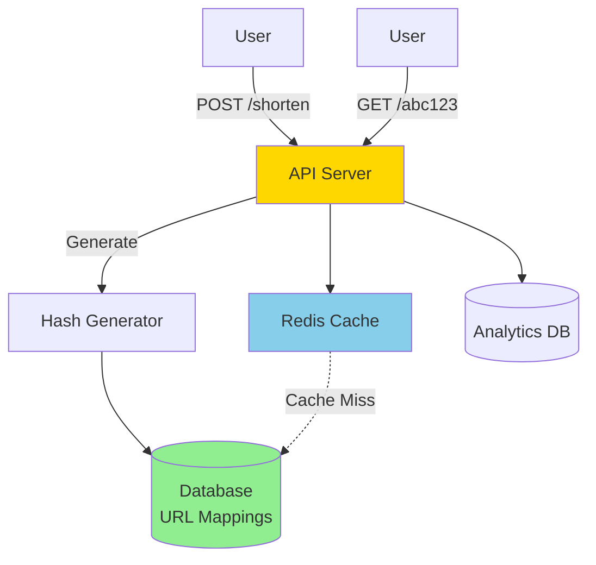
```mermaid
graph TB
    U[User] -->|POST /shorten| API[API Server]
    U2[User] -->|GET /abc123| API
    
    API -->|Generate| HASH[Hash Generator]
    HASH --> DB[(Database<br/>URL Mappings)]
    
    API --> CACHE[Redis Cache]
    CACHE -.->|Cache Miss| DB
    
    API --> STATS[(Analytics DB)]
    
    style API fill:#FFD700
    style CACHE fill:#87CEEB
    style DB fill:#90EE90
```

### Database Schema

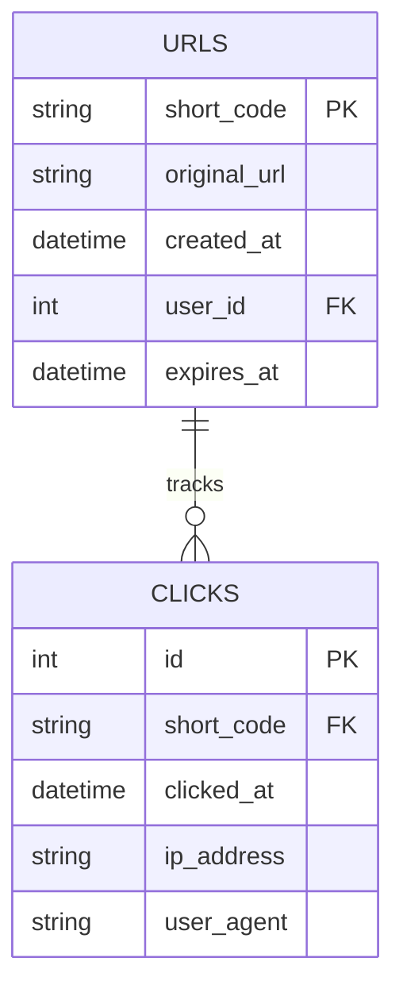
```mermaid
erDiagram
    URLS {
        string short_code PK
        string original_url
        datetime created_at
        int user_id FK
        datetime expires_at
    }
    
    CLICKS {
        int id PK
        string short_code FK
        datetime clicked_at
        string ip_address
        string user_agent
    }
    
    URLS ||--o{ CLICKS : tracks
```

### URL Shortening Algorithm

**Options**:
1. **Hash-based**: MD5/SHA → Take first 7 chars
2. **Counter-based**: Auto-increment ID → Base62 encode
3. **Random**: Generate random string, check collision

**Base62 Encoding**:
```
Characters: [a-z, A-Z, 0-9] = 62 chars
7 characters = 62^7 = 3.5 trillion URLs
```

### Flow Diagrams

**Shorten URL**:
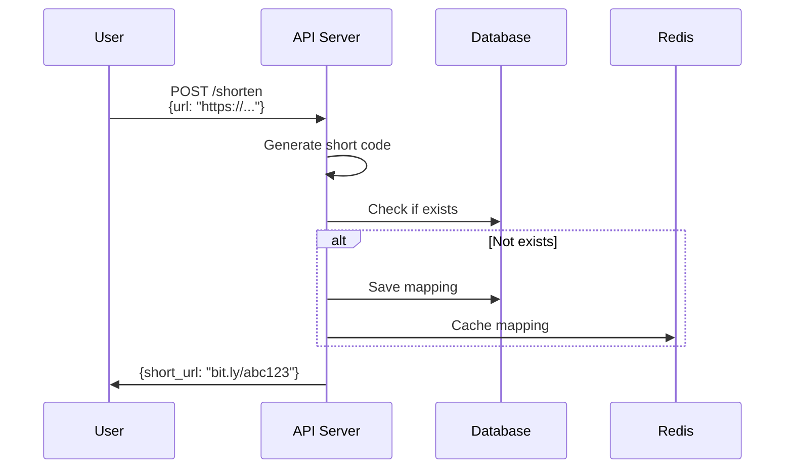
```mermaid
sequenceDiagram
    participant U as User
    participant API as API Server
    participant DB as Database
    participant Cache as Redis
    
    U->>API: POST /shorten<br/>{url: "https://..."}
    API->>API: Generate short code
    API->>DB: Check if exists
    alt Not exists
        API->>DB: Save mapping
        API->>Cache: Cache mapping
    end
    API->>U: {short_url: "bit.ly/abc123"}
```

**Redirect**:
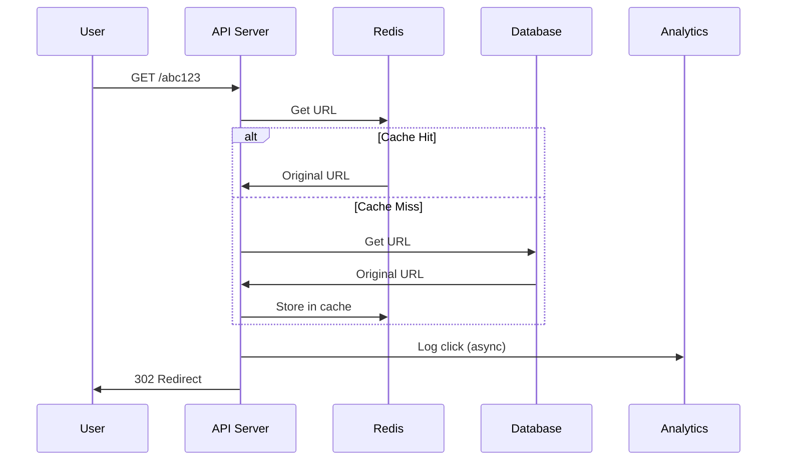
```mermaid
sequenceDiagram
    participant U as User
    participant API as API Server
    participant Cache as Redis
    participant DB as Database
    participant Stats as Analytics
    
    U->>API: GET /abc123
    API->>Cache: Get URL
    alt Cache Hit
        Cache->>API: Original URL
    else Cache Miss
        API->>DB: Get URL
        DB->>API: Original URL
        API->>Cache: Store in cache
    end
    API->>Stats: Log click (async)
    API->>U: 302 Redirect
```

### Scalability Considerations

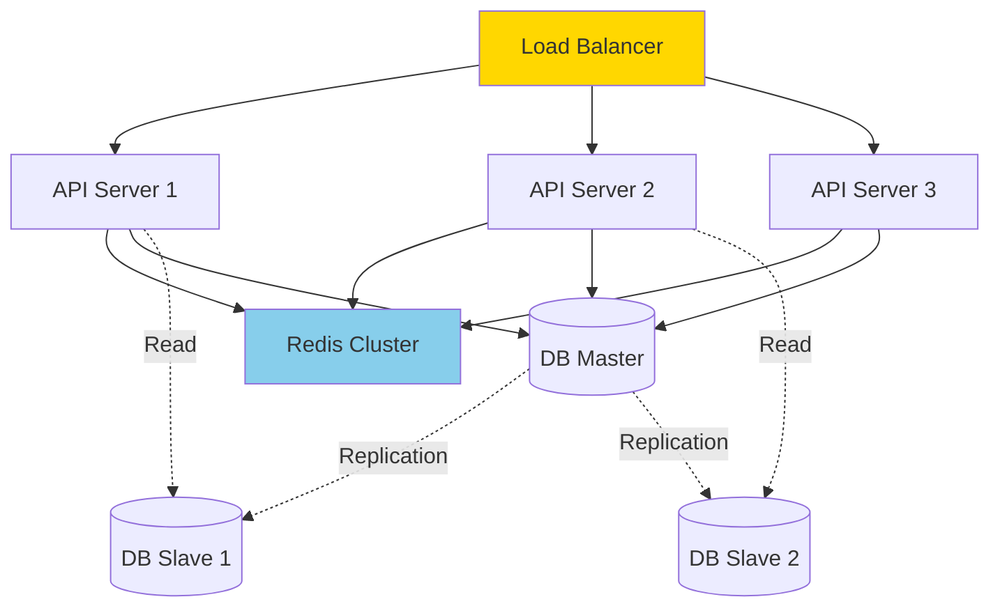
```mermaid
graph TB
    LB[Load Balancer] --> API1[API Server 1]
    LB --> API2[API Server 2]
    LB --> API3[API Server 3]
    
    API1 --> CACHE[Redis Cluster]
    API2 --> CACHE
    API3 --> CACHE
    
    API1 --> DB_MASTER[(DB Master)]
    API2 --> DB_MASTER
    API3 --> DB_MASTER
    
    DB_MASTER -.->|Replication| DB_SLAVE1[(DB Slave 1)]
    DB_MASTER -.->|Replication| DB_SLAVE2[(DB Slave 2)]
    
    API1 -.->|Read| DB_SLAVE1
    API2 -.->|Read| DB_SLAVE2
    
    style LB fill:#FFD700
    style CACHE fill:#87CEEB
```

---

## Q2: Design a basic chat application.

**Answer**:

### Requirements
- One-on-one messaging
- Real-time delivery
- Message history
- Online/offline status

### Architecture

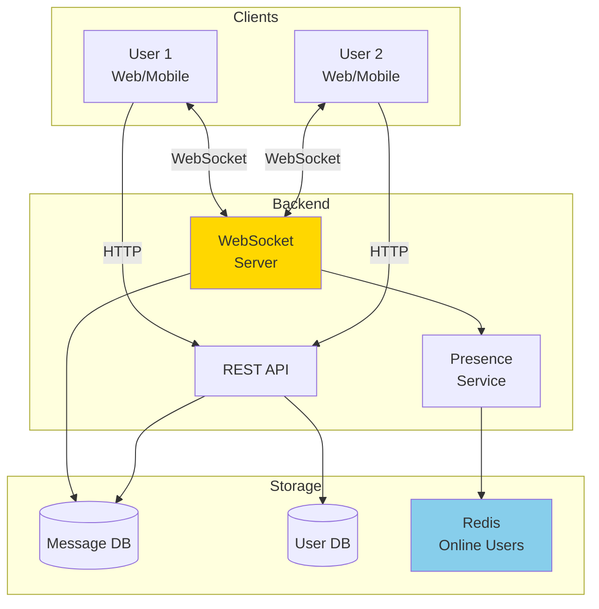
```mermaid
graph TB
    subgraph Clients
        C1[User 1<br/>Web/Mobile]
        C2[User 2<br/>Web/Mobile]
    end
    
    subgraph Backend
        WS[WebSocket<br/>Server]
        API[REST API]
        PRESENCE[Presence<br/>Service]
    end
    
    subgraph Storage
        MSG_DB[(Message DB)]
        USER_DB[(User DB)]
        CACHE[Redis<br/>Online Users]
    end
    
    C1 <-->|WebSocket| WS
    C2 <-->|WebSocket| WS
    
    C1 -->|HTTP| API
    C2 -->|HTTP| API
    
    WS --> MSG_DB
    API --> MSG_DB
    API --> USER_DB
    
    WS --> PRESENCE
    PRESENCE --> CACHE
    
    style WS fill:#FFD700
    style CACHE fill:#87CEEB
```

### Database Schema

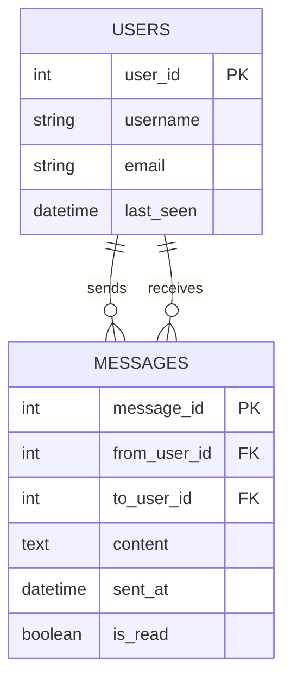
```mermaid
erDiagram
    USERS {
        int user_id PK
        string username
        string email
        datetime last_seen
    }
    
    MESSAGES {
        int message_id PK
        int from_user_id FK
        int to_user_id FK
        text content
        datetime sent_at
        boolean is_read
    }
    
    USERS ||--o{ MESSAGES : sends
    USERS ||--o{ MESSAGES : receives
```

### Message Flow

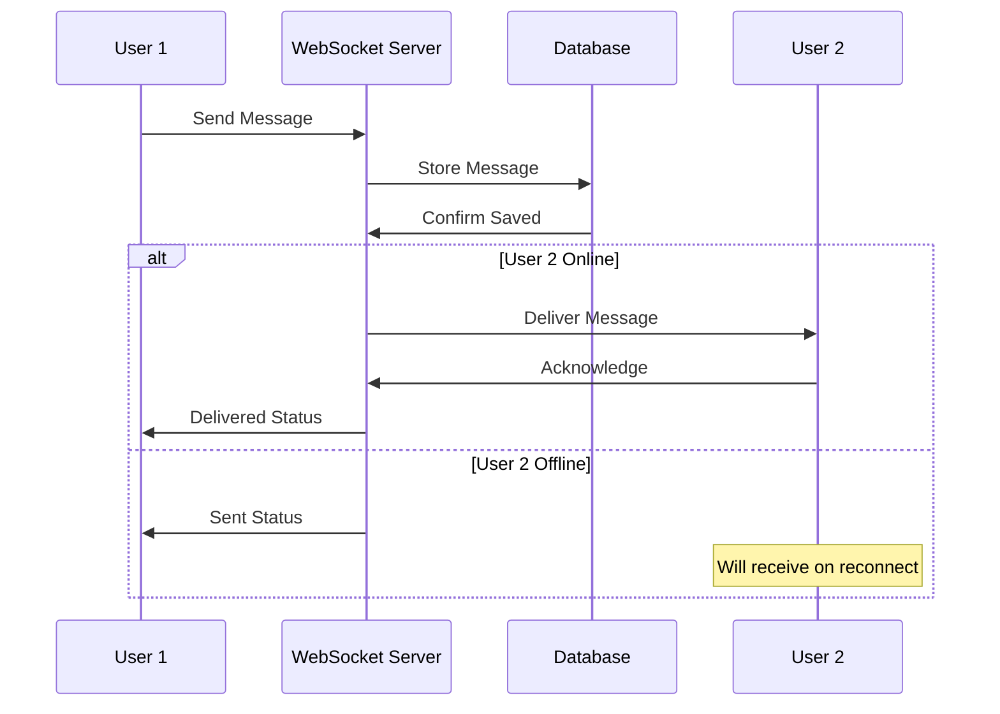
```mermaid
sequenceDiagram
    participant U1 as User 1
    participant WS as WebSocket Server
    participant DB as Database
    participant U2 as User 2
    
    U1->>WS: Send Message
    WS->>DB: Store Message
    DB->>WS: Confirm Saved
    
    alt User 2 Online
        WS->>U2: Deliver Message
        U2->>WS: Acknowledge
        WS->>U1: Delivered Status
    else User 2 Offline
        WS->>U1: Sent Status
        Note over U2: Will receive on reconnect
    end
```

### Presence System

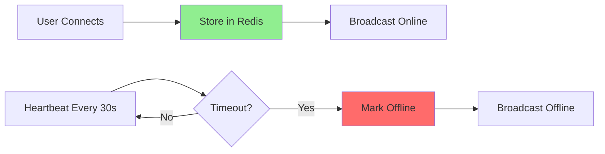
```mermaid
graph LR
    A[User Connects] --> B[Store in Redis]
    B --> C[Broadcast Online]
    
    D[Heartbeat Every 30s] --> E{Timeout?}
    E -->|No| D
    E -->|Yes| F[Mark Offline]
    F --> G[Broadcast Offline]
    
    style B fill:#90EE90
    style F fill:#FF6B6B
```

---

## Q3: Design a simple e-commerce product catalog.

**Answer**:

### Requirements
- Browse products
- Search products
- View product details
- Filter by category/price

### System Architecture

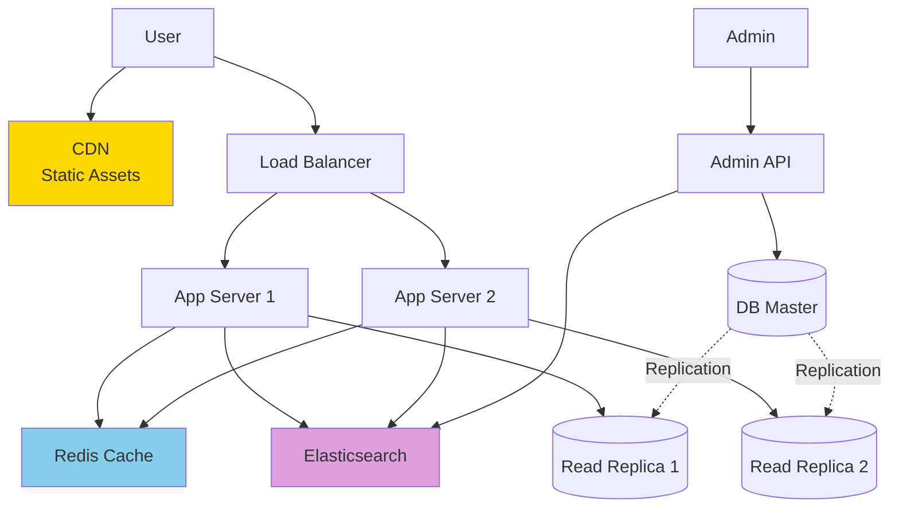
```mermaid
graph TB
    U[User] --> CDN[CDN<br/>Static Assets]
    U --> LB[Load Balancer]
    
    LB --> APP1[App Server 1]
    LB --> APP2[App Server 2]
    
    APP1 --> CACHE[Redis Cache]
    APP2 --> CACHE
    
    APP1 --> SEARCH[Elasticsearch]
    APP2 --> SEARCH
    
    APP1 --> DB_READ1[(Read Replica 1)]
    APP2 --> DB_READ2[(Read Replica 2)]
    
    DB_MASTER[(DB Master)] -.->|Replication| DB_READ1
    DB_MASTER -.->|Replication| DB_READ2
    
    ADMIN[Admin] --> ADMIN_API[Admin API]
    ADMIN_API --> DB_MASTER
    ADMIN_API --> SEARCH
    
    style CDN fill:#FFD700
    style CACHE fill:#87CEEB
    style SEARCH fill:#DDA0DD
```

### Database Schema

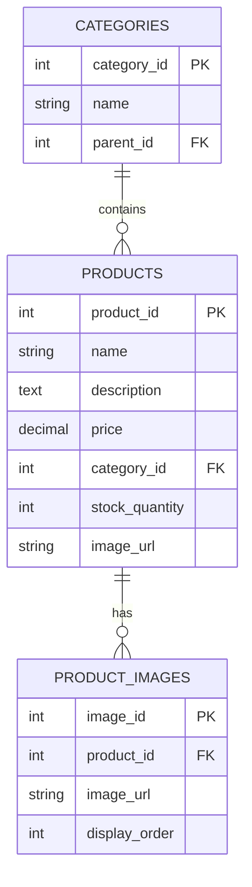
```mermaid
erDiagram
    CATEGORIES {
        int category_id PK
        string name
        int parent_id FK
    }
    
    PRODUCTS {
        int product_id PK
        string name
        text description
        decimal price
        int category_id FK
        int stock_quantity
        string image_url
    }
    
    PRODUCT_IMAGES {
        int image_id PK
        int product_id FK
        string image_url
        int display_order
    }
    
    CATEGORIES ||--o{ PRODUCTS : contains
    PRODUCTS ||--o{ PRODUCT_IMAGES : has
```

### Search Flow

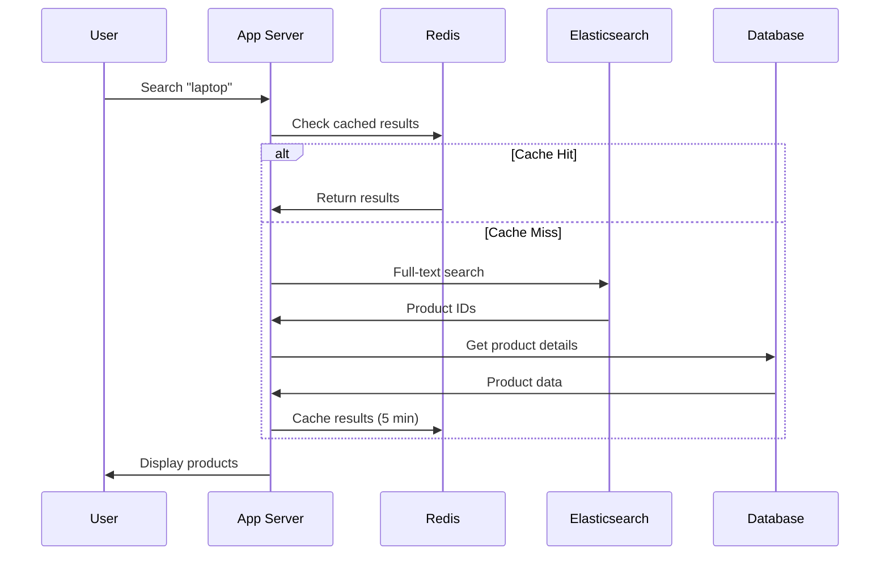
```mermaid
sequenceDiagram
    participant U as User
    participant APP as App Server
    participant CACHE as Redis
    participant ES as Elasticsearch
    participant DB as Database
    
    U->>APP: Search "laptop"
    APP->>CACHE: Check cached results
    
    alt Cache Hit
        CACHE->>APP: Return results
    else Cache Miss
        APP->>ES: Full-text search
        ES->>APP: Product IDs
        APP->>DB: Get product details
        DB->>APP: Product data
        APP->>CACHE: Cache results (5 min)
    end
    
    APP->>U: Display products
```

### Caching Strategy

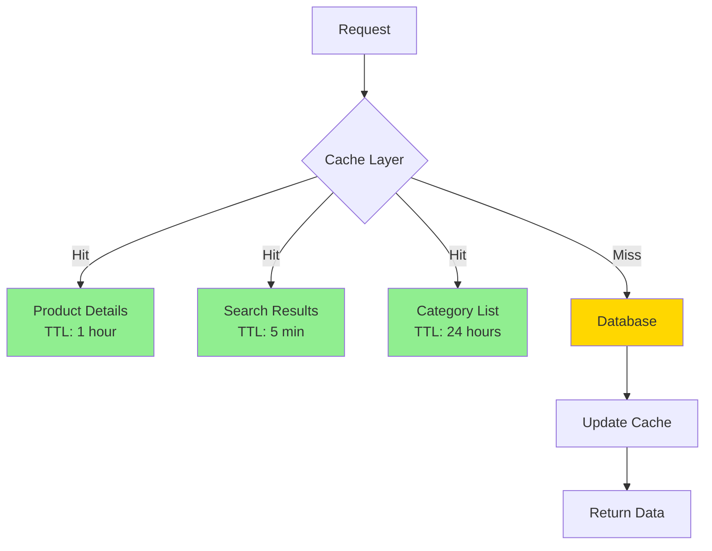
```mermaid
graph TB
    A[Request] --> B{Cache Layer}
    
    B -->|Hit| C1[Product Details<br/>TTL: 1 hour]
    B -->|Hit| C2[Search Results<br/>TTL: 5 min]
    B -->|Hit| C3[Category List<br/>TTL: 24 hours]
    
    B -->|Miss| D[Database]
    D --> E[Update Cache]
    E --> F[Return Data]
    
    style C1 fill:#90EE90
    style C2 fill:#90EE90
    style C3 fill:#90EE90
    style D fill:#FFD700
```

---

## Q4: Design a basic notification system.

**Answer**:

### Requirements
- Send notifications (email, SMS, push)
- Reliable delivery
- Track delivery status
- Handle high volume

### Architecture

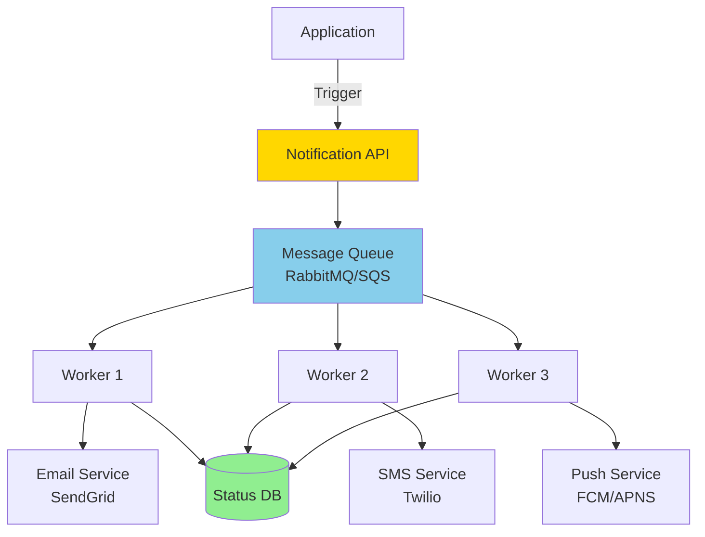
```mermaid
graph TB
    APP[Application] -->|Trigger| API[Notification API]
    
    API --> QUEUE[Message Queue<br/>RabbitMQ/SQS]
    
    QUEUE --> W1[Worker 1]
    QUEUE --> W2[Worker 2]
    QUEUE --> W3[Worker 3]
    
    W1 --> EMAIL[Email Service<br/>SendGrid]
    W2 --> SMS[SMS Service<br/>Twilio]
    W3 --> PUSH[Push Service<br/>FCM/APNS]
    
    W1 --> DB[(Status DB)]
    W2 --> DB
    W3 --> DB
    
    style API fill:#FFD700
    style QUEUE fill:#87CEEB
    style DB fill:#90EE90
```

### Database Schema

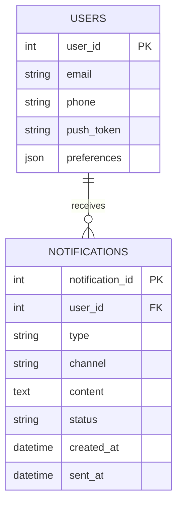
```mermaid
erDiagram
    NOTIFICATIONS {
        int notification_id PK
        int user_id FK
        string type
        string channel
        text content
        string status
        datetime created_at
        datetime sent_at
    }
    
    USERS {
        int user_id PK
        string email
        string phone
        string push_token
        json preferences
    }
    
    USERS ||--o{ NOTIFICATIONS : receives
```

### Notification Flow

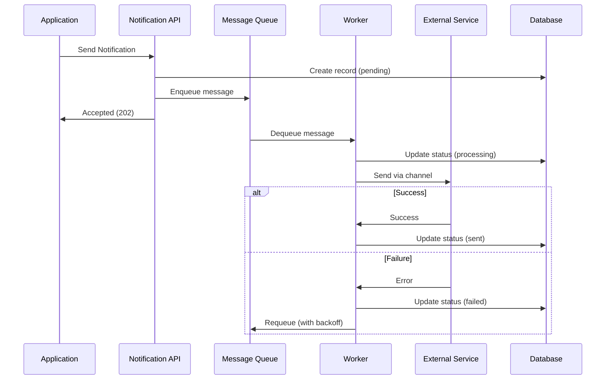
```mermaid
sequenceDiagram
    participant APP as Application
    participant API as Notification API
    participant Q as Message Queue
    participant W as Worker
    participant EXT as External Service
    participant DB as Database
    
    APP->>API: Send Notification
    API->>DB: Create record (pending)
    API->>Q: Enqueue message
    API->>APP: Accepted (202)
    
    Q->>W: Dequeue message
    W->>DB: Update status (processing)
    W->>EXT: Send via channel
    
    alt Success
        EXT->>W: Success
        W->>DB: Update status (sent)
    else Failure
        EXT->>W: Error
        W->>DB: Update status (failed)
        W->>Q: Requeue (with backoff)
    end
```

### Retry Strategy

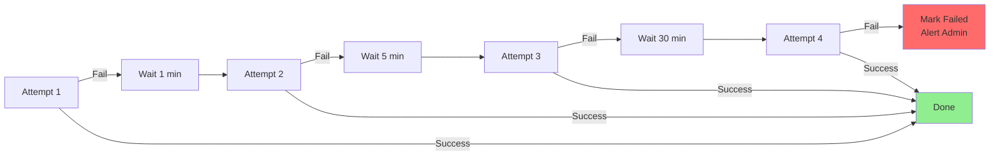
```mermaid
graph LR
    A[Attempt 1] -->|Fail| B[Wait 1 min]
    B --> C[Attempt 2]
    C -->|Fail| D[Wait 5 min]
    D --> E[Attempt 3]
    E -->|Fail| F[Wait 30 min]
    F --> G[Attempt 4]
    G -->|Fail| H[Mark Failed<br/>Alert Admin]
    
    A -->|Success| S[Done]
    C -->|Success| S
    E -->|Success| S
    G -->|Success| S
    
    style S fill:#90EE90
    style H fill:#FF6B6B
```

---

## Q5: Design a basic file storage service.

**Answer**:

### Requirements
- Upload files
- Download files
- List user files
- Delete files
- Support large files

### Architecture

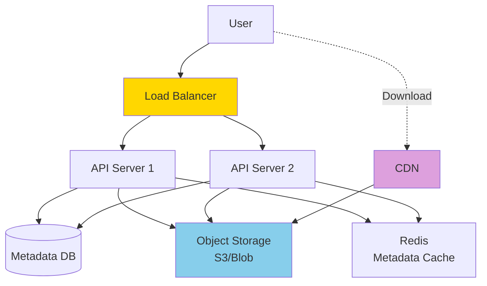
```mermaid
graph TB
    U[User] --> LB[Load Balancer]
    
    LB --> API1[API Server 1]
    LB --> API2[API Server 2]
    
    API1 --> META_DB[(Metadata DB)]
    API2 --> META_DB
    
    API1 --> STORAGE[Object Storage<br/>S3/Blob]
    API2 --> STORAGE
    
    API1 --> CACHE[Redis<br/>Metadata Cache]
    API2 --> CACHE
    
    CDN[CDN] --> STORAGE
    U -.->|Download| CDN
    
    style LB fill:#FFD700
    style STORAGE fill:#87CEEB
    style CDN fill:#DDA0DD
```

### Database Schema

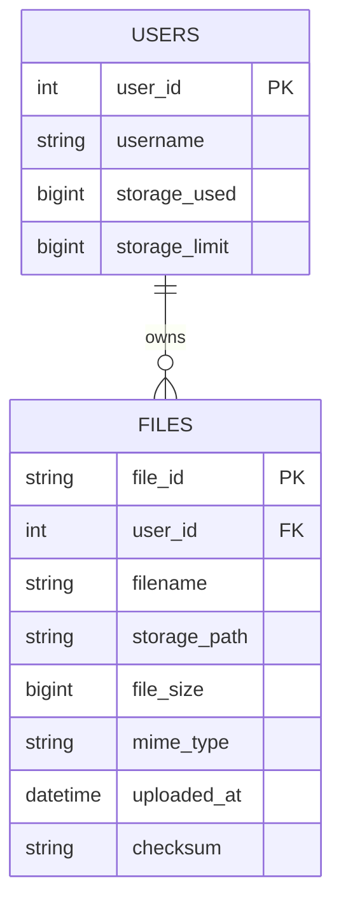
```mermaid
erDiagram
    FILES {
        string file_id PK
        int user_id FK
        string filename
        string storage_path
        bigint file_size
        string mime_type
        datetime uploaded_at
        string checksum
    }
    
    USERS {
        int user_id PK
        string username
        bigint storage_used
        bigint storage_limit
    }
    
    USERS ||--o{ FILES : owns
```

### Upload Flow

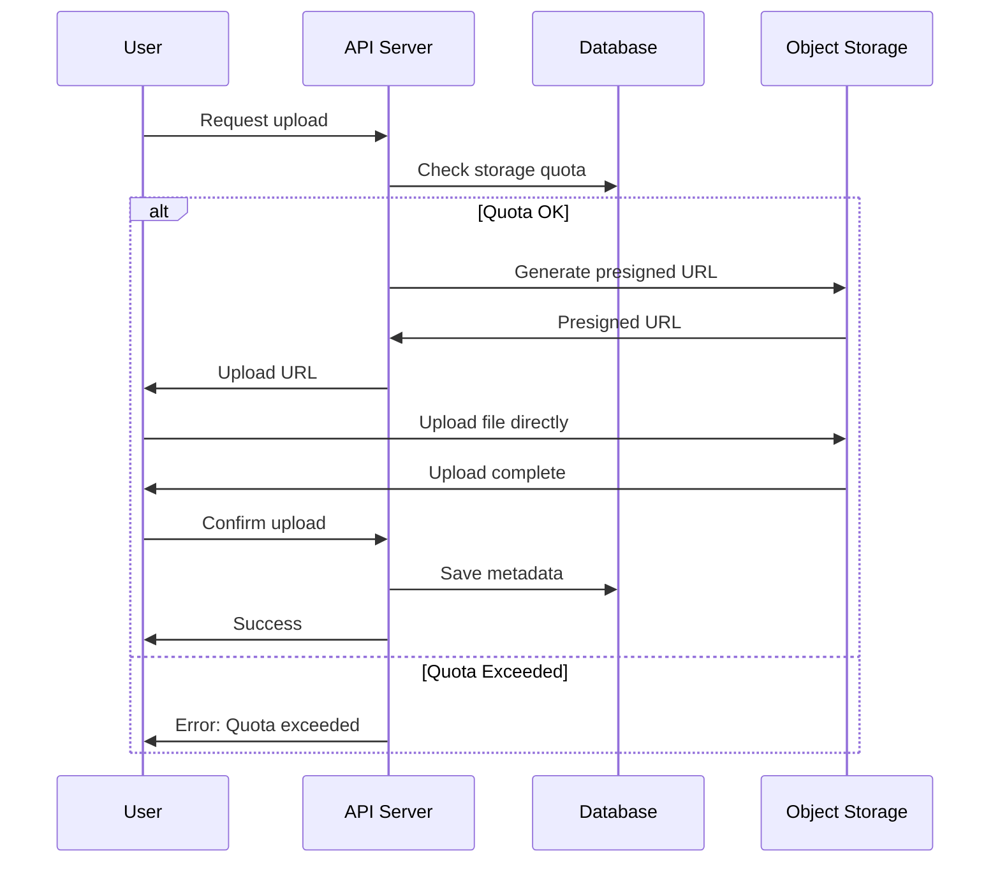
```mermaid
sequenceDiagram
    participant U as User
    participant API as API Server
    participant DB as Database
    participant S3 as Object Storage
    
    U->>API: Request upload
    API->>DB: Check storage quota
    
    alt Quota OK
        API->>S3: Generate presigned URL
        S3->>API: Presigned URL
        API->>U: Upload URL
        
        U->>S3: Upload file directly
        S3->>U: Upload complete
        
        U->>API: Confirm upload
        API->>DB: Save metadata
        API->>U: Success
    else Quota Exceeded
        API->>U: Error: Quota exceeded
    end
```

### Download Flow

```mermaid
sequenceDiagram
    participant U as User
    participant CDN as CDN
    participant API as API Server
    participant S3 as Object Storage
    
    U->>API: Request file
    API->>API: Check permissions
    
    alt Authorized
        API->>S3: Generate signed URL
        S3->>API: Signed URL
        API->>U: Redirect to CDN URL
        U->>CDN: Download file
        
        alt CDN Cache Hit
            CDN->>U: Serve from cache
        else CDN Cache Miss
            CDN->>S3: Fetch file
            S3->>CDN: File data
            CDN->>U: Serve file
        end
    else Unauthorized
        API->>U: 403 Forbidden
    end
```

### Storage Organization

```mermaid
graph TB
    ROOT[Storage Root] --> Y2025[2025/]
    Y2025 --> M12[12/]
    M12 --> D13[13/]
    D13 --> U123[user_123/]
    U123 --> F1[abc123.jpg]
    U123 --> F2[def456.pdf]
    
    style ROOT fill:#FFE4B5
    style U123 fill:#87CEEB
    style F1 fill:#90EE90
    style F2 fill:#90EE90
```

**Path Structure**: `/year/month/day/user_id/file_id.ext`

**Benefits**:
- Even distribution
- Easy to manage
- Supports sharding
- Facilitates cleanup

---

## Summary

Key system design patterns:
- **URL Shortener**: Hashing, caching, analytics
- **Chat Application**: WebSockets, presence, real-time
- **Product Catalog**: Search, caching, read replicas
- **Notification System**: Queues, workers, retry logic
- **File Storage**: Object storage, CDN, presigned URLs

All designs emphasize scalability, reliability, and performance.

