Hard-level system design interview questions covering globally distributed, highly scalable systems.

## Q1: Design WhatsApp/Telegram (Global Messaging).

**Answer**:

### Requirements
- 2B users globally
- Real-time messaging
- End-to-end encryption
- Group chats (256 members)
- Media sharing
- 99.99% uptime
- <100ms latency

### Global Architecture

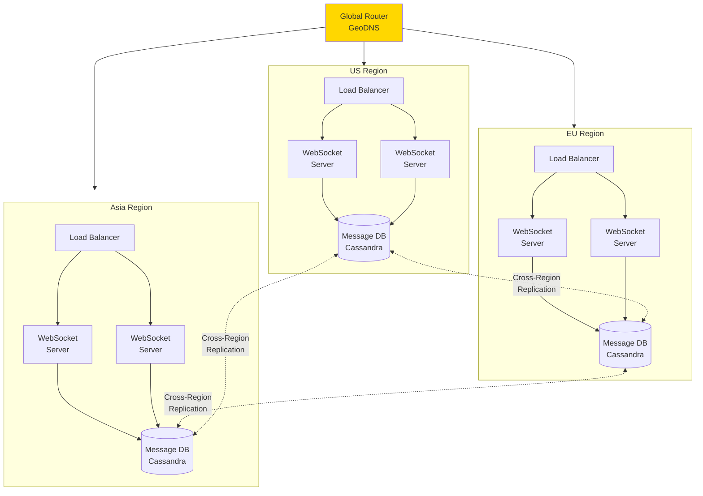
```mermaid
graph TB
    subgraph US["US Region"]
        US_LB[Load Balancer] --> US_WS1[WebSocket<br/>Server]
        US_LB --> US_WS2[WebSocket<br/>Server]
        US_WS1 --> US_MSG[(Message DB<br/>Cassandra)]
        US_WS2 --> US_MSG
    end
    
    subgraph EU["EU Region"]
        EU_LB[Load Balancer] --> EU_WS1[WebSocket<br/>Server]
        EU_LB --> EU_WS2[WebSocket<br/>Server]
        EU_WS1 --> EU_MSG[(Message DB<br/>Cassandra)]
        EU_WS2 --> EU_MSG
    end
    
    subgraph ASIA["Asia Region"]
        ASIA_LB[Load Balancer] --> ASIA_WS1[WebSocket<br/>Server]
        ASIA_LB --> ASIA_WS2[WebSocket<br/>Server]
        ASIA_WS1 --> ASIA_MSG[(Message DB<br/>Cassandra)]
        ASIA_WS2 --> ASIA_MSG
    end
    
    US_MSG <-.->|Cross-Region<br/>Replication| EU_MSG
    EU_MSG <-.->|Cross-Region<br/>Replication| ASIA_MSG
    ASIA_MSG <-.->|Cross-Region<br/>Replication| US_MSG
    
    GLOBAL_ROUTER[Global Router<br/>GeoDNS] --> US
    GLOBAL_ROUTER --> EU
    GLOBAL_ROUTER --> ASIA
    
    style GLOBAL_ROUTER fill:#FFD700
```

### Message Delivery Flow

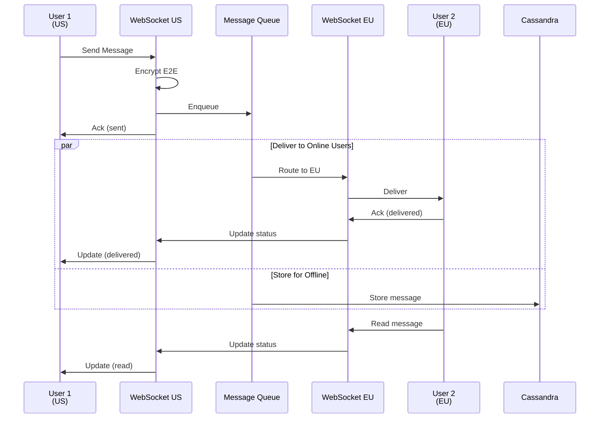
```mermaid
sequenceDiagram
    participant U1 as User 1<br/>(US)
    participant WS_US as WebSocket US
    participant MQ as Message Queue
    participant WS_EU as WebSocket EU
    participant U2 as User 2<br/>(EU)
    
    U1->>WS_US: Send Message
    WS_US->>WS_US: Encrypt E2E
    WS_US->>MQ: Enqueue
    WS_US->>U1: Ack (sent)
    
    par Deliver to Online Users
        MQ->>WS_EU: Route to EU
        WS_EU->>U2: Deliver
        U2->>WS_EU: Ack (delivered)
        WS_EU->>WS_US: Update status
        WS_US->>U1: Update (delivered)
    and Store for Offline
        MQ->>Cassandra: Store message
    end
    
    U2->>WS_EU: Read message
    WS_EU->>WS_US: Update status
    WS_US->>U1: Update (read)
```

### Sharding Strategy

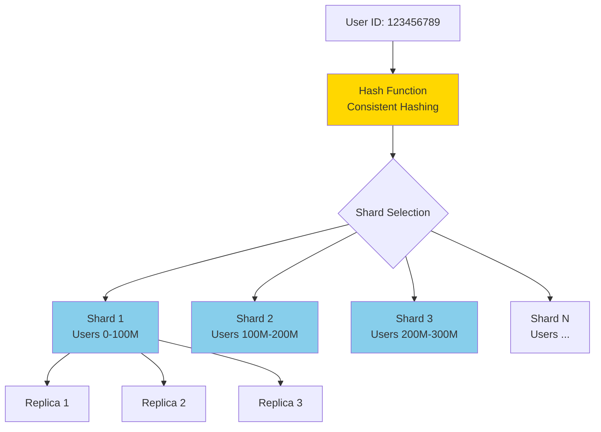
```mermaid
graph TB
    A[User ID: 123456789] --> B[Hash Function<br/>Consistent Hashing]
    
    B --> C{Shard Selection}
    
    C --> S1[Shard 1<br/>Users 0-100M]
    C --> S2[Shard 2<br/>Users 100M-200M]
    C --> S3[Shard 3<br/>Users 200M-300M]
    C --> S4[Shard N<br/>Users ...]
    
    S1 --> R1[Replica 1]
    S1 --> R2[Replica 2]
    S1 --> R3[Replica 3]
    
    style B fill:#FFD700
    style S1 fill:#87CEEB
    style S2 fill:#87CEEB
    style S3 fill:#87CEEB
```

### Group Chat Architecture

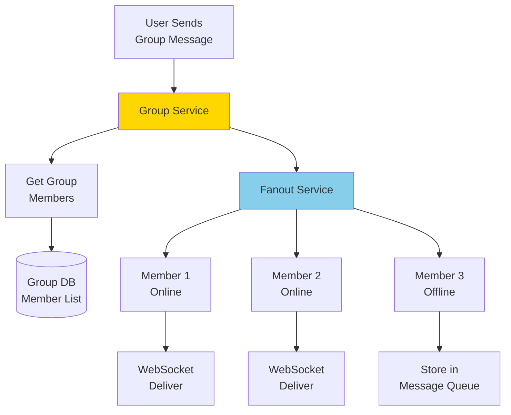
```mermaid
graph TB
    A[User Sends<br/>Group Message] --> B[Group Service]
    
    B --> C[Get Group<br/>Members]
    C --> D[(Group DB<br/>Member List)]
    
    B --> E[Fanout Service]
    
    E --> F1[Member 1<br/>Online]
    E --> F2[Member 2<br/>Online]
    E --> F3[Member 3<br/>Offline]
    
    F1 --> G1[WebSocket<br/>Deliver]
    F2 --> G2[WebSocket<br/>Deliver]
    F3 --> G3[Store in<br/>Message Queue]
    
    style B fill:#FFD700
    style E fill:#87CEEB
```

### End-to-End Encryption

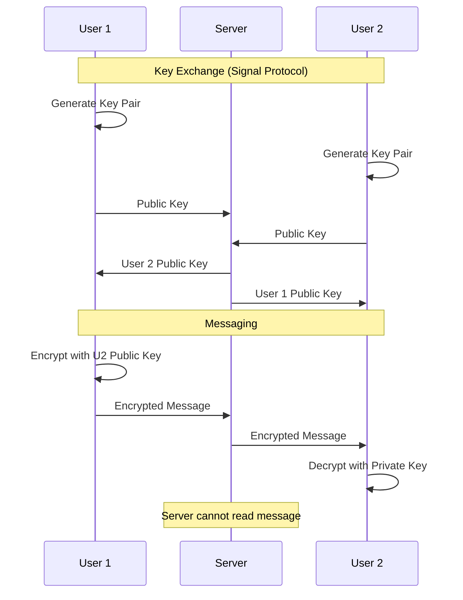
```mermaid
sequenceDiagram
    participant U1 as User 1
    participant S as Server
    participant U2 as User 2
    
    Note over U1,U2: Key Exchange (Signal Protocol)
    
    U1->>U1: Generate Key Pair
    U2->>U2: Generate Key Pair
    
    U1->>S: Public Key
    U2->>S: Public Key
    
    S->>U1: User 2 Public Key
    S->>U2: User 1 Public Key
    
    Note over U1,U2: Messaging
    
    U1->>U1: Encrypt with U2 Public Key
    U1->>S: Encrypted Message
    S->>U2: Encrypted Message
    U2->>U2: Decrypt with Private Key
    
    Note over S: Server cannot read message
```

---

## Q2: Design Google Search.

**Answer**:

### Requirements
- Index 100B+ web pages
- <200ms query latency
- Relevance ranking
- Distributed crawling
- Real-time indexing
- Handle 100K queries/sec

### Architecture

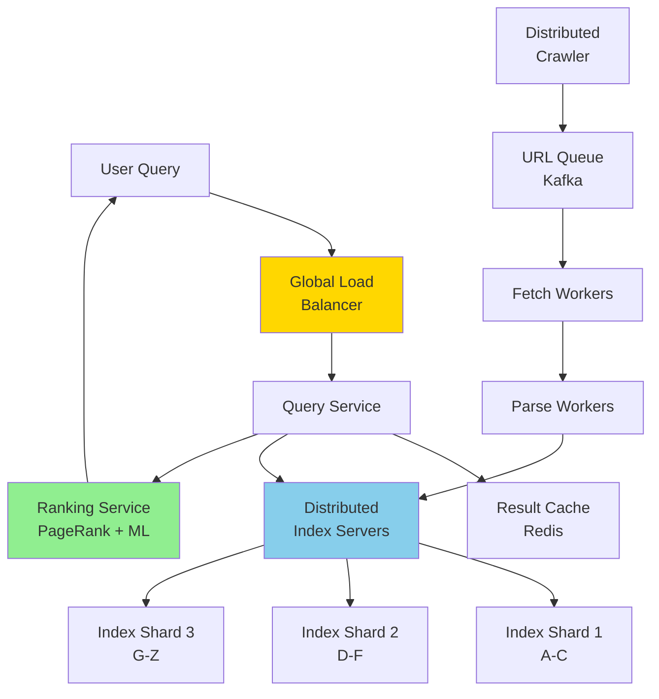
```mermaid
graph TB
    U[User Query] --> LB[Global Load<br/>Balancer]
    
    LB --> QS[Query Service]
    
    QS --> CACHE[Result Cache<br/>Redis]
    
    QS --> INDEX[Distributed<br/>Index Servers]
    
    INDEX --> SHARD1[Index Shard 1<br/>A-C]
    INDEX --> SHARD2[Index Shard 2<br/>D-F]
    INDEX --> SHARD3[Index Shard 3<br/>G-Z]
    
    QS --> RANK[Ranking Service<br/>PageRank + ML]
    
    RANK --> U
    
    CRAWLER[Distributed<br/>Crawler] --> URL_Q[URL Queue<br/>Kafka]
    URL_Q --> FETCH[Fetch Workers]
    FETCH --> PARSE[Parse Workers]
    PARSE --> INDEX
    
    style LB fill:#FFD700
    style INDEX fill:#87CEEB
    style RANK fill:#90EE90
```

### Crawling Pipeline

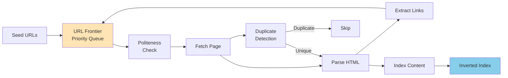
```mermaid
graph LR
    A[Seed URLs] --> B[URL Frontier<br/>Priority Queue]
    
    B --> C[Politeness<br/>Check]
    C --> D[Fetch Page]
    D --> E[Parse HTML]
    E --> F[Extract Links]
    F --> B
    
    E --> G[Index Content]
    G --> H[Inverted Index]
    
    D --> I[Duplicate<br/>Detection]
    I -->|Unique| E
    I -->|Duplicate| J[Skip]
    
    style B fill:#FFE4B5
    style H fill:#87CEEB
```

### Inverted Index Structure

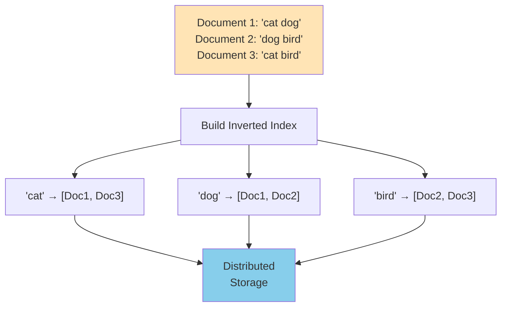
```mermaid
graph TB
    A["Document 1: 'cat dog'<br/>Document 2: 'dog bird'<br/>Document 3: 'cat bird'"] --> B[Build Inverted Index]
    
    B --> C1["'cat' → [Doc1, Doc3]"]
    B --> C2["'dog' → [Doc1, Doc2]"]
    B --> C3["'bird' → [Doc2, Doc3]"]
    
    C1 --> D[Distributed<br/>Storage]
    C2 --> D
    C3 --> D
    
    style A fill:#FFE4B5
    style D fill:#87CEEB
```

### Query Processing

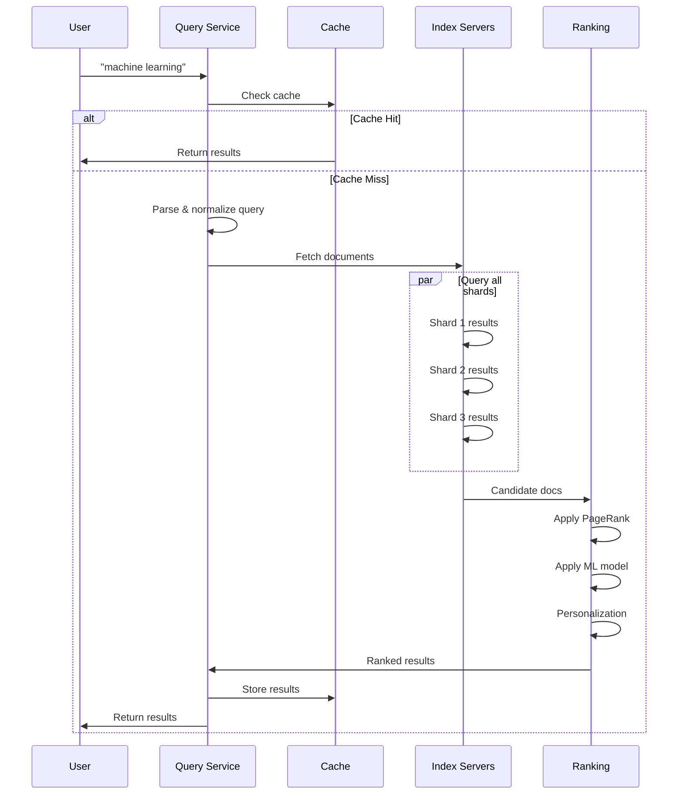
```mermaid
sequenceDiagram
    participant U as User
    participant QS as Query Service
    participant Cache as Cache
    participant Index as Index Servers
    participant Rank as Ranking
    
    U->>QS: "machine learning"
    
    QS->>Cache: Check cache
    alt Cache Hit
        Cache->>U: Return results
    else Cache Miss
        QS->>QS: Parse & normalize query
        QS->>Index: Fetch documents
        
        par Query all shards
            Index->>Index: Shard 1 results
            Index->>Index: Shard 2 results
            Index->>Index: Shard 3 results
        end
        
        Index->>Rank: Candidate docs
        Rank->>Rank: Apply PageRank
        Rank->>Rank: Apply ML model
        Rank->>Rank: Personalization
        Rank->>QS: Ranked results
        QS->>Cache: Store results
        QS->>U: Return results
    end
```

### PageRank Algorithm

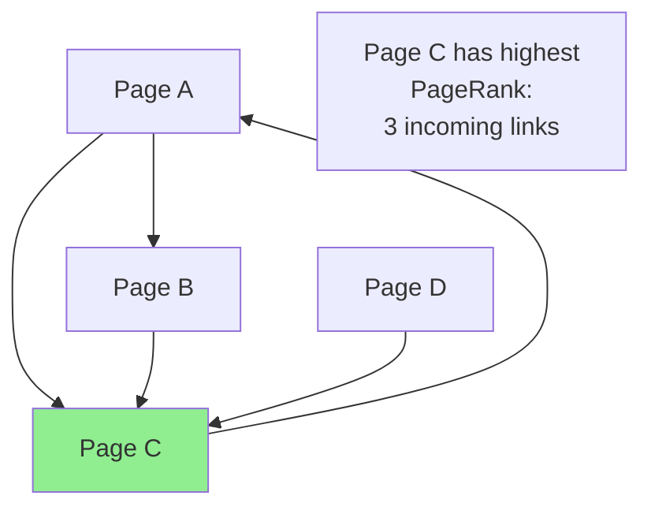
```mermaid
graph TB
    A[Page A] --> B[Page B]
    A --> C[Page C]
    B --> C
    C --> A
    D[Page D] --> C
    
    style C fill:#90EE90
    
    Note[Page C has highest<br/>PageRank:<br/>3 incoming links]
```

---

## Q3: Design Amazon (E-commerce at Scale).

**Answer**:

### Requirements
- 300M products
- 200M active users
- Black Friday: 1M orders/hour
- Inventory management
- Order processing
- Payment processing
- Global distribution

### Microservices Architecture

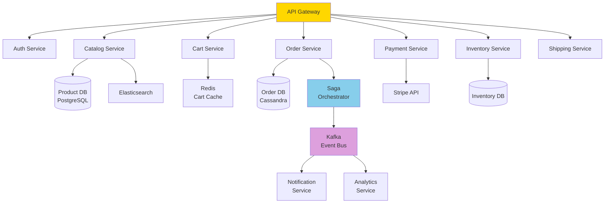
```mermaid
graph TB
    API[API Gateway] --> AUTH[Auth Service]
    API --> CATALOG[Catalog Service]
    API --> CART[Cart Service]
    API --> ORDER[Order Service]
    API --> PAYMENT[Payment Service]
    API --> INVENTORY[Inventory Service]
    API --> SHIPPING[Shipping Service]
    
    CATALOG --> PRODUCT_DB[(Product DB<br/>PostgreSQL)]
    CATALOG --> SEARCH[Elasticsearch]
    
    CART --> REDIS[Redis<br/>Cart Cache]
    
    ORDER --> ORDER_DB[(Order DB<br/>Cassandra)]
    ORDER --> SAGA[Saga<br/>Orchestrator]
    
    PAYMENT --> STRIPE[Stripe API]
    INVENTORY --> INV_DB[(Inventory DB)]
    
    SAGA --> KAFKA[Kafka<br/>Event Bus]
    
    KAFKA --> NOTIF[Notification<br/>Service]
    KAFKA --> ANALYTICS[Analytics<br/>Service]
    
    style API fill:#FFD700
    style SAGA fill:#87CEEB
    style KAFKA fill:#DDA0DD
```

### Order Processing Saga

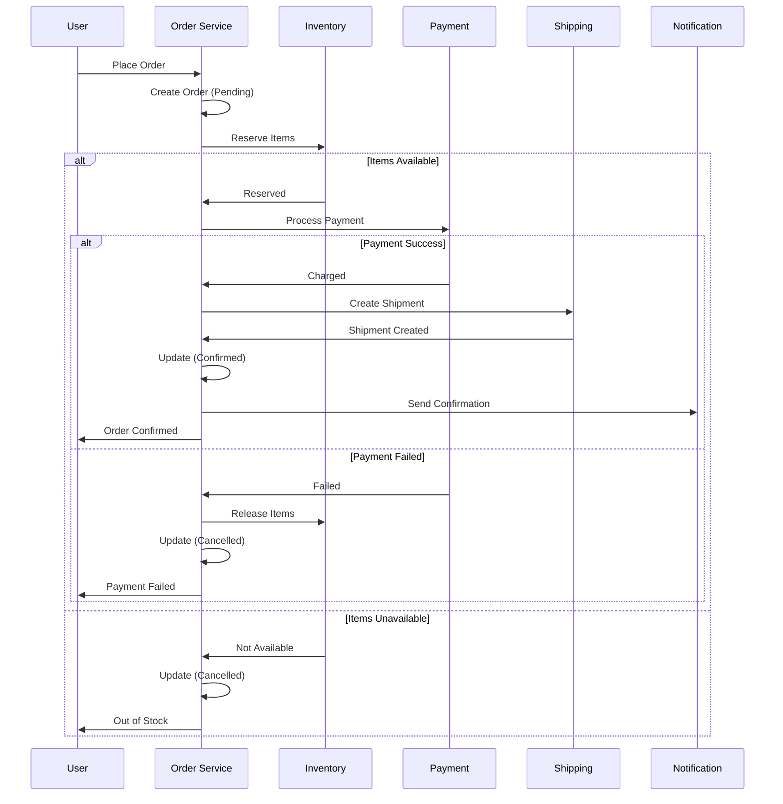
```mermaid
sequenceDiagram
    participant U as User
    participant Order as Order Service
    participant Inv as Inventory
    participant Pay as Payment
    participant Ship as Shipping
    participant Notif as Notification
    
    U->>Order: Place Order
    Order->>Order: Create Order (Pending)
    
    Order->>Inv: Reserve Items
    alt Items Available
        Inv->>Order: Reserved
        
        Order->>Pay: Process Payment
        alt Payment Success
            Pay->>Order: Charged
            
            Order->>Ship: Create Shipment
            Ship->>Order: Shipment Created
            
            Order->>Order: Update (Confirmed)
            Order->>Notif: Send Confirmation
            Order->>U: Order Confirmed
        else Payment Failed
            Pay->>Order: Failed
            Order->>Inv: Release Items
            Order->>Order: Update (Cancelled)
            Order->>U: Payment Failed
        end
    else Items Unavailable
        Inv->>Order: Not Available
        Order->>Order: Update (Cancelled)
        Order->>U: Out of Stock
    end
```

### Inventory Management

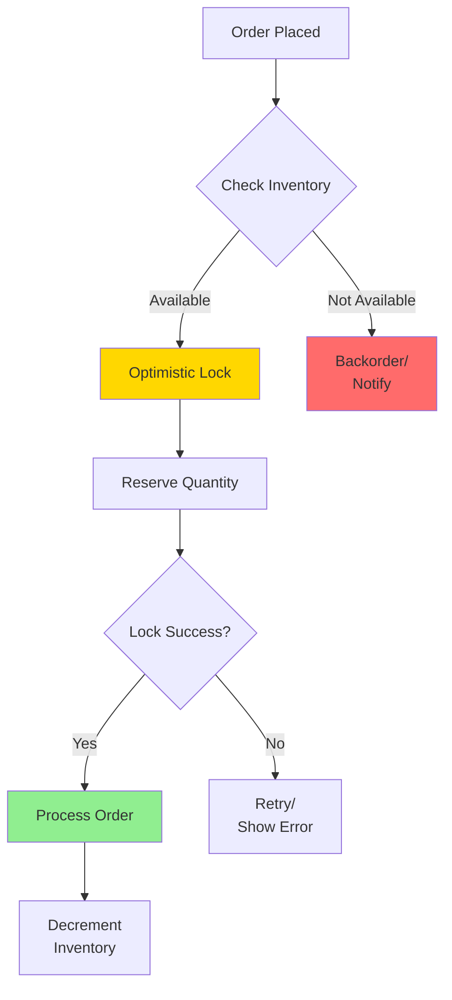
```mermaid
graph TB
    A[Order Placed] --> B{Check Inventory}
    
    B -->|Available| C[Optimistic Lock]
    C --> D[Reserve Quantity]
    D --> E{Lock Success?}
    
    E -->|Yes| F[Process Order]
    E -->|No| G[Retry/<br/>Show Error]
    
    B -->|Not Available| H[Backorder/<br/>Notify]
    
    F --> I[Decrement<br/>Inventory]
    
    style C fill:#FFD700
    style F fill:#90EE90
    style H fill:#FF6B6B
```

### Flash Sale Architecture

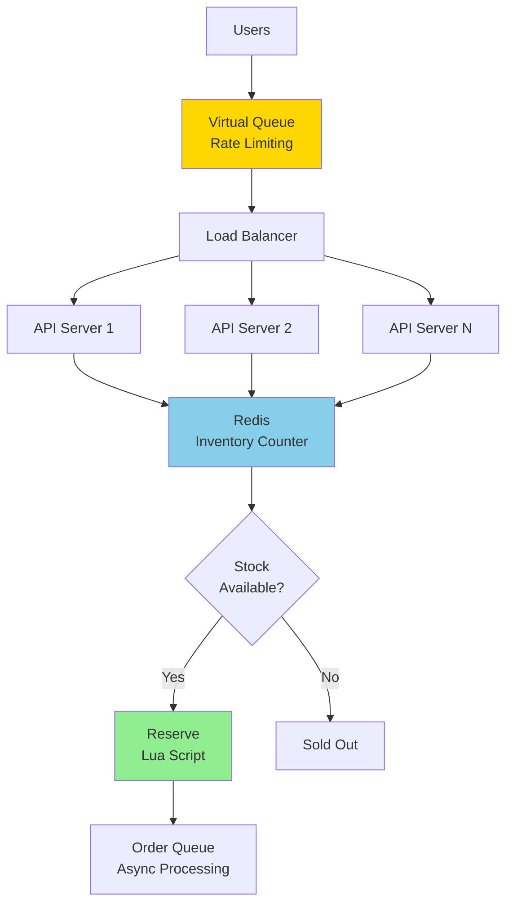
```mermaid
graph TB
    U[Users] --> QUEUE[Virtual Queue<br/>Rate Limiting]
    
    QUEUE --> LB[Load Balancer]
    
    LB --> API1[API Server 1]
    LB --> API2[API Server 2]
    LB --> API3[API Server N]
    
    API1 --> REDIS[Redis<br/>Inventory Counter]
    API2 --> REDIS
    API3 --> REDIS
    
    REDIS --> CHECK{Stock<br/>Available?}
    
    CHECK -->|Yes| RESERVE[Reserve<br/>Lua Script]
    CHECK -->|No| SOLD_OUT[Sold Out]
    
    RESERVE --> ORDER_Q[Order Queue<br/>Async Processing]
    
    style QUEUE fill:#FFD700
    style REDIS fill:#87CEEB
    style RESERVE fill:#90EE90
```

---

## Q4: Design Ticketmaster (High Concurrency Booking).

**Answer**:

### Requirements
- Concert tickets
- High concurrency (100K users for 10K seats)
- No double booking
- Fair allocation
- Handle bots
- Payment processing

### Architecture

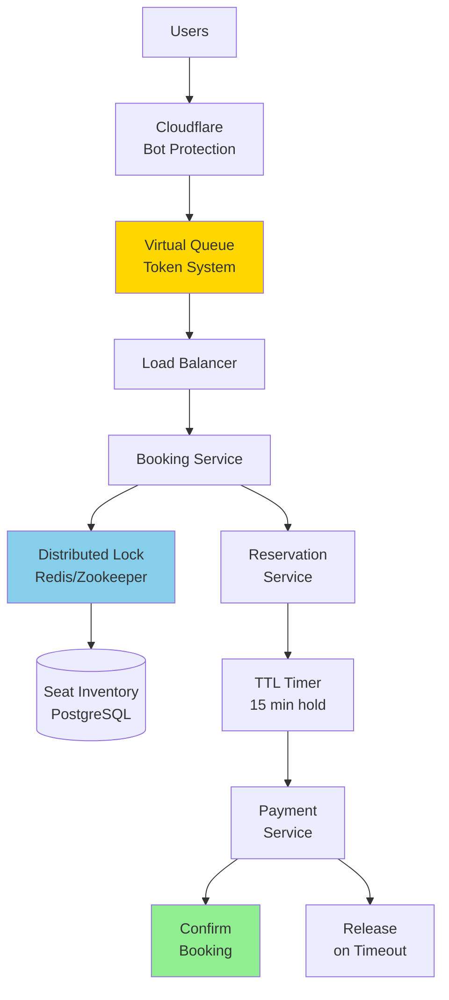
```mermaid
graph TB
    U[Users] --> CF[Cloudflare<br/>Bot Protection]
    CF --> QUEUE[Virtual Queue<br/>Token System]
    
    QUEUE --> LB[Load Balancer]
    
    LB --> BOOK[Booking Service]
    
    BOOK --> LOCK[Distributed Lock<br/>Redis/Zookeeper]
    
    LOCK --> SEAT_DB[(Seat Inventory<br/>PostgreSQL)]
    
    BOOK --> RESERVE[Reservation<br/>Service]
    RESERVE --> TIMER[TTL Timer<br/>15 min hold]
    
    TIMER --> PAYMENT[Payment<br/>Service]
    
    PAYMENT --> CONFIRM[Confirm<br/>Booking]
    PAYMENT --> RELEASE[Release<br/>on Timeout]
    
    style QUEUE fill:#FFD700
    style LOCK fill:#87CEEB
    style CONFIRM fill:#90EE90
```

### Seat Locking Mechanism

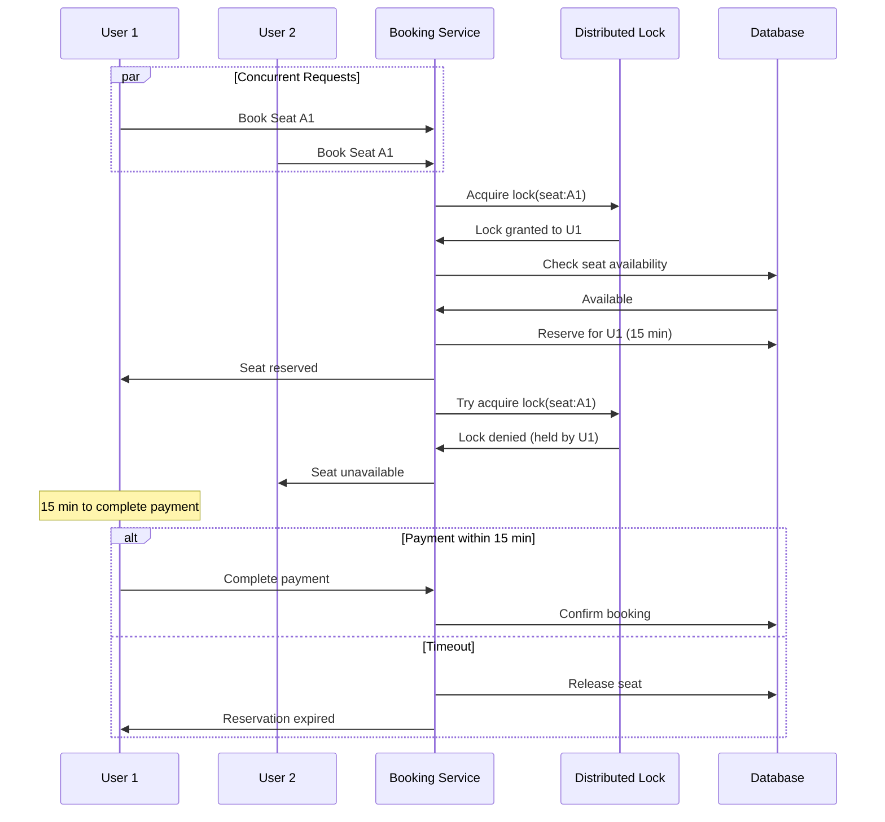
```mermaid
sequenceDiagram
    participant U1 as User 1
    participant U2 as User 2
    participant Book as Booking Service
    participant Lock as Distributed Lock
    participant DB as Database
    
    par Concurrent Requests
        U1->>Book: Book Seat A1
        U2->>Book: Book Seat A1
    end
    
    Book->>Lock: Acquire lock(seat:A1)
    Lock->>Book: Lock granted to U1
    
    Book->>DB: Check seat availability
    DB->>Book: Available
    Book->>DB: Reserve for U1 (15 min)
    Book->>U1: Seat reserved
    
    Book->>Lock: Try acquire lock(seat:A1)
    Lock->>Book: Lock denied (held by U1)
    Book->>U2: Seat unavailable
    
    Note over U1: 15 min to complete payment
    
    alt Payment within 15 min
        U1->>Book: Complete payment
        Book->>DB: Confirm booking
    else Timeout
        Book->>DB: Release seat
        Book->>U1: Reservation expired
    end
```

### Virtual Queue System

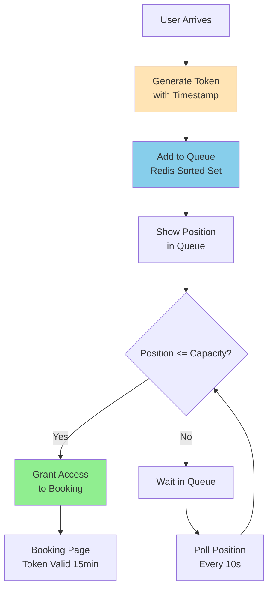
```mermaid
graph TB
    A[User Arrives] --> B[Generate Token<br/>with Timestamp]
    
    B --> C[Add to Queue<br/>Redis Sorted Set]
    
    C --> D[Show Position<br/>in Queue]
    
    D --> E{Position <= Capacity?}
    
    E -->|Yes| F[Grant Access<br/>to Booking]
    E -->|No| G[Wait in Queue]
    
    G --> H[Poll Position<br/>Every 10s]
    H --> E
    
    F --> I[Booking Page<br/>Token Valid 15min]
    
    style B fill:#FFE4B5
    style C fill:#87CEEB
    style F fill:#90EE90
```

### Bot Prevention

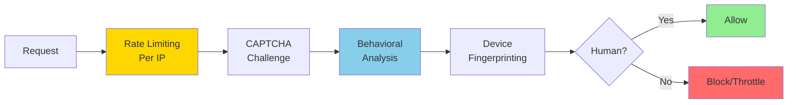
```mermaid
graph LR
    A[Request] --> B[Rate Limiting<br/>Per IP]
    B --> C[CAPTCHA<br/>Challenge]
    C --> D[Behavioral<br/>Analysis]
    D --> E[Device<br/>Fingerprinting]
    E --> F{Human?}
    
    F -->|Yes| G[Allow]
    F -->|No| H[Block/Throttle]
    
    style B fill:#FFD700
    style D fill:#87CEEB
    style G fill:#90EE90
    style H fill:#FF6B6B
```

---

## Q5: Design Dropbox/Google Drive (Distributed File Sync).

**Answer**:

### Requirements
- File upload/download
- Real-time sync across devices
- Version history
- Sharing/permissions
- 500M users
- 1PB+ storage

### Architecture

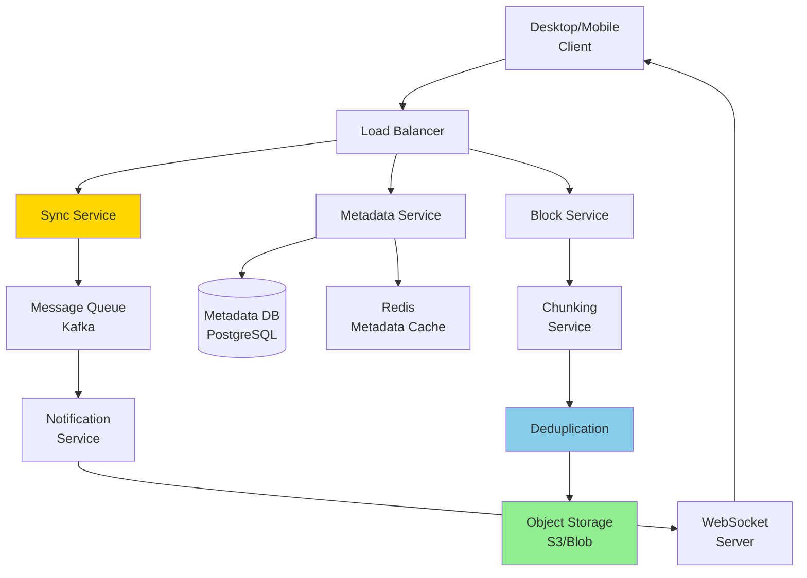
```mermaid
graph TB
    CLIENT[Desktop/Mobile<br/>Client] --> LB[Load Balancer]
    
    LB --> SYNC[Sync Service]
    LB --> META[Metadata Service]
    LB --> BLOCK[Block Service]
    
    SYNC --> QUEUE[Message Queue<br/>Kafka]
    
    META --> META_DB[(Metadata DB<br/>PostgreSQL)]
    
    BLOCK --> CHUNK[Chunking<br/>Service]
    CHUNK --> DEDUP[Deduplication]
    DEDUP --> S3[Object Storage<br/>S3/Blob]
    
    QUEUE --> NOTIF[Notification<br/>Service]
    NOTIF --> WS[WebSocket<br/>Server]
    WS --> CLIENT
    
    META --> CACHE[Redis<br/>Metadata Cache]
    
    style SYNC fill:#FFD700
    style DEDUP fill:#87CEEB
    style S3 fill:#90EE90
```

### File Chunking & Deduplication

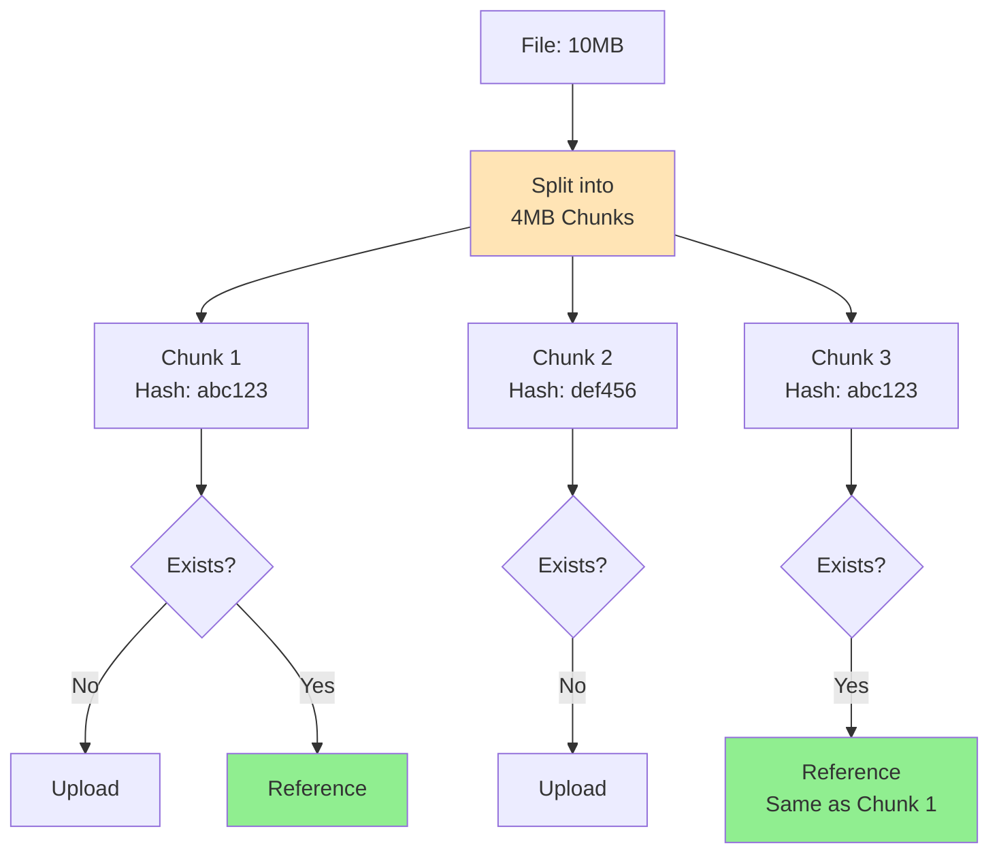
```mermaid
graph TB
    A[File: 10MB] --> B[Split into<br/>4MB Chunks]
    
    B --> C1[Chunk 1<br/>Hash: abc123]
    B --> C2[Chunk 2<br/>Hash: def456]
    B --> C3[Chunk 3<br/>Hash: abc123]
    
    C1 --> D{Exists?}
    C2 --> E{Exists?}
    C3 --> F{Exists?}
    
    D -->|No| G1[Upload]
    D -->|Yes| H1[Reference]
    
    E -->|No| G2[Upload]
    
    F -->|Yes| H2[Reference<br/>Same as Chunk 1]
    
    style B fill:#FFE4B5
    style H1 fill:#90EE90
    style H2 fill:#90EE90
```

### Sync Protocol

```mermaid
sequenceDiagram
    participant D1 as Device 1
    participant Sync as Sync Service
    participant Meta as Metadata
    participant D2 as Device 2
    
    D1->>Sync: Upload file
    Sync->>Sync: Chunk & hash
    Sync->>Meta: Update metadata
    Sync->>Storage: Store chunks
    
    Sync->>Kafka: FileUpdated event
    Kafka->>Notif: Notify subscribers
    
    Notif->>D2: File changed
    D2->>Meta: Get metadata
    Meta->>D2: Chunk list
    
    loop For each chunk
        D2->>Storage: Download chunk
    end
    
    D2->>D2: Reassemble file
```

### Conflict Resolution

```mermaid
graph TB
    A[File Modified<br/>on Device 1] --> B{Sync}
    A2[File Modified<br/>on Device 2] --> B
    
    B --> C{Conflict?}
    
    C -->|No| D[Last Write Wins<br/>by Timestamp]
    
    C -->|Yes| E{Resolution<br/>Strategy}
    
    E --> F1[Keep Both<br/>file_v1, file_v2]
    E --> F2[Operational<br/>Transform]
    E --> F3[User Chooses]
    
    style C fill:#FFD700
    style F1 fill:#87CEEB
    style F2 fill:#90EE90
```

---

## Summary

Hard system design challenges:
- **WhatsApp**: Global messaging, E2E encryption, real-time delivery
- **Google Search**: Distributed crawling, inverted index, PageRank
- **Amazon**: Microservices, saga pattern, inventory management
- **Ticketmaster**: High concurrency, distributed locking, virtual queues
- **Dropbox**: File sync, chunking, deduplication, conflict resolution

All require deep understanding of distributed systems, consistency, and scale.

