Medium-level system design interview questions covering complex distributed systems.

## Q1: Design Twitter/X.

**Answer**:

### Requirements
- Post tweets (280 chars)
- Follow/unfollow users
- Timeline (home feed)
- Search tweets
- Trending topics
- 500M users, 100M DAU

### Architecture

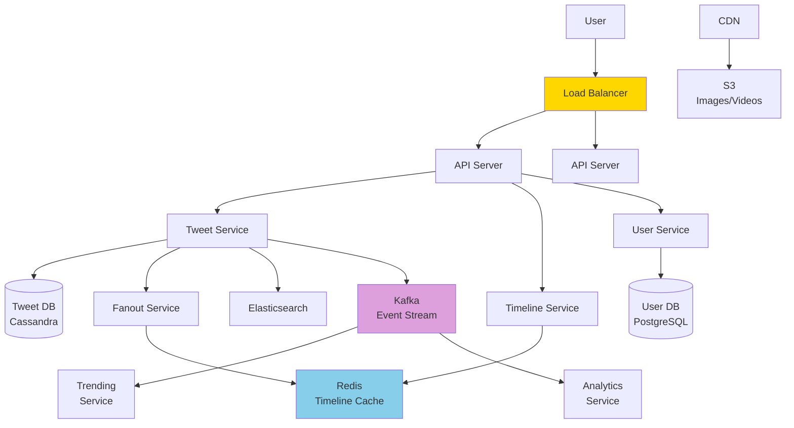
```mermaid
graph TB
    U[User] --> LB[Load Balancer]
    
    LB --> API1[API Server]
    LB --> API2[API Server]
    
    API1 --> TWEET_SVC[Tweet Service]
    API1 --> TIMELINE_SVC[Timeline Service]
    API1 --> USER_SVC[User Service]
    
    TWEET_SVC --> TWEET_DB[(Tweet DB<br/>Cassandra)]
    USER_SVC --> USER_DB[(User DB<br/>PostgreSQL)]
    
    TWEET_SVC --> FANOUT[Fanout Service]
    FANOUT --> REDIS[Redis<br/>Timeline Cache]
    
    TIMELINE_SVC --> REDIS
    
    TWEET_SVC --> SEARCH[Elasticsearch]
    TWEET_SVC --> KAFKA[Kafka<br/>Event Stream]
    
    KAFKA --> TRENDING[Trending<br/>Service]
    KAFKA --> ANALYTICS[Analytics<br/>Service]
    
    CDN[CDN] --> MEDIA[S3<br/>Images/Videos]
    
    style LB fill:#FFD700
    style REDIS fill:#87CEEB
    style KAFKA fill:#DDA0DD
```

### Tweet Flow

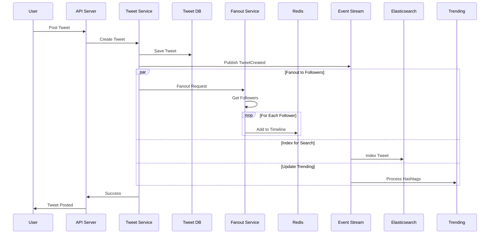
```mermaid
sequenceDiagram
    participant U as User
    participant API as API Server
    participant TS as Tweet Service
    participant DB as Tweet DB
    participant FO as Fanout Service
    participant Cache as Redis
    participant Kafka as Event Stream
    
    U->>API: Post Tweet
    API->>TS: Create Tweet
    TS->>DB: Save Tweet
    TS->>Kafka: Publish TweetCreated
    
    par Fanout to Followers
        TS->>FO: Fanout Request
        FO->>FO: Get Followers
        loop For Each Follower
            FO->>Cache: Add to Timeline
        end
    and Index for Search
        Kafka->>Elasticsearch: Index Tweet
    and Update Trending
        Kafka->>Trending: Process Hashtags
    end
    
    TS->>API: Success
    API->>U: Tweet Posted
```

### Timeline Generation

**Fanout Strategies**:

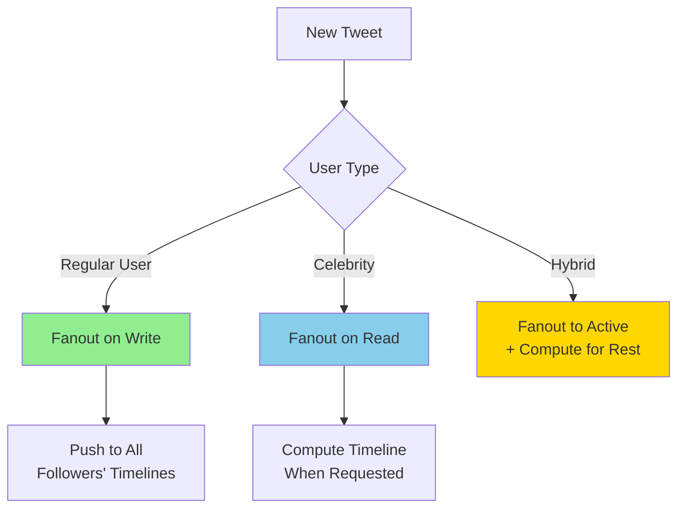
```mermaid
graph TB
    A[New Tweet] --> B{User Type}
    
    B -->|Regular User| C[Fanout on Write]
    C --> D[Push to All<br/>Followers' Timelines]
    
    B -->|Celebrity| E[Fanout on Read]
    E --> F[Compute Timeline<br/>When Requested]
    
    B -->|Hybrid| G[Fanout to Active<br/>+ Compute for Rest]
    
    style C fill:#90EE90
    style E fill:#87CEEB
    style G fill:#FFD700
```

### Database Schema

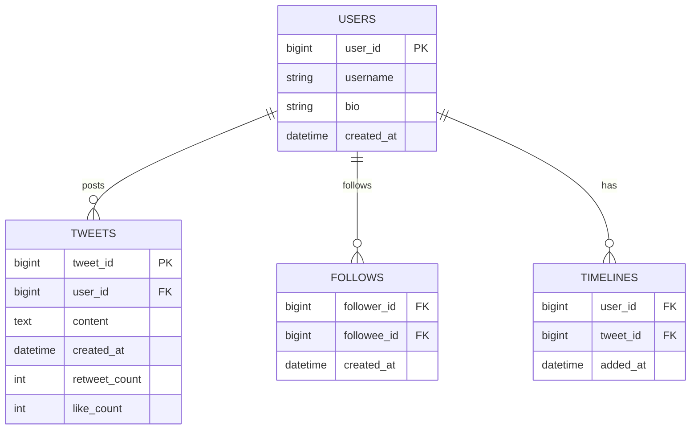
```mermaid
erDiagram
    USERS {
        bigint user_id PK
        string username
        string bio
        datetime created_at
    }
    
    TWEETS {
        bigint tweet_id PK
        bigint user_id FK
        text content
        datetime created_at
        int retweet_count
        int like_count
    }
    
    FOLLOWS {
        bigint follower_id FK
        bigint followee_id FK
        datetime created_at
    }
    
    TIMELINES {
        bigint user_id FK
        bigint tweet_id FK
        datetime added_at
    }
    
    USERS ||--o{ TWEETS : posts
    USERS ||--o{ FOLLOWS : follows
    USERS ||--o{ TIMELINES : has
```

---

## Q2: Design Instagram.

**Answer**:

### Requirements
- Upload photos/videos
- Follow users
- Feed with posts
- Like/comment
- Stories (24h expiry)
- 1B users, 500M DAU

### Architecture

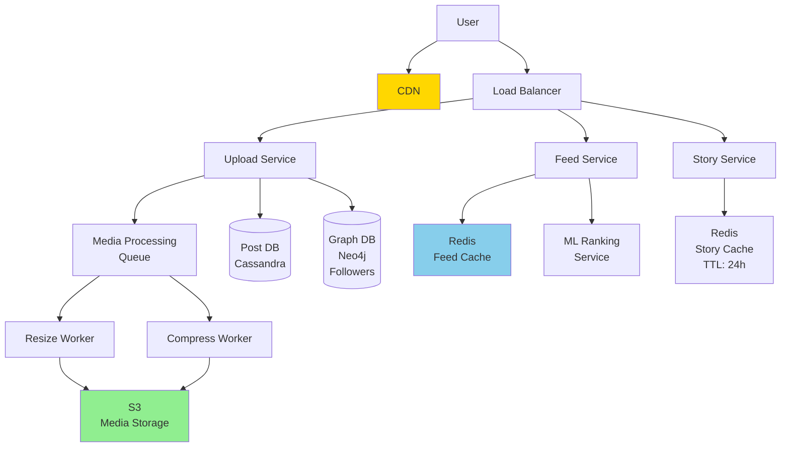
```mermaid
graph TB
    U[User] --> CDN[CDN]
    U --> LB[Load Balancer]
    
    LB --> UPLOAD[Upload Service]
    LB --> FEED[Feed Service]
    LB --> STORY[Story Service]
    
    UPLOAD --> MEDIA_PROC[Media Processing<br/>Queue]
    MEDIA_PROC --> RESIZE[Resize Worker]
    MEDIA_PROC --> COMPRESS[Compress Worker]
    
    RESIZE --> S3[S3<br/>Media Storage]
    COMPRESS --> S3
    
    UPLOAD --> POST_DB[(Post DB<br/>Cassandra)]
    FEED --> REDIS[Redis<br/>Feed Cache]
    STORY --> REDIS_STORY[Redis<br/>Story Cache<br/>TTL: 24h]
    
    UPLOAD --> GRAPH_DB[(Graph DB<br/>Neo4j<br/>Followers)]
    
    FEED --> RANKING[ML Ranking<br/>Service]
    
    style CDN fill:#FFD700
    style REDIS fill:#87CEEB
    style S3 fill:#90EE90
```

### Upload Flow

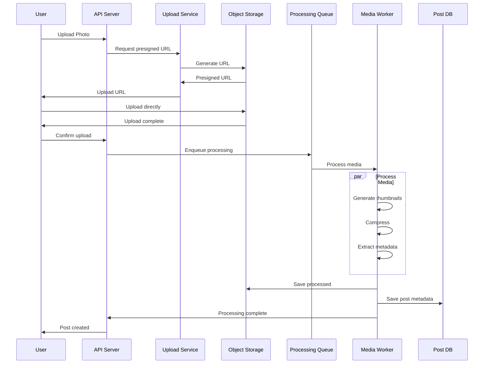
```mermaid
sequenceDiagram
    participant U as User
    participant API as API Server
    participant Upload as Upload Service
    participant S3 as Object Storage
    participant Queue as Processing Queue
    participant Worker as Media Worker
    participant DB as Post DB
    
    U->>API: Upload Photo
    API->>Upload: Request presigned URL
    Upload->>S3: Generate URL
    S3->>Upload: Presigned URL
    Upload->>U: Upload URL
    
    U->>S3: Upload directly
    S3->>U: Upload complete
    
    U->>API: Confirm upload
    API->>Queue: Enqueue processing
    Queue->>Worker: Process media
    
    par Process Media
        Worker->>Worker: Generate thumbnails
        Worker->>Worker: Compress
        Worker->>Worker: Extract metadata
    end
    
    Worker->>S3: Save processed
    Worker->>DB: Save post metadata
    Worker->>API: Processing complete
    API->>U: Post created
```

### Feed Ranking

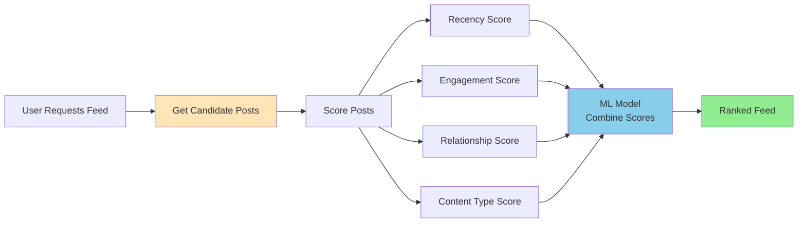
```mermaid
graph LR
    A[User Requests Feed] --> B[Get Candidate Posts]
    B --> C[Score Posts]
    
    C --> D1[Recency Score]
    C --> D2[Engagement Score]
    C --> D3[Relationship Score]
    C --> D4[Content Type Score]
    
    D1 --> E[ML Model<br/>Combine Scores]
    D2 --> E
    D3 --> E
    D4 --> E
    
    E --> F[Ranked Feed]
    
    style B fill:#FFE4B5
    style E fill:#87CEEB
    style F fill:#90EE90
```

---

## Q3: Design Uber/Lyft.

**Answer**:

### Requirements
- Match riders with drivers
- Real-time location tracking
- ETA calculation
- Pricing
- Payment processing
- 100M users, 10M drivers

### Architecture

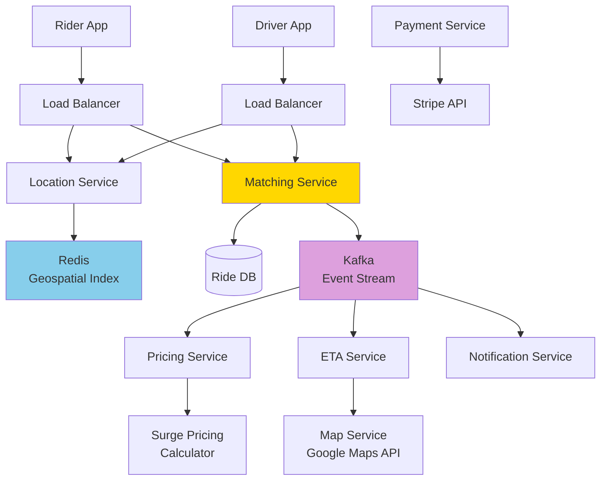
```mermaid
graph TB
    RIDER[Rider App] --> LB1[Load Balancer]
    DRIVER[Driver App] --> LB2[Load Balancer]
    
    LB1 --> MATCH[Matching Service]
    LB2 --> MATCH
    
    LB1 --> LOC[Location Service]
    LB2 --> LOC
    
    LOC --> REDIS_GEO[Redis<br/>Geospatial Index]
    
    MATCH --> RIDE_DB[(Ride DB)]
    MATCH --> KAFKA[Kafka<br/>Event Stream]
    
    KAFKA --> PRICING[Pricing Service]
    KAFKA --> ETA[ETA Service]
    KAFKA --> NOTIF[Notification Service]
    
    PRICING --> SURGE[Surge Pricing<br/>Calculator]
    ETA --> MAP[Map Service<br/>Google Maps API]
    
    PAYMENT[Payment Service] --> STRIPE[Stripe API]
    
    style MATCH fill:#FFD700
    style REDIS_GEO fill:#87CEEB
    style KAFKA fill:#DDA0DD
```

### Matching Algorithm

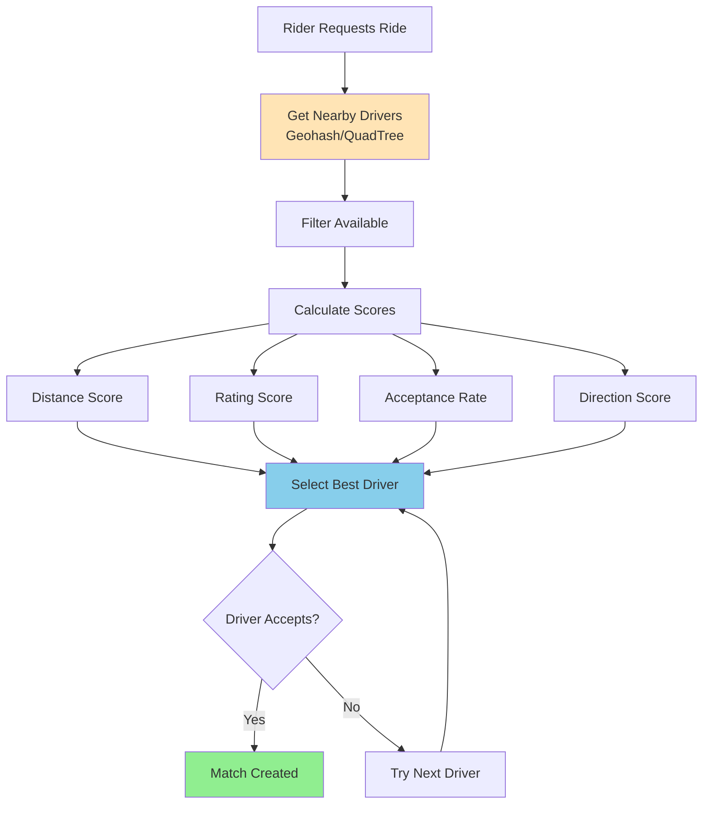
```mermaid
graph TB
    A[Rider Requests Ride] --> B[Get Nearby Drivers<br/>Geohash/QuadTree]
    B --> C[Filter Available]
    C --> D[Calculate Scores]
    
    D --> E1[Distance Score]
    D --> E2[Rating Score]
    D --> E3[Acceptance Rate]
    D --> E4[Direction Score]
    
    E1 --> F[Select Best Driver]
    E2 --> F
    E3 --> F
    E4 --> F
    
    F --> G{Driver Accepts?}
    G -->|Yes| H[Match Created]
    G -->|No| I[Try Next Driver]
    I --> F
    
    style B fill:#FFE4B5
    style F fill:#87CEEB
    style H fill:#90EE90
```

### Location Tracking

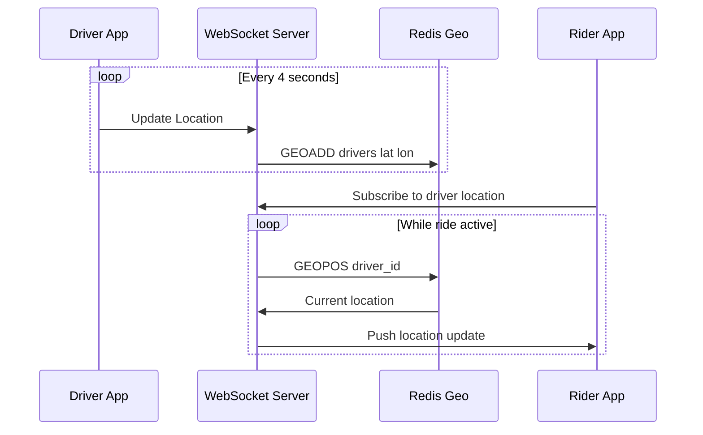
```mermaid
sequenceDiagram
    participant D as Driver App
    participant WS as WebSocket Server
    participant Redis as Redis Geo
    participant R as Rider App
    
    loop Every 4 seconds
        D->>WS: Update Location
        WS->>Redis: GEOADD drivers lat lon
    end
    
    R->>WS: Subscribe to driver location
    
    loop While ride active
        WS->>Redis: GEOPOS driver_id
        Redis->>WS: Current location
        WS->>R: Push location update
    end
```

### Geospatial Indexing

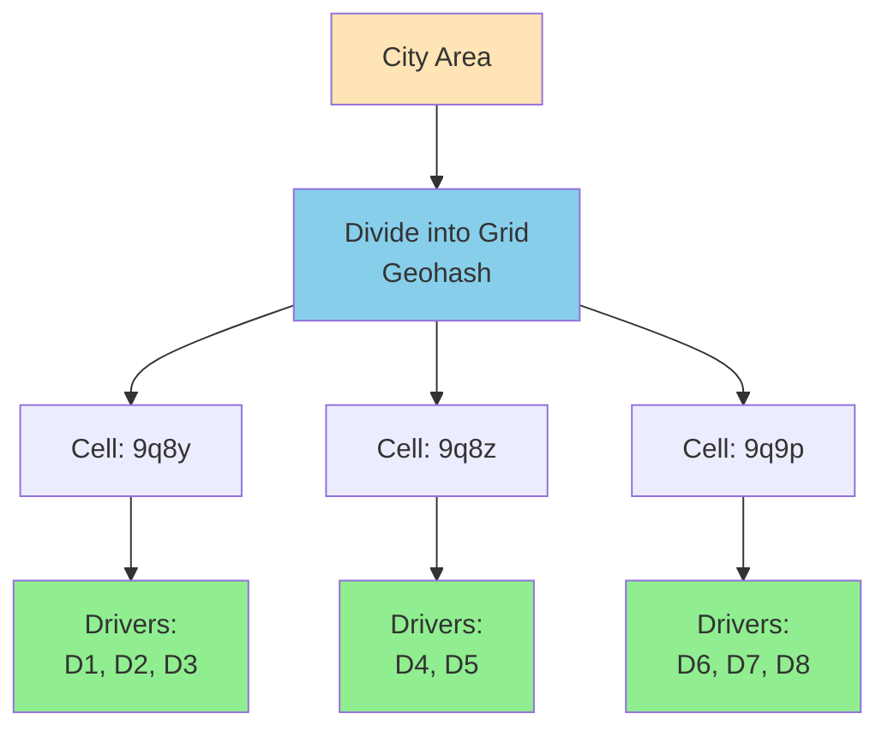
```mermaid
graph TB
    A[City Area] --> B[Divide into Grid<br/>Geohash]
    
    B --> C1[Cell: 9q8y]
    B --> C2[Cell: 9q8z]
    B --> C3[Cell: 9q9p]
    
    C1 --> D1[Drivers:<br/>D1, D2, D3]
    C2 --> D2[Drivers:<br/>D4, D5]
    C3 --> D3[Drivers:<br/>D6, D7, D8]
    
    style A fill:#FFE4B5
    style B fill:#87CEEB
    style D1 fill:#90EE90
    style D2 fill:#90EE90
    style D3 fill:#90EE90
```

---

## Q4: Design Netflix.

**Answer**:

### Requirements
- Stream videos
- Recommendations
- Search content
- Multiple devices
- 200M subscribers
- 4K streaming

### Architecture

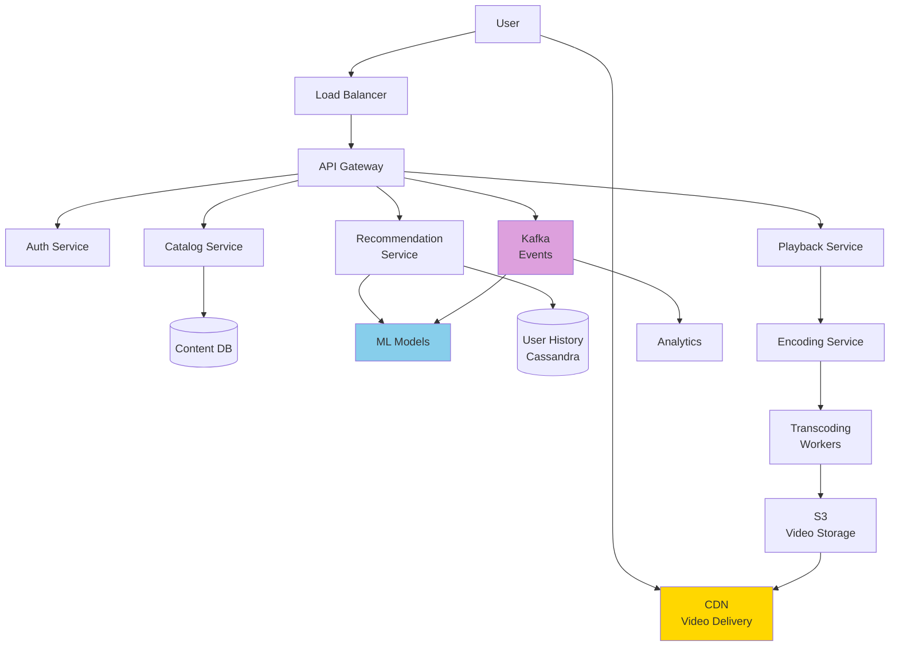
```mermaid
graph TB
    U[User] --> CDN[CDN<br/>Video Delivery]
    U --> LB[Load Balancer]
    
    LB --> API[API Gateway]
    
    API --> AUTH[Auth Service]
    API --> CATALOG[Catalog Service]
    API --> RECOMMEND[Recommendation<br/>Service]
    API --> PLAYBACK[Playback Service]
    
    CATALOG --> CONTENT_DB[(Content DB)]
    RECOMMEND --> ML[ML Models]
    RECOMMEND --> USER_HISTORY[(User History<br/>Cassandra)]
    
    PLAYBACK --> ENCODE[Encoding Service]
    ENCODE --> TRANSCODE[Transcoding<br/>Workers]
    TRANSCODE --> S3[S3<br/>Video Storage]
    
    S3 --> CDN
    
    API --> KAFKA[Kafka<br/>Events]
    KAFKA --> ANALYTICS[Analytics]
    KAFKA --> ML
    
    style CDN fill:#FFD700
    style ML fill:#87CEEB
    style KAFKA fill:#DDA0DD
```

### Video Encoding Pipeline

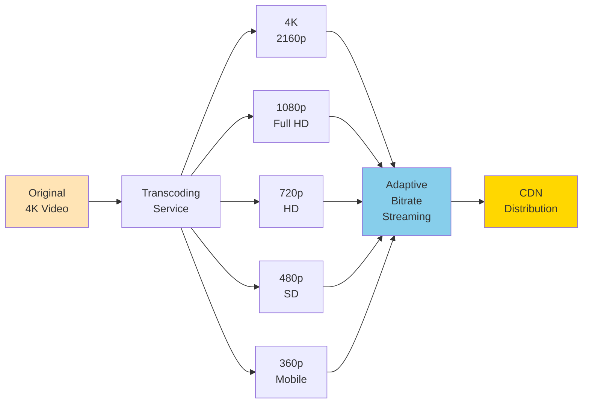
```mermaid
graph LR
    A[Original<br/>4K Video] --> B[Transcoding<br/>Service]
    
    B --> C1[4K<br/>2160p]
    B --> C2[1080p<br/>Full HD]
    B --> C3[720p<br/>HD]
    B --> C4[480p<br/>SD]
    B --> C5[360p<br/>Mobile]
    
    C1 --> D[Adaptive<br/>Bitrate<br/>Streaming]
    C2 --> D
    C3 --> D
    C4 --> D
    C5 --> D
    
    D --> E[CDN<br/>Distribution]
    
    style A fill:#FFE4B5
    style D fill:#87CEEB
    style E fill:#FFD700
```

### Recommendation System

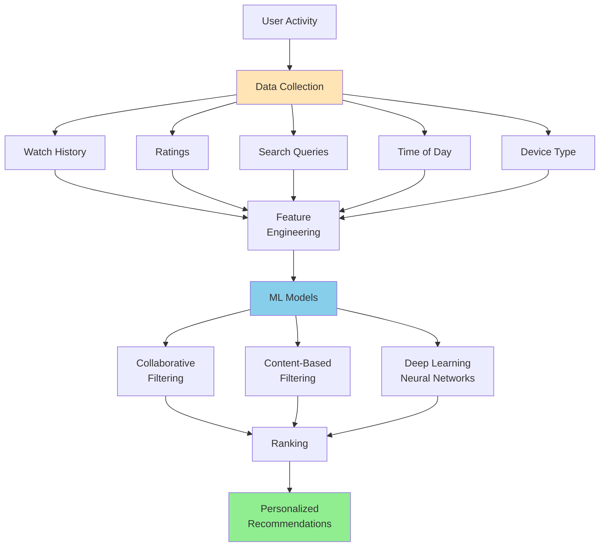
```mermaid
graph TB
    A[User Activity] --> B[Data Collection]
    
    B --> C1[Watch History]
    B --> C2[Ratings]
    B --> C3[Search Queries]
    B --> C4[Time of Day]
    B --> C5[Device Type]
    
    C1 --> D[Feature<br/>Engineering]
    C2 --> D
    C3 --> D
    C4 --> D
    C5 --> D
    
    D --> E[ML Models]
    
    E --> F1[Collaborative<br/>Filtering]
    E --> F2[Content-Based<br/>Filtering]
    E --> F3[Deep Learning<br/>Neural Networks]
    
    F1 --> G[Ranking]
    F2 --> G
    F3 --> G
    
    G --> H[Personalized<br/>Recommendations]
    
    style B fill:#FFE4B5
    style E fill:#87CEEB
    style H fill:#90EE90
```

### Adaptive Streaming

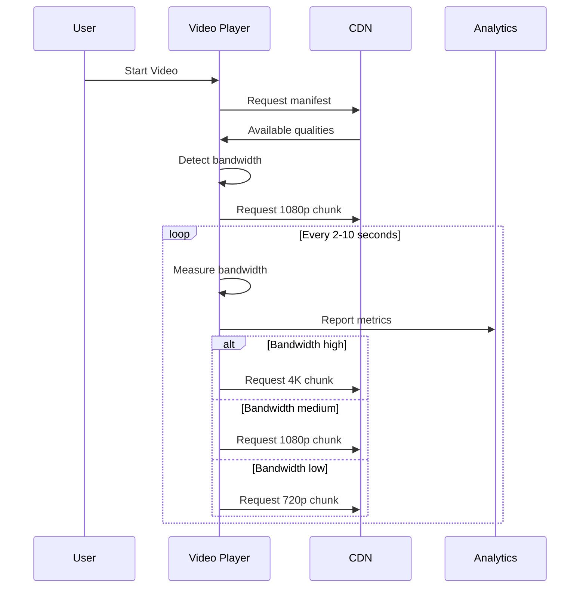
```mermaid
sequenceDiagram
    participant U as User
    participant Player as Video Player
    participant CDN as CDN
    participant Analytics as Analytics
    
    U->>Player: Start Video
    Player->>CDN: Request manifest
    CDN->>Player: Available qualities
    
    Player->>Player: Detect bandwidth
    Player->>CDN: Request 1080p chunk
    
    loop Every 2-10 seconds
        Player->>Player: Measure bandwidth
        Player->>Analytics: Report metrics
        
        alt Bandwidth high
            Player->>CDN: Request 4K chunk
        else Bandwidth medium
            Player->>CDN: Request 1080p chunk
        else Bandwidth low
            Player->>CDN: Request 720p chunk
        end
    end
```

---

## Q5: Design YouTube.

**Answer**:

### Requirements
- Upload videos
- Stream videos
- Comments/likes
- Subscriptions
- Search
- 2B users, 1B hours watched daily

### Architecture

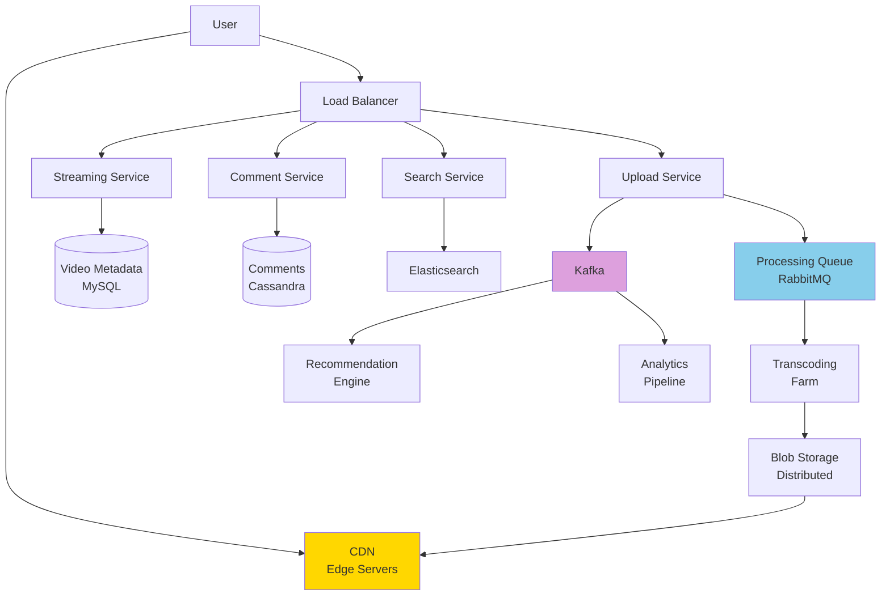
```mermaid
graph TB
    U[User] --> CDN[CDN<br/>Edge Servers]
    U --> LB[Load Balancer]
    
    LB --> UPLOAD[Upload Service]
    LB --> STREAM[Streaming Service]
    LB --> COMMENT[Comment Service]
    LB --> SEARCH[Search Service]
    
    UPLOAD --> QUEUE[Processing Queue<br/>RabbitMQ]
    QUEUE --> TRANSCODE[Transcoding<br/>Farm]
    TRANSCODE --> BLOB[Blob Storage<br/>Distributed]
    
    STREAM --> VIDEO_DB[(Video Metadata<br/>MySQL)]
    COMMENT --> COMMENT_DB[(Comments<br/>Cassandra)]
    SEARCH --> ES[Elasticsearch]
    
    BLOB --> CDN
    
    UPLOAD --> KAFKA[Kafka]
    KAFKA --> RECOMMEND[Recommendation<br/>Engine]
    KAFKA --> ANALYTICS[Analytics<br/>Pipeline]
    
    style CDN fill:#FFD700
    style QUEUE fill:#87CEEB
    style KAFKA fill:#DDA0DD
```

### Upload Pipeline

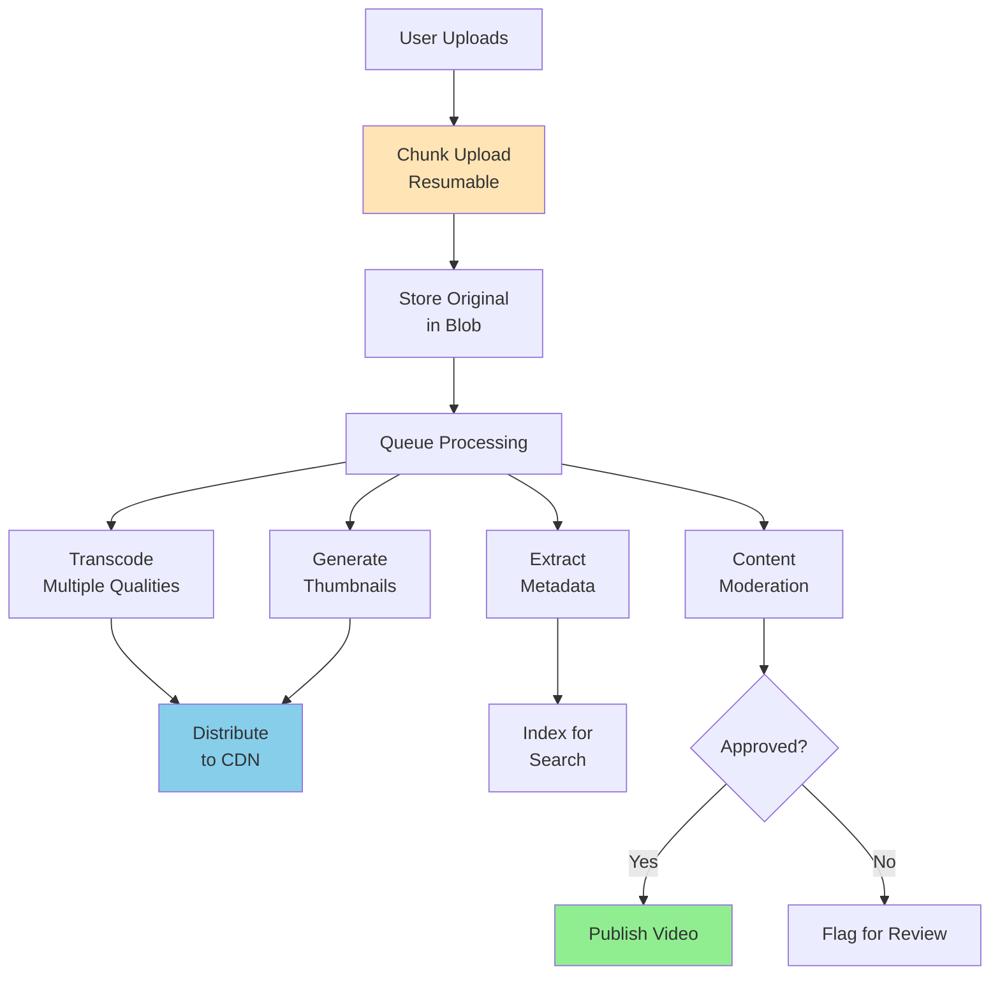
```mermaid
graph TB
    A[User Uploads] --> B[Chunk Upload<br/>Resumable]
    B --> C[Store Original<br/>in Blob]
    C --> D[Queue Processing]
    
    D --> E1[Transcode<br/>Multiple Qualities]
    D --> E2[Generate<br/>Thumbnails]
    D --> E3[Extract<br/>Metadata]
    D --> E4[Content<br/>Moderation]
    
    E1 --> F[Distribute<br/>to CDN]
    E2 --> F
    E3 --> G[Index for<br/>Search]
    E4 --> H{Approved?}
    
    H -->|Yes| I[Publish Video]
    H -->|No| J[Flag for Review]
    
    style B fill:#FFE4B5
    style F fill:#87CEEB
    style I fill:#90EE90
```

### View Count System

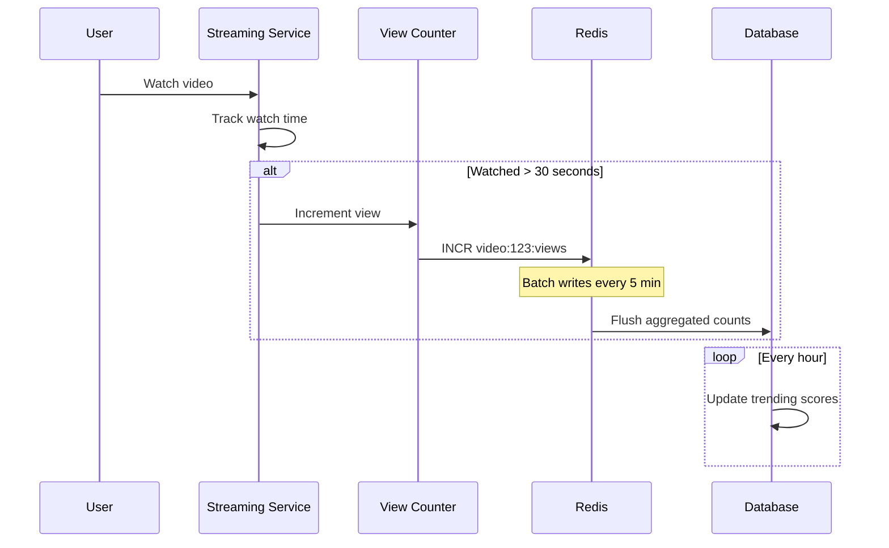
```mermaid
sequenceDiagram
    participant U as User
    participant Stream as Streaming Service
    participant Counter as View Counter
    participant Redis as Redis
    participant DB as Database
    
    U->>Stream: Watch video
    Stream->>Stream: Track watch time
    
    alt Watched > 30 seconds
        Stream->>Counter: Increment view
        Counter->>Redis: INCR video:123:views
        
        Note over Redis: Batch writes every 5 min
        
        Redis->>DB: Flush aggregated counts
    end
    
    loop Every hour
        DB->>DB: Update trending scores
    end
```

---

## Summary

Medium system design patterns:
- **Twitter**: Fanout strategies, timeline generation
- **Instagram**: Media processing, feed ranking
- **Uber**: Geospatial indexing, real-time matching
- **Netflix**: Adaptive streaming, ML recommendations
- **YouTube**: Video transcoding, distributed CDN

All designs emphasize scalability, real-time processing, and user experience.

