Hard-level backend interview questions covering distributed systems, advanced architecture, and complex system design.

## Q1: Design a distributed caching system (like Redis Cluster).

**Answer**:


### Consistent Hashing

```mermaid
graph TB
    A[Hash Ring] --> B[Node 1<br/>0-120°]
    A --> C[Node 2<br/>120-240°]
    A --> D[Node 3<br/>240-360°]
    
    E[Key: user:123] --> F[Hash: 150°]
    F --> C
    
    style A fill:#FFD700
```



### Implementation

```go
package main

import (
	"fmt"
	"hash/fnv"
	"sort"
	"sync"
)

type ConsistentHash struct {
	mu           sync.RWMutex
	ring         map[uint32]string
	sortedKeys   []uint32
	virtualNodes int
}

func NewConsistentHash(nodes []string, virtualNodes int) *ConsistentHash {
	ch := &ConsistentHash{
		ring:         make(map[uint32]string),
		virtualNodes: virtualNodes,
	}

	for _, node := range nodes {
		ch.AddNode(node)
	}

	return ch
}

func (ch *ConsistentHash) hash(key string) uint32 {
	h := fnv.New32a()
	h.Write([]byte(key))
	return h.Sum32()
}

func (ch *ConsistentHash) AddNode(node string) {
	ch.mu.Lock()
	defer ch.mu.Unlock()

	for i := 0; i < ch.virtualNodes; i++ {
		virtualKey := fmt.Sprintf("%s:%d", node, i)
		hash := ch.hash(virtualKey)
		ch.ring[hash] = node
	}

	ch.updateSortedKeys()
}

func (ch *ConsistentHash) RemoveNode(node string) {
	ch.mu.Lock()
	defer ch.mu.Unlock()

	for i := 0; i < ch.virtualNodes; i++ {
		virtualKey := fmt.Sprintf("%s:%d", node, i)
		hash := ch.hash(virtualKey)
		delete(ch.ring, hash)
	}

	ch.updateSortedKeys()
}

func (ch *ConsistentHash) updateSortedKeys() {
	ch.sortedKeys = make([]uint32, 0, len(ch.ring))
	for k := range ch.ring {
		ch.sortedKeys = append(ch.sortedKeys, k)
	}
	sort.Slice(ch.sortedKeys, func(i, j int) bool {
		return ch.sortedKeys[i] < ch.sortedKeys[j]
	})
}

func (ch *ConsistentHash) GetNode(key string) string {
	ch.mu.RLock()
	defer ch.mu.RUnlock()

	if len(ch.ring) == 0 {
		return ""
	}

	hash := ch.hash(key)

	// Binary search for first node >= hash
	idx := sort.Search(len(ch.sortedKeys), func(i int) bool {
		return ch.sortedKeys[i] >= hash
	})

	// Wrap around if needed
	if idx == len(ch.sortedKeys) {
		idx = 0
	}

	return ch.ring[ch.sortedKeys[idx]]
}

// Usage
func main() {
	cache := NewConsistentHash([]string{"node1", "node2", "node3"}, 150)
	
	fmt.Println(cache.GetNode("user:123")) // Returns node2
	fmt.Println(cache.GetNode("user:456")) // Returns node1

	// Add new node
	cache.AddNode("node4")
	
	// Remove node
	cache.RemoveNode("node1")
}
```

### Replication Strategy

```javascript
class DistributedCache {
  constructor(nodes, replicationFactor = 2) {
    this.hash = new ConsistentHash(nodes);
    this.replicationFactor = replicationFactor;
    this.connections = new Map();
    
    nodes.forEach(node => {
      this.connections.set(node, createConnection(node));
    });
  }
  
  async set(key, value, ttl) {
    const nodes = this.getReplicaNodes(key);
    
    await Promise.all(
      nodes.map(node => 
        this.connections.get(node).set(key, value, ttl)
      )
    );
  }
  
  async get(key) {
    const nodes = this.getReplicaNodes(key);
    
    // Try primary first
    try {
      return await this.connections.get(nodes[0]).get(key);
    } catch (error) {
      // Fallback to replicas
      for (let i = 1; i < nodes.length; i++) {
        try {
          return await this.connections.get(nodes[i]).get(key);
        } catch (e) {
          continue;
        }
      }
      throw new Error('All replicas failed');
    }
  }
  
  getReplicaNodes(key) {
    const primary = this.hash.getNode(key);
    const replicas = [primary];
    
    // Get next N-1 nodes for replication
    let currentKey = key;
    for (let i = 1; i < this.replicationFactor; i++) {
      currentKey = `${currentKey}:replica${i}`;
      const replica = this.hash.getNode(currentKey);
      if (replica !== primary && !replicas.includes(replica)) {
        replicas.push(replica);
      }
    }
    
    return replicas;
  }
}
```

---

## Q2: Implement event sourcing with CQRS pattern.

**Answer**:


### Architecture


### Implementation

```javascript
// Event Store
class EventStore {
  constructor() {
    this.events = new Map(); // streamId -> events[]
    this.subscribers = [];
  }
  
  async append(streamId, events) {
    if (!this.events.has(streamId)) {
      this.events.set(streamId, []);
    }
    
    const stream = this.events.get(streamId);
    
    events.forEach(event => {
      event.version = stream.length + 1;
      event.timestamp = Date.now();
      stream.push(event);
      
      // Notify subscribers
      this.subscribers.forEach(sub => sub(event));
    });
  }
  
  async getEvents(streamId, fromVersion = 0) {
    const stream = this.events.get(streamId) || [];
    return stream.filter(e => e.version > fromVersion);
  }
  
  subscribe(handler) {
    this.subscribers.push(handler);
  }
}

// Aggregate
class BankAccount {
  constructor(id) {
    this.id = id;
    this.balance = 0;
    this.version = 0;
    this.changes = [];
  }
  
  // Commands
  deposit(amount) {
    if (amount <= 0) {
      throw new Error('Amount must be positive');
    }
    
    this.applyChange({
      type: 'MoneyDeposited',
      amount
    });
  }
  
  withdraw(amount) {
    if (amount <= 0) {
      throw new Error('Amount must be positive');
    }
    
    if (this.balance < amount) {
      throw new Error('Insufficient funds');
    }
    
    this.applyChange({
      type: 'MoneyWithdrawn',
      amount
    });
  }
  
  // Apply event
  applyChange(event) {
    this.apply(event);
    this.changes.push(event);
  }
  
  apply(event) {
    switch (event.type) {
      case 'AccountCreated':
        this.balance = 0;
        break;
      case 'MoneyDeposited':
        this.balance += event.amount;
        break;
      case 'MoneyWithdrawn':
        this.balance -= event.amount;
        break;
    }
    this.version++;
  }
  
  // Load from history
  loadFromHistory(events) {
    events.forEach(event => this.apply(event));
  }
  
  getUncommittedChanges() {
    return this.changes;
  }
  
  markChangesAsCommitted() {
    this.changes = [];
  }
}

// Repository
class BankAccountRepository {
  constructor(eventStore) {
    this.eventStore = eventStore;
  }
  
  async getById(id) {
    const events = await this.eventStore.getEvents(id);
    const account = new BankAccount(id);
    account.loadFromHistory(events);
    return account;
  }
  
  async save(account) {
    const changes = account.getUncommittedChanges();
    await this.eventStore.append(account.id, changes);
    account.markChangesAsCommitted();
  }
}

// Read Model (Projection)
class AccountBalanceProjection {
  constructor(eventStore) {
    this.balances = new Map();
    
    eventStore.subscribe(event => {
      this.handle(event);
    });
  }
  
  handle(event) {
    const accountId = event.streamId;
    
    if (!this.balances.has(accountId)) {
      this.balances.set(accountId, 0);
    }
    
    switch (event.type) {
      case 'MoneyDeposited':
        this.balances.set(
          accountId,
          this.balances.get(accountId) + event.amount
        );
        break;
      case 'MoneyWithdrawn':
        this.balances.set(
          accountId,
          this.balances.get(accountId) - event.amount
        );
        break;
    }
  }
  
  getBalance(accountId) {
    return this.balances.get(accountId) || 0;
  }
}

// Usage
const eventStore = new EventStore();
const repository = new BankAccountRepository(eventStore);
const projection = new AccountBalanceProjection(eventStore);

// Command: Deposit money
const account = await repository.getById('account-123');
account.deposit(100);
await repository.save(account);

// Query: Get balance
const balance = projection.getBalance('account-123');
```

---

## Q3: Design a distributed lock service.

**Answer**:


### Redlock Algorithm

```go
package main

import (
	"context"
	"crypto/rand"
	"encoding/hex"
	"fmt"
	"sync"
	"time"

	"github.com/redis/go-redis/v9"
)

type RedisLock struct {
	clients  []*redis.Client
	resource string
	token    string
	ttl      time.Duration
	quorum   int
}

func NewRedisLock(clients []*redis.Client, resource string, ttl time.Duration) *RedisLock {
	return &RedisLock{
		clients:  clients,
		resource: resource,
		token:    generateToken(),
		ttl:      ttl,
		quorum:   len(clients)/2 + 1,
	}
}

func generateToken() string {
	b := make([]byte, 16)
	rand.Read(b)
	return hex.EncodeToString(b)
}

func (rl *RedisLock) Acquire(ctx context.Context) (bool, time.Duration) {
	startTime := time.Now()
	locksAcquired := 0

	// Try to acquire lock on all instances
	var wg sync.WaitGroup
	results := make(chan bool, len(rl.clients))

	for _, client := range rl.clients {
		wg.Add(1)
		go func(c *redis.Client) {
			defer wg.Done()
			
			result, err := c.SetNX(ctx, rl.resource, rl.token, rl.ttl).Result()
			results <- (err == nil && result)
		}(client)
	}

	wg.Wait()
	close(results)

	for acquired := range results {
		if acquired {
			locksAcquired++
		}
	}

	elapsedTime := time.Since(startTime)
	validityTime := rl.ttl - elapsedTime - 100*time.Millisecond // Drift compensation

	// Check if we got quorum and lock is still valid
	if locksAcquired >= rl.quorum && validityTime > 0 {
		return true, validityTime
	}

	// Failed to acquire, release any locks we got
	rl.Release(ctx)
	return false, 0
}

func (rl *RedisLock) Release(ctx context.Context) {
	// Lua script for atomic check-and-delete
	script := `
		if redis.call("get", KEYS[1]) == ARGV[1] then
			return redis.call("del", KEYS[1])
		else
			return 0
		end
	`

	var wg sync.WaitGroup
	for _, client := range rl.clients {
		wg.Add(1)
		go func(c *redis.Client) {
			defer wg.Done()
			c.Eval(ctx, script, []string{rl.resource}, rl.token)
		}(client)
	}
	wg.Wait()
}

func (rl *RedisLock) Extend(ctx context.Context, additionalTime time.Duration) bool {
	script := `
		if redis.call("get", KEYS[1]) == ARGV[1] then
			return redis.call("pexpire", KEYS[1], ARGV[2])
		else
			return 0
		end
	`

	extended := 0
	var wg sync.WaitGroup
	results := make(chan bool, len(rl.clients))

	for _, client := range rl.clients {
		wg.Add(1)
		go func(c *redis.Client) {
			defer wg.Done()
			
			result, err := c.Eval(ctx, script, []string{rl.resource}, rl.token, additionalTime.Milliseconds()).Int()
			results <- (err == nil && result == 1)
		}(client)
	}

	wg.Wait()
	close(results)

	for success := range results {
		if success {
			extended++
		}
	}

	return extended >= rl.quorum
}

// Usage with retry
func WithLock(ctx context.Context, clients []*redis.Client, resource string, fn func() error, options ...LockOption) error {
	opts := &lockOptions{
		ttl:        10 * time.Second,
		retries:    3,
		retryDelay: 100 * time.Millisecond,
	}

	for _, opt := range options {
		opt(opts)
	}

	for i := 0; i < opts.retries; i++ {
		lock := NewRedisLock(clients, resource, opts.ttl)
		acquired, _ := lock.Acquire(ctx)

		if acquired {
			defer lock.Release(ctx)
			return fn()
		}

		// Wait before retry with exponential backoff
		time.Sleep(opts.retryDelay * time.Duration(i+1))
	}

	return fmt.Errorf("failed to acquire lock after %d retries", opts.retries)
}

type lockOptions struct {
	ttl        time.Duration
	retries    int
	retryDelay time.Duration
}

type LockOption func(*lockOptions)

// Example usage
func main() {
	clients := []*redis.Client{
		redis.NewClient(&redis.Options{Addr: "redis1:6379"}),
		redis.NewClient(&redis.Options{Addr: "redis2:6379"}),
		redis.NewClient(&redis.Options{Addr: "redis3:6379"}),
	}

	ctx := context.Background()

	err := WithLock(ctx, clients, "resource:123", func() error {
		// Critical section
		fmt.Println("Processing critical section")
		time.Sleep(2 * time.Second)
		return nil
	})

	if err != nil {
		fmt.Println("Error:", err)
	}
}
```

---

## Q4: Implement saga pattern for distributed transactions.

**Answer**:


### Orchestration-Based Saga

```javascript
class OrderSaga {
  constructor(services) {
    this.orderService = services.order;
    this.paymentService = services.payment;
    this.inventoryService = services.inventory;
    this.shippingService = services.shipping;
  }
  
  async execute(orderData) {
    const saga = {
      orderId: null,
      paymentId: null,
      reservationId: null,
      shippingId: null,
      compensations: []
    };
    
    try {
      // Step 1: Create order
      saga.orderId = await this.orderService.create(orderData);
      saga.compensations.push(() => this.orderService.cancel(saga.orderId));
      
      // Step 2: Process payment
      saga.paymentId = await this.paymentService.charge({
        orderId: saga.orderId,
        amount: orderData.total
      });
      saga.compensations.push(() => this.paymentService.refund(saga.paymentId));
      
      // Step 3: Reserve inventory
      saga.reservationId = await this.inventoryService.reserve({
        orderId: saga.orderId,
        items: orderData.items
      });
      saga.compensations.push(() => 
        this.inventoryService.release(saga.reservationId)
      );
      
      // Step 4: Schedule shipping
      saga.shippingId = await this.shippingService.schedule({
        orderId: saga.orderId,
        address: orderData.shippingAddress
      });
      saga.compensations.push(() => 
        this.shippingService.cancel(saga.shippingId)
      );
      
      // All steps succeeded
      await this.orderService.confirm(saga.orderId);
      return { success: true, orderId: saga.orderId };
      
    } catch (error) {
      // Compensate in reverse order
      console.error('Saga failed, compensating...', error);
      
      for (let i = saga.compensations.length - 1; i >= 0; i--) {
        try {
          await saga.compensations[i]();
        } catch (compError) {
          console.error('Compensation failed:', compError);
        }
      }
      
      return { success: false, error: error.message };
    }
  }
}

// Choreography-Based Saga (Event-Driven)
class EventDrivenSaga {
  constructor(eventBus) {
    this.eventBus = eventBus;
    this.setupHandlers();
  }
  
  setupHandlers() {
    // Order created -> Charge payment
    this.eventBus.on('OrderCreated', async (event) => {
      try {
        const payment = await paymentService.charge({
          orderId: event.orderId,
          amount: event.total
        });
        
        await this.eventBus.emit('PaymentSucceeded', {
          orderId: event.orderId,
          paymentId: payment.id
        });
      } catch (error) {
        await this.eventBus.emit('PaymentFailed', {
          orderId: event.orderId,
          error: error.message
        });
      }
    });
    
    // Payment succeeded -> Reserve inventory
    this.eventBus.on('PaymentSucceeded', async (event) => {
      try {
        const reservation = await inventoryService.reserve({
          orderId: event.orderId
        });
        
        await this.eventBus.emit('InventoryReserved', {
          orderId: event.orderId,
          reservationId: reservation.id
        });
      } catch (error) {
        await this.eventBus.emit('InventoryReservationFailed', {
          orderId: event.orderId,
          paymentId: event.paymentId
        });
      }
    });
    
    // Inventory reservation failed -> Refund payment
    this.eventBus.on('InventoryReservationFailed', async (event) => {
      await paymentService.refund(event.paymentId);
      await orderService.cancel(event.orderId);
    });
    
    // Continue with other steps...
  }
}
```

---

## Q5: Design a real-time notification system at scale.

**Answer**:


### Architecture


### Implementation

```javascript
// WebSocket Server
class NotificationServer {
  constructor(redis, messageQueue) {
    this.connections = new Map(); // userId -> WebSocket[]
    this.redis = redis;
    this.messageQueue = messageQueue;
    this.serverId = `server-${process.pid}`;
    
    this.setupPubSub();
  }
  
  setupPubSub() {
    // Subscribe to Redis pub/sub
    this.redis.subscribe('notifications');
    
    this.redis.on('message', (channel, message) => {
      const notification = JSON.parse(message);
      this.deliverToLocalConnections(notification);
    });
  }
  
  async handleConnection(ws, userId) {
    // Store connection
    if (!this.connections.has(userId)) {
      this.connections.set(userId, []);
    }
    this.connections.get(userId).push(ws);
    
    // Update presence
    await this.redis.sadd(`online:${userId}`, this.serverId);
    await this.redis.expire(`online:${userId}`, 30);
    
    // Send pending notifications
    await this.sendPendingNotifications(userId, ws);
    
    // Setup heartbeat
    const heartbeat = setInterval(() => {
      if (ws.readyState === ws.OPEN) {
        ws.ping();
        this.redis.expire(`online:${userId}`, 30);
      } else {
        clearInterval(heartbeat);
      }
    }, 10000);
    
    ws.on('close', () => {
      this.handleDisconnection(userId, ws);
      clearInterval(heartbeat);
    });
  }
  
  async handleDisconnection(userId, ws) {
    const connections = this.connections.get(userId);
    if (connections) {
      const index = connections.indexOf(ws);
      if (index > -1) {
        connections.splice(index, 1);
      }
      
      if (connections.length === 0) {
        this.connections.delete(userId);
        await this.redis.srem(`online:${userId}`, this.serverId);
      }
    }
  }
  
  async sendNotification(userId, notification) {
    // Check if user is online
    const onlineServers = await this.redis.smembers(`online:${userId}`);
    
    if (onlineServers.length > 0) {
      // User is online, publish to Redis
      await this.redis.publish('notifications', JSON.stringify({
        userId,
        notification
      }));
    } else {
      // User is offline, store for later
      await this.storeNotification(userId, notification);
    }
  }
  
  deliverToLocalConnections(data) {
    const { userId, notification } = data;
    const connections = this.connections.get(userId);
    
    if (connections) {
      connections.forEach(ws => {
        if (ws.readyState === ws.OPEN) {
          ws.send(JSON.stringify(notification));
        }
      });
    }
  }
  
  async sendPendingNotifications(userId, ws) {
    const notifications = await this.getPendingNotifications(userId);
    
    notifications.forEach(notification => {
      ws.send(JSON.stringify(notification));
    });
    
    // Mark as delivered
    await this.markAsDelivered(userId, notifications);
  }
  
  async storeNotification(userId, notification) {
    await this.messageQueue.add('store-notification', {
      userId,
      notification,
      timestamp: Date.now()
    });
  }
  
  async getPendingNotifications(userId) {
    // Get from database
    return await db.notifications.find({
      userId,
      delivered: false
    }).sort({ timestamp: 1 }).limit(100);
  }
  
  async markAsDelivered(userId, notifications) {
    const ids = notifications.map(n => n.id);
    await db.notifications.updateMany(
      { id: { $in: ids } },
      { $set: { delivered: true } }
    );
  }
}

// Client
class NotificationClient {
  constructor(url, userId, token) {
    this.url = url;
    this.userId = userId;
    this.token = token;
    this.ws = null;
    this.reconnectAttempts = 0;
    this.maxReconnectAttempts = 5;
  }
  
  connect() {
    this.ws = new WebSocket(`${this.url}?token=${this.token}`);
    
    this.ws.on('open', () => {
      console.log('Connected');
      this.reconnectAttempts = 0;
    });
    
    this.ws.on('message', (data) => {
      const notification = JSON.parse(data);
      this.handleNotification(notification);
    });
    
    this.ws.on('close', () => {
      console.log('Disconnected');
      this.reconnect();
    });
    
    this.ws.on('error', (error) => {
      console.error('WebSocket error:', error);
    });
  }
  
  reconnect() {
    if (this.reconnectAttempts < this.maxReconnectAttempts) {
      this.reconnectAttempts++;
      const delay = Math.min(1000 * Math.pow(2, this.reconnectAttempts), 30000);
      
      setTimeout(() => {
        console.log(`Reconnecting (attempt ${this.reconnectAttempts})...`);
        this.connect();
      }, delay);
    }
  }
  
  handleNotification(notification) {
    console.log('Received notification:', notification);
    // Display to user
  }
}
```

---

## Q6: Implement database connection pooling with circuit breaker.

**Answer**:


### Implementation

```javascript
class CircuitBreaker {
  constructor(options = {}) {
    this.failureThreshold = options.failureThreshold || 5;
    this.successThreshold = options.successThreshold || 2;
    this.timeout = options.timeout || 60000;
    this.state = 'CLOSED';
    this.failures = 0;
    this.successes = 0;
    this.nextAttempt = Date.now();
  }
  
  async execute(fn) {
    if (this.state === 'OPEN') {
      if (Date.now() < this.nextAttempt) {
        throw new Error('Circuit breaker is OPEN');
      }
      this.state = 'HALF_OPEN';
    }
    
    try {
      const result = await fn();
      this.onSuccess();
      return result;
    } catch (error) {
      this.onFailure();
      throw error;
    }
  }
  
  onSuccess() {
    this.failures = 0;
    
    if (this.state === 'HALF_OPEN') {
      this.successes++;
      
      if (this.successes >= this.successThreshold) {
        this.state = 'CLOSED';
        this.successes = 0;
      }
    }
  }
  
  onFailure() {
    this.failures++;
    this.successes = 0;
    
    if (this.failures >= this.failureThreshold) {
      this.state = 'OPEN';
      this.nextAttempt = Date.now() + this.timeout;
    }
  }
  
  getState() {
    return {
      state: this.state,
      failures: this.failures,
      successes: this.successes
    };
  }
}

class ResilientConnectionPool {
  constructor(config) {
    this.pool = new Pool(config);
    this.circuitBreaker = new CircuitBreaker({
      failureThreshold: 5,
      successThreshold: 2,
      timeout: 60000
    });
    
    this.setupMonitoring();
  }
  
  async query(sql, params) {
    return await this.circuitBreaker.execute(async () => {
      const client = await this.pool.connect();
      
      try {
        const result = await Promise.race([
          client.query(sql, params),
          this.timeout(5000)
        ]);
        return result;
      } finally {
        client.release();
      }
    });
  }
  
  timeout(ms) {
    return new Promise((_, reject) =>
      setTimeout(() => reject(new Error('Query timeout')), ms)
    );
  }
  
  setupMonitoring() {
    setInterval(() => {
      const poolStats = {
        total: this.pool.totalCount,
        idle: this.pool.idleCount,
        waiting: this.pool.waitingCount
      };
      
      const cbStats = this.circuitBreaker.getState();
      
      console.log('Pool stats:', poolStats);
      console.log('Circuit breaker:', cbStats);
      
      // Alert if pool is exhausted
      if (poolStats.idle === 0 && poolStats.waiting > 5) {
        console.error('ALERT: Connection pool exhausted!');
      }
      
      // Alert if circuit is open
      if (cbStats.state === 'OPEN') {
        console.error('ALERT: Circuit breaker is OPEN!');
      }
    }, 10000);
  }
  
  async healthCheck() {
    try {
      await this.query('SELECT 1');
      return { healthy: true };
    } catch (error) {
      return { healthy: false, error: error.message };
    }
  }
  
  async close() {
    await this.pool.end();
  }
}

// Usage with retry
async function queryWithRetry(pool, sql, params, retries = 3) {
  for (let i = 0; i < retries; i++) {
    try {
      return await pool.query(sql, params);
    } catch (error) {
      if (i === retries - 1) throw error;
      
      const delay = Math.min(1000 * Math.pow(2, i), 10000);
      await new Promise(resolve => setTimeout(resolve, delay));
    }
  }
}
```

---

## Q7: Design a multi-tenant SaaS database architecture.

**Answer**:


### Shared Database, Shared Schema

```sql
-- All tenants in same tables
CREATE TABLE users (
    id UUID PRIMARY KEY,
    tenant_id UUID NOT NULL,
    email VARCHAR(255) NOT NULL,
    name VARCHAR(255),
    UNIQUE(tenant_id, email)
);

CREATE INDEX idx_users_tenant ON users(tenant_id);

-- Row-level security
CREATE POLICY tenant_isolation ON users
    USING (tenant_id = current_setting('app.current_tenant')::UUID);

ALTER TABLE users ENABLE ROW LEVEL SECURITY;
```

```javascript
// Middleware to set tenant context
async function tenantMiddleware(req, res, next) {
  const tenantId = req.headers['x-tenant-id'] || req.user?.tenantId;
  
  if (!tenantId) {
    return res.status(400).json({ error: 'Tenant ID required' });
  }
  
  req.tenantId = tenantId;
  
  // Set for database session
  await db.query('SET app.current_tenant = $1', [tenantId]);
  
  next();
}

// Query automatically filtered by tenant
app.get('/api/users', tenantMiddleware, async (req, res) => {
  const users = await db.query('SELECT * FROM users');
  res.json({ users });
});
```

### Separate Schema Per Tenant

```javascript
class MultiTenantDatabase {
  constructor(pool) {
    this.pool = pool;
    this.schemaCache = new Map();
  }
  
  async ensureSchema(tenantId) {
    if (this.schemaCache.has(tenantId)) {
      return;
    }
    
    const schemaName = `tenant_${tenantId}`;
    
    await this.pool.query(`
      CREATE SCHEMA IF NOT EXISTS ${schemaName}
    `);
    
    await this.pool.query(`
      CREATE TABLE IF NOT EXISTS ${schemaName}.users (
        id UUID PRIMARY KEY,
        email VARCHAR(255) UNIQUE,
        name VARCHAR(255)
      )
    `);
    
    this.schemaCache.set(tenantId, schemaName);
  }
  
  async query(tenantId, sql, params) {
    await this.ensureSchema(tenantId);
    const schemaName = this.schemaCache.get(tenantId);
    
    // Set search path
    await this.pool.query(`SET search_path TO ${schemaName}`);
    
    return await this.pool.query(sql, params);
  }
}
```

### Separate Database Per Tenant

```javascript
class DatabaseRouter {
  constructor() {
    this.connections = new Map();
  }
  
  async getConnection(tenantId) {
    if (this.connections.has(tenantId)) {
      return this.connections.get(tenantId);
    }
    
    // Get tenant database config
    const config = await this.getTenantConfig(tenantId);
    
    const pool = new Pool({
      host: config.host,
      port: config.port,
      database: config.database,
      user: config.user,
      password: config.password
    });
    
    this.connections.set(tenantId, pool);
    return pool;
  }
  
  async query(tenantId, sql, params) {
    const pool = await this.getConnection(tenantId);
    return await pool.query(sql, params);
  }
  
  async getTenantConfig(tenantId) {
    // Get from central registry
    return await centralDb.query(
      'SELECT * FROM tenant_databases WHERE tenant_id = $1',
      [tenantId]
    );
  }
}
```

---

## Q8: Implement API gateway with rate limiting and authentication.

**Answer**:


### Implementation

```javascript
class APIGateway {
  constructor(config) {
    this.services = config.services;
    this.rateLimiter = new RateLimiter(config.redis);
    this.auth = new AuthService(config.jwtSecret);
    this.cache = new Cache(config.redis);
  }
  
  async handle(req, res) {
    try {
      // 1. Authentication
      const user = await this.authenticate(req);
      req.user = user;
      
      // 2. Rate limiting
      await this.checkRateLimit(req);
      
      // 3. Route to service
      const service = this.findService(req.path);
      if (!service) {
        return res.status(404).json({ error: 'Service not found' });
      }
      
      // 4. Check cache
      const cacheKey = this.getCacheKey(req);
      const cached = await this.cache.get(cacheKey);
      if (cached) {
        return res.json(cached);
      }
      
      // 5. Forward request
      const response = await this.forwardRequest(service, req);
      
      // 6. Cache response
      if (req.method === 'GET') {
        await this.cache.set(cacheKey, response.data, 60);
      }
      
      res.status(response.status).json(response.data);
      
    } catch (error) {
      this.handleError(error, res);
    }
  }
  
  async authenticate(req) {
    const token = req.headers.authorization?.split(' ')[1];
    
    if (!token) {
      throw new UnauthorizedError('No token provided');
    }
    
    return await this.auth.verify(token);
  }
  
  async checkRateLimit(req) {
    const key = req.user?.id || req.ip;
    const limit = req.user ? 1000 : 100; // Higher limit for authenticated
    
    const allowed = await this.rateLimiter.check(key, limit, 60);
    
    if (!allowed) {
      throw new RateLimitError('Too many requests');
    }
  }
  
  findService(path) {
    for (const [pattern, service] of Object.entries(this.services)) {
      if (path.startsWith(pattern)) {
        return service;
      }
    }
    return null;
  }
  
  async forwardRequest(service, req) {
    const url = `${service.url}${req.path}`;
    
    // Load balancing: Round-robin
    const instance = this.selectInstance(service);
    
    const response = await fetch(instance + req.path, {
      method: req.method,
      headers: {
        ...req.headers,
        'X-User-Id': req.user?.id,
        'X-Forwarded-For': req.ip
      },
      body: req.method !== 'GET' ? JSON.stringify(req.body) : undefined
    });
    
    return {
      status: response.status,
      data: await response.json()
    };
  }
  
  selectInstance(service) {
    // Simple round-robin
    if (!service.currentIndex) {
      service.currentIndex = 0;
    }
    
    const instance = service.instances[service.currentIndex];
    service.currentIndex = (service.currentIndex + 1) % service.instances.length;
    
    return instance;
  }
  
  getCacheKey(req) {
    return `${req.method}:${req.path}:${JSON.stringify(req.query)}`;
  }
  
  handleError(error, res) {
    if (error instanceof UnauthorizedError) {
      return res.status(401).json({ error: error.message });
    }
    
    if (error instanceof RateLimitError) {
      return res.status(429).json({ error: error.message });
    }
    
    console.error('Gateway error:', error);
    res.status(500).json({ error: 'Internal server error' });
  }
}

// Configuration
const gateway = new APIGateway({
  jwtSecret: process.env.JWT_SECRET,
  redis: redisClient,
  services: {
    '/api/users': {
      url: 'http://user-service',
      instances: [
        'http://user-service-1:3000',
        'http://user-service-2:3000',
        'http://user-service-3:3000'
      ]
    },
    '/api/orders': {
      url: 'http://order-service',
      instances: [
        'http://order-service-1:3000',
        'http://order-service-2:3000'
      ]
    }
  }
});
```

---

## Q9: Design a job scheduling system with priority queues.

**Answer**:


### Implementation

```javascript
class JobScheduler {
  constructor(redis) {
    this.redis = redis;
    this.workers = [];
    this.running = false;
  }
  
  async addJob(job, priority = 'medium') {
    const priorities = { high: 3, medium: 2, low: 1 };
    const score = priorities[priority] || 2;
    
    const jobData = {
      id: generateId(),
      ...job,
      priority,
      attempts: 0,
      createdAt: Date.now()
    };
    
    await this.redis.zadd(
      'jobs:pending',
      score,
      JSON.stringify(jobData)
    );
    
    return jobData.id;
  }
  
  async start(numWorkers = 5) {
    this.running = true;
    
    for (let i = 0; i < numWorkers; i++) {
      this.workers.push(this.worker(i));
    }
    
    await Promise.all(this.workers);
  }
  
  async worker(id) {
    console.log(`Worker ${id} started`);
    
    while (this.running) {
      try {
        const job = await this.getNextJob();
        
        if (!job) {
          await sleep(1000);
          continue;
        }
        
        await this.processJob(job);
        
      } catch (error) {
        console.error(`Worker ${id} error:`, error);
      }
    }
  }
  
  async getNextJob() {
    // Get highest priority job (ZPOPMAX)
    const result = await this.redis.zpopmax('jobs:pending');
    
    if (!result || result.length === 0) {
      return null;
    }
    
    return JSON.parse(result[0]);
  }
  
  async processJob(job) {
    try {
      // Move to processing
      await this.redis.hset('jobs:processing', job.id, JSON.stringify(job));
      
      // Execute job
      await this.executeJob(job);
      
      // Move to completed
      await this.redis.hdel('jobs:processing', job.id);
      await this.redis.hset('jobs:completed', job.id, JSON.stringify({
        ...job,
        completedAt: Date.now()
      }));
      
    } catch (error) {
      await this.handleJobFailure(job, error);
    }
  }
  
  async executeJob(job) {
    switch (job.type) {
      case 'send-email':
        await sendEmail(job.data);
        break;
      case 'process-image':
        await processImage(job.data);
        break;
      case 'generate-report':
        await generateReport(job.data);
        break;
      default:
        throw new Error(`Unknown job type: ${job.type}`);
    }
  }
  
  async handleJobFailure(job, error) {
    job.attempts++;
    job.lastError = error.message;
    
    const maxAttempts = 3;
    
    if (job.attempts < maxAttempts) {
      // Retry with exponential backoff
      const delay = Math.min(1000 * Math.pow(2, job.attempts), 60000);
      
      setTimeout(async () => {
        await this.addJob(job, job.priority);
      }, delay);
      
    } else {
      // Move to dead letter queue
      await this.redis.hdel('jobs:processing', job.id);
      await this.redis.hset('jobs:failed', job.id, JSON.stringify({
        ...job,
        failedAt: Date.now()
      }));
    }
  }
  
  async stop() {
    this.running = false;
    await Promise.all(this.workers);
  }
  
  async getStats() {
    const pending = await this.redis.zcard('jobs:pending');
    const processing = await this.redis.hlen('jobs:processing');
    const completed = await this.redis.hlen('jobs:completed');
    const failed = await this.redis.hlen('jobs:failed');
    
    return { pending, processing, completed, failed };
  }
}

// Usage
const scheduler = new JobScheduler(redis);

// Add jobs
await scheduler.addJob({
  type: 'send-email',
  data: { to: 'user@example.com', template: 'welcome' }
}, 'high');

await scheduler.addJob({
  type: 'generate-report',
  data: { reportId: '123' }
}, 'low');

// Start workers
await scheduler.start(10);
```

---

## Q10: Implement distributed tracing and observability.

**Answer**:


### Distributed Tracing

```javascript
const opentelemetry = require('@opentelemetry/api');
const { NodeTracerProvider } = require('@opentelemetry/sdk-trace-node');
const { JaegerExporter } = require('@opentelemetry/exporter-jaeger');

class DistributedTracing {
  constructor() {
    this.provider = new NodeTracerProvider();
    
    const exporter = new JaegerExporter({
      endpoint: 'http://jaeger:14268/api/traces'
    });
    
    this.provider.addSpanProcessor(
      new opentelemetry.SimpleSpanProcessor(exporter)
    );
    
    this.provider.register();
    this.tracer = opentelemetry.trace.getTracer('my-service');
  }
  
  async traceRequest(name, fn, parentContext) {
    const span = this.tracer.startSpan(name, {
      parent: parentContext
    });
    
    try {
      const result = await fn(span);
      span.setStatus({ code: opentelemetry.SpanStatusCode.OK });
      return result;
    } catch (error) {
      span.setStatus({
        code: opentelemetry.SpanStatusCode.ERROR,
        message: error.message
      });
      span.recordException(error);
      throw error;
    } finally {
      span.end();
    }
  }
}

// Middleware
function tracingMiddleware(req, res, next) {
  const tracer = opentelemetry.trace.getTracer('api-gateway');
  
  // Extract parent context from headers
  const parentContext = opentelemetry.propagation.extract(
    opentelemetry.context.active(),
    req.headers
  );
  
  const span = tracer.startSpan(`${req.method} ${req.path}`, {
    kind: opentelemetry.SpanKind.SERVER,
    attributes: {
      'http.method': req.method,
      'http.url': req.url,
      'http.target': req.path,
      'http.user_agent': req.headers['user-agent']
    }
  }, parentContext);
  
  req.span = span;
  
  res.on('finish', () => {
    span.setAttribute('http.status_code', res.statusCode);
    span.end();
  });
  
  next();
}

// Service-to-service propagation
async function callService(url, data, parentSpan) {
  const span = tracer.startSpan('http.request', {
    parent: parentSpan,
    attributes: {
      'http.url': url,
      'http.method': 'POST'
    }
  });
  
  // Inject trace context into headers
  const headers = {};
  opentelemetry.propagation.inject(
    opentelemetry.trace.setSpan(opentelemetry.context.active(), span),
    headers
  );
  
  try {
    const response = await fetch(url, {
      method: 'POST',
      headers: {
        ...headers,
        'Content-Type': 'application/json'
      },
      body: JSON.stringify(data)
    });
    
    span.setAttribute('http.status_code', response.status);
    return await response.json();
  } finally {
    span.end();
  }
}
```

---

## Summary

Hard backend topics:
- **Distributed Caching**: Consistent hashing, replication, sharding
- **Event Sourcing**: CQRS, event store, projections
- **Distributed Locks**: Redlock, fault tolerance
- **Saga Pattern**: Orchestration vs choreography, compensations
- **Real-time Notifications**: WebSocket, pub/sub, presence
- **Circuit Breaker**: Connection pooling, resilience
- **Multi-Tenancy**: Database strategies, isolation
- **API Gateway**: Rate limiting, authentication, routing
- **Job Scheduling**: Priority queues, retry logic
- **Distributed Tracing**: OpenTelemetry, observability

These advanced concepts enable building production-grade distributed systems.

